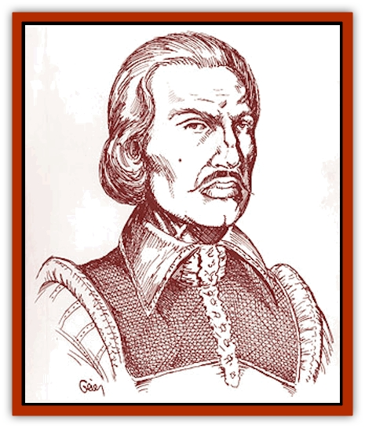

# Nosferatu

| Statistic | **Nosferatu** |
| --- | --- |
| **Activity Cycle:** | Any |
| **Alignment:** | Any, usually evil |
| **Armor Class:** | 2 |
| **Climate/Terrain:** | Any |
| **Damage/Attack:** | 1d4 or by weapon |
| **Diet:** | Blood |
| **Frequency:** | Very rare |
| **Hit Dice:** | 7-9 |
| **Intelligence:** | Average to Genius (8-18) |
| **Magic Resistance:** | Nil |
| **Morale:** | Champion (15-16) |
| **Movement:** | 12, Fl 18 (C) |
| **No. Appearing:** | 1 |
| **No. of Attacks:** | 1 (bite) |
| **Organization:** | Solitary |
| **Size:** | M (5-7') |
| **Special Attacks:** | Charm, class abilities |
| **Special Defenses:** | Hit only by +1 or better magical weapons, regeneration, spell immunities |
| **THAC0:** | As per equivalent class and level |
| **Treasure:** | F |
| **XP Value:** | 8,000 (minimum) |

A [[Vampire_Nosferatu|nosferatu]] is a powerful and fearsome undead creature that strongly resembles a [[Vampire_General_Information|vampire]]. Unlike its dark cousin, the nosferatu neither drains levels nor fears sunlight. However, most people fear nosferatu despite the fact that some nosferatu are not necessarily evil. These creatures are the victims of a dark fate, torn between pain, thirst, and disgust. Though nosferatu hunger for blood, they occasionally show compassion.

These undead creatures are not easily detectible. A nosferatu can easily mingle with mortals since its true nature is not obvious. It retains the abilities of its former class, as well as its new undead powers. It appears monstrous only when attacking. Like a vampire, however, a nosferatu has no shadow or reflection.

**Combat:** Its undead nature makes a nosferatu abnormally strong. At worst, a nosferatu has a Strength of 16. Its Strength otherwise remains what it was when the nosferatu was alive. Because nosferatu do not possess the ability to drain levels, they often rely on weapons or spells for combat.

A nosferatu can charm anyone foolish enough to stare into its eyes, as per the *charm person* spell. Victims may attempt a saving throw with a -2 penalty to avoid being charmed. Once it has entranced a victim in this manner, a nosferatu may make a suggestion, as per the spell. This often allows a nosferatu to get past guards without raising an alarm.

Weapons of less than +1 enchantment remain harmless to nosferatu, and if wounded, a nosferatu regenerates 1 hit point per round. If reduced to zero hit points, a nosferatu adopts a *gaseous form* and flees to its coffin. After eight hours in its coffin, the nosferatu regains its corporeal form. A nosferatu will die if it fails to return to its coffin within 12 turns of being defeated in combat.

*Sleep*, *charm*, and *hold* spells, along with poisons and paralysis, do not affect nosferatu. Spells based upon cold or electricity cause only half damage.

A nosferatu can assume a *gaseous form* at will, during which time it is immune to physical attacks. In addition, nosferatu can *shape change* into a [[Bat|large bat]] at night or a [[Raven_Crow|raven]] during the day. All nosferatu have the ability to *spider climb*. Nosferatu can also *summon animals* - 1d100 [[Rat|rats]] or bats in a subterranean environment or 3d6 [[Wolf|wolves]] in the wilderness. Summoned animals arrive in 2d6 rounds.

A strong garlic smell will keep a nosferatu at bay. They are unaffected by the sight of clerical symbols, and only clerics of the opposite alignment or those specialized in hunting undead can turn nosferatu. These undead creatures suffer no ill effects from contact with clerical symbols or holy water.

Nosferatu generally avoid running water, because like their vampire kin, being immersed in running water for three consecutive rounds will destroy them. A wooden stake through its heart will accomplish the same result, although if the stake is removed, the nosferatu begins regenerating hit points. To completely destroy a staked nosferatu, it must be beheaded and have its mouth stuffed with dirt taken from ground dedicated to a good deity. Vampirism is an evil curse, and even the rare good-aligned nosferatu is vulnerable to the cleansing power of a good deity. In this case, the deity is not necessarily acting against the nosferatu, but against its evil curse.

Nosferatu cannot enter a personal residence without an invitation from a resident, but once invited, the nosferatu may come and go freely. Magical charm, disguise, or any other trickery used to obtain the invitation is still enough to allow nosferatu entrance to someone's home.

Human or humanoid victims may later become a nosferatu *only if the original undead wishes it*. If so, the victim rises from the dead three days after being drained of blood, unless its body was burned or totally destroyed. The victim remains under its killer's control. If the latter is killed, all the victims become self-willed.

Nosferatu always retain all the memories, abilities, skills, and restrictions of their former character class and level. A character of higher level than the maximum Hit Dice drops to the maximum. A character with fewer than the minimum Hit Dice increases to the minimum. For example, a 12th-level mage would return as a 9 Hit Die nosferatu with spells appropriate to a 9th-level mage; likewise, a 5th-level cleric would rise to a 7 Hit Die nosferatu with clerical spells equivalent to a 7th-level cleric. After this change has taken place, the nosferatu can continue to gain experience and levels. It is difficult for a nosferatu to change and grow, however, so it must earn three times the normal number of experience points in order to advance a level. Clerical spells no longer come from the original Immortal patron, unless the nosferatu has the same alignment.

Most ability scores remain the same, but Strength must be at least 16. A Constitution score is no longer required. Clerical and warrior nosferatu may wear armor, although it will not improve their Armor Class. Weapons used in combat must be appropriate to the former character class.

**Habitat/Society:** Nosferatu can dwell anywhere. They are found especially in the Eastern City-States like Slagovich, Zvornik, etc. Most often, a nosferatu will be a person of some importance in the region (a dashing nobleman, a reclusive wizard, the lord of a domain, etc.). These undead do not feel the morbid need of their vampire kin to dwell in cemeteries and other sinister places of death. Nosferatu seek the living whose blood they crave.

Being close to the world of the living, nosferatu feel at ease with unsuspecting mortals. In relative terms, nosferatu also tend to think less and act more compared to the vampire. While a vampire might spend a century brooding and scheming, a nosferatu will spend perhaps a decade. Nosferatu often need to change identities to hide the fact that they do not age or die. Clever disguises to modify the nosferatu's apparent age or impersonating its own offspring remain common tactics. If all else fails, disappearing for a decade also remains a valid option.

Nosferatu enjoy keeping company with others of their kind. An evil or neutral nosferatu and its lesser followers enjoy toying with the living even more. The rare nosferatu of good alignment, however, only occasionally interferes with the affairs of the living in order to preserve its existence or to save loved ones.

**Ecology:** Each nosferatu makes itself a secret place among the living. Evil nosferatu act more like their vampire kin, while the good-aligned nosferatu exist more as unfortunate victims. Good-aligned nosferatu create other undead only if the victim consents (i.e. a loved one), in which case, the victim's original alignment is preserved.

Evil nosferatu often twist a victim's alignment to reflect its own, but not always. An evil nosferatu could decide to preserve a victim's alignment as a form of torment. Good-aligned victims often seek to destroy themselves or their evil masters. The living always fear a nosferatu, regardless of its alignment.

All nosferatu crave the blood of the living. A nosferatu can go without blood for no more than a week before pain begins to twist its body. The pain causes all of its ability scores to drop 1 point per day after the first week of fasting, down to a minimum of 9. A nosferatu must drain at least 9 hit points worth of mortal blood per week to avoid this pain. To recover lost ability score points, a nosferatu must drink another 1d4 hit points worth of fresh blood. Nonhumanoid blood serves only to numb the pain for a day, but it cannot restore lessened ability scores.

---
## Discovery & Documentation

**Source Publication:** Monstrous Compendium Savage Coast Appendix (Online Exclusive) (1995)
**Campaign Setting:** Mystara
**Author(s):** Loren L Coleman, Ted James, Thomas Zuvich, Cindi M. Rice

### Other Creatures Found in This Source Book
   * [[Aranea_Savage_Coast|Aranea (Savage Coast)]]
   * [[Arashaeem|Arashaeem]]
   * [[Batracine|Batracine]]
   * [[Cat_Marine|Cat, Marine]]
   * [[Cinnavixen|Cinnavixen]]
   * [[Clockwork_Swordsman|Clockwork Swordsman]]
   * [[Critter_Temple|Critter, Temple]]
   * [[Cursed_One|Cursed One]]
   * [[Deathmare|Deathmare]]
   * [[Dragon_Savage_Coast_Crimson|Dragon (Savage Coast), Crimson]]
   * [[Dragon_Savage_Coast_Red_Hawk|Dragon (Savage Coast), Red Hawk]]
   * [[Echyan|Echyan]]
   * [[Ee'aar|Ee'aar]]
   * [[Enduk|Enduk]]
   * [[Fachan_Savage_Coast|Fachan (Savage Coast)]]
   * [[Feliquine|Feliquine]]
   * [[Fiend_Narvaezan|Fiend, Narvaezan]]
   * [[Frelôn|Frelôn]]
   * [[Ghriest|Ghriest]]
   * [[Glutton_Sea|Glutton, Sea]]
   * [[Goatman|Goatman]]
   * [[Golem_Naâruk|Golem, Naâruk]]
   * [[Golem_Savage_Coast|Golem (Savage Coast)]]
   * [[Grudgling|Grudgling]]
   * [[Heraldic_Servant_I|Heraldic Servant I]]
   * [[Heraldic_Servant_II|Heraldic Servant II]]
   * [[Heraldic_Servant_III|Heraldic Servant III]]
   * [[Heraldic_Servant_IV|Heraldic Servant IV]]
   * [[Heraldic_Servant_V|Heraldic Servant V]]
   * [[Heraldic_Servant_General_Information|Heraldic Servant, General Information]]
   * [[Hermit_Sea|Hermit, Sea]]
   * [[Jorri|Jorri]]
   * [[Juhrion|Juhrion]]
   * [[Kla'a-tah|Kla'a-tah]]
   * [[Leech_Legacy|Leech, Legacy]]
   * [[Lich_Inheritor|Lich, Inheritor]]
   * [[Lizard_Kin_Savage_Coast|Lizard Kin (Savage Coast)]]
   * [[Lupasus|Lupasus]]
   * [[Lupin|Lupin]]
   * [[Lyra_Bird_Saragón|Lyra Bird, Saragón]]
   * [[Malfera|Malfera]]
   * [[Manscorpion_Nimmurian|Manscorpion, Nimmurian]]
   * [[Mythuínn_Folk|Mythuínn Folk]]
   * [[Neshezu|Neshezu]]
   * [[Nikt'oo|Nikt'oo]]
   * [[Omm-wa|Omm-wa]]
   * [[Omshirim|Omshirim]]
   * [[Parasite_Savage_Coast|Parasite (Savage Coast)]]
   * [[Phanaton|Phanaton]]
   * [[Plant_Savage_Coast|Plant (Savage Coast)]]
   * [[Pudding_Vermilion|Pudding, Vermilion]]
   * [[Rakasta|Rakasta]]
   * [[Ray_Forest|Ray, Forest]]
   * [[Shedu_Greater_Savage_Coast|Shedu, Greater (Savage Coast)]]
   * [[Shimmerfish|Shimmerfish]]
   * [[Skinwing|Skinwing]]
   * [[Spawn_of_Nimmur|Spawn of Nimmur]]
   * [[Spider-spy|Spider-spy]]
   * [[Spirit_Heroic|Spirit, Heroic]]
   * [[Spirit_Walleran|Spirit, Walleran]]
   * [[Succulus|Succulus]]
   * [[Swampmare|Swampmare]]
   * [[Symbiont_Shadow|Symbiont, Shadow]]
   * [[Tortle|Tortle]]
   * [[Troll_Legacy|Troll, Legacy]]
   * [[Trosip|Trosip]]
   * [[Tyminid|Tyminid]]
   * [[Utukku|Utukku]]
   * [[Voat|Voat]]
   * [[Voat_Herathian|Voat, Herathian]]
   * [[Vulturehound|Vulturehound]]
   * [[Wallara|Wallara]]
   * [[Wurmling|Wurmling]]
   * [[Wynzet|Wynzet]]
   * [[Yeshom|Yeshom]]
   * [[Zombie_Red|Zombie, Red]]
