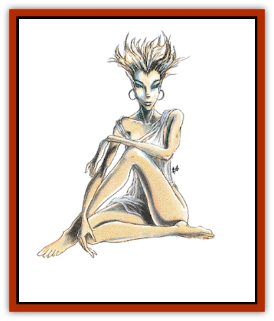

# Nymph

| Statistic | **Nymph** |
| --- | --- |
| **Activity Cycle:** | Day |
| **Alignment:** | Neutral (good) |
| **Armor Class:** | 9 |
| **Climate/Terrain:** | Any |
| **Damage/Attack:** | Nil |
| **Diet:** | None |
| **Frequency:** | Very rare |
| **Hit Dice:** | 3 |
| **Intelligence:** | Exceptional (15-16) |
| **Magic Resistance:** | 50% |
| **Morale:** | Unsteady (7) |
| **Movement:** | 12 |
| **No. Appearing:** | 1-4 |
| **No. of Attacks:** | 0 |
| **Organization:** | Solitary |
| **Size:** | M (4-6') |
| **Special Attacks:** | See below |
| **Special Defenses:** | See below |
| **THAC0:** | 17 |
| **Treasure:** | Q (Q&times;10,X) |
| **XP Value:** | 1,400 |

So beautiful that a glimpse can blind or even kill a man, the nymphs are the embodiment of loveliness, a triumph of nature.

A nymph's beauty is beyond words - an ever-young woman with sleek figure and long, thick hair, radiant skin and perfect teeth, full lips and gentle eyes. A nymph's scent is delightful, and her long robe glows, hemmed with golden threads and embroidered with rainbow hues of unearthly magnificence. A nymph's demeanor is graceful and charming, her mind quick and witty. Nymphs speak their own musical language and the common tongue.

**Combat:** Neutral in their alliances and cares, nymphs do not fight, but flee if confronted by an intruder or danger. Nymphs are able to cast *dimension door* once per day, and can employ druidical priest spells at 7th ability level, giving a nymph four 1st, two 2nd, two 3rd, and one 4th level spell once per day. Looking at a nymph will cause permanent blindness unless the onlookers save versus spell. If the nymph is nude or disrobes, an onlooker will die unless a saving throw versus spell is successful.

**Habitat/Society:** These beautiful females inhabit only the loveliest of wilderness places, clear lakes and streams, glacier palaces, ocean grottoes, and crystalline caverns. Nymphs prefer a solitary existence, but very occasionally a few will gather together in a place of spectacular charm, though these rendezvous seldom last for more than a few months. Animals of all types flock to a nymph to be petted and caressed, forgetting their natural enemies to gather around the lovely creature.

There is a 10% chance that a nymph will be friendly if approached by a good creature without the latter first glimpsing the nymph, by calling or other prior notice. On the other hand, if a nymph sees a human male with 18 Charisma and good alignment before he sees her, it is 90% probable that the nymph will be favorably inclined toward the man. It is still necessary to make saving throws upon sighting the nymph.

Nymphs hate ugliness and evil and sometimes will help to defeat it. Any treasure they possess has usually been given to them by some lovesick man.

**Ecology:** Like a druid, a nymph believes in the sanctity of nature and her environment and will try to keep her lair safe and pure. She will heal wounded animals and mend broken trees and plants. Sometimes she will even help a human in distress (5% chance). Since nymphs live for many generations, they can provide a wealth of information on the history of an area and often know secret places, hide-outs, and entrances long forgotten. If a man is kissed by a nymph, all painful and troubling memories are forgotten for the rest of the day - this may be a boon to some and a curse to others. A lock of nymph's hair can be used to create a powerful sleeping potion or, if enchanted and woven into a cloth and sewn into a garment, will magically add one point to the wearer's Charisma. The tears of a nymph can be used as an ingredient in a *philter of love*. If a woman bathes in a nymph's pool, her Charisma is increased by two points until she bathes again.

---
## Discovery & Documentation

**Source Publication:** MC1 Volume I (w/binder #1) (1991)
**Campaign Setting:** Advanced Dungeons & Dragons 2nd Edition
**Author(s):** Jay Batista, Scott Bennie, Grant Boucher, William W. Connors, Steve Gilbert, Heike Kubasch, James Lowder, David Edward Martin, Bruce Nesmith, Jean Rabe, Rick Swan, John J. Terra, Gary L. Thomas

### Other Creatures Found in This Source Book
   * [[Bat|Bat]]
   * [[Bear|Bear]]
   * [[Behir|Behir]]
   * [[Boar|Boar]]
   * [[Bookworm|Bookworm]]
   * [[Brownie|Brownie]]
   * [[Bugbear|Bugbear]]
   * [[Carrion_Crawler|Carrion Crawler]]
   * [[Cat_Great|Cat, Great]]
   * [[Catoblepas|Catoblepas]]
   * [[Dragon_General_Information|Dragon, General Information]]
   * [[Dragonfish|Dragonfish]]
   * [[Elemental_Air_Kin_Aerial_Servant|Elemental, Air Kin, Aerial Servant]]
   * [[Elemental_Earth_Kin_Sandling|Elemental, Earth Kin, Sandling]]
   * [[Elephant|Elephant]]
   * [[Gnoll|Gnoll]]
   * [[Hobgoblin|Hobgoblin]]
   * [[Homunculus|Homunculus]]
   * [[Hornet_Giant|Hornet, Giant]]
   * [[Horse|Horse]]
   * [[Hyena|Hyena]]
   * [[Jackal|Jackal]]
   * [[Jackalwere|Jackalwere]]
   * [[Korred|Korred]]
   * [[Lich|Lich]]
   * [[Lizard|Lizard]]
   * [[Lizard_Man|Lizard Man]]
   * [[Lycanthrope_General_Information|Lycanthrope, General Information]]
   * [[Lycanthrope_Seawolf|Lycanthrope, Seawolf]]
   * [[Lycanthrope_Werebear|Lycanthrope, Werebear]]
   * [[Lycanthrope_Weretiger|Lycanthrope, Weretiger]]
   * [[Lycanthrope_Werewolf|Lycanthrope, Werewolf]]
   * [[Manticore|Manticore]]
   * [[Medusa|Medusa]]
   * [[Mind_Flayer|Mind Flayer]]
   * [[Minotaur|Minotaur]]
   * [[Mudman|Mudman]]
   * [[Mummy|Mummy]]
   * [[Nixie|Nixie]]
   * [[Ogre|Ogre]]
   * [[Ooze_Slime_Jelly_I|Ooze/Slime/Jelly I]]
   * [[Ooze_Slime_Jelly_II|Ooze/Slime/Jelly II]]
   * [[Orc|Orc]]
   * [[Owl|Owl]]
   * [[Owlbear_I|Owlbear I]]
   * [[Pegasus|Pegasus]]
   * [[Piercer|Piercer]]
   * [[Pudding_Deadly|Pudding, Deadly]]
   * [[Rakshasa|Rakshasa]]
   * [[Rat|Rat]]
   * [[Ray|Ray]]
   * [[Remorhaz|Remorhaz]]
   * [[Satyr|Satyr]]
   * [[Scorpion|Scorpion]]
   * [[Selkie|Selkie]]
   * [[Shadow|Shadow]]
   * [[Skeleton|Skeleton]]
   * [[Skunk|Skunk]]
   * [[Snake|Snake]]
   * [[Spectre|Spectre]]
   * [[Spider|Spider]]
   * [[Sprite|Sprite]]
   * [[Toad_Giant|Toad, Giant]]
   * [[Treant|Treant]]
   * [[Troll|Troll]]
   * [[Umber_Hulk|Umber Hulk]]
   * [[Unicorn|Unicorn]]
   * [[Vampire|Vampire]]
   * [[Wight|Wight]]
   * [[Will_O'Wisp|Will O'Wisp]]
   * [[Wolf|Wolf]]
   * [[Wolfwere|Wolfwere]]
   * [[Wraith|Wraith]]
   * [[Wyvern|Wyvern]]
   * [[Yeti|Yeti]]
   * [[Yuan-ti|Yuan-ti]]
   * [[Zombie|Zombie]]
