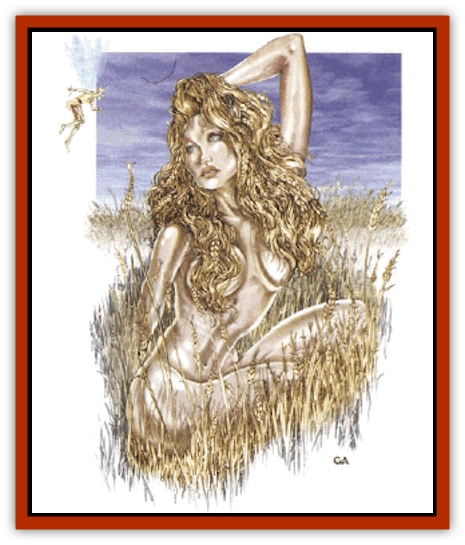

# Nymph - Grain

| Statistic | **Nymph, Grain** |
| --- | --- |
| **Activity Cycle:** | Any |
| **Alignment:** | Neutral |
| **Armor Class:** | 7 |
| **Climate/Terrain:** | Farmland |
| **Damage/Attack:** | Nil |
| **Diet:** | None |
| **Frequency:** | Rare |
| **Hit Dice:** | 3 |
| **Intelligence:** | Exceptional (16) |
| **Magic Resistance:** | 50% |
| **Morale:** | Unsteady (7) |
| **Movement:** | 15 |
| **No. Appearing:** | 1-2 |
| **No. of Attacks:** | 0 |
| **Organization:** | Solitary |
| **Size:** | M (4-6' tall) |
| **Special Attacks:** | Intoxication, marking |
| **Special Defenses:** | Animal friendship |
| **THAC0:** | 17 |
| **Treasure:** | Nil |
| **XP Value:** | 975 |

Grain [[Nymph|nymphs]] are related to their woodland sisters, but have adopted cultivated fields for their homes. Like other nymphs, they are extraordinarily beautiful, possessing great appeal for most males. Like certain other faerie creatures ([[Brownie|kilmoulis]], [[Brownie_Dobie|dobies]], etc.) they have adapted to the encroaching humankind. They are also, in every sense of the word, intoxicatingly beautiful.

Grain nymphs speak elvish and common, can *speak to animals* at will, and can *summon insects* (or *repel* them, depending on the needs of the field).

**Combat:** A grain nymph does not fight when confronted by an antagonist. Rather, she tries to draw the would-be attacker into her domain, the field of grain. When a grain nymph leads an enemy on such a chase, the pursuer must make a successful saving throw vs. spell at a -2 penalty or fall under her influence, which resembles intoxication.

When under the nymph's influence, a creature weaves rather than walks. His speech is slurred and incoherent, and his reflexes are exceedingly poor (-4 to hit, -4 penalty to AC). This condition persists for 2d8 rounds, at which time the creature must make a Constitution check. Failure means the enemy falls into a drunken stupor from which he will not awaken for 1d6 hours. Upon awakening, he will have a splitting headache, an aversion to loud noises, and penalties of -2 to hit and -2 to AC for 1d6 hours. After this, the influence of the grain nymph wears off.

This assumes the enemy survives the stupor, for while he sleeps, the grain nymph will call any large farm beasts within a 1-mile radius to attack the sleeper. They arrive within a turn and begin biting, kicking, or trampling the sleeper. The sleeper wakes only after sustaining 8 hit points of damage, or half his total, whichever is less. At this point, he will be allowed to flee to safety, with the [[Mammal_Herd_I|herd animals]] running close behind. Thereafter, no farm animal (excluding [[Horse|horses]]) will ever be friendly to that person again, for he has been marked by the nymph. No magic short of a full *wish* can cure this.

A grain nymph can be killed by burning or razing her field and then sowing it with salt, or by using any other method that renders the land unfit for cultivation, along with the more conventional method of killing her physically (if one can get close enough to do that). Since the nymph cannot migrate to another field before spring she perishes with her field.

**Habitat/Society:** Grain nymphs live only in the fields of farmers who treat their fields with love and care. In return, the nymph lavishes her bounty upon the grain, causing it to spring full and strong. A grain nymph in a field can double the usual harvest. Further, a field under the care of a grain nymph will not suffer the effects of natural drought or flooding.

All herd animals, especially farm animals, are friendly to a grain nymph, and will even sacrifice their lives for her. If the nymph is threatened in their presence, they will rush to her defense, until the attacker flees or has slain them.

The health of the field and the health of the nymph reflect one another in various ways. A rich field may attract a nymph, an ailing nymph might produce a poor crop, or an unnatural interruption of the natural cycle of the field might affect the health of the resident nymph.

After the harvest, the grain nymph sinks into the soil of her field to become inactive for the winter. After three years of protecting a field, the nymph must travel to another deserving field. If she does not find one within a 50-mile radius, she will die. She cannot return to a field in which she has dwelt until 9 years have passed.

Grain nymphs are actively sought during times of festivals of planting and harvest, when farmers offer sacrifice and make promises to keep the earth in exchange for her presence at a gathering. Mild intoxication effects may be granted (-2 to hit, -2 to AC), but no stupor or hangover will result.

**Ecology:** Grain nymphs appear when wooded areas are cleared to make room for farmland. The nymphs have adapted to the changed situation, melding with the fields, and offering life and bountiful harvests to those who till the earth.

Grain nymphs do not get along too well with nymphs of the woodland, who consider grain nymphs to be snobbish. The grain nymphs see themselves as sophisticated and "cultivated". Grain nymphs dislike [[Bird|birds]] that come and steal the grain, and drive them away by any means possible.

---
## Discovery & Documentation

**Source Publication:** Monstrous Compendium, 1997 Annual, Volume 4 (1995)
**Campaign Setting:** Advanced Dungeons & Dragons 2nd Edition
**Author(s):** Jon Pickens

### Other Creatures Found in This Source Book
   * [[Anemone_Giant_Sea|Anemone, Giant Sea]]
   * [[Asperii|Asperii]]
   * [[Bainligor|Bainligor]]
   * [[Beast_of_Chaos|Beast of Chaos]]
   * [[Blindheim|Blindheim]]
   * [[Bloodsipper_Far_Realm|Bloodsipper (Far Realm)]]
   * [[Bulette_Gohlbrorn|Bulette, Gohlbrorn]]
   * [[Child_of_the_Sea|Child of the Sea]]
   * [[Clockwork_Horror|Clockwork Horror]]
   * [[Clockwork_Swordsman|Clockwork Swordsman]]
   * [[Coral|Coral]]
   * [[Darklore|Darklore]]
   * [[Dharculus|Dharculus]]
   * [[Dolphin_Athas|Dolphin (Athas)]]
   * [[Dragon_Neutral_Moonstone|Dragon, Neutral, Moonstone]]
   * [[Dragon_Prismatic|Dragon, Prismatic]]
   * [[Dream_Stalker|Dream Stalker]]
   * [[Dragon-kin_Albino_Wyrm|Dragon-kin, Albino Wyrm]]
   * [[Echyan|Echyan]]
   * [[Firestar|Firestar]]
   * [[Firetail|Firetail]]
   * [[Fish_Ascallion|Fish, Ascallion]]
   * [[Fish_Deep_Ocean|Fish, Deep Ocean]]
   * [[Fish_Tropical|Fish, Tropical]]
   * [[Fish_Vurgens|Fish, Vurgens]]
   * [[Fogwarden|Fogwarden]]
   * [[Fraal|Fraal]]
   * [[Giant_Crag|Giant, Crag]]
   * [[Gibberling_Brood|Gibberling, Brood]]
   * [[Glutton_Sea|Glutton, Sea]]
   * [[Golden_Ammonite|Golden Ammonite]]
   * [[Golem_Brass_Minotaur|Golem, Brass Minotaur]]
   * [[Golem_Gemstone|Golem, Gemstone]]
   * [[Golem_Maggot|Golem, Maggot]]
   * [[Groundling|Groundling]]
   * [[Hermit_Sea|Hermit, Sea]]
   * [[Hound_of_Law|Hound of Law]]
   * [[Human_Amazon|Human, Amazon]]
   * [[Human_Pygmy|Human, Pygmy]]
   * [[Inquisitor|Inquisitor]]
   * [[Kercpa|Kercpa]]
   * [[Kreel|Kreel]]
   * [[Lycanthrope_Lythari|Lycanthrope, Lythari]]
   * [[Mercurial|Mercurial]]
   * [[Mold_Chromatic|Mold, Chromatic]]
   * [[Mummy_Bog|Mummy, Bog]]
   * [[Neh-thalggu|Neh-thalggu]]
   * [[Nymph_Unseelie|Nymph, Unseelie]]
   * [[Octopus_Octo-Jelly|Octopus, Octo-Jelly]]
   * [[Puddingfish|Puddingfish]]
   * [[Sea_Demon|Sea Demon]]
   * [[Shade|Shade]]
   * [[Shadowrath|Shadowrath]]
   * [[Shark_Athas|Shark (Athas)]]
   * [[Siren_Ravenloft|Siren (Ravenloft)]]
   * [[Skeleton_Variant|Skeleton, Variant]]
   * [[Skyfish|Skyfish]]
   * [[Spectral_Scion|Spectral Scion]]
   * [[Spyder_Fiend|Spyder Fiend]]
   * [[Squid_Squark|Squid, Squark]]
   * [[Tanar'ri_Lesser_Uridezu|Tanar'ri, Lesser, Uridezu]]
   * [[Troll_Mutate|Troll Mutate]]
   * [[Vaati|Vaati]]
   * [[Vampire_Cerebral|Vampire, Cerebral]]
   * [[Varkha|Varkha]]
   * [[Wizshade|Wizshade]]
   * [[Worm_Lukhorn|Worm, Lukhorn]]
   * [[Wyste|Wyste]]
   * [[Yugoloth_Lesser_Gacholoth|Yugoloth, Lesser, Gacholoth]]
   * [[Zombie_Mud|Zombie, Mud]]
