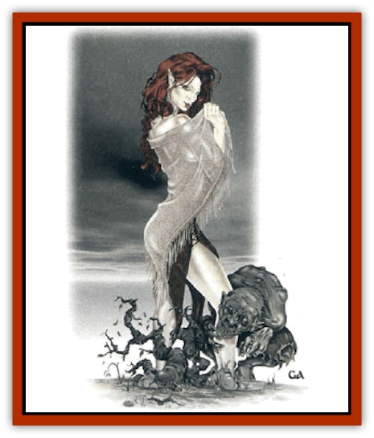

# Nymph - Unseelie

| Statistic | **Nymph, Unseelie** |
| --- | --- |
| **Activity Cycle:** | Any |
| **Alignment:** | Neutral evil |
| **Armor Class:** | 7 |
| **Climate/Terrain:** | Any |
| **Damage/Attack:** | Nil |
| **Diet:** | None |
| **Frequency:** | Very rare |
| **Hit Dice:** | 4 |
| **Intelligence:** | Exceptional (16) |
| **Magic Resistance:** | 50% |
| **Morale:** | Average (10) |
| **Movement:** | 12 |
| **No. Appearing:** | 1 |
| **No. of Attacks:** | 0 |
| **Organization:** | Solitary |
| **Size:** | M (4-6' tall) |
| **Special Attacks:** | <i>Charm</i>, withering |
| **Special Defenses:** | <i>Dimension door</i> |
| **THAC0:** | 17 |
| **Treasure:** | Q (Q&times;10,X) |
| **XP Value:** | 2,000 |

These spiteful, evil creatures are fey and twisted relatives of other [[Nymph|nymphs]]. Unseelie nymphs delight in the perversion and corruption of everything that is good and beautiful in the natural world.

Despite their foul hearts and evil spirits, these creatures possess the almost supernatural beauty of their more beneficent relatives. Unseelie nymphs resemble slim, full-bodied women, with delicate features. Thick, resplendent hair, full, pouty lips, and smooth-as-silk skin accentuate their triumphant beauty. Only a brief, calculating smile or an occasional hard glint from their piercing eyes betrays the evil nature of these creatures. Few people, however, can see beyond the unearthly beauty of an unseelie nymph into the corrupt heart of the evil creature. These nymphs prefer loose-fitting robes that sparkle with multicolor hues as they gracefully move.

Unseelie nymphs are extremely intelligent and speak their own language, as well as the language of faeriekind. In addition, these creatures can speak the common tongue and communicate with all evil faerie spirits ([[Baelnorn|baelnorns]] and [[Nightshade_Toril|nightshades]], for example).

**Combat:** Although unseelie nymphs do not possess physical weapons, these creatures use their stunning beauty and corrupting influence to devastating ends. Anyone (male or female) who sees an unseelie nymph must save. vs. spell with a -2 penalty or fall completely in love with the creature. This *charm* effect is so powerful that even elves and half-elves receive a -15% penalty to their normal resistance to *charm* spells. Smitten creatures consider the unseelie nymph as the center of their respective universe and will do anything short of ending their own life - or directly violating a basic tenet of their ethos - to please their beloved.

Those who make a successful saving throw can see the nymph's evil nature. However, such a creature will have a very difficult time convincing any charmed companions of this truth. Charmed creatures do not willingly leave the unseelie nymph's side and will fight to defend the nymph from danger.

An unseelie nymph exudes a corrupting influence that gradually corrupts its natural surroundings. This influence can completely corrupt 5 square miles of territory within 4 months. Areas corrupted in this way become twisted, horrifying versions of their former beauty. Nothing grows in these areas - even after the unseelie nymph moves on; such affected territories become barren wasteland. Only a *limited wish* or *wish* spell can restore such areas to their former beauty; however, if a hierophant druid (level 16 or higher) makes the territory his home, the corrupting effect will be reversed in 2d6 months.

An unseeile nymph's corrupting influence spreads to those creatures who spend too much time by her side. Every week that a character spends with an unseelie nymph causes the individual to lose 1 point of Charisma and 1 point of the prime requisite ability score (for example, warriors lose Strength as the nymph's power stoops him with age, disease, and other wasting effects. While only a *limtited wish* or *wish* spell can restore an affected individual to his former vigor, a *restoration* spell can restore 1d4 Charisma points and 1d2 points of the prime requisite immediately.

By nature, unseelie nymphs avoid combat, allowing their charmed companions to defend them against threats. If faced without the benefits of charmed defenders, an unseelie nymph will attempt to escape using its *dimension door* ability. This ability, and the nymph's considerable magic resistance, make her hard to defeat.

**Habitat/Society:** Unseelie nymphs hate beauty and goodness, and they strive to pervert these attributes in the natural world. These creatures inhabit the most beautiful of places in an effort to systematically corrupt and destroy them. Once an unseelie nymph completely destroys an area, it searches for a new bastion of beauty to corrupt.

Unseelie nymphs usually live solitary lives, keeping their charmed companions merely for protection and amusement. Occasionally, 2d4 unseelie nymphs will band together in order to corrupt the work of a particularly powerful druid or druidic circle.

**Ecology:** If left unchecked. unseelie nymphs can have a devastating effect on the natural world around them. Thus, they are the sworn enemies of druidic circles, rangers, and the priests of nature deities.

---
## Discovery & Documentation

**Source Publication:** Monstrous Compendium, 1997 Annual, Volume 4 (1995)
**Campaign Setting:** Advanced Dungeons & Dragons 2nd Edition
**Author(s):** Jon Pickens

### Other Creatures Found in This Source Book
   * [[Anemone_Giant_Sea|Anemone, Giant Sea]]
   * [[Asperii|Asperii]]
   * [[Bainligor|Bainligor]]
   * [[Beast_of_Chaos|Beast of Chaos]]
   * [[Blindheim|Blindheim]]
   * [[Bloodsipper_Far_Realm|Bloodsipper (Far Realm)]]
   * [[Bulette_Gohlbrorn|Bulette, Gohlbrorn]]
   * [[Child_of_the_Sea|Child of the Sea]]
   * [[Clockwork_Horror|Clockwork Horror]]
   * [[Clockwork_Swordsman|Clockwork Swordsman]]
   * [[Coral|Coral]]
   * [[Darklore|Darklore]]
   * [[Dharculus|Dharculus]]
   * [[Dolphin_Athas|Dolphin (Athas)]]
   * [[Dragon_Neutral_Moonstone|Dragon, Neutral, Moonstone]]
   * [[Dragon_Prismatic|Dragon, Prismatic]]
   * [[Dream_Stalker|Dream Stalker]]
   * [[Dragon-kin_Albino_Wyrm|Dragon-kin, Albino Wyrm]]
   * [[Echyan|Echyan]]
   * [[Firestar|Firestar]]
   * [[Firetail|Firetail]]
   * [[Fish_Ascallion|Fish, Ascallion]]
   * [[Fish_Deep_Ocean|Fish, Deep Ocean]]
   * [[Fish_Tropical|Fish, Tropical]]
   * [[Fish_Vurgens|Fish, Vurgens]]
   * [[Fogwarden|Fogwarden]]
   * [[Fraal|Fraal]]
   * [[Giant_Crag|Giant, Crag]]
   * [[Gibberling_Brood|Gibberling, Brood]]
   * [[Glutton_Sea|Glutton, Sea]]
   * [[Golden_Ammonite|Golden Ammonite]]
   * [[Golem_Brass_Minotaur|Golem, Brass Minotaur]]
   * [[Golem_Gemstone|Golem, Gemstone]]
   * [[Golem_Maggot|Golem, Maggot]]
   * [[Groundling|Groundling]]
   * [[Hermit_Sea|Hermit, Sea]]
   * [[Hound_of_Law|Hound of Law]]
   * [[Human_Amazon|Human, Amazon]]
   * [[Human_Pygmy|Human, Pygmy]]
   * [[Inquisitor|Inquisitor]]
   * [[Kercpa|Kercpa]]
   * [[Kreel|Kreel]]
   * [[Lycanthrope_Lythari|Lycanthrope, Lythari]]
   * [[Mercurial|Mercurial]]
   * [[Mold_Chromatic|Mold, Chromatic]]
   * [[Mummy_Bog|Mummy, Bog]]
   * [[Neh-thalggu|Neh-thalggu]]
   * [[Nymph_Grain|Nymph, Grain]]
   * [[Octopus_Octo-Jelly|Octopus, Octo-Jelly]]
   * [[Puddingfish|Puddingfish]]
   * [[Sea_Demon|Sea Demon]]
   * [[Shade|Shade]]
   * [[Shadowrath|Shadowrath]]
   * [[Shark_Athas|Shark (Athas)]]
   * [[Siren_Ravenloft|Siren (Ravenloft)]]
   * [[Skeleton_Variant|Skeleton, Variant]]
   * [[Skyfish|Skyfish]]
   * [[Spectral_Scion|Spectral Scion]]
   * [[Spyder_Fiend|Spyder Fiend]]
   * [[Squid_Squark|Squid, Squark]]
   * [[Tanar'ri_Lesser_Uridezu|Tanar'ri, Lesser, Uridezu]]
   * [[Troll_Mutate|Troll Mutate]]
   * [[Vaati|Vaati]]
   * [[Vampire_Cerebral|Vampire, Cerebral]]
   * [[Varkha|Varkha]]
   * [[Wizshade|Wizshade]]
   * [[Worm_Lukhorn|Worm, Lukhorn]]
   * [[Wyste|Wyste]]
   * [[Yugoloth_Lesser_Gacholoth|Yugoloth, Lesser, Gacholoth]]
   * [[Zombie_Mud|Zombie, Mud]]
