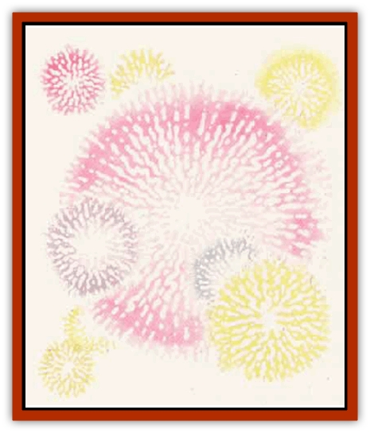
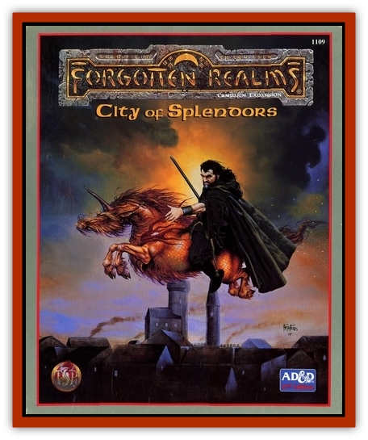

# Nyth

| Statistic | **Nyth** |
| --- | --- |
| **Activity Cycle:** | Any |
| **Alignment:** | Lawful evil |
| **Armor Class:** | 1 |
| **Climate/Terrain:** | Any |
| **Damage/Attack:** | 1d4 |
| **Diet:** | Carnivore |
| **Frequency:** | Rare |
| **Hit Dice:** | 7 |
| **Intelligence:** | High (13-14) |
| **Magic Resistance:** | 44% |
| **Morale:** | Fanatic (17) |
| **Movement:** | Fl 18 (A) |
| **No. Appearing:** | 1 |
| **No. of Attacks:** | 1 |
| **Organization:** | Solitary |
| **Size:** | S (2-4' diameter) |
| **Special Attacks:** | Magic missile |
| **Special Defenses:** | See below |
| **THAC0:** | 13 |
| **Treasure:** | Nil (Any as guardian) |
| **XP Value:** | 4,000 |

Often mistaken for the eerie [[Will_O'Wisp|will o'wisp]], the nyth is a rare predator. It appears as a glowing sphere of light, which it can alter in hue and intensity just as its more famous relative does. Nyth speak and usually know common; they also communicate in the "flickering light" language of will o' wisps.

**Combat:** Nyth fly silently about by means of natural levitation, hunting [[Bird|birds]], rodents, large insects, and other small creatures they can slay. On sunny days, they often drift with the sun behind them, unseen against the glare until they can pounce.

Nyth bite prey that they can hit, but their major weapon is a naturally-generated *magic missile*, which is identical to that created by the 1st-level wizard spell. A nyth can fire this missile, which causa 1d4+1 points of damage, every other round.

Against powerful opponents, nyth dodge to avoid attacks, using their intelligence to discern spellcasters and magical items, and concentrate on foiling such attacks. Nyth will also try conversation to lead hostile beings astray into nearby pitfalls, swamps, traps (if serving as a guardian), and the like. Like will 0' wisps, nyth are able to blank out their radianceentirely (for 2d4 rounds at a time) in order to steal away from an encounter or to approach their prey; during this time, the nyth can only be seen by those who can see invisible creatures. A nyth that fires a *magic missile* pulses brightly, appearing and remaining visible for the entire round.

Nyth can be hit by any sort of weapon. Fire, electricity, and other raw energy dischargees of any sort aid rather than harm a nyth. The points of damage normally dealt by such attacks are added to the nyth's hit point total; this is permanent until lost to further attacks. Thus, nyth cannot be harmed by *fireballs*, *lightning bolts*, and similar magics. It cannot, however, absorb *magic missiles*; instead, it reflects them back upon the caster or item wielder. Nyth do not heal with rest and often seek out wayfarers' fires and forest blazes to replenish their energy and essence in the blazes.

In addition to their natural magic resistance, the uniquely chaotic, multilayer minds of nyth are immune to all enchantment/charm spells and like magical effects.

**Habitat/Society:** Nyth are almost always found as solitary, wandering hunters, without a specific territory or a lair. They do have favorite hunting spots, and often drift in desolate arras or ruins where their radiance will not attract the attention of foes.

Nyth have never been observed to fight will o' wisps or each other. In the wild, they keep to themselves, reproducing by splitting into two nyth when reaching a certain size (absorbed up to or more than 60 hit points); this spectacular process of explosive bursts of light and discharges of *magic missiles* in random directions (living creatures within 30 feet subject to 1 to 3 missiles each) creates two nyth of 7 Hit Dice. Some barbarians call nyth "wildfire" and believe them to be evil spirits. Most merely avoid them and are, in turn, avoided by nyth.

The powers of the nyth make them ideal guardians, and the swift flight, invisibility, and wary avoidance of wild nyth make these guardians the only nyth that most folk ever see. Nyth can get lonely, and acceptance by other creatures, and the designation of a particular area (room, cave, crypt, crossroads, etc.) as its home delights a nyth. If given clear instructions and regular food (fire and energy, not just live prey), a nyth will take pride in defending its home against specified intruders; guardian nyth take on all attackers with guile and wit, retreating only if faced with certain destruction.

Nyth can communicate telepathically with most creatures and may speak any language with which they have frequent contact.

**Ecology:** Wild nyth prey on small creatures of the woodlands and coasts, birds in particular, and go their solitary ways without altering the lands in which they dwell. No specific magical use has yet been found for their essence, but wizards are confident that it will prove useful in devising fire- and magic missile-related spells and items.

---
## Discovery & Documentation

**Source Publication:** City of Splendors (1994)
**Campaign Setting:** Forgotten Realms
**Author(s):** Ed Greenwood, Elain Cunningham

### Other Creatures Found in This Source Book
   * [[Curst|Curst]]
   * [[Doppelganger_Greater|Doppelganger, Greater]]
   * [[Duhlarkin|Duhlarkin]]
   * [[Gulguthhydra|Gulguthhydra]]
   * [[Hakeashar|Hakeashar]]
   * [[Leucrotta_Greater|Leucrotta, Greater]]
   * [[Lycanthrope_Wereshark|Lycanthrope, Wereshark]]
   * [[Ooze_Slime_Jelly_Ghaunadan|Ooze/Slime/Jelly, Ghaunadan]]
   * [[Palimpsest|Palimpsest]]
   * [[Peltast|Peltast]]
   * [[Raggamoffyn|Raggamoffyn]]
   * [[Shadowrath|Shadowrath]]
   * [[Snake_Sewerm|Snake, Sewerm]]
   * [[Watchspider|Watchspider]]
