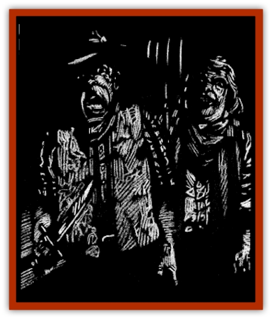

# Obedient

| Statistic | **Obedient** |
| --- | --- |
| **Activity Cycle:** | Any |
| **Alignment:** | See below |
| **Armor Class:** | 10 (by armor type) |
| **Climate/Terrain:** | Dementlieu |
| **Damage/Attack:** | By weapon |
| **Diet:** | Omnivore |
| **Frequency:** | Common |
| **Hit Dice:** | Varies |
| **Intelligence:** | Average to high (10-15) |
| **Magic Resistance:** | Nil |
| **Morale:** | Elite (14) |
| **Movement:** | 12 |
| **No. Appearing:** | 1 |
| **No. of Attacks:** | 1 |
| **Organization:** | See below |
| **Size:** | M |
| **Special Attacks:** | Nil |
| **Special Defenses:** | Nil |
| **THAC0:** | Varies |
| **Treasure:** | M |
| **XP Value:** | Varies |

The Obedient are those unfortunate souls who have been mesmerized into lifelong servitude by the lord of Dementlieu, Dominic d'Honaire. They help their evil master hatch plots against their neighbors and keep nosy outsiders from discovering too much about their cursed land,

The Obedient are normal townspeople living in and around the land of Dementlieu. Many of them are the wealthier and more influential persons about town, for Dominic finds their positions useful in fulfilling his complex schemes.

All members of the Obedient speak the elegant language of Dementlieu. Those among them who have traveled or are well educated will know other tongues as well.

**Combat:** Most of the Obedient are simple fishermen, shopkeepers, and the men and women who work at the inns, taverns, stables, and other places where visitors are likely to stop. Dominic has often provided these persons with poisons to kill or render unconscious anyone he suspects of causing trouble. If forced into direct conflict, the Obedient wield a variety of weapons from long swords to simple daggers. Characters who realize that the Obedient are under the control of another but opt to slay them anyway are subject to a powers check,

Escaping the control of d'Honaire is a difficult thing without outside help. Spells such as *command*, *emotion*, or the like can be used to shatter the hypnotic blocks that the lord of Dementlieu has established. If one of the Obedient is freed from the influence of the master hypnotist, however, Dominic will know immediately. The former servant will despise d'Honaire for enslaving his mind and usually help a party defeat him if possible.

**Habitat/Society:** The primary purpose of the Obedient is to inform Dominic d'Honaire about current events in the villages of Dementlieu. One of the most powerful servants is Lord-governor Marcel Guignol. In public, Dominic pretends to be the Lord-governor's adviser, but in truth, Guignol is the hypnotist's puppet. Other important persons under Dominic's control are the constables in the towns of Port-a-Lucine and a Chateaufaux, most of the wealthier merchants, and even the captains of Port-a-Lucine's fishing fleet.

Characters operating within Dementlieu will not go unnoticed by these servants. and word will reach d'Honaire's ears within hours of any strangers' arrival. Particularly powerful visitors, especially warriors and wizards, might attract Dominic's personal attentions as he attempts to mesmerize them and gather them to his flock of guardians and protectors.

Female characters with high Charisma scores (14 or better) will almost certainly attract Dominic's attentions, and may even be invited to dinner at the adviser's elegant chateau. Characters aware of Dominic's weakness for beautiful women may use this as a way to get to the hypnotist, but if they should discuss their plans while in Chateaufaux or Port-a-Lucine, there is a strong chance that they will be overheard by the Obedient and relayed to their master. Dominic has turned the table on do-gooders more than once, transforming a dinner at his chateau into a deadly trap for his guests.

If visitors to town are particularly vocal about their attitudes toward Dominic or even the Lord-governor, the hypnotist will dispatch several of his more powerful servants to do away with the troublemakers. These servants are typically of the same average level as the character party, and are made up of two warriors, a wizard, and a priest. If extra villains are needed, Dominic can send more warriors of 1-2 levels lower than the party's average to fill the ranks. The DM should generate the characters as an NPC party of the appropriate levels, including the possibility of magic items and so forth.

Though d'Honaire often uses brute force as described above, most of the Obedient are everyday folk who live and work in the villages of Dementlieu. When not delivering messages to the hypnotist's minions, they go about their everyday lives exactly as if nothing was going on.

A member of the Obedient's alignment is normal until he must report to his master of take some action to protect him. At that point it switches to lawful evil, returning to normal only after the task is complete.

**Ecology:** The Obedient live, eat, and sleep like normal men and women. Dominic prefers human servants over elves, dwarves, or other humanoids, because other races aren't usually trusted anyway, and the illusion of trust and normality is an important facade for the Obedient.

---
## Discovery & Documentation

**Source Publication:** Ravenloft Appendix III (1991)
**Campaign Setting:** Ravenloft
**Author(s):** Kirk Botulla

### Other Creatures Found in This Source Book
   * [[Akikage|Akikage]]
   * [[Animator_Common|Animator, Common]]
   * [[Animator_Greater|Animator, Greater]]
   * [[Animator_Minor|Animator, Minor]]
   * [[Animator_General_Information|Animator, General Information]]
   * [[Bakhna_Rakhna|Bakhna Rakhna]]
   * [[Baobhan_Sith|Baobhan Sith]]
   * [[Beetle_Scarab|Beetle, Scarab]]
   * [[Boneless|Boneless]]
   * [[Boowray|Boowray]]
   * [[Bruja|Bruja]]
   * [[Carrionette|Carrionette]]
   * [[Carrion_Stalker|Carrion Stalker]]
   * [[Cat_Midnight|Cat, Midnight]]
   * [[Cat_Skeletal|Cat, Skeletal]]
   * [[Cloaker_Resplendent|Cloaker, Resplendent]]
   * [[Cloaker_Shadow|Cloaker, Shadow]]
   * [[Cloaker_Undead|Cloaker, Undead]]
   * [[Corpse_Candle|Corpse Candle]]
   * [[Death's_Head_Tree|Death's Head Tree]]
   * [[Doppelganger_Ravenloft|Doppelganger (Ravenloft)]]
   * [[Familiar_Pseudo-|Familiar, Pseudo-]]
   * [[Familiar_Undead|Familiar, Undead]]
   * [[Feathered_Serpent|Feathered Serpent]]
   * [[Fenhound|Fenhound]]
   * [[Figurine_Ceramic|Figurine, Ceramic]]
   * [[Figurine_Crystal|Figurine, Crystal]]
   * [[Figurine_Ivory|Figurine, Ivory]]
   * [[Figurine_Obsidian|Figurine, Obsidian]]
   * [[Figurine_Porcelain|Figurine, Porcelain]]
   * [[Figurine_General_Information|Figurine, General Information]]
   * [[Fleas_of_Madness|Fleas of Madness]]
   * [[Furies|Furies]]
   * [[Geist|Geist]]
   * [[Ghost_Animal|Ghost, Animal]]
   * [[Golem_Flesh_Ravenloft|Golem, Flesh (Ravenloft)]]
   * [[Golem_Mist_Ravenloft|Golem, Mist (Ravenloft)]]
   * [[Golem_Wax_Ravenloft|Golem, Wax (Ravenloft)]]
   * [[Gremishka|Gremishka]]
   * [[Hag_Spectral|Hag, Spectral]]
   * [[Head_Hunter|Head Hunter]]
   * [[Hearth_Fiend|Hearth Fiend]]
   * [[Hebi-No-Onna|Hebi-No-Onna]]
   * [[Hound_Phantom|Hound, Phantom]]
   * [[Hound_Skeletal|Hound, Skeletal]]
   * [[Imp_Wishing|Imp, Wishing]]
   * [[Ivy_Crawling|Ivy, Crawling]]
   * [[Jack_Frost|Jack Frost]]
   * [[Jolly_Roger|Jolly Roger]]
   * [[Kizoku|Kizoku]]
   * [[Lashweed|Lashweed]]
   * [[Leech_Magical|Leech, Magical]]
   * [[Leech_Psionic|Leech, Psionic]]
   * [[Lich_Defiler|Lich, Defiler]]
   * [[Lich_Drow|Lich, Drow]]
   * [[Lich_Elemental|Lich, Elemental]]
   * [[Lich_Psionic|Lich, Psionic]]
   * [[Living_Tattoo|Living Tattoo]]
   * [[Lycanthrope_Loup-garou|Lycanthrope, Loup-garou]]
   * [[Lycanthrope_Werejackal|Lycanthrope, Werejackal]]
   * [[Lycanthrope_Werejaguar_Ravenloft|Lycanthrope, Werejaguar (Ravenloft)]]
   * [[Lycanthrope_Wereleopard|Lycanthrope, Wereleopard]]
   * [[Lycanthrope_Wereray|Lycanthrope, Wereray]]
   * [[Mist_Ferryman|Mist Ferryman]]
   * [[Moor_Man|Moor Man]]
   * [[Odem|Odem]]
   * [[Paka|Paka]]
   * [[Plant_Blood_Rose|Plant, Blood Rose]]
   * [[Plant_Fearweed|Plant, Fearweed]]
   * [[Radiant_Spirit|Radiant Spirit]]
   * [[Recluse|Recluse]]
   * [[Remnant_Aquatic|Remnant, Aquatic]]
   * [[Rushlight|Rushlight]]
   * [[Sea_Spawn_Master|Sea Spawn, Master]]
   * [[Sea_Spawn_Minion|Sea Spawn, Minion]]
   * [[Shadow_Asp|Shadow Asp]]
   * [[Shattered_Brethren|Shattered Brethren]]
   * [[Skeleton_Archer|Skeleton, Archer]]
   * [[Skeleton_Insectoid|Skeleton, Insectoid]]
   * [[Skin_Thief|Skin Thief]]
   * [[Spirit_Psionic|Spirit, Psionic]]
   * [[Strahd_Skeleton|Strahd Skeleton]]
   * [[Strahd_Zombie|Strahd Zombie]]
   * [[Unicorn_Shadow|Unicorn, Shadow]]
   * [[Vampire_Drow|Vampire, Drow]]
   * [[Vampire_Nosferatu|Vampire, Nosferatu]]
   * [[Vampire_Oriental|Vampire, Oriental]]
   * [[Virus_General_Information|Virus, General Information]]
   * [[Virus_I|Virus I]]
   * [[Virus_II|Virus II]]
   * [[Virus_III|Virus III]]
   * [[Vorlog|Vorlog]]
   * [[Will_O'Dawn|Will O'Dawn]]
   * [[Will_O'Deep|Will O'Deep]]
   * [[Will_O'Mist|Will O'Mist]]
   * [[Will_O'Sea|Will O'Sea]]
   * [[Zombie_Cannibal|Zombie, Cannibal]]
   * [[Zombie_Desert|Zombie, Desert]]
   * [[Zombie_Wolf|Zombie Wolf]]
   * [[Zombie_Fog|Zombie Fog]]
