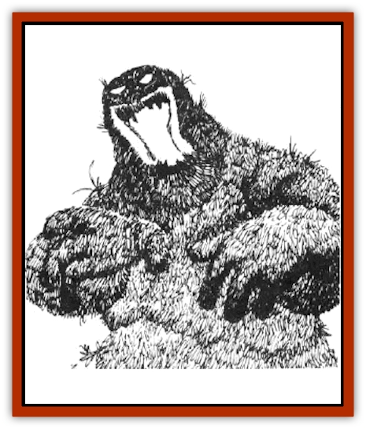

# Obliviax

| Statistic | **Obliviax** |
| --- | --- |
| **Activity Cycle:** | Any |
| **Alignment:** | Neutral evil |
| **Armor Class:** | 10 |
| **Climate/Terrain:** | Any land |
| **Damage/Attack:** | Nil |
| **Diet:** | Soil and water, memories |
| **Frequency:** | Rare |
| **Hit Dice:** | 1-2 hp |
| **Intelligence:** | Average (8) |
| **Magic Resistance:** | Nil |
| **Morale:** | Average (9) |
| **Movement:** | 0 |
| **No. Appearing:** | 2-12 |
| **No. of Attacks:** | 0 |
| **Organization:** | Plant |
| **Size:** | Tiny (½' square) |
| **Special Attacks:** | See below |
| **Special Defenses:** | See below |
| **THAC0:** | 20 |
| **Treasure:** | Nil |
| **XP Value:** | 35 |

Obliviax is a black moss with an evil nature and the magical ability to steal memories from intelligent creatures. It is called "memory moss" and is a bane to wizards everywhere.

Pitch colored and thick, like a luxuriant black carpet, oblivion grows in small patches and spreads through spores. Its leaves and flowers are all glossy black.  When it lacks stolen memories it quivers, as if in anticipation. It smells like damp, loamy dirt, a very unappetizing odor. Although it requires no sunlight to grow, it does require daylight to trigger spore production and so it does not naturally occur in subterranean realms. It can be inadvertently or purposefully carried into a cavern, where it will grow but is unable to reproduce.

**Combat:** Memory moss can sense the approach of sentient beings; once they are within 60 feet, the moss can attempt to steal their memories. It is selective, first attempting to steal wizards' memories, then priests', then any other spellcasters', then any other characters'. When an intelligent creature enters the obliviax's sphere of influence and is attacked, it must roll a successful saving throw vs. spell or lose all memories of the last 24 hours, including all memorized spells. The moss tries to steal from one creature per round until it succeeds, then it does not attack again for 24 hours. These stolen memories give the plant vitality and nourishment. Any creature who has lost memories acts baffled and disoriented, often forgetting important events and knowledge, with nothing but a blank in his memories since the previous day.

If an obliviax with stolen memories is attacked, in one round it forms a part of itself into a tiny moss imitation of the creature whom memories it stole. This mossling remains attached to the parent moss and defends the plant by casting any stolen spells. This is the moss's only defense.

To regain stolen memories, a victim must eat the living obliviax, which takes one round. If a saving throw vs. poison is successful, the eater gains all the stolen memory and spells. If the saving throw fails, the eater becomes very ill for 3d6 turns.

**Habitat/Society:** Obliviax grows in tropical to temperate climes, but cannot abide too much water or cold. It does not grow in desert terrain. It is not uncommon to find patches on tree trunks, fallen logs, or sprouting on rotting leaves. While it does have intelligence, and is aware of other mosses nearby, it does not act in concert with those of its kind, preferring to grab for the best memories possible. Small colonies of this moss are sometimes found in tunnels or caverns, either grown from sprigs of moss tracked in by some unaware creature, or sprouted from spores blown in by the wind.

**Ecology:** It is possible to gain another's memories by eating the moss. Anyone who gains spells by eating the oblivion can cast them, but the memories fade after 24 hours. Evil creatures sometime transplant obliviax near their lairs so it acts as a guardian.

Obliviax powers cannot penetrate lead, so the moss can be carried to a new location in a lead box. Spies use this lead box trick to snare secrets from unsuspecting victims.

A *potion of forgetfulness* can be distilled from obliviax, and its spores can be distilled into an elixir to restore the memories of the forgetful or senile.

---
## Discovery & Documentation

**Source Publication:** MC2 Volume II (1993)
**Campaign Setting:** Advanced Dungeons & Dragons 2nd Edition
**Author(s):** Jay Batista, Scott Bennie, Grant Boucher, William W. Connors, Steve Gilbert, Heike Kubasch, James Lowder, David Edward Martin, Bruce Nesmith, Jean Rabe, Rick Swan, John J. Terra, Gary L. Thomas

### Other Creatures Found in This Source Book
   * [[Ant|Ant]]
   * [[Ant_Lion_Giant|Ant Lion, Giant]]
   * [[Ape_Carnivorous|Ape, Carnivorous]]
   * [[Baboon|Baboon]]
   * [[Badger|Badger]]
   * [[Barracuda|Barracuda]]
   * [[Beetle_Giant|Beetle, Giant]]
   * [[Bulette|Bulette]]
   * [[Bullywug|Bullywug]]
   * [[Dwarf_Duergar|Dwarf, Duergar]]
   * [[Dwarf_Gully|Dwarf, Gully]]
   * [[Eagle|Eagle]]
   * [[Eel|Eel]]
   * [[Elemental_Air_Kin|Elemental, Air Kin]]
   * [[Elemental_Water_Kin|Elemental, Water Kin]]
   * [[Elemental_Water_Kin_Water_Weird|Elemental, Water Kin, Water Weird]]
   * [[Firestar|Firestar]]
   * [[Firetail|Firetail]]
   * [[Fish_Giant|Fish, Giant]]
   * [[Frog|Frog]]
   * [[Gorgon|Gorgon]]
   * [[Hawk|Hawk]]
   * [[Heucuva|Heucuva]]
   * [[Hippocampus|Hippocampus]]
   * [[Hippogriff|Hippogriff]]
   * [[Kelpie|Kelpie]]
   * [[Kenku|Kenku]]
   * [[Killmoulis|Killmoulis]]
   * [[Kuo-Toa|Kuo-Toa]]
   * [[Lamia|Lamia]]
   * [[Lammasu|Lammasu]]
   * [[Lamprey|Lamprey]]
   * [[Leech|Leech]]
   * [[Leprechaun|Leprechaun]]
   * [[Leucrotta|Leucrotta]]
   * [[Locathah|Locathah]]
   * [[Lycanthrope_Wereboar|Lycanthrope, Wereboar]]
   * [[Lycanthrope_Werefox|Lycanthrope, Werefox]]
   * [[Mammal_Minimal|Mammal, Minimal]]
   * [[Mammal_Small|Mammal, Small]]
   * [[Mimic|Mimic]]
   * [[Morkoth|Morkoth]]
   * [[Muckdweller|Muckdweller]]
   * [[Myconid|Myconid]]
   * [[Naga|Naga]]
   * [[Octopus_Giant|Octopus, Giant]]
   * [[Otyugh|Otyugh]]
   * [[Piranha|Piranha]]
   * [[Plant_Dangerous_I|Plant, Dangerous I]]
   * [[Plant_Intelligent|Plant, Intelligent]]
   * [[Poltergeist|Poltergeist]]
   * [[Porcupine|Porcupine]]
   * [[Rat_Osquip|Rat, Osquip]]
   * [[Roc|Roc]]
   * [[Roper|Roper]]
   * [[Rot_Grub|Rot Grub]]
   * [[Rust_Monster|Rust Monster]]
   * [[Sahuagin|Sahuagin]]
   * [[Sea_Lion|Sea Lion]]
   * [[Sea_Horse_Giant|Sea Horse, Giant]]
   * [[Shambling_Mound|Shambling Mound]]
   * [[Shark|Shark]]
   * [[Sphinx|Sphinx]]
   * [[Squid_Giant|Squid, Giant]]
   * [[Stirge|Stirge]]
   * [[Swanmay|Swanmay]]
   * [[Tarrasque|Tarrasque]]
   * [[Tasloi|Tasloi]]
   * [[Triton|Triton]]
   * [[Troglodyte|Troglodyte]]
   * [[Urchin|Urchin]]
   * [[Urd|Urd]]
   * [[Weasel|Weasel]]
   * [[Wolverine|Wolverine]]
   * [[Yellow_Musk_Creeper|Yellow Musk Creeper]]
