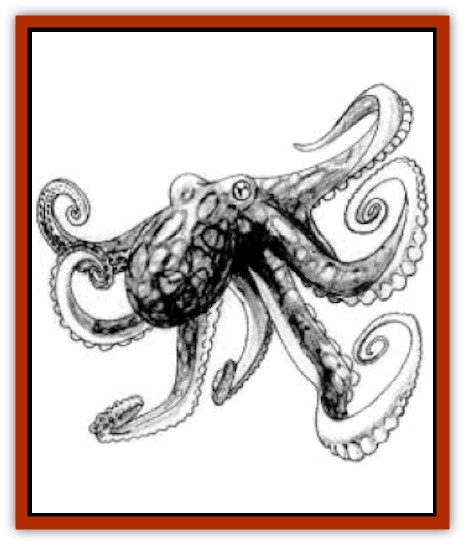

# Octopus - Blue-Ring

| Statistic | **Octopus, Blue-Ring** |
| --- | --- |
| **Activity Cycle:** | Any |
| **Alignment:** | Neutral good |
| **Armor Class:** | 7 |
| **Climate/Terrain:** | Any Underdark waters |
| **Damage/Attack:** | 1-2 (&times;6)/1-4 |
| **Diet:** | Omnivore |
| **Frequency:** | Uncommon |
| **Hit Dice:** | 3-5 |
| **Intelligence:** | Average to Exceptional (8-14) |
| **Magic Resistance:** | Nil |
| **Morale:** | Elite (14) |
| **Movement:** | 2, Swim 12 |
| **No. Appearing:** | 1 |
| **No. of Attacks:** | 7 |
| **Organization:** | Solitary |
| **Size:** | L (4-6' long, 4-10' tentacles) |
| **Special Attacks:** | Poison, constriction |
| **Special Defenses:** | Ink, camouflage |
| **THAC0:** | 3-4 HD: 17 / 5 HD: 15 |
| **Treasure:** | Nil |
| **XP Value:** | 3 HD: 650 / 4 HD: 975 / 5 HD: 1,400 / Shaman 1-4: 4,000 / Shaman 5-7: 5,000 |

These very intelligent, shy creatures live in the cracks and crevices of Underdark's oceans, constantly struggling to escape the notice of the more powerful aquatic races. Their bodies are covered with hundreds of blue circles, giving them their name; they have large golden eyes, a greenish-brown beak, and can change their skin color from dark grayish-brown to a dirty white.

**Combat:** Though they almost always strive to avoid combat, when forced to stand and fight they are remarkably skilled fighters. Initially, most blue-rings depend on evasive tactics. Blueringed octopi, just like other octopi, have chromatophores embedded in their skin that allow them to change color at will, giving them perfect camouflage against the sea floor. These chromatophores even alter the way the octopus reflects light that allows creatures to see via infravision or ultravision.

When spotted, blue-rings wait for an opponent to approach to within 10' or so, then release their poisonous, milky-white ink. This ink fills a 20' radius sphere, and allows the blue-ring to jet away at high speed, seeking protective cover again. The poison affects only creatures breathing the water through gills or through a magical means, such as a water breathing spell. These creatures must make a saving throw vs. poison or suffer 4-24 hp damage and be blinded for 1-6 turns.

In melee, blue-rings hold nothing back, attacking with six tentacles and a bite. The tentacles are almost pure muscle, and are able to constrict their prey. Each hit has a chance to secure a single limb of humanoid prey (roll 1d8): 1=right leg, 2=left leg, 3=right arm, 4=left arm, 5=head (blinded), and 6-8=torso or other non-binding hold. A victim may choose to attempt to break a tentacle's hold; this takes the place of all other actions for the round and requires a successful Open Doors roll.

Worse than constriction, however, the tentacles suffuse their victims with the same poison as their ink; each round that a victim is held it must make a saving throw with a -2 penalty or suffer 4-24 hp damage. A victim held by multiple tentacles must make multiple saving throws but suffers only one set of poison damage/round.

**Habitat/Society:** When captured by aboleth or kuo-toa, they are well-treated and bred for use as a servitor race; many blue-rings are kept in captivity their entire lives. However, keeping blue-ringed octopi always; other octopi always somehow learn of this captivity and seek to free their comrades. This has led to some wild speculation that the blue-rings are telepathic or mages of some kind, though no evidence has ever confirmed this.

**Ecology:** The blue-ring octopi are a nomadic race that strives to avoid conflict. They live everywhere from the shallows to the deepest trenches; they have found underwater connections to the oceans of the surface world and have sometimes been found living in the colder waters of the surface world, where they are allies of the tool-using [[Tako|tako]] and the [[Locathah|locathah]].

**Red Shamans**

  A few octopi from every spawning have rings of ox-blood red; these young are protected and cared for far more than any other blue-ring young, growing much larger than other blue rings (8 HD). They are sheltered and jealously guarded because they grow up to be shamans, capable of reaching 8th level of ability as priests. In addition, the poison of shaman blue-rings is more potent than that of their fellows, inflicting half damage even with a successful saving throw. However, the chromatophores of shamans are always either weak or non-existent; they cannot camouflage themselves, so they often spend their entire lives deep within narrow cleft of rock, where other members of their tribe bring them food and seek their help and advice.

---
## Discovery & Documentation

**Source Publication:** Dragon227 (1996)
**Campaign Setting:** Dragon Magazine
**Author(s):** 

### Other Creatures Found in This Source Book
   * [[Beetle_Scarab_Giant|Beetle, Scarab, Giant]]
   * [[Elemental_Darkness|Elemental, Darkness]]
   * [[Fireweed|Fireweed]]
   * [[Glouras|Glouras]]
