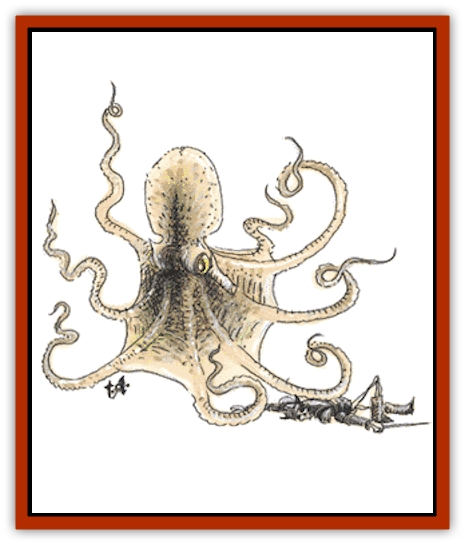

# Octopus - Giant

| Statistic | **Octopus, Giant** |
| --- | --- |
| **Activity Cycle:** | Night |
| **Alignment:** | Neutral (evil) |
| **Armor Class:** | 7 |
| **Climate/Terrain:** | Any salt water |
| **Damage/Attack:** | 1-4 (&times;6)/2-12 |
| **Diet:** | Carnivore |
| **Frequency:** | Rare |
| **Hit Dice:** | 8 |
| **Intelligence:** | Animal (1) |
| **Magic Resistance:** | Nil |
| **Morale:** | Elite (13) |
| **Movement:** | 3, Sw 12 |
| **No. Appearing:** | 1-3 |
| **No. of Attacks:** | 7 |
| **Organization:** | Solitary |
| **Size:** | Large (9-12' across) |
| **Special Attacks:** | Constriction |
| **Special Defenses:** | Ink, color change |
| **THAC0:** | 13 |
| **Treasure:** | (R) |
| **XP Value:** | 2,000 |

The dreaded "cuttlefish" are the scourge of ocean-going sailors and fishermen. Malicious and cunning, giant octopi have been known to attack ships, sinking smaller craft and stealing crew members from the larger ships.

Giant octopi change their color to blend into their surroundings, and the range of colors and patterns available to them is extensive, from green to deep black, blue speckles and red stripes. Tentacles are often disguised as seaweed. Once camouflaged, there is only a 10% chance to detect them, and usually it is their eyes that give them away. Normal coloration is grey to brown, and their vicious beaks are a deep yellow with a bright orange mouth and tongue.

**Combat:** An octopus will readily attack swimmers or small vessels in order to eat the crew. Several have been known to cooperate in order to overwhelm a larger ship, and any craft seized by these monsters loses way and comes to a full stop in three turns.

A giant octopus generally attacks with six of its eight tentacles, using two to anchor itself. Each striking tentacle causes 1d4 points of damage, but unless the member is loosened or severed, it constricts for 2d4 points of damage every round after striking. If a victim is dragged close enough to the beak, the monster can bite for 2d6 points of damage.

Any victim under 8 feet tall or long can be struck by only one tentacle at a time, and the chance that both upper limbs are pinned on a successful strike is 25%, while the chance that both upper limbs are free is also 25%. When both upper limbs are held, the victim has no attack; if only one limb is held the victim attacks with a -3 penalty to its attack roll; if both limbs are free (i.e., the tentacle is wrapped around the victim's body) then the victim attacks with a -1 penalty to its attack roll. Tentacles grip with a Strength of 18/20. Any creature with a Strength equal to or greater than 18/20 can grasp the tentacle and negate its constriction. This does not free the victim, and the octopus will immediately seek to drag the victim to its mouth to eat it. To break free, a tentacle must be severed; this requires 8 points of damage. (These hit points are in addition to those the octopus gains from its 8 Hit Dice.)

Once three or more tentacles are severed, it is 90% probable that the octopus will retreat, ejecting a cloud of black ink 40 feet high by 60 feet wide by 60 feet long. This ink cloud completely obscures the vision of any creature within it. The wounded octopus then camouflages itself in its lair or a nearby hiding place. It takes the monster two to three months to grow back severed tentacles.

**Habitat/Society:** While octopi cooperate to attack a food source, they live a solitary existence, preferring to shelter in warm water of medial to shallow depth. Lairs are made in wrecked ships and undersea caves; any treasure found there is just an incidental leftover from previous meals. Consummate hunters, these monsters have great patience and cover a very small area, waiting for their food to come to them. Mating season comes every spring. Like most marine animals, octopi leave their eggs in a reef to fend for themselves.

**Ecology:** When prey is scarce, or if it has been wounded, an octopus turns to scavenging, eating everything from small crustaceans to seaweeds. Survival is paramount with this monster. It prefers to hunt at night, and often a man missing during the late night watch has been grabbed by a giant octopus, pulled quickly over the side, and eaten.

Giant octopi's leathery hide is tough and waterproof, and it is worked into fine rain ponchos by sailors lucky enough to catch and kill one. Another byproduct of these monsters is their ink - they are most often hunted for this commodity. Giant octopus ink can be used to pen magical scrolls.

---
## Discovery & Documentation

**Source Publication:** MC2 Volume II (1993)
**Campaign Setting:** Advanced Dungeons & Dragons 2nd Edition
**Author(s):** Jay Batista, Scott Bennie, Grant Boucher, William W. Connors, Steve Gilbert, Heike Kubasch, James Lowder, David Edward Martin, Bruce Nesmith, Jean Rabe, Rick Swan, John J. Terra, Gary L. Thomas

### Other Creatures Found in This Source Book
   * [[Ant|Ant]]
   * [[Ant_Lion_Giant|Ant Lion, Giant]]
   * [[Ape_Carnivorous|Ape, Carnivorous]]
   * [[Baboon|Baboon]]
   * [[Badger|Badger]]
   * [[Barracuda|Barracuda]]
   * [[Beetle_Giant|Beetle, Giant]]
   * [[Bulette|Bulette]]
   * [[Bullywug|Bullywug]]
   * [[Dwarf_Duergar|Dwarf, Duergar]]
   * [[Dwarf_Gully|Dwarf, Gully]]
   * [[Eagle|Eagle]]
   * [[Eel|Eel]]
   * [[Elemental_Air_Kin|Elemental, Air Kin]]
   * [[Elemental_Water_Kin|Elemental, Water Kin]]
   * [[Elemental_Water_Kin_Water_Weird|Elemental, Water Kin, Water Weird]]
   * [[Firestar|Firestar]]
   * [[Firetail|Firetail]]
   * [[Fish_Giant|Fish, Giant]]
   * [[Frog|Frog]]
   * [[Gorgon|Gorgon]]
   * [[Hawk|Hawk]]
   * [[Heucuva|Heucuva]]
   * [[Hippocampus|Hippocampus]]
   * [[Hippogriff|Hippogriff]]
   * [[Kelpie|Kelpie]]
   * [[Kenku|Kenku]]
   * [[Killmoulis|Killmoulis]]
   * [[Kuo-Toa|Kuo-Toa]]
   * [[Lamia|Lamia]]
   * [[Lammasu|Lammasu]]
   * [[Lamprey|Lamprey]]
   * [[Leech|Leech]]
   * [[Leprechaun|Leprechaun]]
   * [[Leucrotta|Leucrotta]]
   * [[Locathah|Locathah]]
   * [[Lycanthrope_Wereboar|Lycanthrope, Wereboar]]
   * [[Lycanthrope_Werefox|Lycanthrope, Werefox]]
   * [[Mammal_Minimal|Mammal, Minimal]]
   * [[Mammal_Small|Mammal, Small]]
   * [[Mimic|Mimic]]
   * [[Morkoth|Morkoth]]
   * [[Muckdweller|Muckdweller]]
   * [[Myconid|Myconid]]
   * [[Naga|Naga]]
   * [[Obliviax|Obliviax]]
   * [[Otyugh|Otyugh]]
   * [[Piranha|Piranha]]
   * [[Plant_Dangerous_I|Plant, Dangerous I]]
   * [[Plant_Intelligent|Plant, Intelligent]]
   * [[Poltergeist|Poltergeist]]
   * [[Porcupine|Porcupine]]
   * [[Rat_Osquip|Rat, Osquip]]
   * [[Roc|Roc]]
   * [[Roper|Roper]]
   * [[Rot_Grub|Rot Grub]]
   * [[Rust_Monster|Rust Monster]]
   * [[Sahuagin|Sahuagin]]
   * [[Sea_Lion|Sea Lion]]
   * [[Sea_Horse_Giant|Sea Horse, Giant]]
   * [[Shambling_Mound|Shambling Mound]]
   * [[Shark|Shark]]
   * [[Sphinx|Sphinx]]
   * [[Squid_Giant|Squid, Giant]]
   * [[Stirge|Stirge]]
   * [[Swanmay|Swanmay]]
   * [[Tarrasque|Tarrasque]]
   * [[Tasloi|Tasloi]]
   * [[Triton|Triton]]
   * [[Troglodyte|Troglodyte]]
   * [[Urchin|Urchin]]
   * [[Urd|Urd]]
   * [[Weasel|Weasel]]
   * [[Wolverine|Wolverine]]
   * [[Yellow_Musk_Creeper|Yellow Musk Creeper]]
