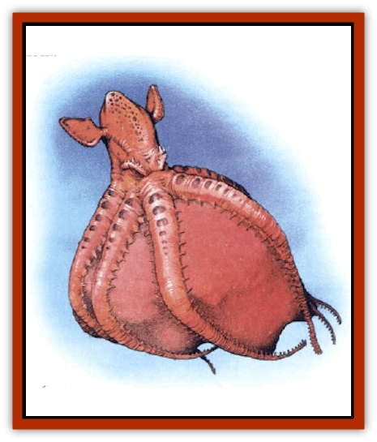

# Octopus - Octo-Jelly

| Statistic | **Octo-hide** | **Octo-jelly** |
| --- | --- | --- |
| **Activity Cycle:** | Any | Any |
| **Alignment:** | Neutral | Neutral |
| **Armor Class:** | 8 | 10 |
| **Climate/Terrain:** | Ocean depths | Ocean depths |
| **Damage/Attack:** | 2d6 | 1d6+1d10 |
| **Diet:** | Carnivore | Carnivore |
| **Frequency:** | Rare | Uncommon |
| **Hit Dice:** | 10 | 8 |
| **Intelligence:** | Animal (1) | Animal (1) |
| **Magic Resistance:** | Nil | Nil |
| **Morale:** | Fearless (20) (see below) | Fearless (19) (see below) |
| **Movement:** | Sw 12 | Sw 9 |
| **No. Appearing:** | 1 | 1-2 |
| **No. of Attacks:** | 1 or special | 1 |
| **Organization:** | Solitary | Solitary |
| **Size:** | H (20' across) | L (9' long, 5' across) |
| **Special Attacks:** | Cold generation | Smother |
| **Special Defenses:** | Continuous damage, luminous cloud, immune to cold | Luminous cloud |
| **THAC0:** | 11 | 13 |
| **Treasure:** | Nil | Nil |
| **XP Value:** | 4,000 | 2,000 |

This deep water predator is a bell-shaped [[Octopus_Giant|octopus]] with a pair of swimming fins protruding from its body. Its tentacles appear to be very short, as they are connected by webbing for nearly their entire length, creating a fleshy bag in which to trap prey. Further, the creature is effectively blind, using touch and sensing vibration to pinpoint its prey. While it can instinctively change color in an instant to match the ocean floor, the lack of light in the depths makes camouflage largely irrelevant.

**Combat:** Moving in the manner of a [[Jellyfish_Giant|jellyfish]] or slowly along the ocean floor, the octo-jelly's hunting method is to position itself directly above its intended prey and then drop down, enfolding the prey completely in its webbed tentacles. The octo-jelly has two attacks against the trapped prey: a bite with its horny beak that inflicts 1d10 points of damage and a smothering attack in its clammy mass, which causes another 1d6 points of damage. Once a prey is trapped, no further attack rolls are necessary, both types of damage are inflicted each round until the prey escapes or is consumed. A trapped prey can free itself at the beginning of any round with a successful saving throw vs. petrification (at a -1 penalty). Because the octo-jelly is so soft, all attacks directed at it cause full damage to anyone trapped inside its mass.

Although fragile, it has virtually unshakable morale. An octo-jelly will not retreat until it has lost 75% of its hit points; under absolutely no other circumstances will it ever retreat. When attacked by a stronger foe, the octo-jelly can release a luminous cloud of glowing blue-green particles. Anyone caught in this cloud (20 feet high by 30 feet wide by 30 feet long) is blinded for one full turn, losing all initiative and defending against any attacks at a -2 penalty.

**Habitat/Society:** The octo-jelly is solitary, due largely to the difficulty of finding a stable food source for even a small gathering in the ocean depths. No more than two (a male and a female) will be found together, and then only during the mating season. When the creature's eggs hatch, the young live for a short time within the mother's protective tentacle bell, but they soon disperse in search of food. These creatures rarely come to the surface, unless driven upward by some major undersea disturbance or cataclysm.

**Ecology:** The octo-jelly eats any animal it has a chance to kill. In return, it is eaten by anything that can catch and kill it, meaning virtually all of its neighbors; there are few clear-cut distinctions between predator and prey in the ocean depths.

Because it is softer than octopi that live near the surface, the skin of the octo-jelly is useless for commercial purposes. It is edible, however. If its ink particles can be collected, they might be used as an ingredient in the ink used to create such spell scrolls as *light*, *continual light*, and the various prismatic spells. An octo-jelly carries enough particles to provide sufficient ink for one written spell.

**Octo-Hide**

  The octo-hide, a relative of the octo-jelly, is a bottom-dwelling octopus of the deepest oceans. Enormous in size (20 feet or more across), with comparatively short, webbed tentacles, it might be of any color and changes hue frequently.

The octo-hide will try to get close enough to bite the prey. To disable prey so it can close in for the kill, each round it can generate a cone of cold 10 feet wide and 30 feet long that inflicts 3d6 points of damage (save vs. spell for half). The octo-hide itself is immune to all cold-based attacks. The beak inflicts 2d6 points of damage. On a beak hit, the octo-hide's tentacles wrap around the prey so that no further attack rolls are necessary.

The octo-hide is ferocious, but if the battle goes against it (the creature loses 75% of its hit points), the octo-hide retreats, releasing any prey and covering its withdrawal with the same sort of blinding cloud as the octo-jelly (lose initiative and -2 on defense for one full turn). The octo-hide's cloud is 40 feet high by 60 feet wide by 60 feet long.

Octo-hides are solitary, due to the difficulty of finding a stable supply of food for more than one octo-hide in a small area. The octo-hide mating season is brief, and the eggs are abandoned as soon as they are laid. The octo-hide preys on both swimmers and bottom-crawlers. Its ink is used in much the same way as that of an octo-jelly, and has the same value as a scroll-ink ingredient.

---
## Discovery & Documentation

**Source Publication:** Monstrous Compendium, 1997 Annual, Volume 4 (1995)
**Campaign Setting:** Advanced Dungeons & Dragons 2nd Edition
**Author(s):** Jon Pickens

### Other Creatures Found in This Source Book
   * [[Anemone_Giant_Sea|Anemone, Giant Sea]]
   * [[Asperii|Asperii]]
   * [[Bainligor|Bainligor]]
   * [[Beast_of_Chaos|Beast of Chaos]]
   * [[Blindheim|Blindheim]]
   * [[Bloodsipper_Far_Realm|Bloodsipper (Far Realm)]]
   * [[Bulette_Gohlbrorn|Bulette, Gohlbrorn]]
   * [[Child_of_the_Sea|Child of the Sea]]
   * [[Clockwork_Horror|Clockwork Horror]]
   * [[Clockwork_Swordsman|Clockwork Swordsman]]
   * [[Coral|Coral]]
   * [[Darklore|Darklore]]
   * [[Dharculus|Dharculus]]
   * [[Dolphin_Athas|Dolphin (Athas)]]
   * [[Dragon_Neutral_Moonstone|Dragon, Neutral, Moonstone]]
   * [[Dragon_Prismatic|Dragon, Prismatic]]
   * [[Dream_Stalker|Dream Stalker]]
   * [[Dragon-kin_Albino_Wyrm|Dragon-kin, Albino Wyrm]]
   * [[Echyan|Echyan]]
   * [[Firestar|Firestar]]
   * [[Firetail|Firetail]]
   * [[Fish_Ascallion|Fish, Ascallion]]
   * [[Fish_Deep_Ocean|Fish, Deep Ocean]]
   * [[Fish_Tropical|Fish, Tropical]]
   * [[Fish_Vurgens|Fish, Vurgens]]
   * [[Fogwarden|Fogwarden]]
   * [[Fraal|Fraal]]
   * [[Giant_Crag|Giant, Crag]]
   * [[Gibberling_Brood|Gibberling, Brood]]
   * [[Glutton_Sea|Glutton, Sea]]
   * [[Golden_Ammonite|Golden Ammonite]]
   * [[Golem_Brass_Minotaur|Golem, Brass Minotaur]]
   * [[Golem_Gemstone|Golem, Gemstone]]
   * [[Golem_Maggot|Golem, Maggot]]
   * [[Groundling|Groundling]]
   * [[Hermit_Sea|Hermit, Sea]]
   * [[Hound_of_Law|Hound of Law]]
   * [[Human_Amazon|Human, Amazon]]
   * [[Human_Pygmy|Human, Pygmy]]
   * [[Inquisitor|Inquisitor]]
   * [[Kercpa|Kercpa]]
   * [[Kreel|Kreel]]
   * [[Lycanthrope_Lythari|Lycanthrope, Lythari]]
   * [[Mercurial|Mercurial]]
   * [[Mold_Chromatic|Mold, Chromatic]]
   * [[Mummy_Bog|Mummy, Bog]]
   * [[Neh-thalggu|Neh-thalggu]]
   * [[Nymph_Grain|Nymph, Grain]]
   * [[Nymph_Unseelie|Nymph, Unseelie]]
   * [[Puddingfish|Puddingfish]]
   * [[Sea_Demon|Sea Demon]]
   * [[Shade|Shade]]
   * [[Shadowrath|Shadowrath]]
   * [[Shark_Athas|Shark (Athas)]]
   * [[Siren_Ravenloft|Siren (Ravenloft)]]
   * [[Skeleton_Variant|Skeleton, Variant]]
   * [[Skyfish|Skyfish]]
   * [[Spectral_Scion|Spectral Scion]]
   * [[Spyder_Fiend|Spyder Fiend]]
   * [[Squid_Squark|Squid, Squark]]
   * [[Tanar'ri_Lesser_Uridezu|Tanar'ri, Lesser, Uridezu]]
   * [[Troll_Mutate|Troll Mutate]]
   * [[Vaati|Vaati]]
   * [[Vampire_Cerebral|Vampire, Cerebral]]
   * [[Varkha|Varkha]]
   * [[Wizshade|Wizshade]]
   * [[Worm_Lukhorn|Worm, Lukhorn]]
   * [[Wyste|Wyste]]
   * [[Yugoloth_Lesser_Gacholoth|Yugoloth, Lesser, Gacholoth]]
   * [[Zombie_Mud|Zombie, Mud]]
