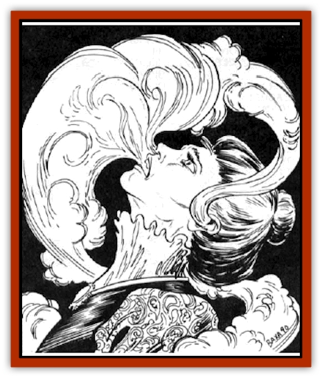

# Odem

| Statistic | **Odem** |
| --- | --- |
| **Activity Cycle:** | Any |
| **Alignment:** | Chaotic evil |
| **Armor Class:** | N/A |
| **Climate/Terrain:** | Any land |
| **Damage/Attack:** | Nil |
| **Diet:** | None |
| **Frequency:** | Very rare |
| **Hit Dice:** | N/A |
| **Intelligence:** | Very (11-12) |
| **Magic Resistance:** | See below |
| **Morale:** | Fearless (19-20) |
| **Movement:** | 9 |
| **No. Appearing:** | 1 |
| **No. of Attacks:** | 1 |
| **Organization:** | Solitary |
| **Size:** | N/A |
| **Special Attacks:** | Domination |
| **Special Defenses:** | Immune to physical damage |
| **THAC0:** | N/A |
| **Treasure:** | Nil |
| **XP Value:** | 1,000 |

An odem is an undead spirit that moves into living bodies and takes control of them.

This creature is invisible to normal sight. Characters who can perceive ethereal objects see the odem as a white vapor when it is outside a body. When it is inside a body, they see a white aura about the face, which is concentrated at the eyes and mouth. The creature also appears as a white vapor on the ethereal plane.

Odems do not speak except when in control of a host, When that happens, they know the languages that they did in life, but not necessarily those of the host.

**Combat:** When it is outside a living body, the odem does not fight. In this state, it is invisible, ethereal, and immune to any form of physical or magical attack. Any spells designed to force extraplanar creatures to retreat or leave the prime material plane (*banishment*, *dismissal*, etc.) will indeed function normally. In the demiplane of Ravenloft, these spells only drive it from the host body and make it flee the region. This assumes that the person casting the spell can see the odem. An odem cannot be turned by a priest.

The odem inhabits a body by entering an orifice such as the mouth, nose, or ear. It can inhabit any living humanoid creature. Once inside the body, the odem is immune to any spell except *wish* or *magic jar*, which can drive it from the host body and repel the wizard's spirit back into the receptacle.

The inhabited body is quite vulnerable to harm while inhabited by the odem. Since the mind in control is that of the odem, spells affecting the mind don't work. If the host body is killed, the odem flees the body and must find a new victim.

An odem can pass through any physical object, but not through a magical restraint. A spell such as *trap the soul*, *temporal stasis*, or *imprisonment* will trap the odem in its current host.

**Habitat/Society:** The odem wanders the border of the ethereal plane, and peers into the Prime Material plane. It searches for victims with great potential for fear, anger, or hate.

An odem does not kill its victim or deaden his or her thoughts. If the victim's body were a coach, and the mind its driver, the odem would bind and gag the driver and take the reins himself. Like the poor driver who sits bound and gagged in the coach, the person whose body has been hijacked is completely aware of everything the odem is doing. He simply is helpless to act. He can even communicate telepathically with the odem if he wishes. If the odem is driven out, the character returns to normal.

**Ecology:** The odem is an evil undead spirit. Vicious or murderous characters of great willpower may become odems when they die. The goal of the odem is always to cause mayhem and destruction. It feeds on the fear, anger, and hate of those around it. Since it is not harmed by the death of its host, it considers the host quite expendable. Typically, it attempts to start fights with insults or even physical abuse. It also may steal from one person and plant the goods on another.

---
## Discovery & Documentation

**Source Publication:** Ravenloft Campaign Setting, 1st Ed. ("Realm of Terror") (1994)
**Campaign Setting:** Ravenloft
**Author(s):** Bruce Nesmith and Andria Hayday

### Other Creatures Found in This Source Book
   * [[Geist|Geist]]
   * [[Gremishka|Gremishka]]
   * [[Lycanthrope_Loup-garou|Lycanthrope, Loup-garou]]
   * [[Strahd_Skeleton|Strahd Skeleton]]
   * [[Strahd_Zombie|Strahd Zombie]]
   * [[Vampire_Nosferatu|Vampire, Nosferatu]]
