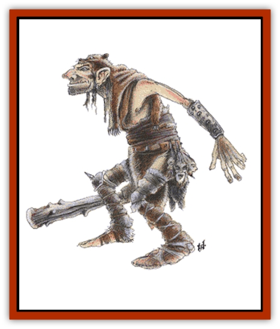
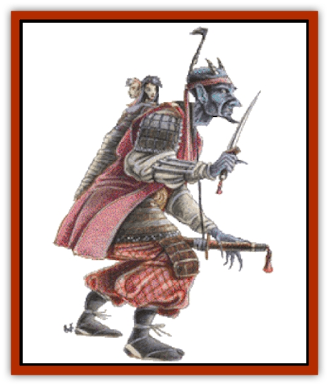

# Ogre

| Statistic | **Merrow** | **Ogre** | **Ogre Mage** |
| --- | --- | --- | --- |
| **Activity Cycle:** | Any | Any | Any |
| **Alignment:** | Chaotic evil | Chaotic evil | Lawful evil |
| **Armor Class:** | 4 | 5 | 4 |
| **Climate/Terrain:** | Any water | Any land | Any oriental land |
| **Damage/Attack:** | 1-6/1-6/2-8 (or by weapon +6) | 1-10 (or by weapon +6) | 1-12 |
| **Diet:** | Carnivore | Carnivore | Carnivore |
| **Frequency:** | Uncommon | Common | Very rare |
| **Hit Dice:** | 4+4 | 4+1 | 5+2 |
| **Intelligence:** | Average (8-10) | Low (8) | Average to exceptional (9-16) |
| **Magic Resistance:** | Nil | Nil | Nil |
| **Morale:** | Steady (11-12) | Steady (11-12) | Elite (13-14) |
| **Movement:** | 6, Sw 12 | 9 | 9, Fl 15 (B) |
| **No. Appearing:** | 2-24 (2d12) | 2-20 (2d10) | 1-6 |
| **No. of Attacks:** | 3 or 1 | 1 | 1 |
| **Organization:** | Tribal | Tribal | Tribal |
| **Size:** | Large (9') | Large (9'+) | Large (10½') |
| **Special Attacks:** | See below | +2 to damage | Magic spells |
| **Special Defenses:** | Camouflage | Nil | Nil |
| **THAC0:** | 15 | 17 | 15 |
| **Treasure:** | M (A) | M (Q,B,S) | G (R,S, magic) |
| **XP Value:** | 420 / Leader: 650 / Chieftain: 975 | 270 / Leader: 650 / Chieftain: 975 | 650 / Chieftain: 975 |

Ogres are big, ugly, greedy humanoids that live by ambushes, raids, and theft. Ill-tempered and nasty, these monsters are often found serving as mercenaries in the ranks of [[Orc|orc]] tribes, evil clerics, or [[Gnoll|gnolls]]. They mingle freely with giants and [[Troll|trolls]].

Adult ogres stand 9 to 10 feet tall and weigh 300 to 350 pounds. Their skin colors range from a dead yellow to a dull black-brown, and (rarely) a sickly violet. Their warty bumps are often of a different color - or at least darker than their hides. Their eyes are purple with white pupils. Teeth and talons are orange or black. Ogres have long, greasy hair of blackish-blue to dull dark green. Their odor is repellent, reminiscent of curdled milk. Dressing in poorly cured furs and animal hides, they care for their weapons and armor only reasonably well. It is common for ogres to speak orc, troll, [[Giant_Stone|stone giant]], and gnoll, as well as their own guttural language. A typical ogre's life span is 90 years.

**Combat:** In small numbers, ogres fight as unorganized individuals, but groups of 11 or more will have a leader, and groups of 16 or more usually include two leaders and a chieftain. Ogres wielding weapons get a Strength bonus of +2 to hit; leaders have +3, chieftains have +4. Females fight as males but score only 2-8 points of damage and have a maximum of only 6 hit points per die. Young ogres fight as [[Goblin|goblins]].

**Habitat/Society:** Ogre tribes are found anywhere, from deep caverns to mountaintops. Tribes have 16-20 males, 2-12 females, and 2-8 young. Shamans, if present, will be of 3rd level, and have access to the spheres of combat, divination, healing, protection, and sun (darkness only). Ogres live by raiding and scavenging and they will eat anything. Their fondness for [[Elf|elf]], [[Dwarf|dwarf]], and [[Halfling|halfling]] flesh means that there is only a 10% chance that these will be found as slaves or prisoners. There is a 30% chance that an ogre lair will include 2-8 slaves. Captured prisoners are always kept as slaves (25%) or food (75%). Extremely avaricious, ogres squabble over treasure and cannot be trusted, even by their own kind.

**Ecology:** Ogres consistently plague mankind, lusting for gold, gems, and jewelry as well as human flesh. They are evil-natured creatures that join with other monsters to prey on the weak and favor overwhelming odds to a fair fight. Ogres make no crafts nor labor.

**Ogre Leader**

  When more than 11 ogres are encountered, a leader will be present. He is a 7 Hit Dice monster with 30-33 hit points and Armor Class 3. He inflicts 5-15 (2d6+3) points of damage per attack, +6 with weapon.

**Ogre Chieftain**

  If 16 or more ogres are encountered, they will be led by two patrol leaders and a chieftain. The chieftain is a 7 Hit Dice monster with 34-37 hit points and Armor Class 4. He inflicts 8-18 (2d6+6) points of damage per attack, +6 with weapon. Chieftains are usually the biggest and smartest ogres in their tribes.

## 

Ogre Mage

The oriental ogre has light blue, light green, or pale brown skin with ivory horns. The hair is usually a different color (blue with green, green with blue) and is darker in shade; the main exception to this coloration is found in ogre magi with pale brown skin and yellow hair. They have black nails and dark eyes with white pupils. The teeth and tusks are very white. Ogre magi are taller and more intelligent than their cousins and they dress in oriental clothing and armor.

**Combat:** Ogre magi can perform the following feats of magic: *fly* (for 12 turns), *become invisible*, *cause darkness* in a 10-foot radius, *polymorph* to a human or similar bipedal creature (4 feet to 12 feet tall), and *regenerate* one hit point per round (lost members must be reattached to regenerate). Once per day they can do the following: *charm person*, *sleep*, *assume gaseous form*, and create a *cone of cold* 60 feet long with a terminal diameter of 20 feet, which inflicts 8-64 (8d8) points of damage (save vs. spell for half damage). Oriental ogres attack with magic first and resort to physical attacks only if necessary. They are +1 on morale.

In battle, ogre magi prefer the naganata (75%) or scimitar and whip (25%). Those found in oriental settings might (25%) possess ki power or have mastered a martial arts form. As ogre magi are intelligent, they will not fight if faced with overwhelming odds, but will flee to gather their forces or hide.

**Habitat/Society:** These monsters live in fortified dwellings or caves and foray to capture slaves, treasure, and food. Ogre magi priests of up to 7th level have been reported. Tribes are small, with 2-5 females and 1-3 children that will not fight, but rather seek to escape in gaseous form. These monsters are extremely protective of their young and will battle with savage abandon to save one's life. If a young ogre mage is captured, these creatures will pay high ransom for its return, but they will seek revenge and will never forget the insult of the kidnaping.

If encountered in their lair, ogre magi will be led by a chief of great strength (+2 on each Hit Die, attacking and saving as a 9 Hit Dice monster). Treasure is divided by this chief and his trove is always the richest. The tribe will have their own clan symbol typical to the oriental lands, and this symbol will be stitched on its war banners and flags as well as on armor and headdresses. The chief will often have the tribe's symbol tattooed on his forehead or back.

Ogre magi speak the common tongue, their own special language, and the speech of normal ogres.

**Ecology:** Ogre magi magical armor is too large to fit a man. This monster's lair is usually a powerful structure that can be expanded into a mighty fortress if it can be rid of its original owners.

## Merrow (Aquatic Ogre)

Faster and fiercer than their land kin, the freshwater merrow are greenish and scaled with webbed hands and feet. Their necks are long and thick, their shoulders are sloping, and they have huge mouths and undershot jaws. Merrow have black teeth and nails and deep green eyes with white centers, and their hair resembles slimy seaweed. About 10% grow ivory horns, especially the more powerful males.

Aquatic ogres are very fond of tattoos, and females may have their entire bodies inked with scenes of death and destruction as a sign of status. Merrow speak their own dialect and the language of other ogres.

**Combat:** Using their green coloration, aquatic ogres can hide, becoming effectively invisible 10-80% of the time, depending on terrain. They attack from cover, so others are -5 on their surprise roll. Merrow typically attack with a large piercing spear (inflicting 2-12 points of damage) in a swimming charge at +1 to hit, followed by melee with talons and teeth.

**Habitat/Society:** A typical merrow tribe consists of:

<ul><li>1 chief, AC3, 6+6 Hit Dice, +2 on damage</li><li>2 patrol leaders, AC3, 5+5 Hit Dice, +1 on damage</li><li>2-24 standard merrow</li><li>2-24 females, AC5, 3+3 Hit Dice, 1-2/1-2/1-6 damage</li><li>1-12 young, AC6, 2+2 Hit Dice, 1-2/1-2/1-4 damage</li><li>1 shaman of 3rd level ability</li></ul>Merrow dwell in caves in shallow, fresh water (50-250 feet deep), often with scrags (see Troll). They can live out of water for about two hours, so they often forage on land. Merrow usually control an area with a radius of 10-15 miles, hunting and foraging throughout this territory. In times of scarcity, or when the lure of treasure becomes too great, a war party will attack the coastal villages of man. Merrow prefer gold and jewels and often overlook dull magical items in search of glittering prizes. The goals of a merrow chieftain rule the tribe, and these power-hungry monsters seek to completely control their "kingdoms", often leading to attacks on intruding ships.

**Ecology:** Merrow are ignorant and superstitious and have no skills but plundering and murder. Areas of the freshwater lakes and seas where they have influence are avoided by sailors and fishermen. These monsters are carnivores, preying on all who enter their regions, often emptying the seas of life with their voracious appetites.

---
## Discovery & Documentation

**Source Publication:** MC1 Volume I (w/binder #1) (1991)
**Campaign Setting:** Advanced Dungeons & Dragons 2nd Edition
**Author(s):** Jay Batista, Scott Bennie, Grant Boucher, William W. Connors, Steve Gilbert, Heike Kubasch, James Lowder, David Edward Martin, Bruce Nesmith, Jean Rabe, Rick Swan, John J. Terra, Gary L. Thomas

### Other Creatures Found in This Source Book
   * [[Bat|Bat]]
   * [[Bear|Bear]]
   * [[Behir|Behir]]
   * [[Boar|Boar]]
   * [[Bookworm|Bookworm]]
   * [[Brownie|Brownie]]
   * [[Bugbear|Bugbear]]
   * [[Carrion_Crawler|Carrion Crawler]]
   * [[Cat_Great|Cat, Great]]
   * [[Catoblepas|Catoblepas]]
   * [[Dragon_General_Information|Dragon, General Information]]
   * [[Dragonfish|Dragonfish]]
   * [[Elemental_Air_Kin_Aerial_Servant|Elemental, Air Kin, Aerial Servant]]
   * [[Elemental_Earth_Kin_Sandling|Elemental, Earth Kin, Sandling]]
   * [[Elephant|Elephant]]
   * [[Gnoll|Gnoll]]
   * [[Hobgoblin|Hobgoblin]]
   * [[Homunculus|Homunculus]]
   * [[Hornet_Giant|Hornet, Giant]]
   * [[Horse|Horse]]
   * [[Hyena|Hyena]]
   * [[Jackal|Jackal]]
   * [[Jackalwere|Jackalwere]]
   * [[Korred|Korred]]
   * [[Lich|Lich]]
   * [[Lizard|Lizard]]
   * [[Lizard_Man|Lizard Man]]
   * [[Lycanthrope_General_Information|Lycanthrope, General Information]]
   * [[Lycanthrope_Seawolf|Lycanthrope, Seawolf]]
   * [[Lycanthrope_Werebear|Lycanthrope, Werebear]]
   * [[Lycanthrope_Weretiger|Lycanthrope, Weretiger]]
   * [[Lycanthrope_Werewolf|Lycanthrope, Werewolf]]
   * [[Manticore|Manticore]]
   * [[Medusa|Medusa]]
   * [[Mind_Flayer|Mind Flayer]]
   * [[Minotaur|Minotaur]]
   * [[Mudman|Mudman]]
   * [[Mummy|Mummy]]
   * [[Nixie|Nixie]]
   * [[Nymph|Nymph]]
   * [[Ooze_Slime_Jelly_I|Ooze/Slime/Jelly I]]
   * [[Ooze_Slime_Jelly_II|Ooze/Slime/Jelly II]]
   * [[Orc|Orc]]
   * [[Owl|Owl]]
   * [[Owlbear_I|Owlbear I]]
   * [[Pegasus|Pegasus]]
   * [[Piercer|Piercer]]
   * [[Pudding_Deadly|Pudding, Deadly]]
   * [[Rakshasa|Rakshasa]]
   * [[Rat|Rat]]
   * [[Ray|Ray]]
   * [[Remorhaz|Remorhaz]]
   * [[Satyr|Satyr]]
   * [[Scorpion|Scorpion]]
   * [[Selkie|Selkie]]
   * [[Shadow|Shadow]]
   * [[Skeleton|Skeleton]]
   * [[Skunk|Skunk]]
   * [[Snake|Snake]]
   * [[Spectre|Spectre]]
   * [[Spider|Spider]]
   * [[Sprite|Sprite]]
   * [[Toad_Giant|Toad, Giant]]
   * [[Treant|Treant]]
   * [[Troll|Troll]]
   * [[Umber_Hulk|Umber Hulk]]
   * [[Unicorn|Unicorn]]
   * [[Vampire|Vampire]]
   * [[Wight|Wight]]
   * [[Will_O'Wisp|Will O'Wisp]]
   * [[Wolf|Wolf]]
   * [[Wolfwere|Wolfwere]]
   * [[Wraith|Wraith]]
   * [[Wyvern|Wyvern]]
   * [[Yeti|Yeti]]
   * [[Yuan-ti|Yuan-ti]]
   * [[Zombie|Zombie]]
