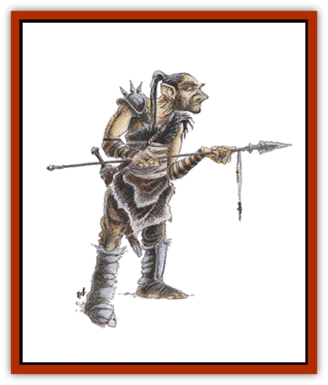

# Ogre - Half

| Statistic | **Half-Ogre** | **Ogrillon** |
| --- | --- | --- |
| **Activity Cycle:** | Any | Any |
| **Alignment:** | Chaotic evil | Chaotic evil |
| **Armor Class:** | 5 (9) | 6 |
| **Climate/Terrain:** | Any/Land | Any/Land |
| **Damage/Attack:** | 2-8 (by weapon) | 2-7/2-7 |
| **Diet:** | Omnivore | Carnivore |
| **Frequency:** | Very rare | Rare |
| **Hit Dice:** | 2+6 | 2+4 |
| **Intelligence:** | Semi- to High (3-14) | Low (5-7) |
| **Magic Resistance:** | Nil | Nil |
| **Morale:** | Steady (12) | Average (10) |
| **Movement:** | 12 | 12 |
| **No. Appearing:** | 1-4 | 1-4 (5-30) |
| **No. of Attacks:** | 1 | 2 |
| **Organization:** | Tribal | Tribal |
| **Size:** | L (8-9' tall) | M (6-7' tall) |
| **Special Attacks:** | Nil | Nil |
| **Special Defenses:** | Nil | Nil |
| **THAC0:** | 17 | 17 |
| **Treasure:** | B,M (Q,B,S) | M (B,S) |
| **XP Value:** | 270 | 175 |

When adventuring companies journey into the wilderness they often run into [[Ogre|ogres]]; big, ugly humanoids. Occasionally, an ogre party will include one or two individuals that are a little shorter, but significantly smarter, wielding a weapon with more skill than might have been expected. They have a better understanding of their opponents, and they grunt commands that anticipate the adventurers' moves. In this way half-breeds, the issue of ogres and humans, earn the respect of their kind.

Half-ogres range from 7 to 8 feet in height and weigh from 315 to 425 pounds. Skin and hair color are variable, but tend toward brown, gray, black, dull yellow (skin only), or any of the above with a slight gray-green tint. Teeth and nails are always orange. Most half-ogres have human-like eyes, though about one in five have the white pupils common to ogres. Their odor is noticeable, but it is not as overpowering as that of a full-blooded ogre. The half-ogre traditionally wears heavy skins and furs, bringing his Armor Class up to that of his ogre brethren, but rare individuals have the ability to make a shirt of chain-mail, for an AC of 3. Half-ogres speak common (more clearly and unimpeded than ogres), ogrish, [[Orc|orcish]], [[Troll|troll]], and one other, usually human, language. They live about 110 years.

Half-ogres posses infravision out to 60 feet. Their sense of smell is better than an ogre's, but it falls short of a human's.

**Combat:** Half-ogres of any sort suffer -2 penalties to their attack rolls against [[Dwarf|dwarves]] and -4 against [[Gnome|gnomes]], since those smaller races are so skilled at battling bigger folk.

Half-ogres in combat are often found with full-blooded ogres. If so, the half-ogre will most likely be leading the ogre party. The ogres fight more wisely when led by a half-ogre that concentrates assaults on characters it recognizes as spellcasters, and teaming up against skilled fighters. Ambushes are better-planned and more carefully baited.

To earn command privileges, particularly when ogre leaders are present, a half-ogre must show himself quick to battle and fierce in combat. Half-ogres' usual weapon of choice is a huge sword (use the statistics for a two-handed bastard sword, save that half-ogres can employ it one-handed, with a large shield in the other), or a war spear capable of causing 2d4 points of damage. A half-ogre inflicts an additional 2 points of damage, due to his mass.

Half-ogres sometimes gather together to form their own tribes. In this case, they will be encountered in bands of 2d10 and will expend as much energy choosing and preparing an ambush as on the combat itself.

For every five half-ogres in an encounter, there is an additional veteran with 5+3 Hit Dice. For every 10 half-ogres, there is a kader with 6 Hit Dice. If more than 15 half-ogres are encountered, they will have a shaman, a fighter/priest with 5+3 Hit Dice and the spells of a 4th-level priest, and two acolyte shamans, with 4+6 Hit Dice and the spells of a 2nd-level priest.

Half-ogres are inclined to intimidate others. A broad, fang-filled smile and perhaps a slamming fist, often encourages an NPC to suddenly remember appointments, or perhaps faint dead away. Kobolds will clutch their spears and cringe in unison when 7'6" of solid muscle smashes their door to splinters and storms in; even larger monsters have serious reservations about attacking half-ogres. They will also terrify local human populations into leaving a half-ogre and his companions alone.

**Habitat/Society:** Half-ogres have no society of their own. If they live with ogres, they are the quick-thinking members of the tribe, ever on their toes to prove themselves worthy. If a half-ogre is reared in a human community, he learns to live with suspicion and fear, and often turns to a military or solitary occupation.

Occasionally, half-ogres join with [[Orc|half-orcs]], [[Orc|orogs]], ogrillons, and other humanoids. These communities are small (5-200 residents) and usually isolated, but can appear in virtually any terrain. Half-ogres fill a middle niche - more powerful than half-orcs or orogs, but smarter than ogrillons, trolls, and other humanoids. As a whole, these communities are chaotic evil, with neutral tendencies stemming from the level of cooperation necessary in a "half-caste" situation. They prefer others of their own kind, and are tolerant of orcs and ogres. Enough of them have human blood that they regard humans with neutrality.

Indeed, chaotic evil humans often find their most enthusiastic followers in such a hybrid tribe. They also tolerate monstrous humanoids such as trolls and giants, but all other races are treated with undisguised hostility.

Hybrid settlements raid civilized territories for prisoners and loot. A settlement may be found holding prisoners. It is also likely for treasure to be found in a hybrid camp. Half-ogres are usually cheated out of most of their rightful treasure shares by the more cunning orogs and half-orcs.

**Ecology:** Sages have expressed much concern over the years, wondering why ogres can interbreed with humans but not with [[Elf|elves]] or [[Halfling|halflings]]. When the actual answer was discovered, the sages' concerns proved unfounded. The explanation had nothing to do with any supposed common origin of humans and ogres, but rather in a unusual characteristic that ogres share with orcs: rapidly adaptive biology. Just as orcs and ogres can adapt quickly to any terrain, from forests to the highest mountains, their genetic construction allows them breed with any humanoid race.

This ability to breed easily is frequently passed on to their progeny. Half-ogres can also breed successfully with most other humanoid races. If this process continues for many generations, the result is a horrible hybrid known as a [[Mongrelman|mongrelman]]. Many mongrelmen have strong strains of orc and ogre in their bloodlines, which may account for their chaotic evil attitudes.

The half-ogre shares the ogre's place in the ecosystem: that of a plague upon demihumans and humans, lusting for treasure and making neither crafts nor good labor. The beginnings of half-ogre poetry have been around for many years, but it is exceptionally ugly and disturbing.

**Ogrillon**

  The ogrillon is a fiercer species of the half-ogre, being the fruit of a union between ogres and orcs. The ogrillon displays the general tendencies of its larger cousin with some exceptions. It is even more brutish and violent, and it normally learns to speak only ogrish and a handful of words in common.

The ogrillon is the size of an orc, and closely resembles one. One in every ten is born with features and coloration very similar to those of ogres: purple eyes with white pupils, black teeth, yellowish skin with dull, dark green hair. The skin of an ogrillon of either type is covered with small horn plates, giving it a superior Armor Class and enabling it to fight without weapons. An ogrillon disdains armor and most other material items, retaining only a handful of gold pieces as treasured belongings. It is uncertain why they would keep gold, except perhaps as good luck charms.

They love mayhem. In combat they disdain weapons and plunge in with both fists. Due to their great strength and horn-reinforced fists, each punch delivers 1d6+1 points of damage. An ogrillon out of combat is restless and troubled, but it will be seen chuckling merrily to itself during a good fight.

Because of their single-mindedness, ogrillons are often approached by orcs when they need good fighters against some enemy. Ogrillons are happy to join and fight, sometimes for the love of combat and destruction, but often for more lucky gold pieces. In combat, there is only a 10% chance that a typical ogrillon can be distinguished from an orc. Ogrillons that resemble ogres, of course, clearly stand out.

Ogrillons are the issue of a female orc mated with a male ogre. Thankfully, it is sterile. The union of a male orc and a female ogre yields an orog, a better class of humanoid monster detailed in the [[Orc|Orc]] entry.

---
## Discovery & Documentation

**Source Publication:** Monstrous Manual (1995)
**Campaign Setting:** Advanced Dungeons & Dragons 2nd Edition
**Author(s):** Tim Beach

### Other Creatures Found in This Source Book
   * [[Aarakocra|Aarakocra]]
   * [[Aboleth|Aboleth]]
   * [[Ankheg|Ankheg]]
   * [[Arcane|Arcane]]
   * [[Argos|Argos]]
   * [[Aurumvorax|Aurumvorax]]
   * [[Baatezu_Lesser_Abishai|Baatezu, Lesser, Abishai]]
   * [[Baatezu_General_Information|Baatezu, General Information]]
   * [[Baatezu_Greater_Pit_Fiend|Baatezu, Greater, Pit Fiend]]
   * [[Banshee|Banshee]]
   * [[Basilisk|Basilisk]]
   * [[Bat|Bat]]
   * [[Bear|Bear]]
   * [[Beetle_Giant|Beetle, Giant]]
   * [[Behir|Behir]]
   * [[Beholder_and_Beholder-kin_I|Beholder and Beholder-kin I]]
   * [[Beholder_and_Beholder-kin_II|Beholder and Beholder-kin II]]
   * [[Bird|Bird]]
   * [[Brain_Mole|Brain Mole]]
   * [[Broken_One|Broken One]]
   * [[Brownie|Brownie]]
   * [[Bugbear|Bugbear]]
   * [[Bulette|Bulette]]
   * [[Bullywug|Bullywug]]
   * [[Carrion_Crawler|Carrion Crawler]]
   * [[Cat_Great|Cat, Great]]
   * [[Catoblepas|Catoblepas]]
   * [[Cat_Small|Cat, Small]]
   * [[Cave_Fisher|Cave Fisher]]
   * [[Centaur|Centaur]]
   * [[Centipede|Centipede]]
   * [[Chimera|Chimera]]
   * [[Cloaker|Cloaker]]
   * [[Cockatrice|Cockatrice]]
   * [[Couatl|Couatl]]
   * [[Crabman|Crabman]]
   * [[Crawling_Claw|Crawling Claw]]
   * [[Crocodile|Crocodile]]
   * [[Crustacean_Giant|Crustacean, Giant]]
   * [[Crypt_Thing|Crypt Thing]]
   * [[Death_Knight|Death Knight]]
   * [[Deepspawn|Deepspawn]]
   * [[Dinosaur_I|Dinosaur I]]
   * [[Displacer_Beast|Displacer Beast]]
   * [[Dog|Dog]]
   * [[Dog_Moon|Dog, Moon]]
   * [[Dolphin|Dolphin]]
   * [[Doppelganger|Doppelganger]]
   * [[Dracolich|Dracolich]]
   * [[Dragon_Brown|Dragon, Brown]]
   * [[Dragon_Chromatic_Black|Dragon, Chromatic, Black]]
   * [[Dragon_Chromatic_Blue|Dragon, Chromatic, Blue]]
   * [[Dragon_Chromatic_Green|Dragon, Chromatic, Green]]
   * [[Dragon_Cloud|Dragon, Cloud]]
   * [[Dragon_Chromatic_Red|Dragon, Chromatic, Red]]
   * [[Dragon_Chromatic_White|Dragon, Chromatic, White]]
   * [[Dragon_Deep|Dragon, Deep]]
   * [[Dragon_Gem_Amethyst|Dragon, Gem, Amethyst]]
   * [[Dragon_Gem_Crystal|Dragon, Gem, Crystal]]
   * [[Dragon_Gem_Emerald|Dragon, Gem, Emerald]]
   * [[Dragon_Gem_Sapphire|Dragon, Gem, Sapphire]]
   * [[Dragon_Gem_Topaz|Dragon, Gem, Topaz]]
   * [[Dragon_Metallic_Brass|Dragon, Metallic, Brass]]
   * [[Dragon_Metallic_Bronze|Dragon, Metallic, Bronze]]
   * [[Dragon_Metallic_Copper|Dragon, Metallic, Copper]]
   * [[Dragon_Mercury|Dragon, Mercury]]
   * [[Dragon_Metallic_Gold|Dragon, Metallic, Gold]]
   * [[Dragon_Mist|Dragon, Mist]]
   * [[Dragon_Metallic_Silver|Dragon, Metallic, Silver]]
   * [[Dragon_General_Information|Dragon, General Information]]
   * [[Dragon_Shadow|Dragon, Shadow]]
   * [[Dragon_Steel|Dragon, Steel]]
   * [[Dragon_Yellow|Dragon, Yellow]]
   * [[Dragonne|Dragonne]]
   * [[Dragon_Turtle|Dragon Turtle]]
   * [[Dragonet_Faerie_Dragon|Dragonet, Faerie Dragon]]
   * [[Dragonet_Fire_Drake|Dragonet, Fire Drake]]
   * [[Dragonet_Pseudodragon|Dragonet, Pseudodragon]]
   * [[Dryad|Dryad]]
   * [[Dwarf_Derro|Dwarf, Derro]]
   * [[Dwarf|Dwarf]]
   * [[Elemental_Athas_General_Information|Elemental (Athas), General Information]]
   * [[Elemental_Air_Kin|Elemental, Air Kin]]
   * [[Elemental_Earth_Kin|Elemental, Earth Kin]]
   * [[Elemental_Fire_Kin|Elemental, Fire Kin]]
   * [[Elemental_Water_Kin|Elemental, Water Kin]]
   * [[Elemental_of_Chaos_Air_Earth|Elemental of Chaos, Air/Earth]]
   * [[Elemental_of_Chaos_Fire_Water|Elemental of Chaos, Fire/Water]]
   * [[Elemental_Composite|Elemental, Composite]]
   * [[Elemental_Air_Earth|Elemental, Air/Earth]]
   * [[Elemental_Fire_Water|Elemental, Fire/Water]]
   * [[Elemental_General_Information|Elemental, General Information]]
   * [[Elephant|Elephant]]
   * [[Elf|Elf]]
   * [[Elf_Aquatic|Elf, Aquatic]]
   * [[Elf_Drow|Elf, Drow]]
   * [[Ettercap|Ettercap]]
   * [[Eyewing|Eyewing]]
   * [[Feyr|Feyr]]
   * [[Fish|Fish]]
   * [[Frog|Frog]]
   * [[Fungus|Fungus]]
   * [[Galeb_Duhr|Galeb Duhr]]
   * [[Gargantua|Gargantua]]
   * [[Gargoyle_I|Gargoyle I]]
   * [[Genie|Genie]]
   * [[Ghost|Ghost]]
   * [[Ghoul|Ghoul]]
   * [[Giant_Cloud|Giant, Cloud]]
   * [[Giant_Cyclops|Giant, Cyclops]]
   * [[Giant_Desert|Giant, Desert]]
   * [[Giant_Ettin|Giant, Ettin]]
   * [[Giant_Firbolg|Giant, Firbolg]]
   * [[Giant_Fire|Giant, Fire]]
   * [[Giant_Fog|Giant, Fog]]
   * [[Giant_Fomorian|Giant, Fomorian]]
   * [[Giant_Frost|Giant, Frost]]
   * [[Giant_Hill|Giant, Hill]]
   * [[Giant_Jungle|Giant, Jungle]]
   * [[Giant_Mountain|Giant, Mountain]]
   * [[Giant_Reef|Giant, Reef]]
   * [[Giant_Stone|Giant, Stone]]
   * [[Giant_Storm|Giant, Storm]]
   * [[Giant_Verbeeg|Giant, Verbeeg]]
   * [[Giant_Wood|Giant, Wood]]
   * [[Gibberling|Gibberling]]
   * [[Giff|Giff]]
   * [[Gith|Gith]]
   * [[Gith_Pirate_of|Gith, Pirate of]]
   * [[Githyanki|Githyanki]]
   * [[Githzerai|Githzerai]]
   * [[Gloomwing|Gloomwing]]
   * [[Gnoll|Gnoll]]
   * [[Gnome|Gnome]]
   * [[Gnome_Spriggan|Gnome, Spriggan]]
   * [[Goblin|Goblin]]
   * [[Golem_General_Information|Golem, General Information]]
   * [[Golem_I_Greater_Golem|Golem I (Greater Golem)]]
   * [[Golem_II_Lesser_Golem|Golem II (Lesser Golem)]]
   * [[Golem_III|Golem III]]
   * [[Golem_IV|Golem IV]]
   * [[Golem_V|Golem V]]
   * [[Golem_VI_Stone_Variants|Golem VI (Stone Variants)]]
   * [[Gorgon|Gorgon]]
   * [[Grell_Colonial|Grell, Colonial]]
   * [[Gremlin_Jermlaine|Gremlin, Jermlaine]]
   * [[Gremlin|Gremlin]]
   * [[Griffon|Griffon]]
   * [[Grimlock|Grimlock]]
   * [[Grippli|Grippli]]
   * [[Hag|Hag]]
   * [[Halfling|Halfling]]
   * [[Harpy|Harpy]]
   * [[Hatori|Hatori]]
   * [[Haunt|Haunt]]
   * [[Hell_Hound|Hell Hound]]
   * [[Heucuva|Heucuva]]
   * [[Hippocampus|Hippocampus]]
   * [[Hippogriff|Hippogriff]]
   * [[Hobgoblin|Hobgoblin]]
   * [[Homunculus|Homunculus]]
   * [[Hook_Horror|Hook Horror]]
   * [[Horse|Horse]]
   * [[Human|Human]]
   * [[Hydra|Hydra]]
   * [[Imp|Imp]]
   * [[Insect_Giant|Insect, Giant]]
   * [[Insect_Swarm|Insect Swarm]]
   * [[Intellect_Devourer|Intellect Devourer]]
   * [[Invisible_Stalker|Invisible Stalker]]
   * [[Ixitxachitl|Ixitxachitl]]
   * [[Jackalwere|Jackalwere]]
   * [[Kenku|Kenku]]
   * [[Ki-rin|Ki-rin]]
   * [[Kirre|Kirre]]
   * [[Kobold|Kobold]]
   * [[Kuo-Toa|Kuo-Toa]]
   * [[Lamia|Lamia]]
   * [[Lammasu|Lammasu]]
   * [[Leech|Leech]]
   * [[Leprechaun|Leprechaun]]
   * [[Leucrotta|Leucrotta]]
   * [[Lich|Lich]]
   * [[Living_Wall|Living Wall]]
   * [[Lizard|Lizard]]
   * [[Lizard_Man|Lizard Man]]
   * [[Locathah|Locathah]]
   * [[Lurker|Lurker]]
   * [[Lycanthrope_General_Information|Lycanthrope, General Information]]
   * [[Lycanthrope_Seawolf|Lycanthrope, Seawolf]]
   * [[Lycanthrope_Werebear|Lycanthrope, Werebear]]
   * [[Lycanthrope_Wereboar|Lycanthrope, Wereboar]]
   * [[Lycanthrope_Werebat|Lycanthrope, Werebat]]
   * [[Lycanthrope_Werefox|Lycanthrope, Werefox]]
   * [[Lycanthrope_Wererat|Lycanthrope, Wererat]]
   * [[Lycanthrope_Wereraven|Lycanthrope, Wereraven]]
   * [[Lycanthrope_Weretiger|Lycanthrope, Weretiger]]
   * [[Lycanthrope_Werewolf|Lycanthrope, Werewolf]]
   * [[Mammal|Mammal]]
   * [[Mammal_Giant|Mammal, Giant]]
   * [[Mammal_Herd_I|Mammal, Herd I]]
   * [[Mammal_Small|Mammal, Small]]
   * [[Manscorpion|Manscorpion]]
   * [[Manticore|Manticore]]
   * [[Medusa_Maedar|Medusa, Maedar]]
   * [[Medusa|Medusa]]
   * [[Mephit_General_Information|Mephit, General Information]]
   * [[Merman|Merman]]
   * [[Mimic|Mimic]]
   * [[Mind_Flayer|Mind Flayer]]
   * [[Minotaur|Minotaur]]
   * [[Mist_Crimson_Death|Mist, Crimson Death]]
   * [[Mist_Vampiric|Mist, Vampiric]]
   * [[Mold_I|Mold I]]
   * [[Moldman|Moldman]]
   * [[Mongrelman|Mongrelman]]
   * [[Morkoth|Morkoth]]
   * [[Muckdweller|Muckdweller]]
   * [[Mudman|Mudman]]
   * [[Mummy_Greater|Mummy, Greater]]
   * [[Mummy|Mummy]]
   * [[Myconid|Myconid]]
   * [[Naga|Naga]]
   * [[Naga_Dark|Naga, Dark]]
   * [[Neogi|Neogi]]
   * [[Nightmare|Nightmare]]
   * [[Nymph|Nymph]]
   * [[Octopus_Giant|Octopus, Giant]]
   * [[Ogre|Ogre]]
   * [[Ooze_Slime_Jelly_I|Ooze/Slime/Jelly I]]
   * [[Ooze_Slime_Jelly_II|Ooze/Slime/Jelly II]]
   * [[Ooze_Slime_Jelly_Slithering_Tracker|Ooze/Slime/Jelly, Slithering Tracker]]
   * [[Orc|Orc]]
   * [[Otyugh|Otyugh]]
   * [[Owlbear_I|Owlbear I]]
   * [[Pegasus|Pegasus]]
   * [[Peryton|Peryton]]
   * [[Phantom|Phantom]]
   * [[Phoenix|Phoenix]]
   * [[Piercer|Piercer]]
   * [[Plant_Dangerous_I|Plant, Dangerous I]]
   * [[Plant_Intelligent|Plant, Intelligent]]
   * [[Poltergeist|Poltergeist]]
   * [[Pudding_Deadly|Pudding, Deadly]]
   * [[Quaggoth|Quaggoth]]
   * [[Rakshasa|Rakshasa]]
   * [[Rat|Rat]]
   * [[Rat_Osquip|Rat, Osquip]]
   * [[Remorhaz|Remorhaz]]
   * [[Revenant|Revenant]]
   * [[Roc|Roc]]
   * [[Roper|Roper]]
   * [[Rust_Monster|Rust Monster]]
   * [[Sahuagin|Sahuagin]]
   * [[Satyr|Satyr]]
   * [[Scorpion|Scorpion]]
   * [[Sea_Lion|Sea Lion]]
   * [[Selkie|Selkie]]
   * [[Shadow|Shadow]]
   * [[Shedu|Shedu]]
   * [[Sirine|Sirine]]
   * [[Skeleton|Skeleton]]
   * [[Skeleton_Giant|Skeleton, Giant]]
   * [[Skeleton_Warrior|Skeleton, Warrior]]
   * [[Slaad|Slaad]]
   * [[Slug_Giant|Slug, Giant]]
   * [[Snake|Snake]]
   * [[Snake_Winged|Snake, Winged]]
   * [[Spectre|Spectre]]
   * [[Sphinx|Sphinx]]
   * [[Spider|Spider]]
   * [[Sprite|Sprite]]
   * [[Squid_Giant|Squid, Giant]]
   * [[Stirge|Stirge]]
   * [[Su-Monster|Su-Monster]]
   * [[Swanmay|Swanmay]]
   * [[Tabaxi|Tabaxi]]
   * [[Tako|Tako]]
   * [[Tanar'ri_True_Balor|Tanar'ri, True, Balor]]
   * [[Tanar'ri_True_Marilith|Tanar'ri, True, Marilith]]
   * [[Tarrasque|Tarrasque]]
   * [[Tasloi|Tasloi]]
   * [[Thought_Eater|Thought Eater]]
   * [[Thri-kreen|Thri-kreen]]
   * [[Titan|Titan]]
   * [[Toad_Giant|Toad, Giant]]
   * [[Treant|Treant]]
   * [[Triton|Triton]]
   * [[Troglodyte|Troglodyte]]
   * [[Troll|Troll]]
   * [[Umber_Hulk|Umber Hulk]]
   * [[Unicorn|Unicorn]]
   * [[Urchin|Urchin]]
   * [[Vampire|Vampire]]
   * [[Wemic|Wemic]]
   * [[Whale|Whale]]
   * [[Wight|Wight]]
   * [[Will_O'Wisp|Will O'Wisp]]
   * [[Wolf|Wolf]]
   * [[Wolfwere|Wolfwere]]
   * [[Worm|Worm]]
   * [[Wraith|Wraith]]
   * [[Wyvern|Wyvern]]
   * [[Xorn|Xorn]]
   * [[Yeti|Yeti]]
   * [[Yuan-ti_Histachii|Yuan-ti, Histachii]]
   * [[Yuan-ti|Yuan-ti]]
   * [[Yugoloth_Guardian|Yugoloth, Guardian]]
   * [[Zaratan|Zaratan]]
   * [[Zombie|Zombie]]
