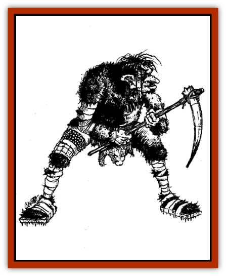

# Ogre - Ice Spire

| Statistic | **Ogre, Ice Spire** |
| --- | --- |
| **Activity Cycle:** | Any |
| **Alignment:** | Chaotic evil |
| **Armor Class:** | 4 |
| **Climate/Terrain:** | Ice Spires, arctic |
| **Damage/Attack:** | 1d12 (or weapon +6) |
| **Diet:** | Carnivore |
| **Frequency:** | Uncommon |
| **Hit Dice:** | 5 |
| **Intelligence:** | Average (8-10) |
| **Magic Resistance:** | Nil |
| **Morale:** | Elite (13-14) |
| **Movement:** | 12 |
| **No. Appearing:** | 2d10 |
| **No. of Attacks:** | 1 |
| **Organization:** | Tribal |
| **Size:** | L (10') |
| **Special Attacks:** | Mist, blood dance |
| **Special Defenses:** | Nil |
| **THAC0:** | 15 |
| **Treasure:** | M (Q,B,S) |
| **XP Value:** | 420 / Leader: 975 / Priest: 1,400 |

Ice Spire [[Ogre|ogres]] are bigger, smarter, and generally more dangerous than their more common cousins found elsewhere in Faer�n. Spire ogres are approximately 10. tall and weigh between 500 and 600 pounds. Their skin color ranges from yellow to black-brown, their hair is dirty gray, and their eyes gleam purple. The odor of Spire ogres is even more repellent than that of their common cousins, smelling something akin to rotting flesh.

**Combat:** The ogres of the Spire are highly disciplined combatants capable of implementing a wide variety of combined manuevers when fighting in large groups. Their powerful limbs give them +2 attack bonuses and damage bonuses of +6. Any group of 11 or more ogres includes a leader who receives a +3 attack bonus. Groups of 16 or more include a chieftain with a +4 attack bonus. Female ogres fight as males, but inflict only 2d4 points of damage and receive a maximum of 6 hit points per Hit Die. Young ogres fight as [[Goblin|goblins]].

Also, the ogres of the Spires are incredibly well adapted to their icy environment. When operating in this environment, they receive a +2 bonus to their surprise rolls. Spire ogres also have a 30% chance to move silently when operating in their native lands.

**Habitat/Society:** Most of the Spire ogres inhabit a vast cave network located high in the mountains. Access to the caves is gained via a complex series of stairs and stepladders built for maximum flexibility in defending the complex from outside incursion. Permeating the caves themselves is a thick, choking mist that causes nausea in all who are unused to its effects (save successfully vs. poison or fight at -3 for 1d3 turns) and limits visibility throughout the complex. The ogres who live in the caves are particularly adept at ducking in and out of the mists to surprise invaders (+4 bonus to surprise rolls while operating in the caves and a 50% chance to move silently or hide in shadows).

The ogres that inhabit the cave network are followers of Vaprak the Destroyer, the great ogre god. As such, they are aggressive and fond of combat. From time to time they ritualistically bash each other with clubs to establish their might and sort out the social hierarchy.

Another tribe of ogres found in the Ice Spires inhabits an icy chasm known as the Dour Fissure. At Baphomet's bidding, they occasionally enter into a trance state and carve hideous friezes outside the fissure to ward away intruders. Anyone staring at these friezes for more than three rounds is affected as though the target of a *confusion* spell. Anyone making any sort of detailed investigation of the friezes must save successfully vs. spell or undergo a subtle shift to the chaotic evil alignment for a period of 1d4 days. The influence of Baphomet has taken a poweful toll on these ogres in many other ways. Many of them are incapable of any action save fighting and eating, spending their time in a frightening, lethargic trance state.

One strange custom of all Spire ogre shamans is to completely consume the body of any creature they kill in combat. The ogres believe that this gives the shaman control over the creature's spirit.

**Blood Dance:** From time to time, under Baphomet's influence, the ogres of the Fissure enter into a state of killing frenzy known as the Blood Dance. While in this strange state of fury, the ogres receive a +2 bonus to all attack and damage rolls, but always keep fighting until they are dead or their rage is quenched. While under the influence of the Dance, an ogre does not stop fighting until it has reached -10 hit points (though it sustains enough damage to die when it reaches 0 hit points).

Once the dance begins, it generally lasts for 2d10 turns. Even the ogres find it impossible to predict when the dance will strike.

**Ogre Shaman**

  If six or more ogres are encountered, they are accompanied by a shaman with the Hit Dice, AC, damage/attack, etc. of a normal ogre, but all the abilities of a 3rd-level priest as well. If 16 or more ogres are encountered they are accompanied by an ogre shaman of the 5th level.

**Ogre Chieftain**

  If 16 or more ogres are encountered, they will be led by an ogre chieftain. The chieftain is a 9-Hit-Die monster with an Armor Class of 3. He inflicts 2d8+7 points of damage per attack, +7 with weapon.

**Ecology:** Ice Spire ogres are low on the totem pole of giants and giant-kin in the Ice Spires region. They keep herds of krotter, a large, yaklike cattle, for food, clothing, and milk. They also raid and pillage to add to their larders and to increase their reputations. They've also been known to hire themselves out as mercenaries when the humans or other, wealthier races of the region go to war 

They've adapted well to their icy environment, wrapping their bodies in heavy furs, held in place by wide leather straps

---
## Discovery & Documentation

**Source Publication:** FOR7 Giantcraft (1993)
**Campaign Setting:** Forgotten Realms
**Author(s):** Ray Winninger

### Other Creatures Found in This Source Book
   * [[Krotter|Krotter]]
   * [[Shadowhound|Shadowhound]]
