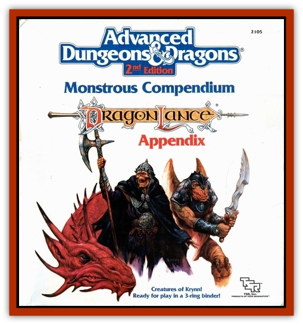

# Ogre - Krynn

| Statistic | **Ogre** | **Orughi** |
| --- | --- | --- |
| **Activity Cycle:** | Any | Any |
| **Alignment:** | Chaotic evil | Chaotic evil |
| **Armor Class:** | 5 | 5 |
| **Climate/Terrain:** | Tropical, subtropical, and temperate/Plain, swamp, forest, jungle, hill, mountain, subterranean | Tropical and subtropical/Forest, hill, and mountain |
| **Damage/Attack:** | 1-10 (weapon) | 1-6 (weapon) |
| **Diet:** | Carnivore | Carnivore |
| **Frequency:** | Common | Very rare |
| **Hit Dice:** | 4+1 | 4+1 |
| **Intelligence:** | Low (5-7) | Low (5-7) |
| **Magic Resistance:** | Nil | Nil |
| **Morale:** | Steady (11) | Unsteady (7) |
| **Movement:** | 9 | 9, Sw 18 |
| **No. Appearing:** | 2-20 | 2-12 |
| **No. of Attacks:** | 1 | 1 |
| **Organization:** | Tribe | Tribe |
| **Size:** | L (7-9' tall) | M (4-5' tall) |
| **Special Attacks:** | +2 to damage | +2 to damage |
| **Special Defenses:** | Nil | Nil |
| **THAC0:** | 17 | 17 |
| **Treasure:** | Individual: M&times;10; Tribe: Q,S,B | Individual: Q; Tribe Q&times;10 |
| **XP Value:** | 175 | 175 |

The [[Ogre|ogres]] of Krynn are bloodthirsty, savage brutes. They are feared and despised by all intelligent races.

Krynn ogres physically resemble the ogres of other worlds. They are taller than most humanoids, with thick and solidly muscled bodies. They have large heads with blunt noses, pointed ears, and high foreheads. A bony ridge covers their beady eyes, which are colored dull gray or blood red. Long, greasy hair grows from their lice-ridden scalps, dangling over their shoulders in matted tangles. Their dry skin, whose color ranges from dark brown to orange-yellow, is crusted with scabs and filth, and often covered with hairy warts. Krynn ogres have rows of sharp brown teeth, caked with grime. Black claws grow from their fingers and toes. Females resemble the males, though they are shorter and less muscular.

Krynn ogres wear the skins and furs of animals they have killed. These are made into loose smocks, long breech cloths, and heavy capes. These skins are not tanned or otherwise treated before they are made into clothing, making them stink like rotting meat. Ogres do not wear gloves or shoes of any kind - their thickly calloused soles provide protection and traction. Some wear stone necklaces, others paint their bodies with crude pigments.

Few creatures are as violent and cruel as ogres. With their low intelligence and flaring tempers, murder, vandalism, and abuse are commonplace in their societies. Greedy and covetous, ogres love treasure almost as much as they do bloodshed.

Krynn ogres speak their own language. Ogre chieftains and leaders usually speak common; 10% of tribesmen other than chieftains and leaders also speak common.

**Combat:** Like the ogres of other worlds, Krynn ogres are extremely dangerous. Not only is violence their common response to most problems, they are perfectly willing to fight to the death over the most trivial conflicts. An ogre is too dull-witted to utilize complex tactics: instead, it engages in brutal melee until either it or its opponent is dead. So intense is their violence that ogres must be restrained from pummeling their opponents long after they have been killed. Strangers are attacked mercilessly, including members of other ogre tribes. An ogre often would rather beat a stranger into submission than waste time speaking with him.

Ogres use spears, battle axes, maces, clubs, and similar melee weapons. These are either stolen from dead victims, or assembled from stone, wood, and other common materials. Though crudely made, ogre weapons are just as effective as their more carefully crafted counterparts. Ogres seldom use bows, slings, or other missile weapons; not only do they find them clumsy to use, they deny the ogres the physical satisfaction of beating and chopping their victims.

Ogres rarely wear armor, mainly because it is difficult to locate armor pieces large enough to fit them. Large ogres sometimes wear thick layers of furs and skins imbedded with chips of stone to give them an effective AC of 4.

Ogre leaders and chieftains are stronger than their followers and inflict significantly more damage. A leader is AC 3, has at least 30 hit points, attacks as a 7-HD creature, and gains an additional +1 damage bonus to his weapon attacks. A chieftain is AC 4, has at least 34 hit points, attacks as a 7-HD creature, and has an additional +2 damage bonus to his weapon attacks.

Immature ogres - those between the ages of 5-20 years - have no more than 3 hit points per Hit Die. They attack with their fists to inflict 1d4 points of damage. They can use simple weapons, such as clubs and axes, with a -3 penalty to inflicted damage.

**Habitat/Society:** Legend has it that the ogres were the first race to awaken on Krynn. The original ogres were graceful and attractive creatures, though they had an inclination toward evil. Their tribes flourished in all corners of the world. An early ogre clan leader named Igrane tried to convince the other tribes that if they failed to renounce their evil natures, they would be doomed to a future of conflict and destruction. The ogres rejected this prediction. Igrane abandoned them to their folly, taking with him a band of enlightened followers who came to be known as the Irda (see the [[Ogre_High|Ogre, High]] entry for details).

Igrane's prediction, of course, came true. The rise of competing races brought about the end of the ogres' domination of Krynn. They were hunted and slaughtered by the [[Elf|elves]] and [[Dwarf|dwarves]], driven into exile by the humans, and betrayed and enslaved by the [[Minotaur_Krynn|minotaurs]]. Additionally, the various ogre tribes warred constantly with each other, reducing their numbers even further. In the end, the ogres were forced into the most remote reaches of Krynn, where they remain to this day. The good races avoid them, while the evil races see them as just another exploitable resource.

Ogre tribes make their homes in the grimmest of lands, where the grass is withered and brown, the earth is cracked and dusty, and the waters are foul and stagnant. Though ogre cities exist, most ogres live in small settlements. A typical ogre settlement is a collection of crude stone huts centered around a large water hole. Each hut is the home of three or four ogres. The tribal leader and chieftain (assuming the tribe is large enough to have both) live in private huts. A hut has no furnishings aside from old furs used for sleeping and the family's weapon collection. Outside of each hut are large racks supporting strips of meat that are drying over smokeless charcoal fires. A typical village also includes a treasure hut and a games pit that holds several [[Wolf|wolves]], [[Bear|bears]], or [[Snake|snakes]]; ogres enjoy dumping weaker tribesmen into the pit, then watching them try to scramble out.

An ogre family consists of a mated pair and one or two children. Females give birth to a single child once per year. When ogres reach the age of 20, they move into their own huts to start their own families, though they still remain with the tribe. Elderly ogres - those too old to hunt, bear children, or serve the tribe in any other way - are slain.

A tribe of ten or more members has one leader. In tribes of 20 or more, there is also a chieftain; in these cases, the leader serves as the chieftain's deputy. No more than half of the tribe are females. Ogres view females as inferior in all respects, useful only for menial jobs and for bearing children. The chieftain (or leader, in the case of smaller tribes) keeps careful track of the number of females in the tribe. If the number of female children exceeds the number of male children, the excess female children are killed.

Each tribe also keeps a number of slaves, equal to about 20% of the tribal population. Most of the slaves are human, but a few are elves or dwarves. Ogre tribes are constantly in need of new slaves, since tribesmen kill them for sport and eat them when they are too lazy to hunt.

An ogre hunting party usually consists of a leader and about six adult males, all heavily armed. A hunting trip lasts anywhere from a few days to several weeks, depending on the needs of the tribe and the scarcity of game. The leader treats his followers cruelly, for instance, using the weakest one as bait to lure hungry game. Followers sometimes arrange for the unfortunate demise of the leader on hunting trips. On their return, they report the loss of the leader to the tribe, then one of their number claims the leader's position.

Ogre leaders and chieftains are absolute rulers of their tribes. Crimes against the tribe include betrayal, theft, unjustified murder, and cowardice. Punishment for all such crimes is death, usually a lingering and painful one. Criminals might be hung upside down on a cliff to be roasted alive in the sun's rays, sealed in a bag with poisonous snakes and thrown into the sea to drown, or sunk in a quicksand bog while the tribe watches and cheers.

Ogres are required to bring all treasure taken from defeated victims back to their village. The chieftain (or leader in smaller tribes) claims half for himself. The ogres who retrieved the treasure are given a small share, usually no more than 10%, and the rest is placed in the treasure hut. The chieftain (or leader) awards treasure to tribesmen for special achievements, such as defeating powerful enemies; invariably, the chieftain presents most of these special awards to himself.

**Ecology:** All intelligent races go out of their way to avoid ogres. However, evil races occasionally employ ogres in their armies. The ogres are too stupid and undependable for complicated missions, but they willingly accept all manner of dangerous and distasteful tasks if the price is right. Some minotaur communities keep ogres as slaves.

Ogres hunt [[Wolverine|wolverines]], wolves, and other woodland creatures for food, but they are also fond of human, elven, and dwarven flesh; [[Kender|kender]] and [[Gnome|gnome]] meat is considered a delicacy. Ogre fishermen scavenge the shorelines for dead fish, since this is easier than catching them, and dead ones are just as tasty as live ones.

No other races trade with ogres, but ogre tribes occasionally trade with each other. Such transactions often erupt in violence. One tribe, for instance, might trade animal skins and ale for a second tribe's gems and weapons. When the second tribe becomes drunk from the strong ale, the first tribe slits their throats and takes what they want.

**Orughi**

  The orughi are an ogre race dwelling on remote islands north of Ansalon. They are shorter, tatter, and duller than most ogres, but they are no less aggressive. They have stringy golden hair, oily gray skin, and webbed hands and feet, enabling them to swim at twice their land movement rate.

Though good fighters, the orughi are not as strong as other ogres and are more prone to panic. When possible, orughi try to lure their opponents into the sea; because of their swimming skill and the fact that they can hold their breath for 20 rounds, they are dangerous opponents in the water. Orughi use battle axes and daggers and also carry special weapons called tonkks. These weapons, resembling iron boomerangs connected to long metallic cords, are used by the orughi to capture birds. The tonkks inflict no damage but can be used to ensnare victims up to a distance of 30 yards (they cannot be used in the water)

Because of their skill with these weapons, orughi attacks with tonkks are made with a +3 bonus to the attack roll (non-orughi use tonkks with a -2 penalty). The cord of the tonkk rapidly wraps itself around a successfully attacked victim; once per round, the victim can attempt a Dexterity check with a -2 penalty. If he succeeds, he has untangled himself. If he fails, he must roll a Strength check with a -4 penalty. If the Strength check falls, the victim is pulled ten yards closer to the orughi who entangled him.

Orughi live in crude wooden shacks on the shores of their islands; they spend most of their time hunting and flshing. They worship Zeboim, the evil Queen of the Sea, and build elaborate shrines in her honor near the water's edge. These shrines, resembling cylindrical towers of stone, can be seen from miles away; experienced sailors recognize them as a sign of an orughi settlement.

The orughi have no formal government. The eldest males of each family collectively rule the tribe. Disagreements are settled by combat. Orughi collect less treasure than other ogres. Their treasure caches seldom contain magical items, but usually include an ample supply of pearls and other gems recovered from the ocean floor.

---
## Discovery & Documentation

**Source Publication:** MC4 Dragonlance Appendix (w/binder #2) (1989)
**Campaign Setting:** Dragonlance
**Author(s):** Rick Swan

### Other Creatures Found in This Source Book
   * [[Anemone_Giant_Sea|Anemone, Giant Sea]]
   * [[Bear_Ice|Bear, Ice]]
   * [[Beast_Undead|Beast, Undead]]
   * [[Bird_Krynn|Bird (Krynn)]]
   * [[Disir|Disir]]
   * [[Draconian_Aurak|Draconian, Aurak]]
   * [[Draconian_Baaz|Draconian, Baaz]]
   * [[Draconian_Bozak|Draconian, Bozak]]
   * [[Draconian_Kapak|Draconian, Kapak]]
   * [[Draconian_General_Information|Draconian, General Information]]
   * [[Draconian_Sivak|Draconian, Sivak]]
   * [[Draconian_Proto-_Traag|Draconian, Proto-, Traag]]
   * [[Dragon_Amphi|Dragon, Amphi]]
   * [[Dragon_Astral|Dragon, Astral]]
   * [[Dragon_Kodragon|Dragon, Kodragon]]
   * [[Dragon_Krynn_Othlorx_General_Information|Dragon (Krynn), Othlorx, General Information]]
   * [[Dragon_Krynn_General_Information|Dragon (Krynn), General Information]]
   * [[Dragon_Sea|Dragon, Sea]]
   * [[Dreamshadow|Dreamshadow]]
   * [[Dreamwraith|Dreamwraith]]
   * [[Dwarf_Daergar|Dwarf, Daergar]]
   * [[Dwarf_Hill_Neidar|Dwarf, Hill, Neidar]]
   * [[Dwarf_Mountain_Hylar|Dwarf, Mountain, Hylar]]
   * [[Dwarf_Theiwar|Dwarf, Theiwar]]
   * [[Dwarf_Zakhar|Dwarf, Zakhar]]
   * [[Elf_Half-|Elf, Half-]]
   * [[Elf_High_Qualinesti|Elf, High, Qualinesti]]
   * [[Elf_High_Silvanesti|Elf, High, Silvanesti]]
   * [[Elf_Sea_Dargonesti|Elf, Sea, Dargonesti]]
   * [[Elf_Sea_Dimernesti|Elf, Sea, Dimernesti]]
   * [[Elf_Wild_Kagonesti|Elf, Wild, Kagonesti]]
   * [[Eyewing|Eyewing]]
   * [[Fetch|Fetch]]
   * [[Fire_Minion|Fire Minion]]
   * [[Fireshadow|Fireshadow]]
   * [[Gnome_Tinker|Gnome, Tinker]]
   * [[Gurik_Cha'ahl|Gurik Cha'ahl]]
   * [[Haunt_Knight|Haunt, Knight]]
   * [[Horax|Horax]]
   * [[Human_Krynn|Human (Krynn)]]
   * [[Imp_Blood_Sea|Imp, Blood Sea]]
   * [[Kalothagh|Kalothagh]]
   * [[Kani_Doll|Kani Doll]]
   * [[Kender|Kender]]
   * [[Kyrie|Kyrie]]
   * [[Lizard_Man_Krynn|Lizard Man (Krynn)]]
   * [[Minotaur_Krynn|Minotaur, Krynn]]
   * [[Ogre_High|Ogre, High]]
   * [[Phaethon|Phaethon]]
   * [[Saqualaminoi|Saqualaminoi]]
   * [[Shadowperson|Shadowperson]]
   * [[Shimmerweed|Shimmerweed]]
   * [[Skrit|Skrit]]
   * [[Spectral_Minion|Spectral Minion]]
   * [[Spider_Krynn|Spider (Krynn)]]
   * [[Stag|Stag]]
   * [[Tayling|Tayling]]
   * [[Thanoi|Thanoi]]
   * [[Tylor|Tylor]]
   * [[Wichtlin|Wichtlin]]
   * [[Wyndlass|Wyndlass]]
   * [[Yaggol|Yaggol]]
