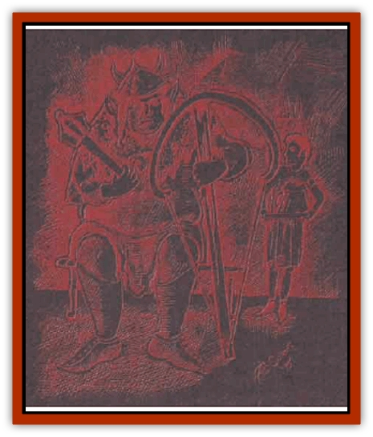

# Ogre - Stonecrown

| Statistic | **Ogre, Stonecrown** |
| --- | --- |
| **Activity Cycle:** | Night |
| **Alignment:** | Neutral evil |
| **Armor Class:** | 5 / Leader/Captain: 3 |
| **Climate/Terrain:** | Mountains, hills |
| **Damage/Attack:** | 2d6 / Leader: 2d8 / Captain: 2d10 / (or by weapon +6) |
| **Diet:** | Carnivore |
| **Frequency:** | Common |
| **Hit Dice:** | 4+3 / Leader: 5+4 / Captain: 6+6 |
| **Intelligence:** | Low (8-10) / Leader/Captain: Average (11-12) |
| **Magic Resistance:** | Nil |
| **Morale:** | Elite (13-14) |
| **Movement:** | 9, Cl 6 |
| **No. Appearing:** | 2-20 |
| **No. of Attacks:** | 1 (2 in battle-rage) |
| **Organization:** | Tribe or company |
| **Size:** | Large (9'+) |
| **Special Attacks:** | Battle-rage |
| **Special Defenses:** | Nil |
| **THAC0:** | 15 |
| **Treasure:** | C,Y |
| **XP Value:** | 420 / Leader: 975 / Captain: 1,400 |

Stonecrow [[Ogre|ogres]] run to fat, not surprisingly considering how much of their time they spend eating. They are crude but powerful, and take simpe joy in killing and destruction. Their rank odor is composed of equal parts grease, filth-ridden garments, and unbathed foulness mixing into a stench like powerful sour milk.

When bored, the creatures are fond of ornamentig themselves with earrings, nose-rings, and other piercings; Stonecrown ogres find these attractive, and sometimes compliment other creatures that share their tastes. They speak their own language, and leaders and mercenaries often speak the [[Goblin|goblin]], [[Orc|orog]], or common tongues.

**Combat:** In mass combat, Stonecrown ogres form club-, axe-, or mace-wielding forces that are efective through brute strength. Despite their simple combat style, their enormous strength gives them a +7 damage bonus with any weapon they use. With ardous training, Stonecrown ogres can keep remarkable discipline in battle, until the battle-rage strikes them. The battle-rage is a blood frenzy triggered when the ogre's blood is first shed. This frenzy allows them to attack twice each round.

Units of Stonecrown ogres that have worked and trained together for long perions of time can control their battle frenzy, raging only when they deem it appropriate. The sight of an entire company of ogres going into battle-rage at once has routed more than one army.

Alone or in the wilds, Stonecrown ogres are voracious hunters with little discipline and no great cunning. They can climb sheer stone faces through force of willpower alone, often reaching a mountaintop with bloodied hands.

Stonecrown ogre leaders always have maximum hit points and superior armor, generally a form of chain. Mercenary captains have superior armor ane often carry Stonecrown arbalests, a type of rock-hurling heavy crossbow. The 10 lb. stones that these arbalests hurl can crack skulls and breastplates; their range is 30/60/120, and thei damage is 1d10/2d6, plus an equipment saving throw vs. crushing blow for shields and armor.

**The Blackwater Guards**

  The most famous of the Stonecrown ogres mercenary companies is the Blackwater Guards - a virtual nomadic kingdom. Founded by Blackwater Baromeg, an especially disciplined and ambitious ogre, the company made a sterling name for itself during the invasion of Kiergard. Baromeg's insistence on the use of proper armor, missile weapons, and polearms helped the unit survive his death.

Disagreements among the company's sergeants and Baromeg's sons led to the fragmentation of the Blackwater company's resources, and scattered groups of skilled mercenaries call themselves the True Black Water Guards or derivative names such as the Black Wyrm Company or the Black Griffon Riders. Each of these scattered bands has grown over time, and the ogres may rule a domain of their own if they can ever set aside their differences.

---
## Discovery & Documentation

**Source Publication:** Warlock of the Stonecrowns (1995)
**Campaign Setting:** Birthright
**Author(s):** Wolfgang Baur

### Other Creatures Found in This Source Book
   * [[Giant_Fhoimorien|Giant, Fhoimorien]]
