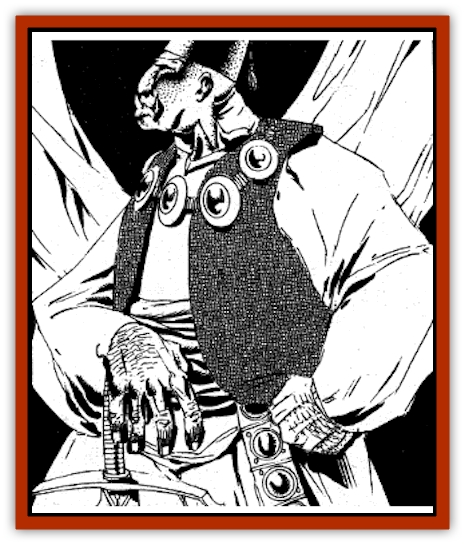

# Ogre - Zakhara

| Statistic | **Ogre (Zakhara)** |
| --- | --- |
| **Activity Cycle:** | Any |
| **Alignment:** | Any |
| **Armor Class:** | 5 |
| **Climate/Terrain:** | Any land |
| **Damage/Attack:** | 1d10 or by weapon |
| **Diet:** | Carnivore |
| **Frequency:** | Common |
| **Hit Dice:** | 4+1 |
| **Intelligence:** | Average (8-10) |
| **Magic Resistance:** | Nil |
| **Morale:** | Steady (11-12) |
| **Movement:** | 9 |
| **No. Appearing:** | 1-4 (Al-Hadhar) or 1-20 (Al-Badia) |
| **No. of Attacks:** | 1 |
| **Organization:** | As other nearby races |
| **Size:** | Large (9-10' tall) |
| **Special Attacks:** | Strength bonus to damage |
| **Special Defenses:** | Nil |
| **THAC0:** | 17 |
| **Treasure:** | Varies |
| **XP Value:** | 175 |

In most lands, [[Ogre|ogres]] are big, ugly, greedy humanoids who live by ambushes, raids, and theft; not so in Zakhara. While still big and ugly by human standards, and sometimes greedy, Zakharan ogres are respected members of civilized society.

Adult ogres stand as tall as ten feet and weigh 300 to 350 pounds. Their skin colors tend to be on the yellowish side, though a few individuals have a violet tinge to their skin, possibly indicating an [[Ogre|ogre mage]] in their ancestry. Their eyes are purple with white pupils; they usually have orange claws and teeth. Hair color ranges from blackish-blue to dark green, and the hair is carefully tended and often braided. Even the curdled milk odor common to other ogres is but a subtle undertone usually masked with other scents.

Zakharan ogres usually speak Midani, but several also know their ancestral ogrish tongue and have expanded its vocabulary far past that used by their less intelligent cousins. Rightly so, they consider ajami ogres to be quite barbaric, and their language similar to that of a child.Zakharan ogres have the same life span as regular ogres, with most able to live 90 years, and a few for over a century.

**Combat:** Even the most pampered and civilized ogres are quite strong. To determine strength, roll 1d10 and consult the following chart, then apply attack and damage bonuses as indicated in the *Player's Handbook*.

| Roll | Strength | Roll | Strength |
| --- | --- | --- | --- |
| 1 | 16 | 8 | 18/00 |
| 2 | 17 | 9 | 19 |
| 3-5 | 18 | 10 | 20 |
| 18* | 6-7 |  |  |

* Roll percentage dice for exact Strength.

Most Zakharan ogres carry weapons. Because of their size, they can use large Weapons (such as a great scimitar) in only one hand, with full benefits. They can wield even larger weapons two-handed. Ogres cause damage according to their weapon type and strength bonus. Even unarmed, an ogre can cause 1d10 damage plus Strength bonus.

Though not tactical geniuses, Zakharan ogres can fight in an organized manner, even without a leader present.

**Habitat/Society:** Zakharan ogres adapt their culture to the type of society nearby. Those in the cities live as Al-Hadhar, while those in the desert live as Al-Badia. Though not all consider ogres one of the ins, or Enlightened races, many ogres follow the Enlightened way and are as civilized and as honorable as any of their neighbors.

All Zakharan ogres share a few traits. They generally dislike ogre magi, though they follow the demands of honor and give them a chance to prove worthy of respect. Most shun ogrima, the offspring of ogre and ogre mage, for they are uncivilized brutes. Even violet-skinned ogres are outcasts because of their association with ogrima.

At the DM's option, Zakharan ogres can be PCs or NPCs, using the kits provided in *Arabian Adventures*. See the *Golden Huzuz* book of the box set *City of Delights* (TSR 1091) for more information.

Al-Hadhar ogres have most of the same traits as other Al-Hadhar. These ogres tend to be calm and rational, and they are greatly prized as workers and warriors because of their strength. Many are members of mamluk societies. Others are similar to merchant-rogues or, rarely, sha'ir or pragmatists.

Al-Badia ogres are also similar to other Al-Badia, roaming the harsh areas of Zakhara, but living as free people. Al-Badia ogres must occasionally deal with prejudice from other races, for there are still occasional tales of ogres carrying away children. Thus, these ogres tend to be less social than other ogres. This attitude adds to the rumors.

In addition, some of the more brutish Al-Badia ogres interbreed with ogre magi or ogrima. To compensate for this, and to prevent even more rumors of evil ogres, the more civilized Al-Badia ogres raid ogrima tribes, trying to kill them.

**Ecology:** Zakharan ogres have the same impact on the world around them as humans, [[Dwarf|dwarves]], or [[Elf|elves]] do. Very few have any crafting skills.

---
## Discovery & Documentation

**Source Publication:** City of Delights (1993)
**Campaign Setting:** Al-Qadim (Forgotten Realms)
**Author(s):** tom Prusa, Tim Beach, Steve Kurtz

### Other Creatures Found in This Source Book
   * [[Afanc|Afanc]]
   * [[Al-Jahar|Al-Jahar]]
   * [[Bird_Talking|Bird, Talking]]
   * [[Cat_Winged|Cat, Winged]]
   * [[Crypt_Servant|Crypt Servant]]
   * [[Elemental_Vermin|Elemental Vermin]]
   * [[Genie_Tasked_Harim_Servant|Genie, Tasked, Harim Servant]]
   * [[Opinicus|Opinicus]]
   * [[Parasite|Parasite]]
   * [[Pasari-Niml|Pasari-Niml]]
   * [[Sirine|Sirine]]
   * [[Tatalla|Tatalla]]
   * [[Tree_Singing|Tree, Singing]]
