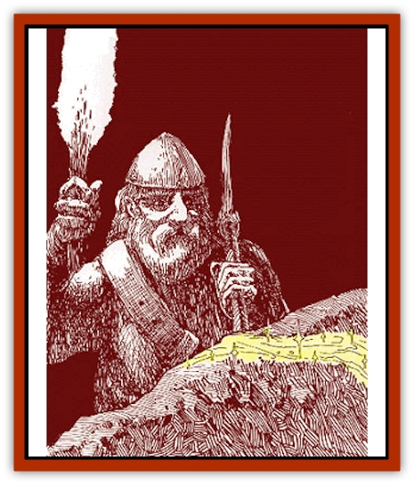

# Omshirim

| Statistic | **Omshirim** |
| --- | --- |
| **Activity Cycle:** | Any |
| **Alignment:** | Neutral |
| **Armor Class:** | 0 |
| **Climate/Terrain:** | Subterranean |
| **Damage/Attack:** | 2d6 |
| **Diet:** | Carnivore (metalavore) |
| **Frequency:** | Very rare |
| **Hit Dice:** | 10 |
| **Intelligence:** | Non- (0) |
| **Magic Resistance:** | Nil |
| **Morale:** | Elite (13-14) |
| **Movement:** | 15 |
| **No. Appearing:** | 1 |
| **No. of Attacks:** | 2 |
| **Organization:** | Solitary |
| **Size:** | L (10' long) |
| **Special Attacks:** | Squeeze |
| **Special Defenses:** | See below |
| **THAC0:** | 11 |
| **Treasure:** | Y (&times;2) |
| **XP Value:** | 7,000 |

Omshirims look like veins of gold, platinum, silver, or other precious metal embedded in rock. The omshirim is the result of a Herathian magical experiment gone awry. The original goal of the experiment was to infuse quicksilver into a [[Lurker|lurker]] to speed it up and make it more adaptable and "decorative". The experiment succeeded in these things. However, the creature displayed unforeseen adaptability, escaped, and multiplied in the caves under Herath, much to the chagrin of the mages who developed it.

**Combat:** When an omshirim senses prey, it leaps out of its hiding place and attacks. The omshirim can detect heat radiation with its 60-foot infravision. It also senses metal, vibration, and movement within the same radius; thus, invisibility is nearly useless against this creature. The omshirim can detect invisible creatures with 95% accuracy.

The omshirim can leap up to 30 feet to attack, and its deceptive appearance causes opponents to roll for surprise with a -4 penalty. Dwarves and other creatures that are especially intrigued by precious metals receive a -5 penalty.

The omshirim flows over its prey and contracts, attacking twice per round with its crushing metal grip. If both attacks succeed, the omshirim has effectively enveloped its target; the victim then begins to suffocate. The target automatically takes damage each round from both squeezing attacks (the omshirim does not need to roll to hit), unless it manages to escape. Regardless of damage taken, the victim will die in 1d4+1 rounds if it is not freed.

Victims enveloped by the omshirim can attempt a bend bars with a -20% penalty to struggle free of the omshirim's grip. Victims are allowed only one such attempt to free themselves. If an outside agent aids the victim's attempt, add half of the other person's bend bars percentage to the victim's chance of success.

An omshirim has an extremely tough metallic hide, which gives it a low AC. It takes half damage from metal weapons and fire-based attacks. Any metal weapon that comes in contact with an omshirim must make a successful saving throw vs. crushing blow or break, because the omshirim's magical metabolism extracts metal from the weapon, weakening it. Magical weapons get a +1 bonus on their saving throws for each plus of the weapon. Because of its highly conductive hide, the omshirim takes no damage from electrical attacks. If necessary, an omshirim can flow into extremely tiny cracks in stone to get away.

**Habitat/Society:** Omshirims are solitary creatures, often found near deposits of valuable metals.

**Ecology:** When two large omshirims meet, they may temporarily combine, later splitting into three omshirim. Omshirim will do this every three to five years under normal hunting conditions, or more often if conditions are favorable.

Omshirims do not collect treasure, although they do extract precious metals from ore. If killed, the creature's corpse can be processed to extract the precious metals. An omshirim corpse yields Y(x2) worth of valuable metals if processed.

The omshirim is intriguing in that it eats both metals and flesh.

---
## Discovery & Documentation

**Source Publication:** Monstrous Compendium Savage Coast Appendix (Online Exclusive) (1995)
**Campaign Setting:** Mystara
**Author(s):** Loren L Coleman, Ted James, Thomas Zuvich, Cindi M. Rice

### Other Creatures Found in This Source Book
   * [[Aranea_Savage_Coast|Aranea (Savage Coast)]]
   * [[Arashaeem|Arashaeem]]
   * [[Batracine|Batracine]]
   * [[Cat_Marine|Cat, Marine]]
   * [[Cinnavixen|Cinnavixen]]
   * [[Clockwork_Swordsman|Clockwork Swordsman]]
   * [[Critter_Temple|Critter, Temple]]
   * [[Cursed_One|Cursed One]]
   * [[Deathmare|Deathmare]]
   * [[Dragon_Savage_Coast_Crimson|Dragon (Savage Coast), Crimson]]
   * [[Dragon_Savage_Coast_Red_Hawk|Dragon (Savage Coast), Red Hawk]]
   * [[Echyan|Echyan]]
   * [[Ee'aar|Ee'aar]]
   * [[Enduk|Enduk]]
   * [[Fachan_Savage_Coast|Fachan (Savage Coast)]]
   * [[Feliquine|Feliquine]]
   * [[Fiend_Narvaezan|Fiend, Narvaezan]]
   * [[Frelôn|Frelôn]]
   * [[Ghriest|Ghriest]]
   * [[Glutton_Sea|Glutton, Sea]]
   * [[Goatman|Goatman]]
   * [[Golem_Naâruk|Golem, Naâruk]]
   * [[Golem_Savage_Coast|Golem (Savage Coast)]]
   * [[Grudgling|Grudgling]]
   * [[Heraldic_Servant_I|Heraldic Servant I]]
   * [[Heraldic_Servant_II|Heraldic Servant II]]
   * [[Heraldic_Servant_III|Heraldic Servant III]]
   * [[Heraldic_Servant_IV|Heraldic Servant IV]]
   * [[Heraldic_Servant_V|Heraldic Servant V]]
   * [[Heraldic_Servant_General_Information|Heraldic Servant, General Information]]
   * [[Hermit_Sea|Hermit, Sea]]
   * [[Jorri|Jorri]]
   * [[Juhrion|Juhrion]]
   * [[Kla'a-tah|Kla'a-tah]]
   * [[Leech_Legacy|Leech, Legacy]]
   * [[Lich_Inheritor|Lich, Inheritor]]
   * [[Lizard_Kin_Savage_Coast|Lizard Kin (Savage Coast)]]
   * [[Lupasus|Lupasus]]
   * [[Lupin|Lupin]]
   * [[Lyra_Bird_Saragón|Lyra Bird, Saragón]]
   * [[Malfera|Malfera]]
   * [[Manscorpion_Nimmurian|Manscorpion, Nimmurian]]
   * [[Mythuínn_Folk|Mythuínn Folk]]
   * [[Neshezu|Neshezu]]
   * [[Nikt'oo|Nikt'oo]]
   * [[Nosferatu|Nosferatu]]
   * [[Omm-wa|Omm-wa]]
   * [[Parasite_Savage_Coast|Parasite (Savage Coast)]]
   * [[Phanaton|Phanaton]]
   * [[Plant_Savage_Coast|Plant (Savage Coast)]]
   * [[Pudding_Vermilion|Pudding, Vermilion]]
   * [[Rakasta|Rakasta]]
   * [[Ray_Forest|Ray, Forest]]
   * [[Shedu_Greater_Savage_Coast|Shedu, Greater (Savage Coast)]]
   * [[Shimmerfish|Shimmerfish]]
   * [[Skinwing|Skinwing]]
   * [[Spawn_of_Nimmur|Spawn of Nimmur]]
   * [[Spider-spy|Spider-spy]]
   * [[Spirit_Heroic|Spirit, Heroic]]
   * [[Spirit_Walleran|Spirit, Walleran]]
   * [[Succulus|Succulus]]
   * [[Swampmare|Swampmare]]
   * [[Symbiont_Shadow|Symbiont, Shadow]]
   * [[Tortle|Tortle]]
   * [[Troll_Legacy|Troll, Legacy]]
   * [[Trosip|Trosip]]
   * [[Tyminid|Tyminid]]
   * [[Utukku|Utukku]]
   * [[Voat|Voat]]
   * [[Voat_Herathian|Voat, Herathian]]
   * [[Vulturehound|Vulturehound]]
   * [[Wallara|Wallara]]
   * [[Wurmling|Wurmling]]
   * [[Wynzet|Wynzet]]
   * [[Yeshom|Yeshom]]
   * [[Zombie_Red|Zombie, Red]]
