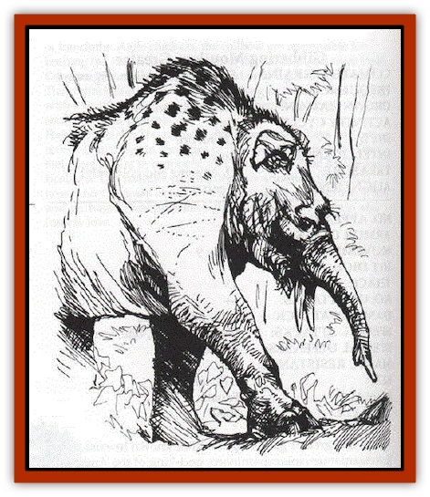

# Onco

| Statistic | **Onco** |
| --- | --- |
| **Activity Cycle:** | day |
| **Alignment:** | Neutral |
| **Armor Class:** | 6 |
| **Climate/Terrain:** | subtropical to tropical jungle |
| **Damage/Attack:** | 1d3/1d4/1d4 |
| **Diet:** | herbivore |
| **Frequency:** | uncommon |
| **Hit Dice:** | 4 |
| **Intelligence:** | Semi- (2-4) |
| **Magic Resistance:** | Nil |
| **Morale:** | Champion (15) |
| **Movement:** | 12 |
| **No. Appearing:** | 1d6-1 |
| **No. of Attacks:** | 1 |
| **Organization:** | solitary or family |
| **Size:** | M (6' tall) |
| **Special Attacks:** | Nil |
| **Special Defenses:** | Nil |
| **THAC0:** | 17 |
| **Treasure:** | Nil |
| **XP Value:** | 120 |

The onco is an aggressive [[Mammal|mammal]] closely related to the <a href="elephant">elephant</a>, though it is about the size of a [[Bear|bear]]. Its tusks never grow to more than one foot in length. Oncos wander the jungle floor eating plant material and scaring other 1 creatures from their territory.

**Combat:** An onco fights by striking with its trunk and tusks. Its smaller size allows it to use all three attacks on one opponent; it may also split its attacks among two different targets.

**Habitat/Society:** Oncos travel in small family units, normally a male and 1d4 females; any onco beyond this are immature young that do not fight. Solitary onco will be lone males in search of mates.

**Ecology:** Onco are too aggressive to make good mounts or beasts of burden. Their tusks are prized for the strength of their ivory, being worth around 100 gp per tusk. They graze the lower jungle, clearing spaces for other large creatures.

---
## Discovery & Documentation

**Source Publication:** The Scarlet Brotherhood (1999)
**Campaign Setting:** Greyhawk
**Author(s):** Sean Reynolds, Kij Johnson, Chris McKitterick, Lisa Stevens, Erik Mona, Roger Moore, Steve Wilson, Sam Wood, Dawn Murin

### Other Creatures Found in This Source Book
   * [[Gibbering_Mouther_Greater|Gibbering Mouther, Greater]]
   * [[Ravenous|Ravenous]]
   * [[Su-Monster|Su-Monster]]
   * [[Thousandtooth|Thousandtooth]]
   * [[Tlokasazotz_Olman_Bat-Vampire|Tlokasazotz (Olman Bat-Vampire)]]
