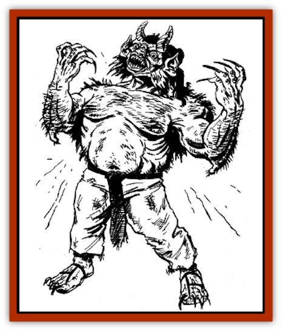

# Oni

| Statistic | **Common Oni** | **Go-Zu-Oni** | **Me-Zu-Oni** |
| --- | --- | --- | --- |
| **Activity Cycle:** | Any | Any | Any |
| **Alignment:** | Lawful evil | Lawful neutral | Lawful neutral |
| **Armor Class:** | 4 | 0 | 2 |
| **Climate/Terrain:** | Temperate mountains, hills, plains, forests, and subterranean | Any land | Any land |
| **Damage/Attack:** | 3-10/3-10 | 6-16/6-16/1-10 | 3-18/3-18 |
| **Diet:** | Carnivore | Carnivore | Carnivore |
| **Frequency:** | Rare | Very rare | Very rare |
| **Hit Dice:** | 8 | 12+8 | 10+5 |
| **Intelligence:** | Average (8-10) | High (13-14) | High (13-14) |
| **Magic Resistance:** | Nil | 20% | 40% |
| **Morale:** | Elite (13) | Champion (15) | Elite (14) |
| **Movement:** | 9 | 9 | 12 |
| **No. Appearing:** | 1-100 | 1-20 | 1-20 |
| **No. of Attacks:** | 2 | 3 | 2 |
| **Organization:** | Solitary or band | Solitary or band | Solitary or band |
| **Size:** | L (7-8' tall) | L (8-9' tall) | L (9'+ tall) |
| **Special Attacks:** | Spells | See below | See below |
| **Special Defenses:** | Nil | Regeneration | Regeneration |
| **THAC0:** | 13 | 9 | 11 |
| **Treasure:** | A | S | S |
| **XP Value:** | 1,400 | 11,000 | 10,000 |

Oni are ferocious lesser spirits who use their awesome strength and magical abilities to dominate and terrorize the regions they inhabit.

The common oni stands 7 to 8 feet tall, resembling a thickly-muscled humanoid whose arms and legs are covered with coarse hair. Their hands end in dirty, thick talons, and hooked toenails grow from their wide feet. Their skin is normally red, but other colors have been noted, including green, black, orange, and purple. Blue-skinned oni also exist, but these are more commonly known as [[Ogre|ogre magi]], because they have as much in common with the western [[Ogre|ogre]] as they do they with eastern oni.

The features of the common oni are fearsome to behold. They have from one to three bulging eyes and broad, pointed ears. One or two thick horns may sprout from their foreheads. Many oni wear shoulder-length hair - usually silver, black, or green - which sometimes is tied in long braids that drape down their backs. Long golden or ivory fangs line their mouths.

An oni's garb imitates the clothing of the local human population. If an oni band dwells near a military outpost, the lesser spirits usually wear armor pieces, including metallic arm and leg bands and even military insignia that have been taken from murdered soldiers. If an oni band lives near a poor farming community, they usually don peasant smocks and sandals. In any case, an oni's equipment and clothing is always more ragged and filthy than that of his human counterpart.

Common oni can speak the language of their kind, as well as the languages of [[Tengu|tengu]], [[Bakemono|bakemono]], [[Hengeyokai|hengeyokai]], and the local human population. Their voices are deep, resonant, and very loud. An oni's snore rumbles like thunder, while its laugh is powerful enough to shake the leaves from the trees.

**Combat:** Most common oni are bloodthirsty and cruel. Not only do they attack for food, but also for the sheer delight of hurting and bullying other creatures. The common oni usually fights with a pair of two-handed swords, one in each hand, but the creature will use other large weapons if available. It also can make slashing attacks with its powerful claws.

The common oni can *polymorph self* three times per day, *fly* three times per day, *become invisible* two times per day, use *cloud trapeze* (for themselves only) once per day, and *cause fear* at will. A few common oni (5%) can spew a column of molten copper at a target up to 10 feet away (make a normal attack roll), causing 4-24 (4d6) hit points of damage. The oni can make one copperspitting attack each day.

Common oni frequently command lesser creatures such as bakemono, [[Goblin_Rat|goblin rats]], and [[Gaki|jiki-niku-gaki]]. When common oni are encountered, there is a 10% chance that they are accompanied by 2-20 (2d10) of these creatures. (To randomly determine the type of creatures accompanying oni, roll 1d6; 1-3 = goblin rats, 4-5 = bakemono, 6 = jiki-niku-gaki.) In the oni lair, 4-40 (4d10) bakemono or goblin rats are always present (50% chance of each), attending the court of the more powerful oni.

A hungry or enraged oni typically attacks by charging its opponent, slashing with its weapons or claws like an uncontrollable beast. However, oni bands are capable of more subtle strategies, particularly when ambushing travelers or other unsuspecting prey. For instance, one oni may use *polymorph* to become a friendly-looking farmer, who engages a traveler in conversation. Meanwhile, other members of the oni band may *become invisible*, and attack the traveler from behind. If a battle turns against an oni band, one of the lesser spirits may use its *cloud trapeze* ability, escaping to rally goblin rats or other reinforcements.

Although oni have little concern for other creatures, they do have a sense of honor and pride, and resent being implicated in crimes they did not commit. For instance, the tale is told of a yakuza gang who convinced a village that an oni had committed certain crimes. In truth, the yakuza themselves were responsible. When the villagers began to hunt the oni, it became enraged, vowing to seek out and destroy the yakuza. (The oni enjoyed its notoriety as the scourge of the countryside, but it was not about to accept the blame for the yakuza gang's actions.) The oni made peace with a group of sympathetic humans, who helped the lesser spirit track down the yakuza. Following the yakuza's defeat, the oni honorably parted company with the humans. Then it resumed its evil ways.

**Habitat/Society:** Habitat/Society: The creation of the oni remains a matter of speculation. Most scholars believe that oni originate from the corrupted spirits of evil humans. Others believe the Celestial Bureaucracy created oni to test the diligence of Kara-Tur's more noble inhabitants, as well as to maintain the balance between good and evil. Regardless of their origin, oni persist throughout Kara-Tur, thriving in most of the world's temperate lands.

Oni usually dwell in desolate and forbidding places, such as rocky mountain regions, deserted ruins, and other sites commonly considered to be haunted. They also may take up residence along a lonely highway near a shrine or gate, harassing all who pass by. Occasionally, an oni may live within a city, hiding in vacant buildings or in the shadows of the city's most destitute streets.

In rare instances, one of these vicious spirits may rule a small village of humans, and live within the village. This powerful oni may use its *polymorph* ability to disguise itself as a human tyrant. If it is especially arrogant, it may operate openly.

An oni band may comprise up to 100 members. Decisions are made collectively by the largest and wisest oni. Females are as powerful as males, fighting with equal prowess and sharing in the command. Male oni have been known to take humans for brides.

Common oni enjoy music and dance. Occasionally they can be found playing red and blue flutes, singing and stomping for hours on end. Such celebrations often follow an oni victory in battle or the discovery of a luxurious treasure. Interrupting an oni musical performance is guaranteed to infuriate them.

Oni covet treasure of all types. Typically, they bury valuables in sturdy iron chests near their lairs. Some oni swallow their treasure items, keeping them safe inside their stomachs.

**Ecology:** Oni have vast appetites and eat all kinds of game and domestic animals. They're especially fond of cattle, deer, sheep, and large birds. Human or humanoid flesh also has been known to end up in their stomachs. According to legend, a thirsty oni once drank an entire lake in one sitting; when made to laugh, the oni coughed up the water and refilled the lake.

In addition to bakemono, goblin rats, and gaki, oni will associate with other evil creatures and humanoids, provided such associations promise to benefit the oni. Oni are fond of black animals such as ravens, black snakes, and black cats, and will often pause to admire and speak with them.

An island inhabited entirely by oni is rumored to exist somewhere in the middle of the Celestial Sea. No human explorer has ever visited the island - at least, none has returned from such a visit. The island is said to be the home of elderly oni who have grown weary and wish to live out their days in peace. Towering mountains of black diamond, rivers of molten silver, and beaches of crimson sand grace the isle. A high iron gate rings the place completely. Thousands of tiny black oni, each no more than a foot tall, guard the island against intruders. In spite of their size, these tiny oni are said to be as powerful as their larger counterparts.

**Go-Zu Oni**

  Go-zu oni are the most powerful type of oni. Unlike common oni, who are masterless, the go-zu oni are soldiers of the Celestial Bureaucracy. They serve their commanders faithfully and loyally.

Go-zu oni resemble common oni, but they are larger, and their bodies are thicker. Their skin is usually dark orange, gray, or deep purple. They have the heads of bulls, with large snouts, small ears, and two long horns. Go-zu oni wear ornate robes and polished armor, which is appropriate to their position as servants of the Celestial Emperor. They speak all human languages, along with the languages of tengu, oni, bakemono, all animals, and the Celestial Court.

Go-zu oni fight with two-handed swords, spears, naginata, halberds, and tridents. In combat, they can make two attacks with a weapon or with their hands. They also can make a single goring attack with their horns. They can *polymorph self*, *cause fear*, *become invisible*, *fly*, and cast *fire shuriken* at will. Twice per day, they can use *cloud trapeze* (for themselves only). They automatically can detect invisible objects and creatures. Their strength equals that of a [[Giant_Hill|hill giant]], and they regenerate 3 hit points per round.

Along with the me-zu oni, the go-zu oni form the bulk of the Celestial Emperor's army in times of trouble and insurrection. They also oversee the lands of the dead and serve as escorts to these lands for the reluctant departed. Go-zu oni have no permanent lairs in the Prime Material Plane; they make their homes in the Celestial Court.

**Me-Zu Oni**

  Like the go-zu oni, me-zu oni are servants and soldiers of the Celestial Emperor. The me-zu oni hold higher positions in the army, however, and command the go-zu oni. When encountered, the me-zu oni are always on a specific mission assigned by the Celestial Bureaucracy. They will not tolerate interference from humans or other lesser creatures.

Me-zu oni resemble go-zu oni, but are larger, and have the heads of horses. They also lack horns. Me-zu oni can speak and understand any language.

In addition to the weapons used by the go-zu oni, me-zu oni may use whips and lassos to attack their opponents. They can *polymorph self*, *become invisible*, *cause fear*, and *fly* at will. They can become *ethereal* and *astral* three times per day each, and can use *cloud trapeze* (for themselves only) three times per day. They have the spell casting ability of 10th-level wu jen; their most common spells include *fiery eyes*, *melt*, *fire shuriken*, *whip*, *animate fire*, *fire ruin*, *hold person*, *dancing blade*, *polymorph other*, *wall of fire*, *creeping darkness*, and *fire breath*. They boast sight abilities equaling the *true seeing* spell, which are in effect at all times. Their Strength equals that of a [[Giant_Stone|stone giant]], and they can regenerate 3 hit points per round.

---
## Discovery & Documentation

**Source Publication:** MC6 Kara-Tur Appendix (1990)
**Campaign Setting:** Kara-Tur (Forgotten Realms)
**Author(s):** Rick Swan

### Other Creatures Found in This Source Book
   * [[Bajang|Bajang]]
   * [[Bakemono|Bakemono]]
   * [[Bisan|Bisan]]
   * [[Buso|Buso]]
   * [[Carp_Giant|Carp, Giant]]
   * [[Centipede_Spirit|Centipede, Spirit]]
   * [[Chu-u|Chu-u]]
   * [[Con-tinh|Con-tinh]]
   * [[Doc_cu'o'c|Doc cu'o'c]]
   * [[Duruch'i-lin|Duruch'i-lin]]
   * [[Flame_Spirit|Flame Spirit]]
   * [[Foo_Creature|Foo Creature]]
   * [[Gaki|Gaki]]
   * [[Gargantua|Gargantua]]
   * [[Goblin_Rat|Goblin Rat]]
   * [[Hai_Nu|Hai Nu]]
   * [[Hannya|Hannya]]
   * [[Hengeyokai|Hengeyokai]]
   * [[Hsing-sing|Hsing-sing]]
   * [[Hu_Hsien|Hu Hsien]]
   * [[Human_Kara-Tur|Human (Kara-Tur)]]
   * [[Ikiryo|Ikiryo]]
   * [[Jishin_Mushi|Jishin Mushi]]
   * [[Kala|Kala]]
   * [[Kaluk|Kaluk]]
   * [[Kappa|Kappa]]
   * [[Korobokuru|Korobokuru]]
   * [[Krakentua|Krakentua]]
   * [[Kuei|Kuei]]
   * [[Memedi|Memedi]]
   * [[Men-shen|Men-shen]]
   * [[Nat|Nat]]
   * [[Ningyo|Ningyo]]
   * [[P'oh|P'oh]]
   * [[P'oh_Gohei|P'oh, Gohei]]
   * [[Shan_Sao|Shan Sao]]
   * [[Shirokinukatsukami|Shirokinukatsukami]]
   * [[Spirit_Folk|Spirit Folk]]
   * [[Spirit_Nature|Spirit, Nature]]
   * [[Spirit_Stone|Spirit, Stone]]
   * [[Tako|Tako]]
   * [[Tengu|Tengu]]
   * [[Wang-Liang|Wang-Liang]]
   * [[Yuan-ti_Histachii|Yuan-ti, Histachii]]
   * [[Yuki-on-na|Yuki-on-na]]
