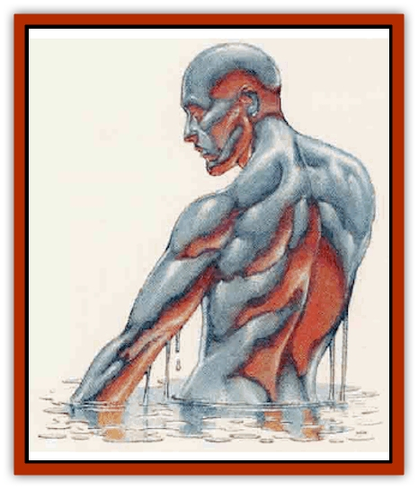

# Ooze - Slime - Jelly - Ghaunadan

| Statistic | **Ooze/Slime/Jelly, Ghaunadan** |
| --- | --- |
| **Activity Cycle:** | Any |
| **Alignment:** | Chaotic evil |
| **Armor Class:** | 1 |
| **Climate/Terrain:** | Subterranean |
| **Damage/Attack:** | 3d4 |
| **Diet:** | Carnivore |
| **Frequency:** | Rare |
| **Hit Dice:** | 5 |
| **Intelligence:** | Very to High (12-14) |
| **Magic Resistance:** | Nil |
| **Morale:** | Fanatic (17) |
| **Movement:** | 12 |
| **No. Appearing:** | 1-4 |
| **No. of Attacks:** | 2 |
| **Organization:** | Solitary |
| **Size:** | M (6') |
| **Special Attacks:** | Paralysis, <i>friends</i> gaze |
| **Special Defenses:** | Half damage from blunt weapons, disarming |
| **THAC0:** | 15 |
| **Treasure:** | J (B) |
| **XP Value:** | 4,000 |

These vile, intelligent beasts are the loyal servants of Ghaunadaur, the god of oozes, slimes, and jellies. Ghaunadan are intelligent oozes that have full control of their semiliquid bodies. Ghaunadan can move, at half their normal movement rate, through small cracks, gratings, or even under doors. These creatures move at that same rate on walls and ceilings.

Further, a ghaunadan can control its body and change forms (for up to 15 hours at a tine) to that of a humanoid creature; most appear as human males, but there are one or two rumored to have female [[Elf_Drow|drow]] forms. A ghaunadan requires one full round to assume or drop its humanoid shape, and, when in humanoid shape, it favors the colors and styles also worn by Ghaunadaur's priests: copper, amber, flame-orange, russet, plum, purple, lilac, and lavender.

**Combat:** In ooze form, a ghaunadan lashes out with two pseudopods, each successful attack inflicting 3d4 points of damage. Victims of this attack are struck with the ghaunadan's paralytic slime; each must save vs. paralysis at a +2 bonus or be paralyzed for 2d6 turns. Also, a ghaunadan's semiliquid body is resistant to bludgeoning blows (half damage from such attacks). In its ooze form, a ghaunadan can forego all physical attacks in a round and choose to mold itself around an opponent�s weapon; when a successful attack hits the ghaunadan, the weapon sinks into its mass, but the ghaunadan firms its skin around the weapon, trapping it like a fly in amber. Characters need to make a bend bars/lift gates roll to free their weapons, or abandon them inside the ghaunadan.

The ghaunadan's humanoid form is a unique individual that is always pleasant to those beholding it (Charisma 15 or greater). If a humanoid ghaunadan looks into someone's eyes, its gaze has an effect identical to a *friends* spell that lasts as long as the ghaunadan remains visible to its targets. If the ghaunadan leaves the area, or assumes its true form, the *friends* effect ends immediately. Note that a ghaunadan cannot form clothing, armor, or weapons from itself. Such items must be obtained from other sources. Victims of the ghaunadan are common targets for a creature seeking such items. A ghaunadan in humanoid form can attack with its pseudopods (stretching its arms and hands into blobs), but may choose not to reveal its true nature by doing so. In this case, a ghaunadan will make use of any available and appropriate weapons.

**Habitat/Society:** Ghaunadan live in any subterranean area where prey is accessible. They tend to live alone, though they often reside near (and lead) other slime- or ooze-based creatures.

Ghaunadan also actively serve their god. Groups of ghaunadan can be found in areas where foes of Ghaunadaur are active.

**Ecology:** Ghaunadan hunt by roaming the area where they live, be it cave, city, tunnel, or dungeon, until they spy prey or intruders. Ghaunadan then take humanoid form (to draw intended victims closer) or hide in ooze form until prey are within range of its melee attack. Ghaunadan cannot consume inorganic items such as armor, rings, or metallic weapons. Unless the ghaunadan makes use of these items in its humanoid form, these things are generally left where they were dropped by the ghaunadan's victim.

---
## Discovery & Documentation

**Source Publication:** City of Splendors (1994)
**Campaign Setting:** Forgotten Realms
**Author(s):** Ed Greenwood, Elain Cunningham

### Other Creatures Found in This Source Book
   * [[Curst|Curst]]
   * [[Doppelganger_Greater|Doppelganger, Greater]]
   * [[Duhlarkin|Duhlarkin]]
   * [[Gulguthhydra|Gulguthhydra]]
   * [[Hakeashar|Hakeashar]]
   * [[Leucrotta_Greater|Leucrotta, Greater]]
   * [[Lycanthrope_Wereshark|Lycanthrope, Wereshark]]
   * [[Nyth|Nyth]]
   * [[Palimpsest|Palimpsest]]
   * [[Peltast|Peltast]]
   * [[Raggamoffyn|Raggamoffyn]]
   * [[Shadowrath|Shadowrath]]
   * [[Snake_Sewerm|Snake, Sewerm]]
   * [[Watchspider|Watchspider]]
