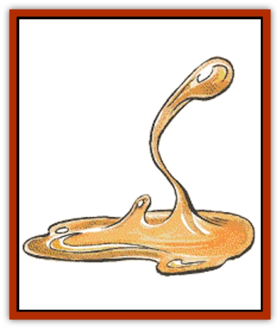

# Ooze - Slime - Jelly I

| Statistic | **Jelly, Stun-** | **Mustard Jelly** | **Olive Slime** | **Olive Slime Creature** |
| --- | --- | --- | --- | --- |
| **Activity Cycle:** | Night | Night | Any | Any |
| **Alignment:** | Neutral | Neutral | Neutral | Neutral |
| **Armor Class:** | 8 | 4 | 9 | 9 |
| **Climate/Terrain:** | Any subterranean | Any subterranean | Any subterranean | Any damp |
| **Damage/Attack:** | 2-8 | 5-20 | Nil | See below |
| **Diet:** | Scavenger | Scavenger | Scavenger | Carnivore |
| **Frequency:** | Rare | Rare | Very rare | Rare |
| **Hit Dice:** | 17 | 7+14 | 2+2 | See below |
| **Intelligence:** | Animal (1) | Average (8-10) | Non- (0) | Animal (1) |
| **Magic Resistance:** | Nil | 10% | See below | See below |
| **Morale:** | Average (9) | Elite (13-14) | Average (10) | Average (9) |
| **Movement:** | 4 | 9 | 0 | 6 |
| **No. Appearing:** | 1 | 1 | 1-4 | 1-20 |
| **No. of Attacks:** | 1 | 1 or 2 | 0 | 1 |
| **Organization:** | Solitary | Solitary | Colony | Colony |
| **Size:** | L (10' on a side) | L (9-12' diam.) | S (4' radius) | Special |
| **Special Attacks:** | Paralyzation | See below | See below | Olive slime |
| **Special Defenses:** | Nil | +1 or better to hit | See below | See below |
| **THAC0:** | 17 | 13 | 19 | 17, 15, or 13 |
| **Treasure:** | See below | See below | Nil | Nil |
| **XP Value:** | 420 | 4,000 / (½ if half slain) | 420 | 420, 975, or 2,500 |

There are many different varieties of ooze, slime, and jelly. More are being discovered all the time, as warped wizards seek to create life or fashion efficient dungeon scavengers. The unifying feature of these creatures is a dissolving touch that consumes flesh as well as weapons and armor.

**Olive Slime**

  Olive slime is a strain of monstrous plant life, closely related to [[Ooze_Slime_Jelly_II|green slime]], that grows while clinging to ceilings. More dangerous than green slime, olive slime favors moist, subterranean regions. It feeds on whatever animal, vegetable, or metallic substances happen to cross its path. The vibrations of a creature beneath it are sufficient to cause it to release its tendrils and drop. Olive slime ignores armor for purposes of determining hit probability. It also negates Dexterity bonuses unless its target is aware of the presence of the slime and takes steps to avoid the stuff. Contact with olive slime causes a numbing poison to ooze from the creature. The slime then spreads itself over the body of its victim, sending out parasitic tendrils to feed upon the body fluids of the host. For humans and demihumans, the point of attachment is usually along the spinal area. The feeding process soon begins to affect the brain of the host as it changes the host's body. An unobservant victim must roll a saving throw vs. poison, failure indicating that the victim has not noticed that the olive slime has dropped upon him. Any group of characters in the vicinity will have a 50% chance of noticing the slime's attachment with a casual glance. This percentage may be adjusted only by magical items. A thorough search by wary individuals reveals the olive slime without difficulty.

Within 2d4 hours, the host's main concern becomes how to feed, protect, and sustain the growth of the olive slime. Naturally, this includes keeping the slime's presence a secret from any companions. If an affected character's companions become suspicious, or if they demonstrate any desire to destroy olive slime, the affected character will escape at the first opportunity. The host's food intake must double or the character wastes away (10% of the character's hit points per day, rounding up, and no natural healing can take place while a character is wasting away. After 1d6+6 days, the host suddenly and painfully metamorphoses into a vegetable creature. The olive slime gradually replaces skin and muscle tissue, and it forms a symbiotic brain link. The new creature has no interest in its former form or fellows. It exists as a new species more akin to plants than any other life form. Feeding then becomes photosynthetic, paralytic, or, most likely, both. When slain, an olive slime creature dissolves into a new patch of olive slime.

Olive slime is harmed only by acid, freezing cold, fire, or by a *cure disease* spell. Spells that affect plants will work on olive slime, although entangle will have no practical effect. Green slime and olive slime are complete opposites - when they encounter each other, the attack of one neutralizes the other.

If an affected character has been transformed into an olive slime creature, there is very little short of a *limited wish* that can return him to normal.

**Olive Slime Creature**

Olive slime creatures, popularly known as "slime [[Zombie|zombies]]", are the end result of the metamorphosis upon the host. The newly formed vegetable creature is linked symbiotically with the olive slime patch that created it. The symbiotic bond is a secure link within 200 miles, but not from one plane of existence to another. The olive slime can call its zombies to defend it from attack, and they will immediately and mindlessly obey.

Regardless of their former existence, and despite their general form, slime creatures are only differentiated by size:

| Size | HD | Damage/Attack |
| --- | --- | --- |
| Tiny | 1+2 | 1-3 |
| Small | 3+2 | 1-4 |
| Man-sized | 5+2 | 2-8 |
| Large | 8+2 | 3-12 |
| Huge | 12+2 | 4-16 |
| Gargantuan | 16 | 4-24 |

Slime creatures have a telepathic bond, effective at a range of 200 yards, and gather together for mutual assistance while feeding or for defense. Their former identities can be discovered only upon close examination.

Habitat varies from well-populated subterranean places to damp forests, swamps, and fens. Slime creatures are equally at home on land or in warm, shallow water. Slime zombies seek out animal hosts for their slime; they attack man-sized creatures on sight. When they attack, olive slime zombies have a 10% chance, per successful hit, to infect an opponent with slime. If they succeed in doing so, they either change targets or flee combat before killing their target - they certainly do not want to kill the new host.

Olive slime zombies are harmed by acid, freezing cold, fire and *magic missile* spells. Spells that affect plants will also affect them, although the effects of *entangle* are minimal at best. No other attacks, by weapons, lightning, or spells that affect the mind will kill a slime creature. An olive slime zombie, however, can suffer only as much physical damage as it has hit points, before its skeleton collapses and it becomes nothing more than a puddle of olive slime. When green slime is applied to an olive slime zombie, it neutralizes the olive slime, delivering 2d4 points of damage per round until the body is reduced to a (non-animate) skeleton.

The vegetable intelligence of slime zombies is no greater than that of common animals, but does enable them to learn from experience. This innate intelligence extends to the use of simple traps, and they will lie in wait at the bottom of hidden shafts.

**Mustard Jelly**

  Mustard jelly originated when a young wizard attempted to polymorph herself into an [[Ooze_Slime_Jelly_II|ochre jelly]]. Her spell failed, and she became a mustard jelly. The stuff has multiplied rapidly in the years since her accident, and it is now a serious threat in many areas.

The monstrous amoeboid mustard jelly is far more dangerous than the ochre jelly. Mustard jelly is translucent, and very hard to see until it attacks. The only clue to its presence is a faint odor, similar to blooming mustard plants. Once it does attack, it may be seen as yellowish brown in color.

Normally, mustard jelly attacks by forming an acidic pseudopod of its own substance and thrusting. The jelly monster secretes a vapor over a 10-foot radius. Those near the jelly must roll a saving throw vs. poison each round. Those who fail the saving throw become lethargic and move at half-normal speed, due to the effects of the vapor. The toxic effects last for two rounds and they are cumulative.

This large creature can divide itself at will into two smaller, faster halves (movement rate 18). Each is capable of attacking, but has only half the hit points the creature had before dividing. A mustard jelly can, for example, flow into a room, divide itself into independent halves to attack, and then reform into a torus in order to surround a pillar its prey has climbed. Unlike the ochre jelly, mustard jelly cannot move through tiny spaces, nor can it move along ceilings, although it will eat through wooden doors. It cannot climb walls either, and so most of its bulk must remain on the floor, stretching up only 4 or 5 feet.

Although intelligent, mustard jelly is not known to value treasure of any sort, except as a lure for greedy adventurers. Of course, it is possible that some treasure might remain after a victim has been devoured.

Mustard jelly is impervious to normal weapons (and can eat wooden ones) and electrical attacks. A *magic missile* spell will only cause it to grow; mustard jelly gains hit points equal in number to the damage rolled. Cold causes only half damage, and other attacks have normal effects.

**Stunjelly**

  This relative of the [[Ooze_Slime_Jelly_II|gelatinous cube]] was designed by some forgotten mage to resemble a section of ordinary stone wall. They are usually about 10 feet square by 2½ to 5 feet thick, and somewhat translucent. If a bright light is shone on one side of the stunjelly, it will be seen on the other. Illumination equal to a *continuous light* spell will reveal whatever treasure a stunjelly might be carrying. Stunjellies make no noise when they move, but they do produce a faint odor of vinegar.

The stunjelly has many features in common with the gelatinous cube. Like the cube, the stunjelly paralyzes creatures who venture too close! Adventurers walking near a stunjelly may be attacked by an anaesthetic pseudopod; those struck must roll a saving throw vs. paralyzation. Those who succeed suffer no ill effects. Those who fail are paralyzed for 5d4 rounds, during which time the stunjelly tries to surround the victim and digest him. Like the gelatinous cube, it is immune to electrical attacks, mind-influencing spells, paralyzation, and polymorph spells. Unlike the gelatinous cube, stunjelly is affected normally by cold attacks.

Stunjellies reproduce by fission, as one extremely thick jelly splits into two smaller ones. This process is accompanied by a horrible, rending sound, audible throughout the vicinity.

A stunjelly might mindlessly carry undigested metals around with it for days. These would include treasure types J, K, L, M, N, and Q, as well as potions, daggers, or similar objects.

Stunjellies are tolerated in many dungeons as traps for unwary intruders, or as janitorial monsters sweeping the passages of digestible litter. For this duty, they are preferred over other breeds of slime and ooze, since they cannot slither through doors into areas where they would be unwelcome.

---
## Discovery & Documentation

**Source Publication:** MC1 Volume I (w/binder #1) (1991)
**Campaign Setting:** Advanced Dungeons & Dragons 2nd Edition
**Author(s):** Jay Batista, Scott Bennie, Grant Boucher, William W. Connors, Steve Gilbert, Heike Kubasch, James Lowder, David Edward Martin, Bruce Nesmith, Jean Rabe, Rick Swan, John J. Terra, Gary L. Thomas

### Other Creatures Found in This Source Book
   * [[Bat|Bat]]
   * [[Bear|Bear]]
   * [[Behir|Behir]]
   * [[Boar|Boar]]
   * [[Bookworm|Bookworm]]
   * [[Brownie|Brownie]]
   * [[Bugbear|Bugbear]]
   * [[Carrion_Crawler|Carrion Crawler]]
   * [[Cat_Great|Cat, Great]]
   * [[Catoblepas|Catoblepas]]
   * [[Dragon_General_Information|Dragon, General Information]]
   * [[Dragonfish|Dragonfish]]
   * [[Elemental_Air_Kin_Aerial_Servant|Elemental, Air Kin, Aerial Servant]]
   * [[Elemental_Earth_Kin_Sandling|Elemental, Earth Kin, Sandling]]
   * [[Elephant|Elephant]]
   * [[Gnoll|Gnoll]]
   * [[Hobgoblin|Hobgoblin]]
   * [[Homunculus|Homunculus]]
   * [[Hornet_Giant|Hornet, Giant]]
   * [[Horse|Horse]]
   * [[Hyena|Hyena]]
   * [[Jackal|Jackal]]
   * [[Jackalwere|Jackalwere]]
   * [[Korred|Korred]]
   * [[Lich|Lich]]
   * [[Lizard|Lizard]]
   * [[Lizard_Man|Lizard Man]]
   * [[Lycanthrope_General_Information|Lycanthrope, General Information]]
   * [[Lycanthrope_Seawolf|Lycanthrope, Seawolf]]
   * [[Lycanthrope_Werebear|Lycanthrope, Werebear]]
   * [[Lycanthrope_Weretiger|Lycanthrope, Weretiger]]
   * [[Lycanthrope_Werewolf|Lycanthrope, Werewolf]]
   * [[Manticore|Manticore]]
   * [[Medusa|Medusa]]
   * [[Mind_Flayer|Mind Flayer]]
   * [[Minotaur|Minotaur]]
   * [[Mudman|Mudman]]
   * [[Mummy|Mummy]]
   * [[Nixie|Nixie]]
   * [[Nymph|Nymph]]
   * [[Ogre|Ogre]]
   * [[Ooze_Slime_Jelly_II|Ooze/Slime/Jelly II]]
   * [[Orc|Orc]]
   * [[Owl|Owl]]
   * [[Owlbear_I|Owlbear I]]
   * [[Pegasus|Pegasus]]
   * [[Piercer|Piercer]]
   * [[Pudding_Deadly|Pudding, Deadly]]
   * [[Rakshasa|Rakshasa]]
   * [[Rat|Rat]]
   * [[Ray|Ray]]
   * [[Remorhaz|Remorhaz]]
   * [[Satyr|Satyr]]
   * [[Scorpion|Scorpion]]
   * [[Selkie|Selkie]]
   * [[Shadow|Shadow]]
   * [[Skeleton|Skeleton]]
   * [[Skunk|Skunk]]
   * [[Snake|Snake]]
   * [[Spectre|Spectre]]
   * [[Spider|Spider]]
   * [[Sprite|Sprite]]
   * [[Toad_Giant|Toad, Giant]]
   * [[Treant|Treant]]
   * [[Troll|Troll]]
   * [[Umber_Hulk|Umber Hulk]]
   * [[Unicorn|Unicorn]]
   * [[Vampire|Vampire]]
   * [[Wight|Wight]]
   * [[Will_O'Wisp|Will O'Wisp]]
   * [[Wolf|Wolf]]
   * [[Wolfwere|Wolfwere]]
   * [[Wraith|Wraith]]
   * [[Wyvern|Wyvern]]
   * [[Yeti|Yeti]]
   * [[Yuan-ti|Yuan-ti]]
   * [[Zombie|Zombie]]
