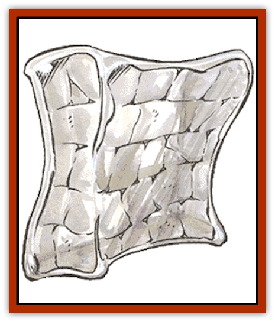
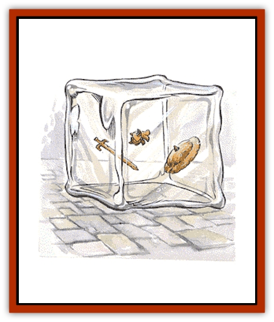

# Ooze - Slime - Jelly II

| Statistic | **Crystal Ooze** | **Gelatinous Cube** | **Gray Ooze** | **Green Slime** | **Ochre Jelly** |
| --- | --- | --- | --- | --- | --- |
| **Activity Cycle:** | Any | Any | Any | Any | Any |
| **Alignment:** | Neutral | Neutral | Neutral | Neutral | Neutral |
| **Armor Class:** | 8 | 8 | 8 | 9 | 8 |
| **Climate/Terrain:** | Dimly lit water | Subterranean | Subterranean | Subterranean | Subterranean |
| **Damage/Attack:** | 4-16 | 2-8 | 2-16 | Nil | 3-12 |
| **Diet:** | Omnivore | Omnivore | Omnivore | Omnivore | Omnivore |
| **Frequency:** | Rare | Uncommon | Rare | Rare | Uncommon |
| **Hit Dice:** | 4 | 4 | 3+3 | 2 | 6 |
| **Intelligence:** | Animal (1) | Non- (0) | Animal (1) | Non- (0) | Non- (0) |
| **Magic Resistance:** | Nil | Nil | Nil | Nil | Nil |
| **Morale:** | Average (10) | Average (10) | Average (10) | Average (10) | Average (10) |
| **Movement:** | 1, Sw 3 | 6 | 1 | 0 | 3 |
| **No. Appearing:** | 1-2 | 1 | 1-3 | 1-6 | 1-3 |
| **No. of Attacks:** | 1 | 1 | 1 | 0 | 1 |
| **Organization:** | Solitary | Solitary | Solitary | Colony | Solitary |
| **Size:** | M to L (4-12') | L (10' cube) | M to L (4-12') | S (2-4') | M (4-7') |
| **Special Attacks:** | Poison | Paralyzation, surprise | Corrodes metal | See below | Nil |
| **Special Defenses:** | See below | See below | See below | See below | See below |
| **THAC0:** | 17 | 17 | 17 | 19 | 15 |
| **Treasure:** | Nil | Nil (incidental) | Nil | Nil | Nil |
| **XP Value:** | 420 | 650 | 270 | 65 | 270 |

The oozes, slimes and jellies of the underworld are hideous, amorphous creatures that are the bane of all that lives, dissolving the weapons, armor, and flesh of their victims.

## Ochre Jelly

This monster resembles a giant amoeba, seeping through darkened corridors, through cracks and under doors, searching for flesh or cellulose to devour. Their form allows them to travel on walls and ceilings and drop on unsuspecting prey.

**Combat:** The ochre jelly attacks by attempting to envelop its prey. Its secretions dissolve flesh, inflicting 3-12 (d10+2) points of damage per round of exposure. While a *lightning bolt* will divide the creature into one or more smaller jellies, each doing one-half normal damage, fire- and cold-based attacks have normal effects.

**Habitat/Society:** An asexual creature, the ochre jelly is a solitary beast that is occasionally found with its own divided offspring. It lives only to eat and reproduce.

**Ecology:** Voraciously dissolving all types of carrion and trash, this monster is sometimes tolerated in inhabited subterranean areas for its janitorial services, but this activity is difficult to organize and is usually not appreciated by the inhabitants because of its danger.

## Gray Ooze

**Psionics Summary**

| Level | Dis/Sci/Dev | Attack/Defense | Score | PSPs |
| --- | --- | --- | --- | --- |
| 1 | 2/1/1 | PsC/M- | 13 | 1d100+20 |

A slimy horror that looks like wet stone or a sedimentary rock formation, the gray ooze is rarely thicker than six or eight inches, but sometimes grows to a length of 12 feet. It cannot climb walls or ceilings, so it slides, drips, and oozes along cavern floors.

**Combat:** The gray ooze strikes like a [[Snake|snake]], and can corrode metal at an alarming rate (chain mail in one round, plate mail in two, and magical armor in one round per each plus to Armor Class). Spells have no effect on this monster, nor do fire- or cold-based attacks. Lightning and blows from weapons cause full damage. Note that weapons striking a gray ooze may corrode and break.

**Habitat/Society:** After a large meal, a gray ooze reproduces by "budding": growing a small pod that is left behind in a corridor or cavern. This pod takes two to three days to mature and then the little gray ooze absorbs its leathery shell and begins slithering about, searching for a meal. Sometimes more than one of these monsters are found together, but this is just a random event because they are not intelligent.

**Ecology:** The gray ooze is a dungeon scavenger. It is rumored that metalworkers of extraordinary skill keep very small oozes in stone jars to etch and score their metal work, but this is a delicate and dangerous practice.

## Crystal Ooze

This creature is a variety of gray ooze which has adapted to living in water. It is 75% invisible when immersed in its natural element. It is translucent, mostly glassy clear, with an occasional milky white swirl in its substance.

**Combat:** Crystal ooze strikes like a snake, then attempts to flow over a victim and exude its paralyzing poison. Unlike its cousin, the gray ooze, this creature does not corrode metal, but its poisons attack wood, cloth, and flesh. Unless a victim successfully saves vs. poison, he becomes paralyzed and will be consumed by the crystal ooze in a short time. When prey is reduced to -20 hit points, it is totally consumed. Crystal ooze cannot be harmed by acid, cold, heat, or fire attacks, but electricity and *magic missiles* inflict full damage. Blows from weapons inflict only 1 point of damage per hit. A wooden weapon must save vs. acid or it will dissolve and break.

**Habitat/Society:** Crystal oozes live in any dim or dark body of water, though they can exist out of water for several hours. They reproduce by budding, like the gray ooze, but the crystal pods usually take seven to 10 days to hatch. Crystal oozes will eat their offspring, but occasionally, if the body of water is large enough and food is not scarce, a few of them might be found living in the same water.

**Ecology:** Crystal oozes are scavengers that leave metal and stone objects in their wake, so incidental treasure can often be found around and in their lairs.

## 

Gelatinous Cube

So nearly transparent that they are difficult to see, these cubes travel down dungeon corridors, absorbing carrion and trash along the way. Their sides glisten, tending to leave a slimy trail, but gelatinous cubes cannot climb walls or cling to ceilings. Very large cubes grow tall to garner mosses and the like from ceilings.

**Combat:** A gelatinous cube attacks by touching its victim with its anesthetizing slime. A victim who fails to save vs. paralyzation is paralyzed (anesthetized) for 5-20 (5d4) rounds. The cube then surrounds its prey and secretes digestive fluids to absorb the food. All damage is caused by these digestive acids. Because gelatinous cubes are difficult to see, others are -3 on their surprise roll. Electricity, *fear*, *holds*, paralyzation, *polymorph*, and sleep-based attacks have no effect on this monster, but fire and blows from weapons have normal effects. If a cube fails its saving throw against a cold-based attack, the cube will be slowed 50% and inflicts only 1-4 points of damage.

**Habitat/Society:** Possessing no intelligence, gelatinous cubes live only for eating. They prefer well- traveled dungeons where there is always food to scavenge. These creatures reproduce by budding, leaving clear, rubbery cubes in dark corners or on heaps of trash. Young are not protected and are sometimes reabsorbed by the parent. Treasure is sometimes swept up by a gelatinous cube as the creature travels along a cavern floor; any metals, gems, or jewelry are carried in the monster's body until they can be ejected as indigestible. Items found inside a cube include treasure types J, K, L, M, N, Q, as well as an occasional potion, dagger, or similar object.

**Ecology:** The gelatinous cube is sometimes encouraged to stay in a certain area for its scavenging abilities, and is preferred over other jellies and oozes since its square shape does not allow it to slither under doors and into areas in which it is not desired.

## Green Slime

A hideous growth, green slime is bright green, sticky, and wet. It grows in dark subterranean places on walls, ceilings and floors.

**Combat:** This slime cannot attack but is sensitive to vibrations and often drops from the ceiling onto a passing victim. Green slime attaches itself to living flesh and in 1-4 melee rounds turns the creature into green slime (no resurrection possible). Green slime eats through one inch of wood in an hour, but can dissolve metal quickly, going through plate armor in three melee rounds. The horrid growth can be scraped off quickly, cut away, frozen, or burned. A *cure disease* spell kills green slime, but other attacks, including weapons and spells, have no effect.

**Habitat/Society:** Green slime hates light and feeds on animal, vegetable, and metallic substances in dark caverns. Since it cannot move, this slime grows only when food comes to it. Sunlight dries it out and eventually kills it. Occasional huge slimes or colonies of dozens have been reported.

**Ecology:** Green slime is an infestation that all creatures avoid; it is burned out of caverns or mines if found. Once it has infected an area, it has a tendency to grow back, even after being frozen or burned away, because dormant spores can germinate years later.

---
## Discovery & Documentation

**Source Publication:** MC1 Volume I (w/binder #1) (1991)
**Campaign Setting:** Advanced Dungeons & Dragons 2nd Edition
**Author(s):** Jay Batista, Scott Bennie, Grant Boucher, William W. Connors, Steve Gilbert, Heike Kubasch, James Lowder, David Edward Martin, Bruce Nesmith, Jean Rabe, Rick Swan, John J. Terra, Gary L. Thomas

### Other Creatures Found in This Source Book
   * [[Bat|Bat]]
   * [[Bear|Bear]]
   * [[Behir|Behir]]
   * [[Boar|Boar]]
   * [[Bookworm|Bookworm]]
   * [[Brownie|Brownie]]
   * [[Bugbear|Bugbear]]
   * [[Carrion_Crawler|Carrion Crawler]]
   * [[Cat_Great|Cat, Great]]
   * [[Catoblepas|Catoblepas]]
   * [[Dragon_General_Information|Dragon, General Information]]
   * [[Dragonfish|Dragonfish]]
   * [[Elemental_Air_Kin_Aerial_Servant|Elemental, Air Kin, Aerial Servant]]
   * [[Elemental_Earth_Kin_Sandling|Elemental, Earth Kin, Sandling]]
   * [[Elephant|Elephant]]
   * [[Gnoll|Gnoll]]
   * [[Hobgoblin|Hobgoblin]]
   * [[Homunculus|Homunculus]]
   * [[Hornet_Giant|Hornet, Giant]]
   * [[Horse|Horse]]
   * [[Hyena|Hyena]]
   * [[Jackal|Jackal]]
   * [[Jackalwere|Jackalwere]]
   * [[Korred|Korred]]
   * [[Lich|Lich]]
   * [[Lizard|Lizard]]
   * [[Lizard_Man|Lizard Man]]
   * [[Lycanthrope_General_Information|Lycanthrope, General Information]]
   * [[Lycanthrope_Seawolf|Lycanthrope, Seawolf]]
   * [[Lycanthrope_Werebear|Lycanthrope, Werebear]]
   * [[Lycanthrope_Weretiger|Lycanthrope, Weretiger]]
   * [[Lycanthrope_Werewolf|Lycanthrope, Werewolf]]
   * [[Manticore|Manticore]]
   * [[Medusa|Medusa]]
   * [[Mind_Flayer|Mind Flayer]]
   * [[Minotaur|Minotaur]]
   * [[Mudman|Mudman]]
   * [[Mummy|Mummy]]
   * [[Nixie|Nixie]]
   * [[Nymph|Nymph]]
   * [[Ogre|Ogre]]
   * [[Ooze_Slime_Jelly_I|Ooze/Slime/Jelly I]]
   * [[Orc|Orc]]
   * [[Owl|Owl]]
   * [[Owlbear_I|Owlbear I]]
   * [[Pegasus|Pegasus]]
   * [[Piercer|Piercer]]
   * [[Pudding_Deadly|Pudding, Deadly]]
   * [[Rakshasa|Rakshasa]]
   * [[Rat|Rat]]
   * [[Ray|Ray]]
   * [[Remorhaz|Remorhaz]]
   * [[Satyr|Satyr]]
   * [[Scorpion|Scorpion]]
   * [[Selkie|Selkie]]
   * [[Shadow|Shadow]]
   * [[Skeleton|Skeleton]]
   * [[Skunk|Skunk]]
   * [[Snake|Snake]]
   * [[Spectre|Spectre]]
   * [[Spider|Spider]]
   * [[Sprite|Sprite]]
   * [[Toad_Giant|Toad, Giant]]
   * [[Treant|Treant]]
   * [[Troll|Troll]]
   * [[Umber_Hulk|Umber Hulk]]
   * [[Unicorn|Unicorn]]
   * [[Vampire|Vampire]]
   * [[Wight|Wight]]
   * [[Will_O'Wisp|Will O'Wisp]]
   * [[Wolf|Wolf]]
   * [[Wolfwere|Wolfwere]]
   * [[Wraith|Wraith]]
   * [[Wyvern|Wyvern]]
   * [[Yeti|Yeti]]
   * [[Yuan-ti|Yuan-ti]]
   * [[Zombie|Zombie]]
