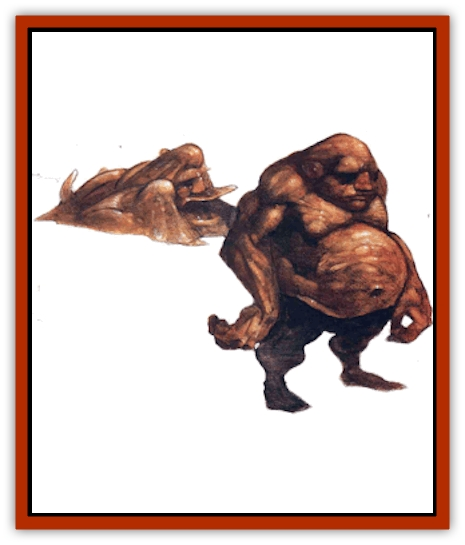

# Ooze Sprite

| Statistic | **Ooze Sprite** |
| --- | --- |
| **Activity Cycle:** | Any |
| **Alignment:** | Neutral |
| **Armor Class:** | 6 |
| **Climate/Terrain:** | Paraplane of Ooze |
| **Damage/Attack:** | 1d6 |
| **Diet:** | Carnivore |
| **Frequency:** | Common |
| **Hit Dice:** | 3 (king 10) |
| **Intelligence:** | Average (8-10) |
| **Magic Resistance:** | Nil |
| **Morale:** | Average (8-10) |
| **Movement:** | 6 |
| **No. Appearing:** | 1d6 (sometimes 3d6) |
| **No. of Attacks:** | 1 |
| **Organization:** | Tribal |
| **Size:** | M (5-6' long) |
| **Special Attacks:** | Mind control |
| **Special Defenses:** | Malleable form, hide in ooze |
| **THAC0:** | 17 |
| **Treasure:** | Nil |
| **XP Value:** | 650 / Ooze Sprite King: 5,000 |

Now here's a misnamed creature. There's nothing less [[Sprite|spritely]] than this pile of ooze and muck. Little more than a heap of goo in appearance, the ooze sprite nevertheless possesses abilities and properties that distinguish it from other natives of the plane of Ooze.

When asked about ooze sprites, a sage in Sigil (who wished to remain nameless) stated: "These deceptive creatures rarely make their presence known. Their insidious nature reflects their quiet mastery of all things that occur around them. They may be behind everything that occurs on the entire plane - and possibly beyond. Who knows how far their influence has spread? Who knows what - or who - else they control? My advice? Watch out."

While such chant sounds like the paranoid screed of an unstable barmy, it is important for a planewalker to remember that these creatures are much more than they just appear. They are intelligent, well organized, difficult to combat, and potent in their ability to control the minds of others.

Ooze sprites do not speak, but communicate with each other through the standard mode of ooze sprite conversation: sign language. By manipulating their pseudopods and body shape, the creatures are able to convey complex ideas to those who understand.

**Combat:** The ooze sprite is an animate bit of protoplasm able to shift its form to virtually any shape. Thus, it is capable of seeping through small openings and conforming to any shape imposed upon the sprite by its surroundings without harm (that is to say, it can't be crushed, cut, pierced, or seized). Fact is, a sprite is so malleable that blows from weapons can't harm it. Even magical weapons inflict damage only according to their enchantment (a +1 weapon inflicts 1 point of damage, a +2 weapon inflicts 2 points of damage, and so on).

In its natural environment or any similar ooze- or slime-filled area, the creature can hide with 95% efficiency, subtracting 2 from its opponents' surprise rolls.

Ooze sprites have an innate power of *suggestion*, although the commands given aren't transferred by voice, but by touch. They secrete a special substance that - when placed on the flesh of another creature - allows the sprites to send commands directly to the brain of their chosen victim. They must first make an attack roll to touch the chosen victim, who then may make a saving throw versus spell to resist the *suggestion*. The ooze sprites can use this ability on any being with an Intelligence of 1 or better, and the effects last only an hour. Thus, commands are usually short and very simple, such as "come here and let me devour you" or "go away".

**Habitat/Society:** Ooze sprite society is surprisingly complex. The creatures organize themselves into little tribes, which roam nomadically about the plane of Ooze. Each tribe has a chieftain chosen through a process that is a combination of rotation and election; most ooze sprites have the chance to become a chieftain, at least for a while.

Once every six Sigil years (approximately), all the current chieftains gather in a council to choose one of their number to be king. Each ooze sprite pays homage to the king by donating a potent chemical from its own body. This king, thus empowered, becomes a massive creature of 10 HD that then travels the plane, hunting its own kind and culling the weak. This self-destructive cycle keeps their population small, yet each individual strong.

Ooze sprites reproduce when each member of the tribe contributes a small portion of its own mass and intelligence to a new offspring created by the group as a whole. The entire tribe then acts as a family unit to raise the young creature, which matures very, very rapidly - due in part to the fact that it directly inherits some knowledge and ability from those creatures that sired it.

The ooze sprites use their power to control the minds of others as a matter of course. They don't look upon it as "evil" or "manipulative", though most of their victims would certainly claim otherwise. Rather, the ooze sprites use other beings to accomplish various tasks. (Other creatures are merely tools or food for the ooze sprites, so therefore using them cannot be evil.) For example, the [[Mephit_II_Earth_Ooze|ooze mephits]], a common target of ooze sprite manipulations, are used to carry sign-language messages to other tribes. Occasionally, they are even used as a means of transportation should a sprite need to get somewhere quickly.

Since ooze sprites don't recognize that other creatures may possess intelligence equal to (or greater than) theirs, they never use their suggestive capabilities to cause a body to do something requiring initiative or intelligence. Ooze sprites never cause their victims to say anything, for they don't realize that verbal communication is possible.

**Ecology:** The origin of this creature plagues many sages and scholars. Most graybeards don't apply concepts like natural evolution to the Inner Planes, particularly given odd environments like the plane of Ooze. It seems unlikely that creatures such as the ooze sprites might arise spontaneously from the muck. It also seems unlikely that they were intentionally created by an outside force - unless that force also failed to recognize the intelligence of those around it. Most scholars believe the ooze sprites to be the accidental result of a magical experiment gone awry - although the bloods admit that they always use that same explanation when they have no real idea regarding a creature's origins.

Ooze sprites feed on tiny creatures native to the plane, ranging from nearly microscopic organisms to worms and grubs that live in the mire.

**Mr. Slur**

  Chant has it that an ooze sprite was brought to Sigil, the City of Doors, where bashers taught it of the existence of other intelligent races, other planes, and more. This creature was even given a magical charm that allowed it to speak (albeit slowly and gutturally). Called Slurgosith originally, the anomalous creature worked its way into and up through the ranks of the Cage's criminal underground, using its abilities to control the minds of others. It adopted a humanoid shape - a short, fat man with no hair and greasy skin - and the name Mr. Slur.

Mr. Slur is now said to be the head of a vast criminal organization. If the dark of its real motives goes beyond that (and it probably does), no one knows for sure how far.

---
## Discovery & Documentation

**Source Publication:** Planescape III (1996)
**Campaign Setting:** Planescape
**Author(s):** Monte Cook

### Other Creatures Found in This Source Book
   * [[Animental|Animental]]
   * [[Archomental_Evil|Archomental, Evil]]
   * [[Archomental_Good|Archomental, Good]]
   * [[Belker|Belker]]
   * [[Bzastra|Bzastra]]
   * [[Chososion|Chososion]]
   * [[Darklight|Darklight]]
   * [[Devete|Devete]]
   * [[Devourer_Planescape|Devourer (Planescape)]]
   * [[Dharum_Suhn|Dharum Suhn]]
   * [[Egarus|Egarus]]
   * [[Elemental_Athas_Lesser_Air_Earth|Elemental (Athas), Lesser, Air/Earth]]
   * [[Elemental_Athas_Lesser_Fire_Water|Elemental (Athas), Lesser, Fire/Water]]
   * [[Elemental_Fire_Kin_Salamander_II|Elemental, Fire Kin, Salamander II]]
   * [[Entrope|Entrope]]
   * [[Facet|Facet]]
   * [[Frost_Salamander|Frost Salamander]]
   * [[Fundamental_Air_Earth|Fundamental, Air/Earth]]
   * [[Fundamental_Fire_Water|Fundamental, Fire/Water]]
   * [[Fundamental_All_Elements|Fundamental, All Elements]]
   * [[Garmorm|Garmorm]]
   * [[Homunculus_Elemental|Homunculus, Elemental]]
   * [[Immoth|Immoth]]
   * [[Khargra|Khargra]]
   * [[Klyndes|Klyndes]]
   * [[Magran|Magran]]
   * [[Menglis|Menglis]]
   * [[Nathri|Nathri]]
   * [[Paraelemental|Paraelemental]]
   * [[Phirblas|Phirblas]]
   * [[Psurlon|Psurlon]]
   * [[Quasielemental_Negative|Quasielemental, Negative]]
   * [[Quasielemental_Positive|Quasielemental, Positive]]
   * [[Rast|Rast]]
   * [[Ravid|Ravid]]
   * [[Ruvoka|Ruvoka]]
   * [[Scile|Scile]]
   * [[Shad|Shad]]
   * [[Shocker|Shocker]]
   * [[Sislan|Sislan]]
   * [[Suisseen|Suisseen]]
   * [[Terithran|Terithran]]
   * [[Thoqqua|Thoqqua]]
   * [[Trilloch|Trilloch]]
   * [[Tsnng|Tsnng]]
   * [[Ungulosin|Ungulosin]]
   * [[Vacuous|Vacuous]]
   * [[Wavefire|Wavefire]]
   * [[Xag-Ya_Xeg-Yi|Xag-Ya/Xeg-Yi]]
   * [[Xill|Xill]]
