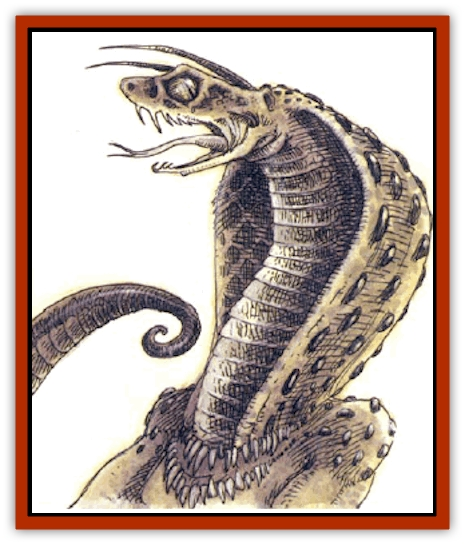

# Ophidian

| Statistic | **Ophidian** |
| --- | --- |
| **Activity Cycle:** | Day |
| **Alignment:** | Chaotic neutral |
| **Armor Class:** | 5 (base) |
| **Climate/Terrain:** | Tropical jungle, underground |
| **Damage/Attack:** | 1d3 and by weapon |
| **Diet:** | Carnivore |
| **Frequency:** | Uncommon |
| **Hit Dice:** | 3 or 4 |
| **Intelligence:** | Low to very (5-12) |
| **Magic Resistance:** | Nil |
| **Morale:** | Unsteady (5-7) |
| **Movement:** | 9, Sw 18 |
| **No. Appearing:** | 3d4 |
| **No. of Attacks:** | 2 |
| **Organization:** | Clan |
| **Size:** | M (5-6' long) |
| **Special Attacks:** | See below |
| **Special Defenses:** | Camouflage |
| **THAC0:** | 17 |
| **Treasure:** | U |
| **XP Value:** | 3 HD: 175 / 4 HD: 270 |

Ophidia, or snakemen, look like large snakes with humanoid arms and hands, but they aren't long and slender like true [[Snake|snakes]]. They are usually mottled green and yellow in color.

Ophidia have their own language, and about half of them know Common or another language spoken by nearby races.

**Combat:** Ophidia have a chameleonlike power to change colors. Their scales can assume brown and gray tones, as well as their normal green and yellow, so they can blend into subterranean environments as well. This blending ability imposes a -2 penalty upon opponents' surprise rolls, and ophidia use this to good effect in preparing ambushes.

For every three normal snakemen encountered, there will be one present with 4 Hit Dice. These stronger ophidia do not lead the others, but do tend to bully them a bit, hissing out orders and providing some plan of attack.

About 90% of ophidia carry weapons, and 50% use shields. Roughly half carry swords, 30% use clubs or maces, 10% carry battle axes, and 5% use scourges. The remaining 5% may carry any type of weapon that can be used with one hand. They attack twice per round, once with a weapon and once with their bite. A bitten human, demihuman, or humanoid victim must make a successful saving throw vs. poison or be afflicted by disease: 1d4+1 days after the bite, the victim's skin grows scaly. The legs begin to shrink, and the tongue becomes forked. After two weeks, the victim becomes an ophidian with 4 HD.

Those affected by the disease gradually lose their memories, becoming more snakelike every day. *Cure disease* and *reverse curse* halt the affliction, though neither is effective alone. A *heal* spell or *regeneration*, *wish*, or *limited wish* is required to reverse the disease. Once the transformation is complete, nothing short of a wish will return the victim to the previous state.

**Habitat/Society:** Wild ophidia live in small family groups. The eldest female usually leads the group, and she determines where the group hunts and what alliances they make.

Ophidia are sometimes enslaved by [[Yuan-ti|yuan-ti]], and they often serve [[Naga|nagas]] or [[Dragon_Chromatic_Green|green]] or [[Dragon_Chromatic_Black|black dragons]]. In fact, they are rarely found in groups without a powerful non-ophidian leader of some kind. Some form uneasy alliances with [[Lizard_Man|lizard men]], but they never share living areas with them. Ophidia are friendly with snakes and are often found with a giant constrictor.

Snakemen have little in the way of religion, though groups often "worship" the naga, [[Dragon_General_Information|dragon]], or giant constrictor snake with whom they associate, bringing food and presents to them.

Ophidia can mate at any time during the year. Females initiate the ritual with a writhing dance that hypnotizes males. About two months after mating, the female lays 1d6+1 eggs in a shallow hole, then covers them. The eggs harden slowly and hatch in about three months. If a whole nest survives to adulthood, they form a new family group. Others generally join with a group of snakemen in the area, either a wild group or one in servitude to a greater monster.

When an ophidian is created through a bite, it feels compelled to travel to the area where it was bitten. This compulsion begins when the transformation is half complete, and the soon-to-be snakeman sneaks off, fighting for freedom if caught. When the new ophidian arrives at the area where it was bitten, any local clan will adopt it.

**Ecology:** Ophidia are dangerous predators, stalking and ambushing any sort of warm-blooded prey. They prefer smaller animals, but like true snakes they can unhinge their jaws. This enables them to swallow dead animals up to 3 feet long. Snakemen generally serve to keep the populations of small animals down, though certain groups have been known to acquire a taste for [[Halfling|halflings]].

Ophidian poison becomes inert a few minutes after it leaves the snakeman's body, so cannot be used to pass the disease.

---
## Discovery & Documentation

**Source Publication:** Dragon Mountain (1993)
**Campaign Setting:** Advanced Dungeons & Dragons 2nd Edition
**Author(s):** Colin McComb, Paul Arden Lidberg

### Other Creatures Found in This Source Book
   * [[Dragon-kin|Dragon-kin]]
   * [[Elemental_Earth_Kin_Earth_Weird|Elemental, Earth Kin, Earth Weird]]
   * [[Gnasher|Gnasher]]
   * [[Gnasher_Winged|Gnasher, Winged]]
   * [[Kobold_Dragon_Mountain|Kobold, Dragon Mountain]]
   * [[Living_Steel|Living Steel]]
   * [[Noran|Noran]]
   * [[Rautym|Rautym]]
   * [[Spider_Brain|Spider, Brain]]
   * [[Squeaker|Squeaker]]
   * [[Stone_Snake|Stone Snake]]
   * [[Suwyze|Suwyze]]
   * [[Tanar'ri_Greater_Wastrilith|Tanar'ri, Greater, Wastrilith]]
   * [[Undead_Dwarf|Undead Dwarf]]
