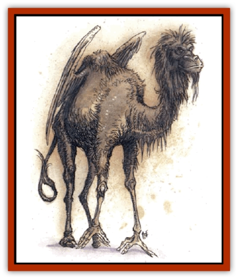

# Opinicus

| Statistic | **Opinicus** |
| --- | --- |
| **Activity Cycle:** | Any |
| **Alignment:** | Chaotic good |
| **Armor Class:** | -2 |
| **Climate/Terrain:** | Any surface ruins |
| **Damage/Attack:** | 1-3/1-3 |
| **Diet:** | Omnivore |
| **Frequency:** | Very rare |
| **Hit Dice:** | 7+7 |
| **Intelligence:** | Very to exceptional (11-16) |
| **Magic Resistance:** | 35% |
| **Morale:** | Steady (11-12) |
| **Movement:** | 21, Fl 30 (B) |
| **No. Appearing:** | 1-2 |
| **No. of Attacks:** | 2 |
| **Organization:** | Solitary |
| **Size:** | M (3' at shoulder, 12'-wingspan) |
| **Special Attacks:** | Spells, rear claws for 1d6/1d6 |
| **Special Defenses:** | Spells, gaze |
| **THAC0:** | 13 |
| **Treasure:** | A |
| **XP Value:** | 10,000 |

**Psionics Summary**

| Level | Dis/Sci/Dev | Attack/Defense | Score | PSPs |
| --- | --- | --- | --- | --- |
| 5 | 2/3/10 | All/All | per ability | 150 |

**Psychoportation -** *Sciences:* probability travel, teleport; *Devotions:* astral projection, dimensional door, dimension walk, dream travel, teleport trigger, time/space anchor.

**Psychokinesis -** *Science:* telekinesis; *Devotions:* animate object, control winds, inertial barrier, levitation.

For purposes of psionics, opinicus have a Constitution of 16.

An opinicus (the term is plural as well as singular) is a desert-dwelling creature of good will. It is an odd-looking creature, seemingly a blend of several creatures. This friendly psionic beast looks like a [[Camel|camel]] with an [[Eagle|eagle's]] wings, a monkey's face and hands, and a [[Cat_Great|lion's]] mane and tail. Its forepaws have opposable thumbs and can be used to grasp and wield objects of various sorts. Most opinicus are colored a light buff to a golden brown with slightly darker faces and wings.

Though some sages may suggest the opinicus is one of the classic "mad wizard's experiment", it is a breed unto itself, and an ancient one at that, with roots in Zakhara's Haunted Lands and Ruined Kingdoms. Most speak an older dialect of Midani, though some of them hint they have a language of their own; if so, it is never spoken around other creatures.

**Combat:** Opinicus seek to avoid combat in most cases, but are adamant opponents of evil. They attack all evil creatures and have a special hatred of undead and [[Al-Jahar|al-Jahar]], attacking any of those monsters on sight. Opinicus fight sometimes to aid a good cause.

Opinicus have very keen senses and are never surprised. They are also stealthy, and opponents suffer a -2 penalty to surprise rolls, -5 if the opinicus is in its home environment.

Despite its rather ridiculous appearance, the opinicus can be deadly in combat, flying into opponents when space permits. It attacks using its front claws for 1-3 points of damage each. If both front claws hit, or if the opinicus is flying, it also rakes with its rear claws, which cause 1d6 damage apiece.

Opinicus also have spellcasting abilities and spell-like powers. They have the spell capacity of a 7th level cleric with a Wisdom of 18, and they can also turn undead. Each can also cast *holy word* and *heal*, each spell three times per day. Though mainly for defensive purposes, some of their spells can be used offensively as well. If the DM wishes, opinicus can be considered kahins or hakimas, but seldom other kits.

Opinicus can become ethereal at will (as per *plate mail of etherealness*) and use this ability to travel away or to become insubstantial. They also have several transportation-related psionic powers.

In addition to their other powers, opinicus have a glowing sun sparkle gaze. It emanates in a cone-shape 20 feet long and 10 feet wide at the base. Once per turn (10 minutes), an opinicus can use the gaze to harm undead and creatures of the lower planes; these creatures suffer 2d8 damage, half if they roll a successful saving throw vs. spell.

Though opinicus usually save their psionic powers for traveling and playing pranks, they use them for self-defense if pressed. Inertial barrier and dimension walk are of particular use in self-defense.

**Habitat/Society:** Opinicus usually live in old ruins, such as a deserted city, palace, or temple. They are occasionally encountered elsewhere, usually on some mission for a good cause. Despite the creatures' penchant for joking and playing pranks, good creatures seldom refuse their aid. Since opinicus are so ancient (often living for centuries), and because they are found in the Haunted Lands and the Ruined Kingdoms, they are assumed to be an ancient beneficial race. Some wise folk say they were summoned from the outer planes to battle al-Jahar and [[Vargouille|vargouilles]].

**Ecology:** Opinicus have little impact on their environment, though they sometimes clean the ruins they inhabit or create works of art, usually sculpture.

---
## Discovery & Documentation

**Source Publication:** City of Delights (1993)
**Campaign Setting:** Al-Qadim (Forgotten Realms)
**Author(s):** tom Prusa, Tim Beach, Steve Kurtz

### Other Creatures Found in This Source Book
   * [[Afanc|Afanc]]
   * [[Al-Jahar|Al-Jahar]]
   * [[Bird_Talking|Bird, Talking]]
   * [[Cat_Winged|Cat, Winged]]
   * [[Crypt_Servant|Crypt Servant]]
   * [[Elemental_Vermin|Elemental Vermin]]
   * [[Genie_Tasked_Harim_Servant|Genie, Tasked, Harim Servant]]
   * [[Ogre_Zakhara|Ogre (Zakhara)]]
   * [[Parasite|Parasite]]
   * [[Pasari-Niml|Pasari-Niml]]
   * [[Sirine|Sirine]]
   * [[Tatalla|Tatalla]]
   * [[Tree_Singing|Tree, Singing]]
