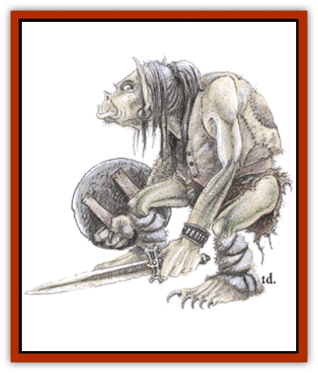

# Orc

| Statistic | **Orc** | **Orog** |
| --- | --- | --- |
| **Activity Cycle:** | Night | Night |
| **Alignment:** | Lawful evil | Lawful evil |
| **Armor Class:** | 6 (10) | 4 (10) |
| **Climate/Terrain:** | Any land | Any land |
| **Damage/Attack:** | 1-8 (weapon) | 1-10 (weapon) |
| **Diet:** | Carnivore | Carnivore |
| **Frequency:** | Common | Uncommon |
| **Hit Dice:** | 1 | 3 |
| **Intelligence:** | Average (8-10) | High (10-12) |
| **Magic Resistance:** | Nil | Nil |
| **Morale:** | Steady (11-12) | Elite (13-14) |
| **Movement:** | 9 (12) | 6 (12) |
| **No. Appearing:** | 30-300 (3d10&times;10) | 20-80 (2d4&times;10) |
| **No. of Attacks:** | 1 | 1 |
| **Organization:** | Tribe | Tribe |
| **Size:** | M (6' tall) | M (6-7') |
| **Special Attacks:** | Nil | +1 to damage |
| **Special Defenses:** | Nil | Nil |
| **THAC0:** | 19 | 17 |
| **Treasure:** | L (C,O,Q&times;10,S) | L (C,O,Q&times;10,S) |
| **XP Value:** | 15 / Subchief, leader: 35 / Guard: 35 / Chief: 65 / Bodyguard: 65 / Shaman, 1st: 35 / Shaman, 3rd: 175 / Shaman, 5th: 650 | 65 / Subchief, leader: 120 / Chief: 175 |

Orcs are a species of aggressive mammalian carnivores that band together in tribes and survive by hunting and raiding. Orcs believe that in order to survive they must expand their territory, and so they are constantly involved in wars against many enemies: humans, [[Elf|elves]], [[Dwarf|dwarves]], [[Goblin|goblins]], and other orc tribes.

Orcs vary widely in appearance, as they frequently crossbreed with other species. In general, they resemble primitive humans with grey-green skin covered with coarse hair. Orcs have a slightly stooped posture, a low jutting forehead, and a snout instead of a nose, though comparisons between this facial feature and those of pigs are exaggerated and perhaps unfair. Orcs have well-developed canine teeth for eating meat and short pointed ears that resemble those of a wolf. Orcish snouts and ears have a slightly pink tinge. Their eyes are human, with a reddish tint that sometimes makes them appear to glow red when they reflect dim light sources in near darkness. This is actually part of their optical system, a pigment which gives them infravision. Male orcs are about 5½ to 6 feet tall. Females average 6 inches shorter than males. Orcs prefer to wear colors that most humans think unpleasant: blood red, rust red, mustard yellow, yellow green, moss green, greenish purple, and blackish brown. Their armor is unattractive besides - dirty and often a bit rusty.

Orcs speak Orcish, a language derived from older human and elvish languages. There is no common standard of Orcish, so the language has many dialects which vary from tribe to tribe. Orcs have also learned to speak local common tongues, but are not comfortable with them. Some orcs have a limited vocabulary in goblin, [[Hobgoblin|hobgoblin]], and [[Ogre|ogre]] dialects.

**Combat:** Orcs are constantly in battle. They use the following weapons.

<ul><li>sword and flail 5%</li><li>sword and spear 10%</li><li>axe and spear 10%</li><li>axe and polearm 10%</li><li>axe and crossbow 10%</li><li>axe and bow 10%</li><li>sword and battleaxe 5%</li><li>spear 10%</li><li>axe 10%</li><li>polearm 20%</li></ul>Polearms are typically either halberds, pikes (set to receive charge), or glaives. Leaders typically possess two weapons. If a subchief is present, there is a 40% chance the orcs will be fighting around a standard. The presence of this standard increases attack rolls and morale by +1 for all orcs within 60 yards. Orcs typically wear studded leather armor and a shield (AC 6).

Orcs hate direct sunlight and fight at -1 penalty to their attack rolls in sunlight. Their morale decreases by 1 under these circumstances as well. Orcs employ sniping and ambush tactics in the wild. They do not obey the "rules of war" unless such is in their best interests; for example, they will shoot at those who attempt to parlay with them under a white flag unless the orc leader feels it is advantageous to hear what the enemy has to say. They abuse human rules of engagement and chivalry to their best advantage. They have a historic enmity against elves and dwarves; many tribes will kill these demihumans on sight.

It is often believed that orcs are so bloodthirsty and cruel that they are ineffective tacticians and that they would rather be vicious than victorious. Like most stereotypes, this is highly misleading; it is true for some orc tribes but not for all. Many orc tribes have waged wars for decades and have developed a frightening efficiency with battle tactics.

**Habitat/Society:** For every three orcs encountered, there will be a leader and three assistants. These orcs will have 8 hit points each, being the meanest and strongest in the group. If 150 orcs or more are encountered there will be the following additional figures with the band: a subchief and 3-18 guards, each with Armor Class 4, 11 hit points, and +1 damage due to Strength on all attacks. They fight as monsters of 2 Hit Dice (THAC0 19). For every 100 orcs encountered, there will be either a shaman (maximum 5th level priest) or a witch doctor (maximum 4th-level mage). Shamans and witch doctors gain an extra 1d4 hit points for each level above 1st and fight as a monster of 1 Hit Die for every two levels (round fractions up) of spell-casting ability (e.g., a 5th-level shaman has d8+4d4 hit points and fights as a 3 Hit Dice monster.)

If the orcs are not in their lair, there is a 20% chance they will be escorting a train of 1-6 carts and 10-60 slave bearers bringing supplies, loot, or ransom and tribute to their orc chief or a stronger orc tribe. The total value of the goods carried by all of the carts will vary between 10 and 1,000 silver pieces, and each slave bearer will bear goods valued between 5 and 30 silver pieces. If the orcs are escorting a treasure train, double the number of leaders and assistants and add 10 orcs for each cart in the train; one subchief with 5-30 guards will always be in charge.

Orc lairs are underground 75% of the time, in a wilderness village 25% of the time. Orc communities range from small forts with 100-400 orcs to mining communities with 500-2,000 orcs to huge cities (partially underground and partially above ground) with 2,000 to 20,000 orcs. There will always be additional orcs when the encounter is in a creature's lair: a chief and 5-30 bodyguards (AC 4, 13-16 hit points, attack as monsters with 3 Hit Dice (THAC0 17) and inflict an extra +2 damage on all attacks due to Strength). If the lair is underground, there is a 50% chance that 2-5 ogres per 200 orcs will be living with them. Most lairs above ground are rude villages of wooden huts protected by a ditch, log rampart and log palisade, or more advanced constructions built by other races. The village will have 1-4 watch towers and a single gate. There will be one ballista and one catapult for every 100 adult male orcs.

Orcs are aggressive. They believe other species are inferior to them and that bullying and slavery is part of the natural order. They will cooperate with other species but are not dependable: as slaves, they will rebel against all but the most powerful masters; as allies they are quick to take offense and break agreements. Orcs believe that battle is the ideal challenge, but some leaders are pragmatic enough to recognize the value of peace, which they exact at a high price. If great patience and care are used, orc tribes can be effective trading partners and military allies.

Orcs value territory above all else; battle experience, wealth, and number of offspring are other major sources of pride. Orcs are patriarchal; women are fit only to bear children and nurse them. Orcs have a reputation for cruelty that is deserved, but humans are just as capable of evil as orcs. Orcs have marriage customs, but orc males are not noted for their faithfulness.

Orcs worship many deities (some who have different names among different tribes); the chief deity is usually a giant, one-eyed orc. Orcish religion is extremely hateful toward other species and urges violence and warfare. Orc shamans have been noted for their ambition, and many tribes have suffered because of political infighting between warriors and priests.

**Ecology:** Orcs have an average lifespan of 40 years. They have a gestation period of 10 months and produce two to three offspring per birth. Infant mortality is high. Orcs are carnivores, but prefer game meats or livestock to demihumans and humanoids.

It is said that orcs have no natural enemies, but they work hard to make up for this lack. Orc tribes have fearsome names such as Vile Rune, Bloody Head, Broken Bone, Evil Eye, and Dripping Blade.

Orcs are skilled miners who can spot new and unusual constructions 35% of the time and sloping passages 25% of the time. They are also excellent weaponsmiths.

**Orog**

  Elite orcs, or orogs, are a race of great orcs, possibly mixed with ogre blood. Orogs range between 6 and 6½ feet tall. They are highly disciplined warriors and have their own standards and banners which they display prominently - it is usually easy to tell when orogs are present among common orcs. Orogs can be found at the vanguard of large orc armies, but rarely on patrol. There is a 10% chance that an orc tribe will have orogs, whose number equals 10% of the male population. (Thus a community of 3,000 male orcs has a 10% chance of having 300 additional orogs.) Small bands of elites (20-80 orogs) will hire themselves out as mercenaries. Orogs have 3 Hit Dice, plate mail (AC 3), and have a +3 Strength bonus on damage dice. For every 20 orogs, there will also be one leader with 4 Hit Dice (THAC0 17). There is but one orog chief, who has 5 Hit Dice (THAC0 15). Orogs use weaponry common to orcs, but will typically possess two weapons apiece.

**Half-Orc**

  Orcs will crossbreed with virtually every humanoid and demihuman species except elves, with whom they cannot. The mongrel offspring of orcs and these other species are known as half-orcs. Orc-goblins, orc-hobgoblins, and orc-humans are the most common. Half-orcs tend to favor the orcish strain heavily, and as such are basically orcs, although 10% of these offspring can pass as ugly humans. They are treated as humans with levels instead of Hit Dice. If multi-classed, they have these maximums: priest, 4th level; fighter, 10th level; thief, 8th level.

If half-orcs remain single-classed, these maximums increase to: priest, 7th level (Wisdom 15 required for 5th, Wisdom 16 for 6th, Wisdom 17 for 7th); fighter, 17th level (Strength 18/00 required for 11th, Strength 19 for 12th, Strength 20 for 14th, and Strength 21 for 17th); thief, 11th level (Dexterity 15 required for 9th, Dexterity 16 for 10th, and Dexterity 17 for 11th).

Half-orcs are distrusted by both human and orc cultures because they remind each of the other's racial stock. Half-orcs advance in orc culture by flaunting their superior ability and in human culture by associating with people who don't care about appearance. Most tend toward neutrality with slight lawful and evil tendencies, but lawful good half-orcs are not unknown. Some half-orcs have split from both cultures to form their own societies in remote areas. These half-orcs worship their own gods and (like most hermits) are extremely suspicious of strangers.

---
## Discovery & Documentation

**Source Publication:** MC1 Volume I (w/binder #1) (1991)
**Campaign Setting:** Advanced Dungeons & Dragons 2nd Edition
**Author(s):** Jay Batista, Scott Bennie, Grant Boucher, William W. Connors, Steve Gilbert, Heike Kubasch, James Lowder, David Edward Martin, Bruce Nesmith, Jean Rabe, Rick Swan, John J. Terra, Gary L. Thomas

### Other Creatures Found in This Source Book
   * [[Bat|Bat]]
   * [[Bear|Bear]]
   * [[Behir|Behir]]
   * [[Boar|Boar]]
   * [[Bookworm|Bookworm]]
   * [[Brownie|Brownie]]
   * [[Bugbear|Bugbear]]
   * [[Carrion_Crawler|Carrion Crawler]]
   * [[Cat_Great|Cat, Great]]
   * [[Catoblepas|Catoblepas]]
   * [[Dragon_General_Information|Dragon, General Information]]
   * [[Dragonfish|Dragonfish]]
   * [[Elemental_Air_Kin_Aerial_Servant|Elemental, Air Kin, Aerial Servant]]
   * [[Elemental_Earth_Kin_Sandling|Elemental, Earth Kin, Sandling]]
   * [[Elephant|Elephant]]
   * [[Gnoll|Gnoll]]
   * [[Hobgoblin|Hobgoblin]]
   * [[Homunculus|Homunculus]]
   * [[Hornet_Giant|Hornet, Giant]]
   * [[Horse|Horse]]
   * [[Hyena|Hyena]]
   * [[Jackal|Jackal]]
   * [[Jackalwere|Jackalwere]]
   * [[Korred|Korred]]
   * [[Lich|Lich]]
   * [[Lizard|Lizard]]
   * [[Lizard_Man|Lizard Man]]
   * [[Lycanthrope_General_Information|Lycanthrope, General Information]]
   * [[Lycanthrope_Seawolf|Lycanthrope, Seawolf]]
   * [[Lycanthrope_Werebear|Lycanthrope, Werebear]]
   * [[Lycanthrope_Weretiger|Lycanthrope, Weretiger]]
   * [[Lycanthrope_Werewolf|Lycanthrope, Werewolf]]
   * [[Manticore|Manticore]]
   * [[Medusa|Medusa]]
   * [[Mind_Flayer|Mind Flayer]]
   * [[Minotaur|Minotaur]]
   * [[Mudman|Mudman]]
   * [[Mummy|Mummy]]
   * [[Nixie|Nixie]]
   * [[Nymph|Nymph]]
   * [[Ogre|Ogre]]
   * [[Ooze_Slime_Jelly_I|Ooze/Slime/Jelly I]]
   * [[Ooze_Slime_Jelly_II|Ooze/Slime/Jelly II]]
   * [[Owl|Owl]]
   * [[Owlbear_I|Owlbear I]]
   * [[Pegasus|Pegasus]]
   * [[Piercer|Piercer]]
   * [[Pudding_Deadly|Pudding, Deadly]]
   * [[Rakshasa|Rakshasa]]
   * [[Rat|Rat]]
   * [[Ray|Ray]]
   * [[Remorhaz|Remorhaz]]
   * [[Satyr|Satyr]]
   * [[Scorpion|Scorpion]]
   * [[Selkie|Selkie]]
   * [[Shadow|Shadow]]
   * [[Skeleton|Skeleton]]
   * [[Skunk|Skunk]]
   * [[Snake|Snake]]
   * [[Spectre|Spectre]]
   * [[Spider|Spider]]
   * [[Sprite|Sprite]]
   * [[Toad_Giant|Toad, Giant]]
   * [[Treant|Treant]]
   * [[Troll|Troll]]
   * [[Umber_Hulk|Umber Hulk]]
   * [[Unicorn|Unicorn]]
   * [[Vampire|Vampire]]
   * [[Wight|Wight]]
   * [[Will_O'Wisp|Will O'Wisp]]
   * [[Wolf|Wolf]]
   * [[Wolfwere|Wolfwere]]
   * [[Wraith|Wraith]]
   * [[Wyvern|Wyvern]]
   * [[Yeti|Yeti]]
   * [[Yuan-ti|Yuan-ti]]
   * [[Zombie|Zombie]]
