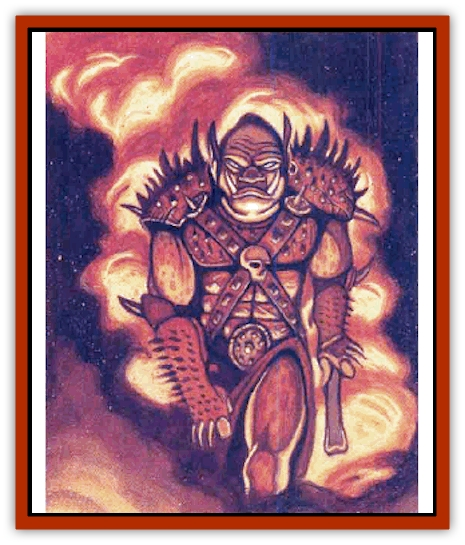

# Orc - Neo-Orog

| Statistic | **Black** | **Red** |
| --- | --- | --- |
| **Activity Cycle:** | Any | Any |
| **Alignment:** | Lawful evil | Lawful evil |
| **Armor Class:** | 5 (10) | 3 (6) |
| **Climate/Terrain:** | Any | Any |
| **Damage/Attack:** | By weapon | By weapon |
| **Diet:** | Carnivore | Carnivore |
| **Frequency:** | Uncommon | Uncommon |
| **Hit Dice:** | 4 | 5 |
| **Intelligence:** | Average (10) | Average (10) |
| **Magic Resistance:** | Nil | Nil |
| **Morale:** | Elite (13-14) | Champion (15-16) |
| **Movement:** | 8 (14) | 6 (12) |
| **No. Appearing:** | 10-100 | 10-100 |
| **No. of Attacks:** | 1 | 1 |
| **Organization:** | Tribal | Tribal |
| **Size:** | M (6-7' tall) | M (6' tall) |
| **Special Attacks:** | Nil | War cry |
| **Special Defenses:** | Camouflage | Nil |
| **THAC0:** | 17 | 15 |
| **Treasure:** | L (C,O,Q&times;10,S) | L (C,O,Q&times;10,S) |
| **XP Value:** | 175 / Sergeant: 270 / Officer: 420 / General: 650 | 270 / Sergeant: 420 / Officer: 650 / General: 975 |

The neo-orog is a magical hybrid of ordinary [[Orc|orcs]], [[Ogre|ogres]], and other creatures. The two breeds of neo-orog, red and black, are warrior creatures, loyal and skillful. who live for battle. Tall and muscular, with large hooded eyes, tough leathery skin, and snouted bestial faces, nec-orogs seem to embody all the worse aspects of the creatures that went into their creation.

Red Neo-Orog are bred as elite troops. Their skin is a dark  mottled red, and their eyes are deep yellow. They are usually well equipped and revel in bloodshed and violence. They speak both orc and the common tongue.

**Combat:** In battle, red nec-orogs can scream their unique war cy, which causes all orcs, [[Orc|orogs]], and neo-orogs within earshot to fight at +1 on attack and damage rolls for 2d4 rounds. The effect is not cumulative, and individual neo-orogs cannot be affected by it more than once a day. Red neo-orogs receive an additional +1 on attack rolls when defending the Red Wizards of Thay.

Red neo-orogs fight with the following weapons:

<ul><li>Broad sword 20%</li><li>War hammer 10%</li><li>Battle axe 20%</li><li>Mace and dagger 10%</li><li>Spear and shield 20%</li><li>Crossbow and sword 10%</li><li>Hand axe 10%</li></ul>**Habitat/Society:** All neo-orogs live in barracks built by the Red Wizards. No independent groups of them exist. They are organized into large military units. For every 10 neo-orogs in a group, there is one sergeant with maximum hit points. For every 20, there is one officer with 6 HD (THACO 15) and a +1 on all damage rolls. Each barracks is commanded by a neo-orog general with 7 HD (THACO 13), +2 on all damage rolls, and having AC 2 (5).

**Ecology:** For many lades Thayans have tried to create their own race of orcs, violent but loyal to Thay. Their only weakness is their slow rate of reproduction - the Thayans have managed to field only a few companies of them. As a group, neo-orogs have only a marginal reproduction rate. Many are infertile.

**Black Neo-Orog**

  The black breed of neo-omgs are similar to the red neo-orogs in many respects, but are bred to act as scouts, archers, and infiltrators. They are leaner, slightly taller than reds, and skin ranges from dark green to deep, sooty black. Their facial features are slightly less bestial and their eyes are smaller and completely black.

Camouflage masters, black neo-orogs hide so effectively that even observers who know what they are looking for have only a 20% chance of detecting them. Normally alert observers have a 10% chance, while casual observation yields only a 5% chance. The camouflage is negated if the creature moves or attacks. A number of black neo-orogs have thief skills in addition to their warrior skills. They do not have the war cry of red neo-orogs, but can be affected by the war cry of a red orog.

Black neo-orog fight with the following weapons;

#l Broad sword/short how 20%|Spear/dagger 20%|Broad sword/crossbow 10%|Short sword/short bow 15%|Broad sword/longbow 15%|Short sword/spear 20%

In all other ways, black neo-orogs are like red neo-orogs.

---
## Discovery & Documentation

**Source Publication:** Monstrous Compendium, 1996 Annual, Volume 3 (1995)
**Campaign Setting:** Advanced Dungeons & Dragons 2nd Edition
**Author(s):** Jon Pickens

### Other Creatures Found in This Source Book
   * [[Alaghi|Alaghi]]
   * [[Alhoon|Alhoon]]
   * [[Aranea_Savage_Coast|Aranea (Savage Coast)]]
   * [[Arcane_Head|Arcane Head]]
   * [[Banedead|Banedead]]
   * [[Banelich|Banelich]]
   * [[Bat_Bonebat|Bat, Bonebat]]
   * [[Beetle|Beetle]]
   * [[Belgoi|Belgoi]]
   * [[Bladeling|Bladeling]]
   * [[Braxat|Braxat]]
   * [[Bunyip|Bunyip]]
   * [[Burbur|Burbur]]
   * [[Bvanen|Bvanen]]
   * [[Cat_Great_Snow_Tiger|Cat, Great, Snow Tiger]]
   * [[Chosen_One|Chosen One]]
   * [[Chronovoid|Chronovoid]]
   * [[Cildabrin|Cildabrin]]
   * [[Coffer_Corpse|Coffer Corpse]]
   * [[Disenchanter|Disenchanter]]
   * [[Dog_Temporal|Dog, Temporal]]
   * [[Dragon_Cerilia|Dragon (Cerilia)]]
   * [[Dragon_Ghost|Dragon, Ghost]]
   * [[Dragon_Lesser_Undead|Dragon, Lesser Undead]]
   * [[Dragon_Neutral_Amber|Dragon, Neutral, Amber]]
   * [[Dread_Warrior|Dread Warrior]]
   * [[Dreamweaver|Dreamweaver]]
   * [[Dream_Spawn_Greater_Ennui|Dream Spawn, Greater, Ennui]]
   * [[Dream_Spawn_Lesser_Morph|Dream Spawn, Lesser, Morph]]
   * [[Dwarf_Arctic|Dwarf, Arctic]]
   * [[Dwarf_Urdunnir|Dwarf, Urdunnir]]
   * [[Eel_Giant_Moray|Eel, Giant Moray]]
   * [[Elemental_Fire_Kin_Tome_Guardian|Elemental, Fire Kin, Tome Guardian]]
   * [[Elf_Rockseer|Elf, Rockseer]]
   * [[Ethyk|Ethyk]]
   * [[Faerie_Faerie_Fiddler|Faerie, Faerie Fiddler]]
   * [[Faerie_Petty_Bramble|Faerie, Petty, Bramble]]
   * [[Faerie_Petty_Gorse|Faerie, Petty, Gorse]]
   * [[Faerie_Petty|Faerie, Petty]]
   * [[Firenewt|Firenewt]]
   * [[Formian|Formian]]
   * [[Gargoyle_II|Gargoyle II]]
   * [[Giant_Cerilia|Giant (Cerilia)]]
   * [[Goblin_Cerilia|Goblin (Cerilia)]]
   * [[Golem_Magic|Golem, Magic]]
   * [[Golem_Shaboath|Golem, Shaboath]]
   * [[Hag_Bheur|Hag, Bheur]]
   * [[Hamadryad|Hamadryad]]
   * [[Hound_of_Ill-Omen|Hound of Ill-Omen]]
   * [[Human_Cerilia|Human (Cerilia)]]
   * [[Hybsil|Hybsil]]
   * [[Ibrandlin|Ibrandlin]]
   * [[Imp_Chaos|Imp, Chaos]]
   * [[Ixitxachitl_Ixzan|Ixitxachitl, Ixzan]]
   * [[Jabberwock|Jabberwock]]
   * [[Kyton|Kyton]]
   * [[Kyuss_Son_of|Kyuss, Son of]]
   * [[Lillend|Lillend]]
   * [[Life-Shaped_Creation_Guardian|Life-Shaped Creation, Guardian]]
   * [[Life-Shaped_Creation_Transport|Life-Shaped Creation, Transport]]
   * [[Lycanthrope_Werecrocodile|Lycanthrope, Werecrocodile]]
   * [[Lycanthrope_Werespider|Lycanthrope, Werespider]]
   * [[Magedoom|Magedoom]]
   * [[Manotaur|Manotaur]]
   * [[Mastiff_Shadow|Mastiff, Shadow]]
   * [[Meazel|Meazel]]
   * [[Mist_Scarlet_Dancer|Mist, Scarlet Dancer]]
   * [[Needleman|Needleman]]
   * [[Orc_Ondonti|Orc, Ondonti]]
   * [[Owlbear_II|Owlbear II]]
   * [[Pegataur|Pegataur]]
   * [[Phaerimm|Phaerimm]]
   * [[Reggelid|Reggelid]]
   * [[Render|Render]]
   * [[Saurial|Saurial]]
   * [[Scalamagdrion|Scalamagdrion]]
   * [[Sharn|Sharn]]
   * [[Snake_Messenger|Snake, Messenger]]
   * [[Spirit_Forest_Uthraki|Spirit, Forest, Uthraki]]
   * [[Spirit_Forest_Wood_Man|Spirit, Forest, Wood Man]]
   * [[Spirit_Ice_Orglash|Spirit, Ice, Orglash]]
   * [[Spirit_Rock_Thomil|Spirit, Rock, Thomil]]
   * [[Strider_Giant|Strider, Giant]]
   * [[Tembo|Tembo]]
   * [[Temporal_Glider|Temporal Glider]]
   * [[Temporal_Stalker|Temporal Stalker]]
   * [[Tether_Beast|Tether Beast]]
   * [[Thessalmonster|Thessalmonster]]
   * [[Time_Dimensional|Time Dimensional]]
   * [[Tomb_Tapper|Tomb Tapper]]
   * [[Undead_Dragon_Slayer|Undead Dragon Slayer]]
   * [[Unicorn_Black_Toril|Unicorn, Black (Toril)]]
   * [[Vaath|Vaath]]
   * [[Vortex_Spider|Vortex Spider]]
   * [[Weredragon|Weredragon]]
   * [[Zhentarim_Spirit|Zhentarim Spirit]]
