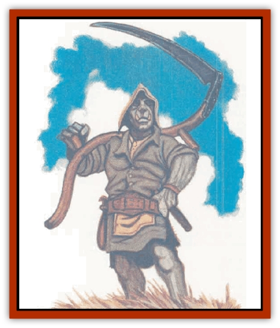

# Orc - Ondonti

| Statistic | **Orc, Ondonti** |
| --- | --- |
| **Activity Cycle:** | Any |
| **Alignment:** | Lawful good |
| **Armor Class:** | 10 (6 with barkskin) |
| **Climate/Terrain:** | Any land |
| **Damage/Attack:** | By weapon |
| **Diet:** | Omnivore |
| **Frequency:** | Rare |
| **Hit Dice:** | 1 (clerics to 7th level) |
| **Intelligence:** | Average (8-10) |
| **Magic Resistance:** | Nil |
| **Morale:** | Average (8-10) |
| **Movement:** | 12 |
| **No. Appearing:** | 10-60 |
| **No. of Attacks:** | 1 (see below) |
| **Organization:** | Tribe |
| **Size:** | M (6' tall) |
| **Special Attacks:** | Nil |
| **Special Defenses:** | <i>Sanctuary</i>, <i>barkskin</i>, <i>tree</i>, immune to <i>charm</i>, + 1 save vs. poison (priest spells) |
| **THAC0:** | 19 |
| **Treasure:** | Nil |
| **XP Value:** | 120 / Cleric, 1st: 175 / Cleric, 2nd: 270 / Cleric, 3rd: 420 / Cleric, 4th: 650 / Cleric, 5th: 975 / Cleric, 6th: 1,400 / Cleric, 7th: 2,000 |

North of The Ride, in a secluded part of the Tortured Lands, dwells a race known as the ondonti, a close cousin of the [[Orc|orc]]. This race lives as peaceful farmers and gatherers, taking only what they need from the land to survive. In outward appearances, ondontis resemble orcs.

Scattered tribes of ondontis lived peaceful lives until a scouting party from Zhentil Keep stumbled across them in 1340 DR. Because ondontis live by a peaceful and collaborative philosophy, they were not prepared for treachery, and shortly after the initial meeting between Zhents and ondontis, the majority of the ondonti population, with the exception of one isolated tribe, was betrayed by the Zhents and kidnapped into slavery. Very few ondontis have since then escaped further raids. The greedy lords of Zhentil Keep view ondontis as superior slaves because their strength and nonviolent attitude make them superbly suited to lightly supervised manual labor.

**Combat:** Traditional ondonti culture is peaceful and contemplative. Most would sooner die than take another sentient creature.s life, and they kill other creatures only as needed for food (or if the creatures are deemed insane or incurably diseased). However, the Zhentarim have brought up several young ondontis in an orcish environment, training them to be skilled killers (alignment LN to LE). These ondontis are still not as violent or abusive as orcs, but a few generations of violently indoctrinated ondontis could bring into being a deadly race of humanoids under the influence of the Zhentarim.

All ondontis can use the following spell-like abilities: *sanctuary* (on themselves) three times a day, *barkskin* once a day, *purify food &amp; drink* three times a day, and *tree* once a week. Ondontis also gain a +1 bonus to their saving throws vs. poison and are immune to *charm*-type spells and spell-like abilities.

Adult ondontis (male and female) have Strength scores ranging from 17 to 19 and Constitution scores from 16 to 18. Ondontis trained by the Zhentilar usually fight with either a bastard or two-handed sword, and can easily fight with either weapon and a shield. They dislike metal armor and don leather or studded leather when not using their natural barkskin ability. Since the first group of ondonti warriors is still learning its craft, it is uncertain how far they will progress as fighters.

Especially wise ondontis can become clerics of up to 7th level. Spells memorized by ondonti clerics are almost always curative and defensive in nature, as harmful spells are taboo. Priest ondontis have a minimum Wisdom of 16.

**Habitat/Society:** Ondontis revere Eldath, the Goddess of Peace and Quiet Places, and their culture attempts to embody the pacifist teachings of Eldath. Ondonti oral history recounts that "the Founders" brought 30 young ondontis to the lands they still consider theirs long ago, and laid down the teachings that provide the foundations of ondonti society in a cycle of tales called Tarek-Passar (the Way of Peace). One sage has theorized that the original ondontis were in fact infant orc orphans, brought from their lands and taught by a reclusive group of priests of Eldath.

Ondontis are nearly the opposite of orcs: peaceful, kind, and dependable. To the ondontis, peace, harmony with one's environment, and a full family life are what is important in life. Ondonti priests are revered and their guidance is followed because of their majestic wisdom and close relationship to Eldath.

Fourteen of the 15 ondonti tribes have been captured by raiding Zhentilar and taken to the Citadel of the Raven for use as slave labor and as breeding stock for an army of superior humanoids. The remaining ondonti tribe lives in extreme seclusion, employing the spells of several ondonti clerics to hide its members from further enslavement. It is rumored that a extraplanar servant sent by Eldath herself guards over her remaining children, while another seeks to free those who have been wrongly seized from their homeland.

**Ecology:** Ondontis reproduce at the same rate as orcs, but have attained a longer lifespan than orcs (60 years) as a result of internal cultural harmony and applied curative priestly magic. The mortality rate of infant ondontis is nearly nonexistent, due to close monitoring of pregnant ondontis and infants by the priesthood.

---
## Discovery & Documentation

**Source Publication:** Ruins of Zhentil Keep (1995)
**Campaign Setting:** Forgotten Realms
**Author(s):** John Terra and Kevin Melka

### Other Creatures Found in This Source Book
   * [[Banedead|Banedead]]
   * [[Banelich|Banelich]]
   * [[Burnbones|Burnbones]]
   * [[Elemental_Nature|Elemental, Nature]]
   * [[Gargoyle_Guardgoyle|Gargoyle, Guardgoyle]]
   * [[Golem_Magic|Golem, Magic]]
   * [[Golem_Vault_Guardian|Golem, Vault Guardian]]
   * [[Hybsil|Hybsil]]
   * [[Magedoom|Magedoom]]
   * [[Mist_Scarlet_Dancer|Mist, Scarlet Dancer]]
   * [[Rat_Zhentish_Sewer|Rat, Zhentish Sewer]]
   * [[Render|Render]]
   * [[Sacaanti|Sacaanti]]
   * [[Snake_Messenger|Snake, Messenger]]
   * [[Zhentarim_Spirit|Zhentarim Spirit]]
