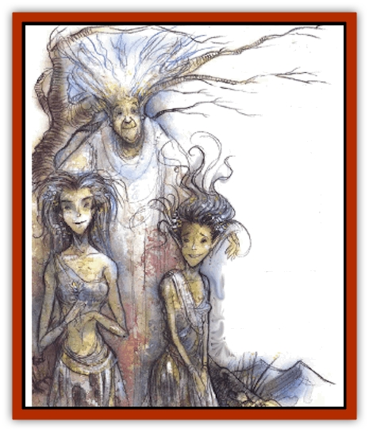

# Oread

| Statistic | **Oread** |
| --- | --- |
| **Activity Cycle:** | Day |
| **Alignment:** | Chaotic good (neutral) |
| **Armor Class:** | 4 |
| **Climate/Terrain:** | Arborea, Beastlands, Ysgard |
| **Damage/Attack:** | 1d6 (club) |
| **Diet:** | Petrivore |
| **Frequency:** | Rare |
| **Hit Dice:** | 3 |
| **Intelligence:** | High (13-14) |
| **Magic Resistance:** | 60% |
| **Morale:** | Steady (12) |
| **Movement:** | 6, Br 24 |
| **No. Appearing:** | 1d4 |
| **No. of Attacks:** | 1 |
| **Organization:** | Solitary |
| **Size:** | M (6' tall) |
| **Special Attacks:** | Charm, spells |
| **Special Defenses:** | Spells, meld into stone |
| **THAC0:** | 17 |
| **Treasure:** | Q&times;100,U |
| **XP Value:** | 420 / Snowhair: 10,000 |

Oreads are to mountains what [[Dryad|dryads]] are to oak forests: They are guardian spirits, protectors, and shepherds. Oreads are lithe, stony women with skin the color of the rock of the mountain they protect. Some Oreads are soft and round and tawny like limestone or sandstone; others are grainy red, white, and black like granite; or sharp, angular, and brittle like dark gray gneiss. Their eyes are always the color or clear gemstones and their hair resembles lichen: pale gray, whitish green, or a dark yellow-brown. In winter, their hair and their shoulders always turn white, like the snow-capped peaks. Like dryads, all Oreads are female.

Oreads always wear loose gowns in black, gray, or gold. They are very fond of ornaments, such as ribbons resembling white, plunging waterfalls, crowns of gold and jewels, and glowing shawls that somehow bend light into rainbows.

Oreads speak a dialect of the language of dryads, and the two races can make themselves understood to each other, though only with some difficulty. In addition to their own language, oreads also speak the language of [[Satyr|satyrs]], [[Korred|korreds]], [[Galeb_Duhr|galeb duhr]], [[Giant_Stone|stone giants]], [[Giant_Mountain|mountain giants]], and [[Dwarf|dwarves]].

**Combat:** Oreads dislike combat but are hellions when miners, woodcutters, quarrymen, or builders threaten their territory. Oreads can club their enemies with their hard fists for 1d6 points of damage, or they can use their powerful spells.

Each oread can sing the *song of stone* once per day. The song sounds like a fast mountain brook, like the rushing wind in trees, like the clatter of stones in a rockslide. This magical form of attack charms all those who hear it unless they make a saving throw versus spell at -3. Those who fail must serve the oread for one year, and no *dispel magic* or *remove curse* can break this charm. Part of the enchantment causes the oread's servant to be so devoted to her that he'll willingly lay down his life for hts mistress. A *limited wish* or *holy word* is required to break the hold of an oread over her servant. Most oreads keep only a single servant at a time, and if appealed to, they sometimes ransom their servants back to their families before their time of service is done.

An oread can cast each or the following spells once per day as a 9th-level caster: *stone shape*, *stoneskin*, and *stone tell*. An oread can *dimension door* anywhere on her mountain three times per day, and can *meld into stone* at will. Once melded within the stone, they can either return to the surface when the spell's effect expires, or they can burrow rapidly through solid stone to reappear elsewhere. "Burrowing" is actually an inaccurate term when applied to oreads: they are at one with the stone that they travel through as other races might travel through water, leaving no trace of a tunnel or disturbance behind them.

Oreads prefer to ambush the enemies of the mountains when they can. Their assaults take place on footpaths that their victim travels often. The oreads all *meld into stone* before the taget arrives, and then leap out as he passes by. In these situations, they gain surprise on a roll of 1-7 on 1d10.

Oreads sometimes befriend snow leopards, mountain lions, and mountain goats. These animals aren't their slaves or servants, but come and go as they please. Oreads have little other company, so they defend their pets fiercely, sometimes to the death.

**Habitat/Society:** Oreads are tied to a single mountain peak. They can travel anywhere on their mountain, from the valley to the heights, but they may never go more than 500 yards from the foot of their mountain. Unlike dryads, they are not vulnerable to the death of their mountain - after all, a mountain cannot die - but they are pained by mining, deforestation, and magical erosion.

Although oreads are solitary, up to four have been encountered in one place. These meetings are usually in mountain valleys surrounded by many peaks, and the oreads are usually related. Arboreans say this is why mountains that stand near one another are sometimes called sisters.

The mountain spirits dwell alone for most of their lives, though once a century they may raise a daughter. Like dryads, the children of oreads are born of satyr or korred fathers, though the fathers have nothing to do with (and no interest in) raising their young. The young oreads resemble korred until they reach puberty at age 19, when they begin to lose their wild hair and mountain-goat hooves. Any male young are satyrs, who quickly grow to maturity and then strike out on their own.

**Ecology:** Oreads devour certain minerals - especially clear gemstones such as quartz, topaz, emeralds, sapphires, and diamonds - and they gladly accept such gifts from visitors and admirers. They are quite brash about their desires and are not ashamed to bluntly ask for gems that they admire. They enjoy metal jewelry but don't eat metals of any kind. Oreads are on good terms with dryads, korred, satyrs, galeb duhr, and most faerie creatures. They are the sworn enemies of dwarves, [[Gnome|gnomes]], [[Goblin|goblins]], [[Elemental_Earth_Kin|pech]], [[Xorn|xorn]], and other mining races. They are rivals of [[Elemental_Air_Kin|sylphs]], who often tease and harass the earthbound oreads.

**Snowhair**

  The snowhair are the legendary oreads who have broken the bonds of their ties to a particular mountain and become the guardians of entire mountain ranges. They are the eldest oreads, the keepers of wisdom and the legacy of the entire race, and their age is reflected in their snow-white hair, thir craggy features, and their slumped bodies, like mountains worn into foothills with the passage of time.

Snowhair are much stronger than their younger sisters; they have 12 Hit Dice, can cast *earthquake* once per week, and may cast *animate rock*, *dig*, *Maximillian's earthen grasp*, and *part stone* (an earthen version of *part water*) at will. If they are severely threatened or angered, they can petrify opponents with a touch. Most snowhair oreads resort to this only against miners, quarrymen, and the like who ignore their warnings and continue to mine. The victim is entitled to a saving throw, and if it succeeds he can never be petrified by that particular snowhair oread. If it fails, he ist transformed into a boulder of about the same size. Because their form is altered, victims can only be restored through a combination of *stone shape* and *stone to flesh*.

The snowhair are responsible for takinh oread daughters from their mothers to the mountains that the young will be bonded to when they mature, so the snowhair are often seen by the oreads as bringers of sorrow. However, they are also the defenders of the mountains. When a planar shift threatens to slip a mountain over a boundary from one plane to the next, the snowhair oreads are the ones who make the final efforts to keep the land in the plane it belogs to.

All snowhair oreads are peaceful, smiling, and talkative, full of the tranquil strength that comes with age. Some are even proxies of the powers. A group of seven ancient snowhair oreads is said to be the guardian nature spirits of Mount Olympus.

---
## Discovery & Documentation

**Source Publication:** Planes of Chaos (1994)
**Campaign Setting:** Planescape
**Author(s):** Wolfgang Baur, L. W. Smith

### Other Creatures Found in This Source Book
   * [[Asrai|Asrai]]
   * [[Astral_Dreadnought|Astral Dreadnought]]
   * [[Bacchae|Bacchae]]
   * [[Chaos_Beast|Chaos Beast]]
   * [[Fensir|Fensir]]
   * [[Abyssal_Lord|Abyssal Lord]]
   * [[Howler|Howler]]
   * [[Imp_Chaos|Imp, Chaos]]
   * [[Lillend|Lillend]]
   * [[Murska|Murska]]
   * [[Ratatosk|Ratatosk]]
   * [[Tanar'ri_Greater_Goristro|Tanar'ri, Greater, Goristro]]
   * [[Tanar'ri_Lesser_Armanite|Tanar'ri, Lesser, Armanite]]
   * [[Varrangoin|Varrangoin]]
   * [[Viper_Tree|Viper Tree]]
