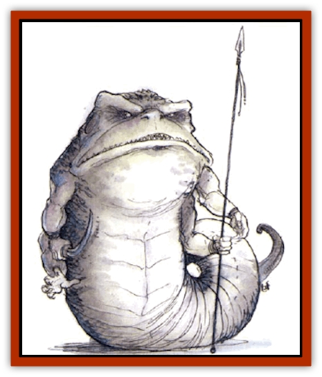

# Ormyrr

| Statistic | **Ormyrr** |
| --- | --- |
| **Activity Cycle:** | Any |
| **Alignment:** | Lawful neutral |
| **Armor Class:** | 5 |
| **Climate/Terrain:** | Any nonarctic, nondry land |
| **Damage/Attack:** | 1d4+1 (&times;4) or by weapon/2d4 |
| **Diet:** | Omnivore |
| **Frequency:** | Very rare |
| **Hit Dice:** | 7+7 |
| **Intelligence:** | Very (11-12) |
| **Magic Resistance:** | Nil |
| **Morale:** | Elite (13-14) |
| **Movement:** | 11, Sw 15 |
| **No. Appearing:** | 1d12 |
| **No. of Attacks:** | 5 |
| **Organization:** | Tribe |
| **Size:** | H (up to 25' long, 10' tall) |
| **Special Attacks:** | Hurl rocks, constriction |
| **Special Defenses:** | Nil |
| **THAC0:** | 13 |
| **Treasure:** | R,V (Z) |
| **XP Value:** | 975 |

Some sages believe these seldom-glimpsed creatures are natives of another plane. An ormyrr is pale-mushroom white to dun in color, with a purplish underbelly. It looks like a giant upright worm with two pairs of arms projecting from a powerful torso, topped by a fang-mouthed, froglike head. Ormyrr give an overall impression of great strength and can wield weapons with all four arms without getting tangled up in their own attacks. They are always eager to seize weapons when they can, and if found bearing magical items, it is 80% likely that these will be weapons that the ormyrr will use.

**Combat:** Ormyrr fight with their long-taloned hands or use them to hurl missiles, including large stones, which they hurl up to 40 feet, smashing foes for 2d6 damage each. They also wield weapons (typically waving pairs of axes or swords). Note that an ormyrr's hand can swing a two-handed weapon without penalty. Ormyrr also bite with fearsome force, inflicting 2d4 points of damage upon a successful hit.

In any round in which an ormyrr strikes the same foe twice, the victim must make Strength and Dexterity checks. If both fail, the ormyrr automatically rolls over that opponent and will constrict on the following round. The squeezed victim suffers 2d6 damage per round, and thereafter attacks with a -1 penalty and suffers a -2 penalty to damage rolls. A Strength check is allowed each round to break free.

If they can get them, ormyrr like slings, weighted nets, military forks, or tridents, but they cast these aside to attack foes with four blades at once when close. They dislike spellcasters and will seek to disable opponents who obviously have magic first. Some ormyrr wear necklaces of the linked skulls of creatures they've slain - the braincases are often used to store sling stones and other small weapons or items (such as caltrops or darts).

**Habitat/Society:** Ormyrr are amphibious and hibernate in mud at the bottom of deep lakes or go out to sea in the cold months. They den at the bottom of small lakes throughout the North, but prefer to hunt on land, roaming far afield (up to 40 miles) from their lairs.

Ormyrr live and hunt in tribal bands that keep to themselves and do not make war on other tribes. The sex and tribal affiliation of an ormyrr are immediately obvious to another ormyrr (probably by scent) but all ormyrr look identical to human eyes.

Ormyrr are fascinated by magic and are working hard to develop magic of their own - something they seem to have no aptitude for at all. One of the great dreams of ormyrr is to attain the power to fly, either by growing wings, by breeding wings into the race (mating attempts with [[Wyvern|wyverns]] and other creatures have been a series of disasters), or by seizing and duplicating enough magical items that give the power of flight so that every ormyrr can have one.

When useful magic is to be had, the normally placid ormyrr become avaricious and crafty in the extreme. Ormyrr have even been observed to worship human deities of magic, although they have gods of their own (depicted as giant, winged ormyrr with boulders held in their outstretched hands).

**Ecology:** Ormyrr are great enemies of [[Yuan-ti|yuan-ti]] and [[Harpy|harpies]], both of whom they attack on sight. Ormyrr live on a varied diet of plants, birds, reptiles, and mammals, but usually avoid attacking beings of intelligent races. They seem immune to many poisons (+4 to all poison and venom saving throws). Several alchemists and sages are interested in studying ormyrr, but no uses have yet been found for ormyrr body parts or substances.

---
## Discovery & Documentation

**Source Publication:** Monstrous Compendium, 1994 Annual, Volume 1 (1995)
**Campaign Setting:** Advanced Dungeons & Dragons 2nd Edition
**Author(s):** David Wise

### Other Creatures Found in This Source Book
   * [[Abyss_Ant|Abyss Ant]]
   * [[Achaierai|Achaierai]]
   * [[Afanc|Afanc]]
   * [[Al-Jahar|Al-Jahar]]
   * [[Baelnorn|Baelnorn]]
   * [[Baneguard|Baneguard]]
   * [[Banelar|Banelar]]
   * [[Bird_Talking|Bird, Talking]]
   * [[Blazing_Bones|Blazing Bones]]
   * [[Campestri|Campestri]]
   * [[Caniquine|Caniquine]]
   * [[Cat_Winged|Cat, Winged]]
   * [[Crypt_Servant|Crypt Servant]]
   * [[Death's_Head_Tree|Death's Head Tree]]
   * [[Dog_Saluqi|Dog, Saluqi]]
   * [[Dragon_Electrum|Dragon, Electrum]]
   * [[Dragon_Fang|Dragon, Fang]]
   * [[Dragon_Linnorm_Corpse_Tearer|Dragon, Linnorm, Corpse Tearer]]
   * [[Dragon_Linnorm_Dread|Dragon, Linnorm, Dread]]
   * [[Dragon_Linnorm_Flame|Dragon, Linnorm, Flame]]
   * [[Dragon_Linnorm_Forest|Dragon, Linnorm, Forest]]
   * [[Dragon_Linnorm_Frost|Dragon, Linnorm, Frost]]
   * [[Dragon_Linnorm_Gray|Dragon, Linnorm, Gray]]
   * [[Dragon_Linnorm_Land|Dragon, Linnorm, Land]]
   * [[Dragon_Linnorm_Midgard|Dragon, Linnorm, Midgard]]
   * [[Dragon_Linnorm_Rain|Dragon, Linnorm, Rain]]
   * [[Dragon_Linnorm_Sea|Dragon, Linnorm, Sea]]
   * [[Dragon_Neutral_Jacinth|Dragon, Neutral, Jacinth]]
   * [[Dragon_Neutral_Jade|Dragon, Neutral, Jade]]
   * [[Dragon_Neutral_Pearl|Dragon, Neutral, Pearl]]
   * [[Dread|Dread]]
   * [[Dragon-kin|Dragon-kin]]
   * [[Elemental_Earth_Kin_Chrysmal|Elemental, Earth Kin, Chrysmal]]
   * [[Elemental_Earth_Kin_Earth_Weird|Elemental, Earth Kin, Earth Weird]]
   * [[Elemental_Fire_Kin_Azer|Elemental, Fire Kin, Azer]]
   * [[Elemental_Sandman|Elemental, Sandman]]
   * [[Elemental_Wind_Walker|Elemental, Wind Walker]]
   * [[Elemental_Vermin|Elemental Vermin]]
   * [[Feystag|Feystag]]
   * [[Flame_Skull|Flame Skull]]
   * [[Foulwing|Foulwing]]
   * [[Gambado|Gambado]]
   * [[Garbug|Garbug]]
   * [[Genie_Tasked_Administrator|Genie, Tasked, Administrator]]
   * [[Genie_Tasked_Deceiver|Genie, Tasked, Deceiver]]
   * [[Genie_Tasked_Harim_Servant|Genie, Tasked, Harim Servant]]
   * [[Genie_Tasked_Messenger|Genie, Tasked, Messenger]]
   * [[Genie_Tasked_Miner|Genie, Tasked, Miner]]
   * [[Genie_Tasked_Oathbinder|Genie, Tasked, Oathbinder]]
   * [[Gibbering_Mouther|Gibbering Mouther]]
   * [[Gnasher|Gnasher]]
   * [[Gnasher_Winged|Gnasher, Winged]]
   * [[Golem_Brain|Golem, Brain]]
   * [[Golem_Hammer|Golem, Hammer]]
   * [[Golem_Metagolem|Golem, Metagolem]]
   * [[Golem_Spiderstone|Golem, Spiderstone]]
   * [[Gorynych|Gorynych]]
   * [[Greelox|Greelox]]
   * [[Helmed_Horror|Helmed Horror]]
   * [[Jarbo|Jarbo]]
   * [[Laraken|Laraken]]
   * [[Lich_Psionic|Lich, Psionic]]
   * [[Living_Steel|Living Steel]]
   * [[Lock_Lurker|Lock Lurker]]
   * [[Loxo|Loxo]]
   * [[Lycanthrope_Loup_de_Noir|Lycanthrope, Loup de Noir]]
   * [[Lycanthrope_Werebadger|Lycanthrope, Werebadger]]
   * [[Lycanthrope_Werejaguar|Lycanthrope, Werejaguar]]
   * [[Lythlyx|Lythlyx]]
   * [[Magebane|Magebane]]
   * [[Marrashi|Marrashi]]
   * [[Metalmaster|Metalmaster]]
   * [[Mimic_House_Hunter|Mimic, House Hunter]]
   * [[Naga_Bone|Naga, Bone]]
   * [[Nautilus_Giant|Nautilus, Giant]]
   * [[Nightshade_Toril|Nightshade (Toril)]]
   * [[Nishruu|Nishruu]]
   * [[Noran|Noran]]
   * [[Opinicus|Opinicus]]
   * [[Parasite|Parasite]]
   * [[Pasari-Niml|Pasari-Niml]]
   * [[Plant_Vampire_Moss|Plant, Vampire Moss]]
   * [[Pteraman|Pteraman]]
   * [[Rautym|Rautym]]
   * [[Shadeling|Shadeling]]
   * [[Skum|Skum]]
   * [[Snake_Giant_Cobra|Snake, Giant Cobra]]
   * [[Snake_Stone|Snake, Stone]]
   * [[Spectral_Wizard|Spectral Wizard]]
   * [[Spell_Weaver|Spell Weaver]]
   * [[Spider_Brain|Spider, Brain]]
   * [[Suwyze|Suwyze]]
   * [[Tatalla|Tatalla]]
   * [[Tick_Heart|Tick, Heart]]
   * [[Tree_Dark|Tree, Dark]]
   * [[Tree_Singing|Tree, Singing]]
   * [[Tressym|Tressym]]
   * [[Troll_Snow|Troll, Snow]]
   * [[Tuyewera|Tuyewera]]
   * [[Ulitharid|Ulitharid]]
   * [[Undead_Dwarf|Undead Dwarf]]
   * [[Undead_Lake_Monster|Undead Lake Monster]]
   * [[Whipsting|Whipsting]]
   * [[Windghost|Windghost]]
   * [[Wolf_Dread|Wolf, Dread]]
   * [[Wolf_Stone|Wolf, Stone]]
   * [[Wolf_Vampiric|Wolf, Vampiric]]
   * [[Wraith_Shimmering|Wraith, Shimmering]]
   * [[Xantravar|Xantravar]]
   * [[Xaver|Xaver]]
