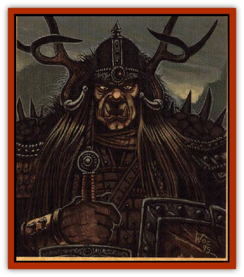

# Orog - Cerilia

| Statistic | **Orog (Cerilia)** |
| --- | --- |
| **Activity Cycle:** | Night |
| **Alignment:** | Neutral evil |
| **Armor Class:** | 3 (10) |
| **Climate/Terrain:** | Mountain, subterranean |
| **Damage/Attack:** | By weapon +2 |
| **Diet:** | Carnivore |
| **Frequency:** | Uncommon |
| **Hit Dice:** | 3 |
| **Intelligence:** | Average to High (10-14) |
| **Magic Resistance:** | Nil |
| **Morale:** | Elite (10-14) |
| **Movement:** | 9 |
| **No. Appearing:** | 4-16 |
| **No. of Attacks:** | 1 |
| **Organization:** | Tribe |
| **Size:** | M (6½' tall) |
| **Special Attacks:** | Nil |
| **Special Defenses:** | Nil |
| **THAC0:** | 17 |
| **Treasure:** | C, O, Qx10, S (individual L) |
| **XP Value:** | 120 |

Orogs are a subterranean race of miners and warriors that inhabit Cerilia's mountain ranges. Their dark fortresses and holds can be found concealed in remote gorges or hidden in great underground caverns. The orogs consider all other races to be their enemies, and live in a state of perpetual warfare; in recent years, they've established several strong footholds on the surface.

Orogs stand taller than humans but have short, stocky legs. An orog has a thick, barrel-chested torso, long, powerful arms, and a somewhat apish face with a short, snubbed muzzle and flat nostrils. The creatures' skin is hairless and ranges from leathery gray to black.

Orogs are excellent metalworkers and commonly wear heavy banded mail. Tribal colors are displayed proudly on cloaks, surcoats, or standards. Despite their brutish appearance, orogs are very intelligent and have a firm grasp of tactics and strategy.

**Combat:** Orogs are very strong and gain a +2 bonus to damage rolls with any handheld or thrown weapons. They favor axes, maces, polearms, and heavy long swords. Crossbows are also popular.

Orogs are nauseated and blinded by bright sunlight, and suffer a -2 penalty to attack and saving throws in such conditions; even cloudy days give them -1 penalties. This aversion to daylight makes daytime travel difficult, so tunnel networks are often excavated to allow movement in the vicinity of an orog holding without emerging into the daylight.

A band of orogs is led by a 6 HD chieftain with THAC0 15 and a +4 bonus to damage rolls. The chieftain is advised by a 5 HD battle priest who wields the spell powers of a 5th-level cleric. The chieftain is guarded by 2-12 orogs of at least 16 hp each in plate mail (AC 2), with a +3 bonus to damage rolls. For every 20 orogs, one subleader equal to a guard will be present, as well as a 3 HD battle priest with the powers of a 3rd-level cleric.

Orogs domesticate a fierce variety of giant lizard equal in all respects to subterranean lizards. Raiding parties that need to move fast are often mounted on lizards, as are leaders among larger war bands. These creatures are described in the *Monstrous Manual* (as subterranean lizards)

**Habitat/Society:** Io the distant past, orogs were surface dwellers who were driven underground during a series of genocidal wars against the dwarves. They managed to survive by adapting to their new environment. The orog fortresses, home to 4d6x10 individuals, are supported by gathering underground fungi and raising Livestock, as well as extensive hunting and raiding on the surface.

The orogs view each and every member of their society as warriors. Military virtues are embraced by their society, and sheer strength is respected as well. The priests of the orogs' nameless patron power are extremely powerful and influential, and entire tribes march at the words of the high battle priests.

---
## Discovery & Documentation

**Source Publication:** Birthright Campaign Setting Box Set (1995)
**Campaign Setting:** Birthright
**Author(s):** L. Richard Baker III, Colin McComb, Walter Velez, Tony Szczudlo, William O'Connor, Eric Hotz, Carrie Bebris, Roger E. Moore, Sue Weinlein, Peggy Cooper

### Other Creatures Found in This Source Book
   * [[Dragon_Cerilia|Dragon (Cerilia)]]
   * [[Giant_Cerilia|Giant (Cerilia)]]
   * [[Goblin_Cerilia|Goblin (Cerilia)]]
   * [[Rhuobhe_Manslayer|Rhuobhe Manslayer]]
   * [[The_Gorgon|The Gorgon]]
   * [[The_Seadrake|The Seadrake]]
   * [[The_Spider|The Spider]]
