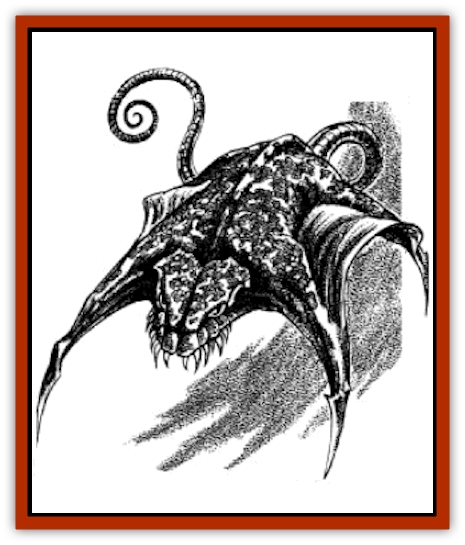

# Orpsu

| Statistic | **Orpsu** |
| --- | --- |
| **Activity Cycle:** | Nocturnal (subterranean: any) |
| **Alignment:** | Neutral evil |
| **Armor Class:** | 7 |
| **Climate/Terrain:** | Temperate/any dry |
| **Damage/Attack:** | 4-7/1-3 |
| **Diet:** | Carnivore |
| **Frequency:** | Rare |
| **Hit Dice:** | 1+6 |
| **Intelligence:** | Low (5-7) |
| **Magic Resistance:** | Nil |
| **Morale:** | Elite (13) |
| **Movement:** | 2, Fl 14 (D) |
| **No. Appearing:** | 4-12 (usually 6 or 7) |
| **No. of Attacks:** | 2 |
| **Organization:** | Hunting swarms |
| **Size:** | S (up to 2' &ldquo;hornspan&rdquo;, 3' length) |
| **Special Attacks:** | See below |
| **Special Defenses:** | See below |
| **THAC0:** | 19 |
| **Treasure:** | Nil |
| **XP Value:** | 420 |

Orpsu, also known as "night stirges", are flying predators who feed on fresh blood. They are unrelated to the more common [[Stirge|stirge]], and do not grip victims to feed. An orpsu is a hairless, rat-tailed flying beast equipped with raking fangs and four bony, wing-like projecting "horns". Orpsu are mottled crimson, purple, mauve, or cinnamon-brown in hue, and have veined, leathery skin.

Orpsu are common in Kara-Tur and the steppes, plains, and deserts that lie west of the Eastern Realms.

**Combat:** Orpsu have 150' infravision, and hunt in darkness to avoid attacks from larger predators when flying in the open. Once per day, an orpsu can use a weak form of *hold monster* (as the fifth-level wizard spell, except that only a single living being within 60' can be attacked). If the target successfully saves (at +2) against this power, it is affected as if by a *slow* spell. Orpsu catch and overcome most of their prey by this means. They are relatively clumsy in flight, and usually swoop down on prey only after it has been *held* or *slowed*.

Orpsu have stout, razor-sharp fangs, but no lower jaws, and cannot bite, using their fangs instead to slash or rake. Orpsu also have prehensile tails, too weak to hold struggling prey or a weapon, but able to drag small objects or coil around a tree limb when the creature is at rest. Orpsu have no legs or feet, and can only move on the ground by clumsily undulating their bodies.

The most distinctive features of an orpsu are its razor-sharp, blade-like bone "horns", which project out of its body like two back-to-back crescents, the ends of one pair of horns curling forward on either side of the raking fangs, and the other two projecting backwards like wings on either side of the tail. An orpsu is at a disadvantage if knocked out of the air, and therefore instinctively swoops down to strike targets at an angle, as it passes - so only one side of its body menaces prey, and only one horn (either the front horn - or, if it misses, the angled, dragging rear horn) can strike an intended target per swoop (in addition to the orpsu's fangs). A horn attack does 1d4+3 damage.

Any wound caused by one continues to bleed (the victim losing 1 hp/round thereafter) until the wound is bound up (and the victim refrains from combat or other strenuous activity for at least 1 turn), or curative magic is applied.

Orpsu only attempt to drain blood from victims who are held, asleep, or who have collapsed. Up to a dozen soft, flexible white tentacles emerge from slits in an orpsu's belly (into which they retract when not needed). Orpsu have no barbs or claws to grip victims, and instead glide down to a flapping halt above chosen prey, onto which they settle heavily. The tentacles penetrate the victim's skin, providing some holding power, and the orpsu usually wraps its tail around the victim's body, limb or extremity. On the round after settling, the orpsu's blood drain begins. It takes 1-2 hit points of blood per round, until the victim dies or the orpsu is knocked off (this is not difficult if the victim is conscious and able to move). A physical attack by another being usually causes a draining orpsu to bound into the air with a powerful coiling and whipping of its tail, and fly away. Orpsu have no known blood-satiation point. They remain alert when draining, and will abandon a victim rather than face certain death by remaining.

Orpsu fly by natural levitation, propelling themselves forward by flailing and wriggling their tails, and steering by angling the membrane "wings" of their horns as they tilt their bodies.

**Habitat/Society:** Orpsu lair in rocky places, such as caverns or ruins, and hunt in open, rolling scrubland or plains - or dwell and hunt entirely beneath the surface, in the endless caverns of the Underdark.

Orpsu emit no calls or noises, and can communicate only with others of their kind, employing a limited, 20'-range telepathy that is incomprehensible to other beings employing magic or natural powers to mentally eavesdrop. Their peculiar mental activity renders them immune to *charm*, *suggestion*, *domination*, and *hold* magic and similar mental powers and spells.

Orpsu live in mated pairs, producing litters of 1-4 live, instantly-active and hungry young (1-1 HD, attacks: 2-5/1-2) every three summers. Offspring remain with their parents to form a family "swarm", which grows with the passing years and litters until the swarm numbers more than a dozen - whereupon 1-3 of the oldest, original offspring form mated pairs and fly off to find new (orpsu-less) hunting territory, and there found a swarm of their own.

**Ecology:** Surface-dwelling orpsu prey on sheep, cattle, many small creatures (having a particular fondness for badgers, foxes, and otters), large birds, and men. Subterranean orpsu prefer the blood of [[Elf_Drow|drow]] and [[Dwarf_Duergar|duergar]] to all else.

---
## Discovery & Documentation

**Source Publication:** MC11 Forgotten Realms Appendix II (1991)
**Campaign Setting:** Advanced Dungeons & Dragons 2nd Edition
**Author(s):** Tim Beach, Tim Brown, William W. Connors, Dale Donovan, Ed Greenwood, Jeff Grubb, Bruce Heard, Slade Henson, Rob King, Colin McComb, Roger E. Moore, Bruce Nesmith, Jon Pickens, Jean Rabe, Dori Watry, Skip Williams

### Other Creatures Found in This Source Book
   * [[Alaghi|Alaghi]]
   * [[Alguduir|Alguduir]]
   * [[Beguiler|Beguiler]]
   * [[Bird_Toril|Bird (Toril)]]
   * [[Cantobele|Cantobele]]
   * [[Carapace|Carapace]]
   * [[Cat_Toril|Cat (Toril)]]
   * [[Chitine|Chitine]]
   * [[Cildabrin|Cildabrin]]
   * [[Dimensional_Warper|Dimensional Warper]]
   * [[Dragon_Deep|Dragon, Deep]]
   * [[Fachan_Toril|Fachan (Toril)]]
   * [[Fael|Fael]]
   * [[Feyr|Feyr]]
   * [[Firetail|Firetail]]
   * [[Frost|Frost]]
   * [[Gaund|Gaund]]
   * [[Gloomwing|Gloomwing]]
   * [[Golden_Ammonite|Golden Ammonite]]
   * [[Golem_Lightning|Golem, Lightning]]
   * [[Hamadryad|Hamadryad]]
   * [[Harrier|Harrier]]
   * [[Harrla|Harrla]]
   * [[Haun|Haun]]
   * [[Haundar|Haundar]]
   * [[Hendar|Hendar]]
   * [[Inquisitor|Inquisitor]]
   * [[Lhiannan_Shee|Lhiannan Shee]]
   * [[Loxo|Loxo]]
   * [[Manni|Manni]]
   * [[Manscorpion|Manscorpion]]
   * [[Mara|Mara]]
   * [[Morin|Morin]]
   * [[Naga_Dark|Naga, Dark]]
   * [[Plant_Carnivorous_Black_Willow|Plant, Carnivorous, Black Willow]]
   * [[Plant_Carnivorous_Toril|Plant, Carnivorous (Toril)]]
   * [[Plant_Dangerous_I|Plant, Dangerous I]]
   * [[Ring-Worm|Ring-Worm]]
   * [[Rohch|Rohch]]
   * [[Sand_Cat|Sand Cat]]
   * [[Saurial|Saurial]]
   * [[Sha'az|Sha'az]]
   * [[Silver_Dog|Silver Dog]]
   * [[Simpathetic|Simpathetic]]
   * [[Skuz|Skuz]]
   * [[Spider_Monkey|Spider, Monkey]]
   * [[Tren|Tren]]
