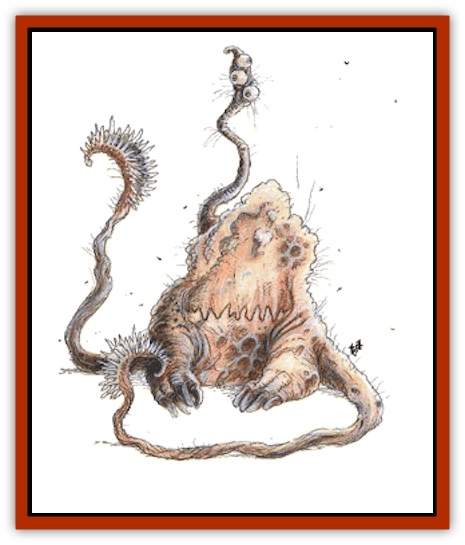

# Otyugh

| Statistic | **Neo-Otyugh** | **Otyugh** |
| --- | --- | --- |
| **Activity Cycle:** | Any | Any |
| **Alignment:** | Neutral | Neutral |
| **Armor Class:** | 0 | 3 |
| **Climate/Terrain:** | Subterranean | Subterranean |
| **Damage/Attack:** | 2-12/2-12/1-3 | 1-8/1-8/2-5 |
| **Diet:** | Omnivore | Omnivore |
| **Frequency:** | Rare | Uncommon |
| **Hit Dice:** | 9-12 | 6-8 |
| **Intelligence:** | Average-Very (8-12) | Low-Average (5-10) |
| **Magic Resistance:** | Nil | Nil |
| **Morale:** | Fanatic (17) | Elite (14) |
| **Movement:** | 6 | 6 |
| **No. Appearing:** | 1 | 1 (2) |
| **No. of Attacks:** | 3 | 3 |
| **Organization:** | Solitary | Solitary |
| **Size:** | L (8' diam.) | M-L (6-7' diam.) |
| **Special Attacks:** | Grab, disease | Grab, disease |
| **Special Defenses:** | Never surprised | Never surprised |
| **THAC0:** | 9-10 HD: 11 / 11-12 HD: 9 | 6 HD: 15 / 7-8 HD: 13 |
| **Treasure:** | See below | See below |
| **XP Value:** | 9 HD: 2,000 / 10 HD: 3,000 / 11 HD: 4,000 / 12 HD: 5,000 | 6 HD: 650 / 7 HD: 975 / 8 HD: 1,400 |

Otyughs (Aw-tee-ug), also known as the gulguthra, are terrifying creatures that lurk in heaps of dung and decay, waiting for something to disturb it. There are two varieties, the regular otyugh, and its larger, more intelligent offshoot, the neo-otyugh. They feed on dung and wastes from other dungeon creatures (gulguthra means "dung eaters") but also enjoy an occasional snack of fresh meat.

Otyughs have huge, bloated bodies covered with a rock-like skin that is brownish gray in color, which is in turn covered with dung. They stand on three thick legs that give them slow ground movement but enable them to pivot quickly. They have three eyes on a leaf-like stalk that moves quickly from side to side, enabling them to scan a large area. The eye stalk is also a receiver/transmitter for their telepathic abilities. Otyughs have a huge mouth with very sharp teeth in the center of their mass. They also have two tentacles with leaf-like ridges that they use to smash and grapple their opponents. The tentacles are covered with rough thorn-like projections. Neo-otyughs have smaller mouths than otyughs.

Otyughs and neo-otyughs speak their own language, much of which is non-verbal (movements of eye stalk and tentacles, or emission of certain smells); they also have limited telepathy that enable them to communicate with other creatures. Otyughs reek of dung and decay.

**Combat:** Otyughs lurk under piles of offal with only their eyes exposed. They usually attack if they feel threatened, or if they are hungry and there is fresh meat nearby. They attack with their two ridged tentacles, which either smash an opponent or grapple it. Grappled opponents suffer 2-4 points of damage per round. Otyughs' bite attacks gain a +2 bonus to the attack roll when biting grappled opponents. Otyughs smash grappled opponents to the ground, while the more intelligent neo-otyughs use their victims as shields, bettering their Armor Class by 1. Neo-otyughs may also force attackers to hit the grappled character with a successful attack roll of its own (vs. the grappled character's AC); to do this the neo-otyugh forgoes its squeeze attack. Characters with a Strength of at least 18 can struggle for one round and automatically break free; others must make a successful open doors roll to escape.

Both types of gulguthra are disease-ridden; their bite is 90% likely to infect the character with a debilitating (80%) or fatal (20%) disease. Otyughs are immune to these diseases.

**Habitat/Society:** All gulguthra have limited telepathic ability. An otyugh can communicate with creatures up to 40 feet away, while a neo-otyugh can communicate with creatures as distant as 60 feet. Communication is usually limited to simple feelings and emotions such as hunger, temperature conditions and associated discomforts, its dislike of bright lights, and imminent death for its prey. Gulguthra also have infravision with a 90-foot range.

Otyughs and neo-otyughs live in ruins and dungeons. They make deals with other dungeon denizens, agreeing not to attack them in exchange for their dung and body wastes, which they then devour. To keep the supply of waste coming (and to get fresh meat) they will agree to help defend their home against intruders, which includes many adventurers. Otyughs may be persuaded not to attack creatures in exchange for promises of friendship and food. Neo-otyughs are less trusting (and more vicious), and usually attack intruders on sight. An otyugh's dungeon allies will sometimes ask it to guard treasure for them. Most gulguthra live alone; 10% of the time, during mating season, two gulguthra can found in its lair.

**Ecology:** Otyughs and neo-otyughs live underground in heaps of offal and refuse. They hate bright sunlight, preferring the comfortable darkness of dungeons. They mate each year for one month, with one offspring produced. It takes the newborn four months to mature (immature gulguthra have 3-5 HD, damage 1-6/1-6/1-2, and a Strength of 16 is required to break free of their grasp). Otyughs are so disgusting that no alchemist or wizard would want to touch their components, so the corpses of the gulguthra have no known use or value.

---
## Discovery & Documentation

**Source Publication:** MC2 Volume II (1993)
**Campaign Setting:** Advanced Dungeons & Dragons 2nd Edition
**Author(s):** Jay Batista, Scott Bennie, Grant Boucher, William W. Connors, Steve Gilbert, Heike Kubasch, James Lowder, David Edward Martin, Bruce Nesmith, Jean Rabe, Rick Swan, John J. Terra, Gary L. Thomas

### Other Creatures Found in This Source Book
   * [[Ant|Ant]]
   * [[Ant_Lion_Giant|Ant Lion, Giant]]
   * [[Ape_Carnivorous|Ape, Carnivorous]]
   * [[Baboon|Baboon]]
   * [[Badger|Badger]]
   * [[Barracuda|Barracuda]]
   * [[Beetle_Giant|Beetle, Giant]]
   * [[Bulette|Bulette]]
   * [[Bullywug|Bullywug]]
   * [[Dwarf_Duergar|Dwarf, Duergar]]
   * [[Dwarf_Gully|Dwarf, Gully]]
   * [[Eagle|Eagle]]
   * [[Eel|Eel]]
   * [[Elemental_Air_Kin|Elemental, Air Kin]]
   * [[Elemental_Water_Kin|Elemental, Water Kin]]
   * [[Elemental_Water_Kin_Water_Weird|Elemental, Water Kin, Water Weird]]
   * [[Firestar|Firestar]]
   * [[Firetail|Firetail]]
   * [[Fish_Giant|Fish, Giant]]
   * [[Frog|Frog]]
   * [[Gorgon|Gorgon]]
   * [[Hawk|Hawk]]
   * [[Heucuva|Heucuva]]
   * [[Hippocampus|Hippocampus]]
   * [[Hippogriff|Hippogriff]]
   * [[Kelpie|Kelpie]]
   * [[Kenku|Kenku]]
   * [[Killmoulis|Killmoulis]]
   * [[Kuo-Toa|Kuo-Toa]]
   * [[Lamia|Lamia]]
   * [[Lammasu|Lammasu]]
   * [[Lamprey|Lamprey]]
   * [[Leech|Leech]]
   * [[Leprechaun|Leprechaun]]
   * [[Leucrotta|Leucrotta]]
   * [[Locathah|Locathah]]
   * [[Lycanthrope_Wereboar|Lycanthrope, Wereboar]]
   * [[Lycanthrope_Werefox|Lycanthrope, Werefox]]
   * [[Mammal_Minimal|Mammal, Minimal]]
   * [[Mammal_Small|Mammal, Small]]
   * [[Mimic|Mimic]]
   * [[Morkoth|Morkoth]]
   * [[Muckdweller|Muckdweller]]
   * [[Myconid|Myconid]]
   * [[Naga|Naga]]
   * [[Obliviax|Obliviax]]
   * [[Octopus_Giant|Octopus, Giant]]
   * [[Piranha|Piranha]]
   * [[Plant_Dangerous_I|Plant, Dangerous I]]
   * [[Plant_Intelligent|Plant, Intelligent]]
   * [[Poltergeist|Poltergeist]]
   * [[Porcupine|Porcupine]]
   * [[Rat_Osquip|Rat, Osquip]]
   * [[Roc|Roc]]
   * [[Roper|Roper]]
   * [[Rot_Grub|Rot Grub]]
   * [[Rust_Monster|Rust Monster]]
   * [[Sahuagin|Sahuagin]]
   * [[Sea_Lion|Sea Lion]]
   * [[Sea_Horse_Giant|Sea Horse, Giant]]
   * [[Shambling_Mound|Shambling Mound]]
   * [[Shark|Shark]]
   * [[Sphinx|Sphinx]]
   * [[Squid_Giant|Squid, Giant]]
   * [[Stirge|Stirge]]
   * [[Swanmay|Swanmay]]
   * [[Tarrasque|Tarrasque]]
   * [[Tasloi|Tasloi]]
   * [[Triton|Triton]]
   * [[Troglodyte|Troglodyte]]
   * [[Urchin|Urchin]]
   * [[Urd|Urd]]
   * [[Weasel|Weasel]]
   * [[Wolverine|Wolverine]]
   * [[Yellow_Musk_Creeper|Yellow Musk Creeper]]
