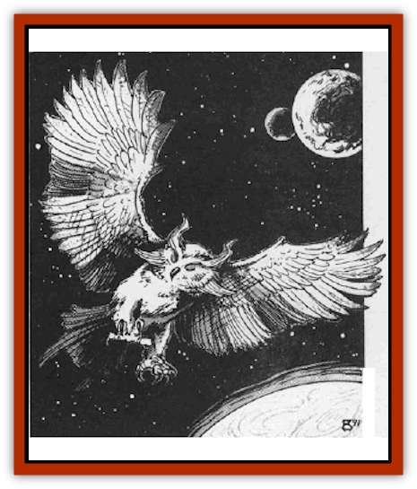

# Owl - Space

| Statistic | **Owl, Space** |
| --- | --- |
| **Activity Cycle:** | Night |
| **Alignment:** | Chaotic good |
| **Armor Class:** | 6 |
| **Climate/Terrain:** | Any |
| **Damage/Attack:** | 1d4/1d4/1d3 |
| **Diet:** | Omnivore |
| **Frequency:** | Rare |
| **Hit Dice:** | 3+3 |
| **Intelligence:** | Genius (18) |
| **Magic Resistance:** | Nil |
| **Morale:** | Champion (15) |
| **Movement:** | 3, Fl 12 (B) |
| **No. Appearing:** | 1 (2-8) |
| **No. of Attacks:** | 3 |
| **Organization:** | Parliament |
| **Size:** | S (2½' tall) |
| **Special Attacks:** | Nil |
| **Special Defenses:** | See below |
| **THAC0:** | 17 |
| **Treasure:** | Nil |
| **XP Value:** | 420 |

Every spelljamming ship needs a navigator; wildspace is big, and the chance for error is great. Space owls are intelligent [[Owl|owls]] with a gift for navigation. Humans, [[Dwarf|dwarves]], and [[Gnome|gnomes]] use them most often.

Space owls resemble normal owls, with coloration ranging from dark brown to snowy white. They have big, yellow, unblinking eyes. The owls stand about 2½' tall, with a wingspan of 4'.

These highly intelligent birds can communicate with all [[Bird|birds]], both of groundling and wildspace origin. Space owls also speak Common and up to three other languages (DM's choice).

**Combat:** These cerebral birds are reluctant to enter combat. They would much rather discuss the conflict with their foe, trying to dig deep into the enemy's subconscious to explain their violent tendencies. Is it nature? Is it a bad upbringing? Since most foes resent being mentally dissected, this practice winds up infuriating an enemy even more.

Thus, the space owls have no choice but to defend themselves, using their two sets of sharp talons to inflict 1d4 damage each. The space owls follow up with a beak blow, doing an additional 1d3 damage.

Since space owls are brilliant, they realize that these attacks seldom deter an enemy. So they have developed the ability to cast *invisibility*, *minor image*, *blink*, *ventriloquism*, and *spook*, each three times a day, at 6th level. Also, owls can cast *find the path*, *true seeing*, and *augury*, each once per day.

**Habitat/Society:** Space owls congregate in small groups called parliaments. They nest in trees, on the roofs of buildings that house knowledge (observatories, sage houses, mage towers, 1ibraries, laboratories), or in the wrecks of spelljammer ships. (When space owls lair in a spelljammer shipwreck, they often try to rebuild it.) An even number of owls in a parliament are mated pairs. For each pair, there is a 20% chance of 1d4 owlets, or a 10% chance of 1d4+1 eggs.

Space owls live for 100+10d10 years. They are nocturnal, and so they love the starry night sky of wildspace. Bright lights, such as light spells, blind them. Space owls have exceptional hearing and ultravision, the latter only usable at night.

All space owls have the Navigation proficiency, and they do not suffer the -2 check modifier. There is a 45% chance that trained space owls have 1d4 other proficiencies from the following list: Ancient History, Animal Lore, Astrology, Engineering, Reading Lips, Reading/Writing, and Spellcraft.

The owls' sense of direction is 90% accurate. They can serve as a ship's navigator, and they need no star charts when travelling in their native sphere. The owls instinctively memorize the positions of all heavenly bodies in their native crystal sphere. They can learn the astronomical layouts of other crystal spheres, but this requires at least one month of travel in the sphere, followed by an Intelligence check. Studying an accurate map of the sphere, reduces study time to only 1d4 days, followed by the Intelligence check. In either case, success means that the owl now knows that sphere; failure means another month of travel or 1d4 days of map study.

Besides navigation, space owls are adept at calculating planetary orbits, debating philosophy or science, and even playing chess. Their only drawback is an unfortunate tendency to ramble, over-analyze, and use huge polysyllabic words.

**Ecology:** Space owls need only a little air to breathe; a few minutes in an atmosphere every couple of days keeps them happy. They eat almost anything, including cooked food, wine, and sweets. In the wild, they eat plants, insects, and small rodents.

Wizards who want a space owl familiar must still cast the *find fantiliar* spell, then persuade the owl to become a familiar.

---
## Discovery & Documentation

**Source Publication:** MC9 Spelljammer Appendix II (1991)
**Campaign Setting:** Planescape
**Author(s):** Scott Davis, Newton Ewell, John Terra

### Other Creatures Found in This Source Book
   * [[Alchemy_Plant|Alchemy Plant]]
   * [[Allura|Allura]]
   * [[Aperusa|Aperusa]]
   * [[Autognome|Autognome]]
   * [[Bionoid|Bionoid]]
   * [[Bloodsac|Bloodsac]]
   * [[Buzzjewel|Buzzjewel]]
   * [[Constellate|Constellate]]
   * [[Contemplator|Contemplator]]
   * [[Dohwar|Dohwar]]
   * [[Dragon_Moon|Dragon, Moon]]
   * [[Dragon_Stellar|Dragon, Stellar]]
   * [[Dragon_Sun|Dragon, Sun]]
   * [[Dreamslayer|Dreamslayer]]
   * [[Dweomerborn|Dweomerborn]]
   * [[Fal|Fal]]
   * [[Feesu|Feesu]]
   * [[Fire_Bat|Fire Bat]]
   * [[Firebird|Firebird]]
   * [[Firelich|Firelich]]
   * [[Flowfiend|Flowfiend]]
   * [[Gadabout|Gadabout]]
   * [[Gammaroid|Gammaroid]]
   * [[Gonn|Gonn]]
   * [[Gossamer|Gossamer]]
   * [[Grav|Grav]]
   * [[Great_Dreamer|Great Dreamer]]
   * [[Greatswan|Greatswan]]
   * [[Grell_Colonial|Grell, Colonial]]
   * [[Gullion|Gullion]]
   * [[Insectare|Insectare]]
   * [[Lhee|Lhee]]
   * [[Mercurial_Slime|Mercurial Slime]]
   * [[Meteorspawn|Meteorspawn]]
   * [[Monitor|Monitor]]
   * [[Pristatic|Pristatic]]
   * [[Scro|Scro]]
   * [[Selkie_Star|Selkie, Star]]
   * [[Silatic|Silatic]]
   * [[Skullbird|Skullbird]]
   * [[Sleek|Sleek]]
   * [[Sluk|Sluk]]
   * [[Space_Swine|Space Swine]]
   * [[Sphinx_Astro-|Sphinx, Astro-]]
   * [[Spirit_Warrior|Spirit Warrior]]
   * [[Starfly_Plant|Starfly Plant]]
   * [[Stargazer|Stargazer]]
   * [[Undead_Stellar|Undead, Stellar]]
   * [[Witchlight_Marauder|Witchlight Marauder]]
   * [[Xixchil|Xixchil]]
   * [[Yitsan|Yitsan]]
   * [[Zurchin|Zurchin]]
