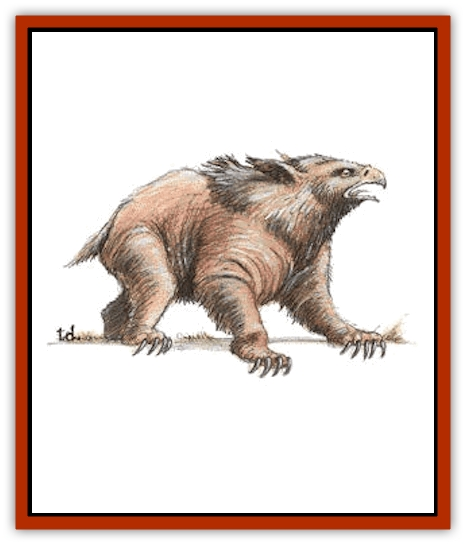

# Owlbear I

| Statistic | **Owlbear I** |
| --- | --- |
| **Activity Cycle:** | Late afternoon/early evening |
| **Alignment:** | Neutral |
| **Armor Class:** | 5 |
| **Climate/Terrain:** | Temperate forest |
| **Damage/Attack:** | 1-6/1-6/2-12 |
| **Diet:** | Carnivore |
| **Frequency:** | Rare |
| **Hit Dice:** | 5+2 |
| **Intelligence:** | Low (5-7) |
| **Magic Resistance:** | Nil |
| **Morale:** | Steady (11-12) +Special |
| **Movement:** | 12 |
| **No. Appearing:** | 1 (2-8) |
| **No. of Attacks:** | 3 |
| **Organization:** | Pack |
| **Size:** | L (8' tall) |
| **Special Attacks:** | Hug |
| **Special Defenses:** | Nil |
| **THAC0:** | 15 |
| **Treasure:** | (C) |
| **XP Value:** | 420 |

Owlbears are probably the crossbred creation of a demented wizard; given the lethality of this creation, it is quite likely that the wizard who created them is no longer alive. Owlbears are vicious, ravenous, aggressive, and evil tempered at all times.

Owlbears are a cross between a [[Owl|giant owl]] and a [[Bear|bear]]. They are covered with a thick coat of feathers and fur, brown-black to yellow-brown in color. The 8-foot-tall males, which weigh between 1,300 and 1,500 pounds, are darker colored. The beaks of these creatures are yellow to ivory and their terrifying eyes are red-rimmed. Owlbears speak their own language, which consists of very loud screeches of varying length and pitch.

**Combat:** The owlbear attacks prey on sight, always fighting to the death (ignore morale rating for purposes of determining retreat). It attacks with its claws and snapping beak. If an owlbear scores a claw hit with a roll of 18 or better, it drags its victim into a hug, subsequently squeezing its opponent for 2-16 points of damage per round until either the victim or the owlbear is slain. The owlbear can also use its beak attack on victims caught in its grasp, but cannot use its claws. A single attempt at a bend bars/lift gates roll may be made to break from the grasp of an owlbear. Note that if the Armor Class of a victim is high enough that 18 is insufficient to hit, the hug is not effective and no damage is taken.

**Habitat/Society:** Owlbears inhabit the depths of tangled forests in temperate climes, as well as subterranean labyrinths, living in caves or hollow stumps.

Owlbears live in mated pairs; the male is slightly larger and heavier than the female. If encountered in their lair there is a 25% chance that there will be 1-6 eggs (20%) or young (80%) in addition to the adults. The offspring will be 40% to 70% grown and fight as creatures with three or four Hit Dice, depending on their growth. They have hit points based on their adjusted Hit Dice. Immature offspring inflict 1-4/1-4/2-8 points of damage with their attacks and a character has a +20% to his bend bars/lift gates roll to escape the hug of an immature owlbear.

An owlbear pair claims a territory of one or two square miles and will vigorously defend this territory against all intruders.

An owlbear's main weakness is also its greatest strength - its ferocity. Because owlbears are so bad-tempered, they stop at nothing to kill a target. It is not difficult to trick an owlbear into hurling itself off a cliff or into a trap, provided you can find one.

**Ecology:** Owlbears have a lifespan of 20 years. They are warm-blooded mammals, but lay eggs. They prey on anything, from rabbits to bears, to [[Troll|trolls]], to [[Snake|snakes]] and reptiles. Owlbears prefer temperate climates, but some thrive in subarctic environments. As a hybrid of two animals, one diurnal and the other nocturnal, they have an unusual active time, waking at noon, hunting animals active during the day, then hunting nocturnal creatures before going to sleep at midnight. Owlbears are active in the summer months and hibernate during the cold season. There are rumors of white [[Owlbear_II|arctic owlbears]], a cross between arctic owls and polar bears, but no specimens have ever been captured.

An owlbear does not actively seek treasure but the remains of victims may be found buried in shallow holes around an owlbear lair. Owlbear eggs are worth 2,000 silver pieces and hatchlings are worth 5,000 silver pieces on the open market. These are typically bought by wizards; while they are impossible to domesticate, they make formidable guardians and wizards sometimes place them in locations of strategic importance (it has been said that an owlbear is a less subtle version of a "keep out" sign). Owlbears in dungeons and ruins almost always have been placed there by someone.

---
## Discovery & Documentation

**Source Publication:** MC1 Volume I (w/binder #1) (1991)
**Campaign Setting:** Advanced Dungeons & Dragons 2nd Edition
**Author(s):** Jay Batista, Scott Bennie, Grant Boucher, William W. Connors, Steve Gilbert, Heike Kubasch, James Lowder, David Edward Martin, Bruce Nesmith, Jean Rabe, Rick Swan, John J. Terra, Gary L. Thomas

### Other Creatures Found in This Source Book
   * [[Bat|Bat]]
   * [[Bear|Bear]]
   * [[Behir|Behir]]
   * [[Boar|Boar]]
   * [[Bookworm|Bookworm]]
   * [[Brownie|Brownie]]
   * [[Bugbear|Bugbear]]
   * [[Carrion_Crawler|Carrion Crawler]]
   * [[Cat_Great|Cat, Great]]
   * [[Catoblepas|Catoblepas]]
   * [[Dragon_General_Information|Dragon, General Information]]
   * [[Dragonfish|Dragonfish]]
   * [[Elemental_Air_Kin_Aerial_Servant|Elemental, Air Kin, Aerial Servant]]
   * [[Elemental_Earth_Kin_Sandling|Elemental, Earth Kin, Sandling]]
   * [[Elephant|Elephant]]
   * [[Gnoll|Gnoll]]
   * [[Hobgoblin|Hobgoblin]]
   * [[Homunculus|Homunculus]]
   * [[Hornet_Giant|Hornet, Giant]]
   * [[Horse|Horse]]
   * [[Hyena|Hyena]]
   * [[Jackal|Jackal]]
   * [[Jackalwere|Jackalwere]]
   * [[Korred|Korred]]
   * [[Lich|Lich]]
   * [[Lizard|Lizard]]
   * [[Lizard_Man|Lizard Man]]
   * [[Lycanthrope_General_Information|Lycanthrope, General Information]]
   * [[Lycanthrope_Seawolf|Lycanthrope, Seawolf]]
   * [[Lycanthrope_Werebear|Lycanthrope, Werebear]]
   * [[Lycanthrope_Weretiger|Lycanthrope, Weretiger]]
   * [[Lycanthrope_Werewolf|Lycanthrope, Werewolf]]
   * [[Manticore|Manticore]]
   * [[Medusa|Medusa]]
   * [[Mind_Flayer|Mind Flayer]]
   * [[Minotaur|Minotaur]]
   * [[Mudman|Mudman]]
   * [[Mummy|Mummy]]
   * [[Nixie|Nixie]]
   * [[Nymph|Nymph]]
   * [[Ogre|Ogre]]
   * [[Ooze_Slime_Jelly_I|Ooze/Slime/Jelly I]]
   * [[Ooze_Slime_Jelly_II|Ooze/Slime/Jelly II]]
   * [[Orc|Orc]]
   * [[Owl|Owl]]
   * [[Pegasus|Pegasus]]
   * [[Piercer|Piercer]]
   * [[Pudding_Deadly|Pudding, Deadly]]
   * [[Rakshasa|Rakshasa]]
   * [[Rat|Rat]]
   * [[Ray|Ray]]
   * [[Remorhaz|Remorhaz]]
   * [[Satyr|Satyr]]
   * [[Scorpion|Scorpion]]
   * [[Selkie|Selkie]]
   * [[Shadow|Shadow]]
   * [[Skeleton|Skeleton]]
   * [[Skunk|Skunk]]
   * [[Snake|Snake]]
   * [[Spectre|Spectre]]
   * [[Spider|Spider]]
   * [[Sprite|Sprite]]
   * [[Toad_Giant|Toad, Giant]]
   * [[Treant|Treant]]
   * [[Troll|Troll]]
   * [[Umber_Hulk|Umber Hulk]]
   * [[Unicorn|Unicorn]]
   * [[Vampire|Vampire]]
   * [[Wight|Wight]]
   * [[Will_O'Wisp|Will O'Wisp]]
   * [[Wolf|Wolf]]
   * [[Wolfwere|Wolfwere]]
   * [[Wraith|Wraith]]
   * [[Wyvern|Wyvern]]
   * [[Yeti|Yeti]]
   * [[Yuan-ti|Yuan-ti]]
   * [[Zombie|Zombie]]
