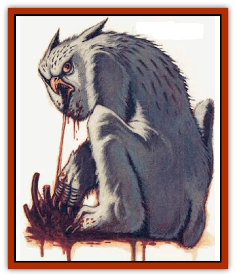

# Owlbear II

| Statistic | **Arctic** | **Winged** |
| --- | --- | --- |
| **Activity Cycle:** | Day | Dusk |
| **Alignment:** | Neutral | Neutral |
| **Armor Class:** | 5 | 5 |
| **Climate/Terrain:** | Any arctic | Any nonarctic |
| **Damage/Attack:** | 1d10/1d10/2d6 | 1d10/1d10/2d6 |
| **Diet:** | Carnivore | Carnivore |
| **Frequency:** | Very rare | Very rare |
| **Hit Dice:** | 8+2 | 5+2 |
| **Intelligence:** | Low (5-7) | Low (5-7) |
| **Magic Resistance:** | Nil | Nil |
| **Morale:** | Steady (11-12) | Steady (11-12) |
| **Movement:** | 12, Sw 9 | 12, Fl 18 (E) |
| **No. Appearing:** | 1 (2-8) | 1 (2-5) |
| **No. of Attacks:** | 3 | 3 |
| **Organization:** | Pack | Family |
| **Size:** | L (12' tall) | L (8' tall) |
| **Special Attacks:** | Hug, surprise | Hug, surprise |
| **Special Defenses:** | Immune to cold | Nil |
| **THAC0:** | 13 | 15 |
| **Treasure:** | Incidental | Incidental |
| **XP Value:** | 2,000 | 975 |

## Arctic Owlbear

Arctic owlbears are the polar cousins of the normal [[Owlbear_I|owlbear]]. They resemble a cross between a snowy [[Owl|owl]] and a [[Bear|polar bear]]. Both their fur and their feathers are a snowy white, while the claws and beak are both black. Yellow, glowing eyes look forward from a rounded head. Like other owlbears, arctic owlbears communicate with hoots and loud screeches.

**Combat:** Due to its ability to blend into the arctic environment, an arctic owlbear is 75% likely to surprise its prey when hunting. Arctic owlbears are as foul-tempered as their forest cousins, immediately attacking prey with their front claws and wicked beaks.

Upon scoring a claw hit on a roll of 18 or better, the owlbear immediately hugs for 2d8 points of damage, which it maintains as long as it wishes, inflicting damage each round. Once engaged in a hugging attack, the owlbear cannot slash with its claws, but can use its beak normally. A single attempt to break the hug is allowed, using the bend bars/lift gates roll for success (monsters without Strength ratings use a saving throw vs. paralysis if larger than man-size, at -2 if man-sized or smaller).

The multi-layered fur and feathers of the arctic owlbear give it immunity to cold-based attacks.

**Habitat/Society:** Arctic owlbears live in the coldest areas of the arctic, often making their lairs in pre-existing caves or carving dens in hanks of snow. However, they tend to be wanderers and do not settle in any one place for long. If encountered in their lair, a mated pair of owlbears is 25% likely to have either 1d6 eggs (20% chance) or the same number of young (80% chance). Young will be from 40% to 70% grown, fighting as creatures with 5 or 6 Hit Dice. Damage inflicted by these younger owl bears is 1d6/1d6/2d4. The hug inflicts 2d6 points of damage per round and the chance of escaping the hug is increased by 20%.

**Ecology:** Arctic owlbears live for ahout 20 years. They will prey on anything, but prefer meat above all else. Unlike normal owlbears, the arctic variety hunt primarily by day and, being good swimmers, will aggressively pursue the prey into frigid waters without hesitation. They are well adapted for their environment-rough, leathery pads on the bottom of their paws help them maintain stability on icy surfaces. Natives of these lands claim nothing is worse than having an arctic owlbear on your trail, because of their stubborn determination, nasty disposition, and constant hunger.

## Winged Owlbear

The winged owlbear is a true synthesis of owl and bear; unlike other species of owlbears, this one has a large pair of feathered wings growing from its shoulders. However, the winged owlbear is just as nasty-tempered as its ground-dwelling cousin and communicates with the same screeching tones.

**Combat:** The flight of the winged owlbear is nearly silent due to the construction of its feathers - any prey has a penalty to its surprise roll of at least -2; in poor lighting, this might be as high as -6. A winged owlbear fights as do other owlbears, using its front claws and sharp beak. A claw hit on a roll of 18 or better establishes a hug, which allows one chance to escape using the bend bar/lift gate chances and otherwise allows the creature to inflict 2d8 points of damage per round.

**Habitat/Society:** The winged owlbear can be found in almost any non-arctic environment (though they are very scarce), but seems to prefer wooded forests or mountainous terrain. Their flying capabilities allow them to claim large areas as their territory - usually ten to twenty square miles.

Winged owlbears live as mated pairs. If encountered in their lairs, there is a 25% chance that 1d3 eggs (20% chance) or the same number of young (80% chance) will be present with the adults. The young are the same as normal owlbear young, as their wings will not supprt them until they reach full size.

**Ecology:** A winged owlbear tends to live slightly longer than other varieties, an age of 25 years or so is common. These creatures are sought by wizards for various reasons, though there is no record of any one being successfully domesticated.

---
## Discovery & Documentation

**Source Publication:** Monstrous Compendium, 1996 Annual, Volume 3 (1995)
**Campaign Setting:** Advanced Dungeons & Dragons 2nd Edition
**Author(s):** Jon Pickens

### Other Creatures Found in This Source Book
   * [[Alaghi|Alaghi]]
   * [[Alhoon|Alhoon]]
   * [[Aranea_Savage_Coast|Aranea (Savage Coast)]]
   * [[Arcane_Head|Arcane Head]]
   * [[Banedead|Banedead]]
   * [[Banelich|Banelich]]
   * [[Bat_Bonebat|Bat, Bonebat]]
   * [[Beetle|Beetle]]
   * [[Belgoi|Belgoi]]
   * [[Bladeling|Bladeling]]
   * [[Braxat|Braxat]]
   * [[Bunyip|Bunyip]]
   * [[Burbur|Burbur]]
   * [[Bvanen|Bvanen]]
   * [[Cat_Great_Snow_Tiger|Cat, Great, Snow Tiger]]
   * [[Chosen_One|Chosen One]]
   * [[Chronovoid|Chronovoid]]
   * [[Cildabrin|Cildabrin]]
   * [[Coffer_Corpse|Coffer Corpse]]
   * [[Disenchanter|Disenchanter]]
   * [[Dog_Temporal|Dog, Temporal]]
   * [[Dragon_Cerilia|Dragon (Cerilia)]]
   * [[Dragon_Ghost|Dragon, Ghost]]
   * [[Dragon_Lesser_Undead|Dragon, Lesser Undead]]
   * [[Dragon_Neutral_Amber|Dragon, Neutral, Amber]]
   * [[Dread_Warrior|Dread Warrior]]
   * [[Dreamweaver|Dreamweaver]]
   * [[Dream_Spawn_Greater_Ennui|Dream Spawn, Greater, Ennui]]
   * [[Dream_Spawn_Lesser_Morph|Dream Spawn, Lesser, Morph]]
   * [[Dwarf_Arctic|Dwarf, Arctic]]
   * [[Dwarf_Urdunnir|Dwarf, Urdunnir]]
   * [[Eel_Giant_Moray|Eel, Giant Moray]]
   * [[Elemental_Fire_Kin_Tome_Guardian|Elemental, Fire Kin, Tome Guardian]]
   * [[Elf_Rockseer|Elf, Rockseer]]
   * [[Ethyk|Ethyk]]
   * [[Faerie_Faerie_Fiddler|Faerie, Faerie Fiddler]]
   * [[Faerie_Petty_Bramble|Faerie, Petty, Bramble]]
   * [[Faerie_Petty_Gorse|Faerie, Petty, Gorse]]
   * [[Faerie_Petty|Faerie, Petty]]
   * [[Firenewt|Firenewt]]
   * [[Formian|Formian]]
   * [[Gargoyle_II|Gargoyle II]]
   * [[Giant_Cerilia|Giant (Cerilia)]]
   * [[Goblin_Cerilia|Goblin (Cerilia)]]
   * [[Golem_Magic|Golem, Magic]]
   * [[Golem_Shaboath|Golem, Shaboath]]
   * [[Hag_Bheur|Hag, Bheur]]
   * [[Hamadryad|Hamadryad]]
   * [[Hound_of_Ill-Omen|Hound of Ill-Omen]]
   * [[Human_Cerilia|Human (Cerilia)]]
   * [[Hybsil|Hybsil]]
   * [[Ibrandlin|Ibrandlin]]
   * [[Imp_Chaos|Imp, Chaos]]
   * [[Ixitxachitl_Ixzan|Ixitxachitl, Ixzan]]
   * [[Jabberwock|Jabberwock]]
   * [[Kyton|Kyton]]
   * [[Kyuss_Son_of|Kyuss, Son of]]
   * [[Lillend|Lillend]]
   * [[Life-Shaped_Creation_Guardian|Life-Shaped Creation, Guardian]]
   * [[Life-Shaped_Creation_Transport|Life-Shaped Creation, Transport]]
   * [[Lycanthrope_Werecrocodile|Lycanthrope, Werecrocodile]]
   * [[Lycanthrope_Werespider|Lycanthrope, Werespider]]
   * [[Magedoom|Magedoom]]
   * [[Manotaur|Manotaur]]
   * [[Mastiff_Shadow|Mastiff, Shadow]]
   * [[Meazel|Meazel]]
   * [[Mist_Scarlet_Dancer|Mist, Scarlet Dancer]]
   * [[Needleman|Needleman]]
   * [[Orc_Neo-Orog|Orc, Neo-Orog]]
   * [[Orc_Ondonti|Orc, Ondonti]]
   * [[Pegataur|Pegataur]]
   * [[Phaerimm|Phaerimm]]
   * [[Reggelid|Reggelid]]
   * [[Render|Render]]
   * [[Saurial|Saurial]]
   * [[Scalamagdrion|Scalamagdrion]]
   * [[Sharn|Sharn]]
   * [[Snake_Messenger|Snake, Messenger]]
   * [[Spirit_Forest_Uthraki|Spirit, Forest, Uthraki]]
   * [[Spirit_Forest_Wood_Man|Spirit, Forest, Wood Man]]
   * [[Spirit_Ice_Orglash|Spirit, Ice, Orglash]]
   * [[Spirit_Rock_Thomil|Spirit, Rock, Thomil]]
   * [[Strider_Giant|Strider, Giant]]
   * [[Tembo|Tembo]]
   * [[Temporal_Glider|Temporal Glider]]
   * [[Temporal_Stalker|Temporal Stalker]]
   * [[Tether_Beast|Tether Beast]]
   * [[Thessalmonster|Thessalmonster]]
   * [[Time_Dimensional|Time Dimensional]]
   * [[Tomb_Tapper|Tomb Tapper]]
   * [[Undead_Dragon_Slayer|Undead Dragon Slayer]]
   * [[Unicorn_Black_Toril|Unicorn, Black (Toril)]]
   * [[Vaath|Vaath]]
   * [[Vortex_Spider|Vortex Spider]]
   * [[Weredragon|Weredragon]]
   * [[Zhentarim_Spirit|Zhentarim Spirit]]
