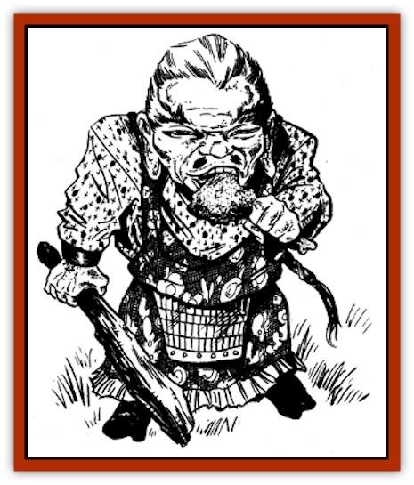

# P'oh

| Statistic | **P'oh** |
| --- | --- |
| **Activity Cycle:** | Any |
| **Alignment:** | Chaotic evil |
| **Armor Class:** | 4 |
| **Climate/Terrain:** | Temperate plains and hills |
| **Damage/Attack:** | 1-6 or by weapon type |
| **Diet:** | Special |
| **Frequency:** | Very rare |
| **Hit Dice:** | 5 |
| **Intelligence:** | High (13-14) |
| **Magic Resistance:** | Nil |
| **Morale:** | Average (10) |
| **Movement:** | 6 |
| **No. Appearing:** | 1 |
| **No. of Attacks:** | 1 |
| **Organization:** | Solitary |
| **Size:** | S (2-3' tall) |
| **Special Attacks:** | Drought |
| **Special Defenses:** | +1 or better weapons to hit |
| **THAC0:** | 15 |
| **Treasure:** | Q |
| **XP Value:** | 1,400 |

This diminutive humanoid boasts impressive powers, and is greatly feared by the common folk. He is among the most arrogant and obnoxious of the lesser spirits.

The p'oh stands no more than 3 feet tall. He has ruddy bronze skin and long red hair, often tied in a ponytail with dried vines. He has narrow eyes, either blue or green, a pug nose, and oversized ears. His thin mouth is usually twisted in a condescending grin. His stubby legs make him wobble when he walks. He wears gowns made of the finest silk, interwoven with threads of gold and silver.

The p'oh speaks the language of his own kind as well as the trade language.

**Combat:** A p'oh is more of a pest than a fighter, avoiding physical combat whenever possible. He will threaten, insult, and otherwise intimidate potential adversaries, attacking only as a last resort. When facing equal or inferior opponents who refuse to back down or give in to his demands, the p'oh will attack, fighting fearlessly and without mercy. When facing formidable foes who refuse to be intimidated, the p'oh usually will withdraw, rather than risk his own neck. He can become *invisible* at will.

If combat ensues, the p'oh attacks, wielding a club cut from a dead tree, or an iron rod instead. Occasionally, a p'oh carries a more common weapon, such as a katana or a wakizashi. In addition to the damage inflicted with each successful hit, the p'oh's victim must make a saving throw vs. spells. If the saving throw is successful, the victim suffers no further effect. If the saving throw fails, the victim is desiccated by the drying touch of the p'oh, and loses 1 point of Constitution. If the victim's Constitution drops to 2, the character cannot fight, stand, cast spells, or take any other actions. If his Constitution drops to 0, the victim is dead. If a desiccated victim survives his encounter with a p'oh, he recovers 1 Constitution point per day.

Common folk are most fearful of the p'oh's ability to *create drought* (as the wu jen spell). The p'oh can use this power once a week, affecting an area 5 miles in diameter. The drought persists until one of the following occurs: the p'oh cancels it, the p'oh is killed, or the spell is countered by *ice blight*.

**Habitat/Society:** The p'oh is a wandering spirit, active both day and night. He is most commonly encountered in agricultural lands well away from populous areas. Once the p'oh arrives in a suitable area, he locates a secure lair, such as a cave, a high plateau, or a hollow tree in a dense forest.

After the p'oh has chosen a lair, he appears to the peasants, announcing that he has honored them with his presence by settling in their area. The p'oh then demands that the peasants make weekly offerings to him (which the p'oh will collect while *invisible*). If the peasants make the requested offerings and the p'oh accepts them, the p'oh remains in the area, causing no mischief. If the offerings are insufficient, the p'oh will become angry and cause a drought to settle in the area. The drought continues until the peasants resume their offerings (or otherwise make peace with the p'oh), or until the p'oh is driven away or destroyed.

Offerings that a p'oh requests usually involve large quantities of water or other potables, as well as fruits and vegetables. Sometimes a p'oh intentionally demands ridiculous offerings from the peasants he oversees, either to test their resolve or simply to harass them. Such demands might include a basket of corn containing exactly 10,001 kernels, 100 gallons of water from a distant ocean, or an unmelted snowflake. If the villagers refuse or cannot comply, the p'oh punishes them with drought.

On rare occasions, the Celestial Emperor sends a p'oh to an area to punish the inhabitants for some transgression or crime. In such instances, the p'oh forgoes his normal requests for offerings, and leaves after he has caused a drought according to the Emperor's wishes. More often, however, the p'oh acts on his own initiative. Along country roads, peasants commonly erect small shrines in the p'oh's honor, in an attempt to keep these pesky creatures appeased.

**Ecology:** The p'oh can eat virtually anything, but he has an exceptional capacity for liquid nourishment. In a single sitting, he can guzzle gallons of water, milk, or wine.

---
## Discovery & Documentation

**Source Publication:** MC6 Kara-Tur Appendix (1990)
**Campaign Setting:** Kara-Tur (Forgotten Realms)
**Author(s):** Rick Swan

### Other Creatures Found in This Source Book
   * [[Bajang|Bajang]]
   * [[Bakemono|Bakemono]]
   * [[Bisan|Bisan]]
   * [[Buso|Buso]]
   * [[Carp_Giant|Carp, Giant]]
   * [[Centipede_Spirit|Centipede, Spirit]]
   * [[Chu-u|Chu-u]]
   * [[Con-tinh|Con-tinh]]
   * [[Doc_cu'o'c|Doc cu'o'c]]
   * [[Duruch'i-lin|Duruch'i-lin]]
   * [[Flame_Spirit|Flame Spirit]]
   * [[Foo_Creature|Foo Creature]]
   * [[Gaki|Gaki]]
   * [[Gargantua|Gargantua]]
   * [[Goblin_Rat|Goblin Rat]]
   * [[Hai_Nu|Hai Nu]]
   * [[Hannya|Hannya]]
   * [[Hengeyokai|Hengeyokai]]
   * [[Hsing-sing|Hsing-sing]]
   * [[Hu_Hsien|Hu Hsien]]
   * [[Human_Kara-Tur|Human (Kara-Tur)]]
   * [[Ikiryo|Ikiryo]]
   * [[Jishin_Mushi|Jishin Mushi]]
   * [[Kala|Kala]]
   * [[Kaluk|Kaluk]]
   * [[Kappa|Kappa]]
   * [[Korobokuru|Korobokuru]]
   * [[Krakentua|Krakentua]]
   * [[Kuei|Kuei]]
   * [[Memedi|Memedi]]
   * [[Men-shen|Men-shen]]
   * [[Nat|Nat]]
   * [[Ningyo|Ningyo]]
   * [[Oni|Oni]]
   * [[P'oh_Gohei|P'oh, Gohei]]
   * [[Shan_Sao|Shan Sao]]
   * [[Shirokinukatsukami|Shirokinukatsukami]]
   * [[Spirit_Folk|Spirit Folk]]
   * [[Spirit_Nature|Spirit, Nature]]
   * [[Spirit_Stone|Spirit, Stone]]
   * [[Tako|Tako]]
   * [[Tengu|Tengu]]
   * [[Wang-Liang|Wang-Liang]]
   * [[Yuan-ti_Histachii|Yuan-ti, Histachii]]
   * [[Yuki-on-na|Yuki-on-na]]
