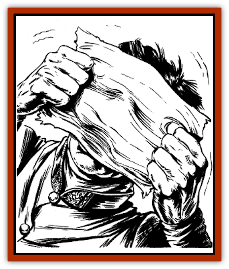

# P'oh - Gohei

| Statistic | **P'oh, Gohei** |
| --- | --- |
| **Activity Cycle:** | Any |
| **Alignment:** | Chaotic evil |
| **Armor Class:** | 3 |
| **Climate/Terrain:** | Any |
| **Damage/Attack:** | See below |
| **Diet:** | Special |
| **Frequency:** | Very rare |
| **Hit Dice:** | 1+5 |
| **Intelligence:** | Semi-(2-4) |
| **Magic Resistance:** | 20% |
| **Morale:** | Average (10) |
| **Movement:** | See below |
| **No. Appearing:** | 4-16 |
| **No. of Attacks:** | 1 |
| **Organization:** | Group |
| **Size:** | T (1' wide) |
| **Special Attacks:** | See below |
| **Special Defenses:** | Nil |
| **THAC0:** | 19 |
| **Treasure:** | Nil |
| **XP Value:** | 120 |

Gohei p'oh, also known as paper ghosts, are spirits that act as servitors and guards for evil wu jen.

In its most common form, a gohei p'oh resembles an ordinary piece of parchment, sized like a page from a book. The gohei p'oh is always blank. If a person tries to write on it, the ink disappears as soon as it touches the creature.

Gohei p'oh cannot speak, but they can understand simple phrases in the language common to the area.

**Combat:** A gohei p'oh will obey any simple command of the wu jen who created it. Typically, the gohei p'oh guards a room, and is ordered to attack any intruder who enters. He also may be ordered to destroy anyone who touches a particular object in the room, such as a desk or book. When following such a command, gohei p'oh will fight to the death.

Though they have no sensory organs, gohei p'oh can detect the presence of all living creatures within an area 20 feet in diameter. They can detect spirits, and intruders who are *invisible*. No one can surprise a gohei p'oh.

Gohei p'oh can fold themselves into several different forms. (The most common forms are listed below.) A transformation takes one full round, during which the paper spirit remains stationary and can take no other actions. This folding transformation also can occur while the gohei p'oh hovers in midair. The spirit can fold itself into any of these forms at will, as often as it desires. However, the powers of an individual form may be restricted in use.

Each form has its own movement rate, appearance, and abilities. All forms suffer double damage from normal and magical fire attacks.

**Page.** This is the gohei po'h's normal form, resembling the blank page of a book. The spirit moves by flapping itself; its movement rate is Fl 9 (C). It attacks by charging towards a victim's head. A successful attack roll means the spirit has plastered itself over the victim's face, and has begun to absorb his breath. The victim immediately suffers 1-4 hit points of damage, and automatically loses an additional 1-4 points in each subsequent round. A successful Strength check allows the victim to wrench the page from his face; two companions whose Strength totals at least 20 points can pull it off automatically. Because this is the gohei p'oh's most vulnerable form, the spirit seldom uses it unless only a single victim is present.

**Dove.** This form resembles a dove made of folded paper. It has a movement rate of Fl 24 (A). The dove attacks by slashing victims with the sharp edge of its wing, inflicting 1-4 hit points of damage.

**Pinwheel.** This form resembles a pinwheel of folded paper. It boasts a movement rate of Fl 12 (C), and can hover in midair indefinitely. When hovering, it can blast a column of air at any victim up to 10 feet away (make a normal attack roll) to inflict 1-4 hit points of damage. The air-blast victim must also make a Dexterity Check; failure means he is blown to the ground or against an object, suffering an additional 1-2 hit points of damage.

**Box.** This form, the gohei po'h's most dangerous, resembles a small box or satchel. The spirit has a movement rate of Fl 3 (C). If the spirit comes within 3 feet of a victim and makes a successful attack roll, the victim is sucked inside the box and is immediately transported to a random location in the Ethereal Plane. (The victim will have to find his own way back.) A gohei p'oh in box form can "swallow" only one victim a day. Instead of "swallowing" a victim, the boxlike spirit can turn itself inside out. This maneuver effectively allows it to "swallow" itself and escape to the Ethereal Plane. The spirit must remain there for a full day, after which it can "swallow" itself again and return to its original location.

**Habitat/Society:** To create gohei p'oh, an evil wu jen uses any book of evil lore. He subjects several pages of the book to a series of corrupting ceremonies. Month by month, the words on the parchment gradually fade. After six months, the pages are blank, and the gohei p'oh have been created. Wu jen typically create four gohei p'oh at a time.

**Ecology:** Gohei p'oh can erase printed words from any type of book, which can lie up to 1 foot away from the spirit. Usually, the gohei p'oh assumes its page form and inserts itself inside a thick volume, where it consumes words at the rate of about 1 page per day.

---
## Discovery & Documentation

**Source Publication:** MC6 Kara-Tur Appendix (1990)
**Campaign Setting:** Kara-Tur (Forgotten Realms)
**Author(s):** Rick Swan

### Other Creatures Found in This Source Book
   * [[Bajang|Bajang]]
   * [[Bakemono|Bakemono]]
   * [[Bisan|Bisan]]
   * [[Buso|Buso]]
   * [[Carp_Giant|Carp, Giant]]
   * [[Centipede_Spirit|Centipede, Spirit]]
   * [[Chu-u|Chu-u]]
   * [[Con-tinh|Con-tinh]]
   * [[Doc_cu'o'c|Doc cu'o'c]]
   * [[Duruch'i-lin|Duruch'i-lin]]
   * [[Flame_Spirit|Flame Spirit]]
   * [[Foo_Creature|Foo Creature]]
   * [[Gaki|Gaki]]
   * [[Gargantua|Gargantua]]
   * [[Goblin_Rat|Goblin Rat]]
   * [[Hai_Nu|Hai Nu]]
   * [[Hannya|Hannya]]
   * [[Hengeyokai|Hengeyokai]]
   * [[Hsing-sing|Hsing-sing]]
   * [[Hu_Hsien|Hu Hsien]]
   * [[Human_Kara-Tur|Human (Kara-Tur)]]
   * [[Ikiryo|Ikiryo]]
   * [[Jishin_Mushi|Jishin Mushi]]
   * [[Kala|Kala]]
   * [[Kaluk|Kaluk]]
   * [[Kappa|Kappa]]
   * [[Korobokuru|Korobokuru]]
   * [[Krakentua|Krakentua]]
   * [[Kuei|Kuei]]
   * [[Memedi|Memedi]]
   * [[Men-shen|Men-shen]]
   * [[Nat|Nat]]
   * [[Ningyo|Ningyo]]
   * [[Oni|Oni]]
   * [[P'oh|P'oh]]
   * [[Shan_Sao|Shan Sao]]
   * [[Shirokinukatsukami|Shirokinukatsukami]]
   * [[Spirit_Folk|Spirit Folk]]
   * [[Spirit_Nature|Spirit, Nature]]
   * [[Spirit_Stone|Spirit, Stone]]
   * [[Tako|Tako]]
   * [[Tengu|Tengu]]
   * [[Wang-Liang|Wang-Liang]]
   * [[Yuan-ti_Histachii|Yuan-ti, Histachii]]
   * [[Yuki-on-na|Yuki-on-na]]
