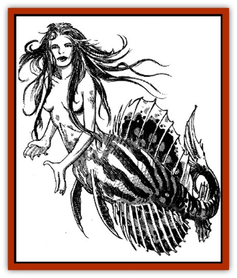

# Pahari

| Statistic | **Pahari** |
| --- | --- |
| **Activity Cycle:** | Any |
| **Alignment:** | Chaotic good |
| **Armor Class:** | 7 |
| **Climate/Terrain:** | Tropical/Seas and oceans |
| **Damage/Attack:** | By weapon type or spell |
| **Diet:** | Carnivore |
| **Frequency:** | Uncommon |
| **Hit Dice:** | 3-6 |
| **Intelligence:** | Very to Genius (11-18) |
| **Magic Resistance:** | 25% |
| **Morale:** | Average (10) |
| **Movement:** | 12, Sw18 or Sw 24 |
| **No. Appearing:** | 2-20 |
| **No. of Attacks:** | 1 |
| **Organization:** | Community |
| **Size:** | M (5-6' long) |
| **Special Attacks:** | Spells |
| **Special Defenses:** | Spells |
| **THAC0:** | 3-4 HD: 17 / 5-6 HD: 15 |
| **Treasure:** | U (Q&times;10,A) |
| **XP Value:** | 650 + 400 per hit die above 3. |

Pahari are shapeshifting, marine [[Nymph|nymphs]] that dwell in Zakhara's seas and oceans. In their natural forms, they are similar in appearance to [[Merman|mermaids]]. They are also able to assume the form of a small fish and that of a beautiful woman.

The upper body of a pahari is that of a perfectly formed woman, more beautiful than the fullest moon. The lower body of a pahari is that of a fish, its scales either blue, green, or ruby red. They prefer this form above all others, although they can assume two other shapes for an emergency or adventure.

Their piscine form resembles a colorful tropical fish, approximately 12" in length. In this form they can swim at speed 24 and easily evade large predators by hiding in the small niches and crevices of a reef or ocean floor.

Their human form matches the upper half of their natural shape, complete with a pair of slender and willowy legs. They only assume this shape when venturing onto land or ship, since in the water their other two forms are more maneuverable.

Pahari can breathe both both water and air. They live in underwater communities, but occasionally surface to gaze in fascination at land. The bravest of pahari work up the courage to sunbathe on rocks near shore or to approach ships and engage in conversation with sailors.

All pahari can speak their own language and Common. They can also communicate with all [[Fish|fish]] and [[Elemental_Water_Kin|nereids]]. The most intelligent pahari can learn up to four additional languages, choosing from among those spoken by [[Dolphin|dolphins]], [[Giant_Reef|reef giants]], [[Whale|whales]], and [[Zaratan|zaratani]].

**Combat:** Normally shy and peace-loving creatures, pahari are loathe to enter into combat. They can fight with any weapon provided, but rarely ever carry any themselves. They are fond of magical items, however, and will use them in combat if needed.

Pahari are potent spell-casters. Most are elemental wizards, casting spells at a level equal to twice their Hit Dice (i.e., a 4 HD pahari can cast spells as an 8th-level wizard). Almost all choose water as their element of specialization. Their favorite spells include *airy water*, *command water spirits*, *conjure (water) elemental*, *converse with sea creatures*, *float*, *sea sight*, *ship of fools*, *strengthen water creatures*, *waterbane*, and *water blast*.

Pahari can polymorph into another of their three forms once per round, at will.

**Habitat/Society:** Pahari dwell in small communities on the sea bed, often close to shore. They gather kelp and seaweed, which forms the staple part of their diet, eating small amounts of shellfish and mollusks as well. They never eat fish, considering the act akin to cannibalism.

A community of pahari consists of 2-20 individuals, evenly divided in size and Hit Dice. They make small homes out of shells and coral and tend a garden of kelp or seaweed nearby. A community of more than five pahari will have a 50% chance of being attended by 2-12 dolphins.

The pahari are adventuresome and regard surface dwellers with a fascination that borders on obsession. They will collect anything that pertains to life above the waves (especially magical items), often welcoming sailors into their communities to hear them spin tales of their homelands. With this preoccupation about life above water, it is not uncommon for a younger pahari to venture onto land in her human form, if only to spend a day shocking the villagers (who promptly find her some clothes), eating surface food, dancing, and singing long into the night before returning home. A few have been known to stay longer (although this is discouraged by the older, wiser pahari), even marrying a good-aligned surface dweller in some instances.

Like most faerie creatures, pahari have a very long life span (300-400 years). They soon outlive a human husband, afterward returning home to the sea for good. The older pahari, many who have already experienced this heartbreaking loss, do their best to console their newly-returned sister. As a general rule, the older and wiser pahari prefer short, frequent encounters with surface dwellers.

**Ecology:** Pahari are staunch protectors of their marine environment and oppose evil sea creatures, like [[Hag|sea hags]], at every opportunity. A pahari's kiss can bestow *water breathing* on the lucky recipient for a day.

---
## Discovery & Documentation

**Source Publication:** MC13 Al-Qadim Appendix (1992)
**Campaign Setting:** Al-Qadim (Forgotten Realms)
**Author(s):** C. Terry Phillips

### Other Creatures Found in This Source Book
   * [[Ammut|Ammut]]
   * [[Ashira|Ashira]]
   * [[Asuras|Asuras]]
   * [[Black_Cloud_of_Vengeance|Black Cloud of Vengeance]]
   * [[Buraq|Buraq]]
   * [[Camel|Camel]]
   * [[Camel_of_the_Pearl|Camel of the Pearl]]
   * [[Centaur_Desert|Centaur, Desert]]
   * [[Copper_Automaton|Copper Automaton]]
   * [[Debbi|Debbi]]
   * [[Elephant_Bird|Elephant Bird]]
   * [[Gen|Gen]]
   * [[Genie_Noble_Dao|Genie, Noble Dao]]
   * [[Genie_Noble_Djinni|Genie, Noble Djinni]]
   * [[Genie_Noble_Efreeti|Genie, Noble Efreeti]]
   * [[Genie_Noble_Marid|Genie, Noble Marid]]
   * [[Genie_Tasked_Architect_Builder|Genie, Tasked, Architect/Builder]]
   * [[Genie_Tasked_Artist|Genie, Tasked, Artist]]
   * [[Genie_Tasked_Guardian|Genie, Tasked, Guardian]]
   * [[Genie_Tasked_Herdsman|Genie, Tasked, Herdsman]]
   * [[Genie_Tasked_Slayer|Genie, Tasked, Slayer]]
   * [[Genie_Tasked_Warmonger|Genie, Tasked, Warmonger]]
   * [[Genie_Tasked_Winemaker|Genie, Tasked, Winemaker]]
   * [[Ghost_Mount|Ghost Mount]]
   * [[Ghul|Ghul]]
   * [[Giant_Desert|Giant, Desert]]
   * [[Giant_Jungle|Giant, Jungle]]
   * [[Giant_Reef|Giant, Reef]]
   * [[Giant_Zakhara_General_Information|Giant (Zakhara), General Information]]
   * [[Hama|Hama]]
   * [[Heway|Heway]]
   * [[Living_Idol|Living Idol]]
   * [[Lycanthrope_Werehyena|Lycanthrope, Werehyena]]
   * [[Lycanthrope_Werelion|Lycanthrope, Werelion]]
   * [[Markeen|Markeen]]
   * [[Maskhi|Maskhi]]
   * [[Mason_Wasp_Giant|Mason Wasp, Giant]]
   * [[Nasnas|Nasnas]]
   * [[Rom|Rom]]
   * [[Sabu_Lord|Sabu Lord]]
   * [[Sakina|Sakina]]
   * [[Serpent_Lord|Serpent Lord]]
   * [[Serpent_Winged|Serpent, Winged]]
   * [[Silat|Silat]]
   * [[Simurgh|Simurgh]]
   * [[Stone_Maiden|Stone Maiden]]
   * [[Vishap|Vishap]]
   * [[Zaratan|Zaratan]]
   * [[Zin|Zin]]
