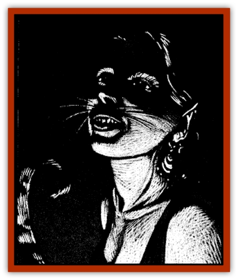

# Paka

| Statistic | **Paka** |
| --- | --- |
| **Activity Cycle:** | Day or night |
| **Alignment:** | Chaotic evil |
| **Armor Class:** | 6 |
| **Climate/Terrain:** | Ravenloft |
| **Damage/Attack:** | 1d6/1d6 or by weapon |
| **Diet:** | Carnivore |
| **Frequency:** | Rare |
| **Hit Dice:** | Varies |
| **Intelligence:** | Average to supra-genius (8-19) |
| **Magic Resistance:** | 20% |
| **Morale:** | Steady (11-12) |
| **Movement:** | 15 |
| **No. Appearing:** | 3d6 |
| **No. of Attacks:** | 2 |
| **Organization:** | Pride |
| **Size:** | M |
| **Special Attacks:** | Springing |
| **Special Defenses:** | Healing |
| **THAC0:** | By class |
| **Treasure:** | U |
| **XP Value:** | 1,000 |

Paka are an ancient and sinister race of shapechanging feline humanoids who prey upon the settlements of humankind. Able to pass easily for human, they can spend years sowing evil before their true nature is discovered.

The appearance of a paka is that of a slender and fit but otherwise normal human. They are lithe, supple, and capable of amazing feats of agility, though they will never let non-paka who see these displays live. Female paka almost always have orange hair that turns dark gray as they age. Male paka may have any color hair except dark brown. The eyes of a paka shine red if caught in the light.

Paka can change their shape to more resemble their feline origins, but they are not [[Lycanthrope_General_Information|lycanthropes]] and cannot transmit their powers in any way. When transformed, the paka's face becomes much more catlike, developing a smaller blackish nose, whiskers, and sharp teeth.

In either form, paka have sharp claws on their hands. These are retractable, however, and only a careful examination of the creature will reveal them when they are not extended.

Paka are skilled linguists who will almost always be able to speak half a dozen human languages in addition to their own tongue. Many of these creatures can also converse with lycanthropes such as [[Lycanthrope_Wereleopard|wereleopards]] and [[Lycanthrope_Weretiger|weretigers]].

**Combat:** Paka, or *cat people* as the [[Human_Vistana|Vistani]] call them, are supple and malicious fighters who love to torment their prey before finally killing it.

Paka can leap great distances, up to 40' in a horizontal direction with a running start, 15' without, or 15' straight up. They often use this ability to spring at their opponents and catch them by surprise. Paka who attack with surprise double their damage in the first round.

Most paka like to use their natural claws to slice their victim's flesh, but many have acquired powerful weapons from past victims and have learned to use them effectively. A paka that attacks with its claws may strike twice in any combat round, inflicting 1d6 points of damage with each successful hit. Their weapons cause their normal damage, but paka may attack twice per round with any small or medium weapon due to their amazing agility. These claws are retractable in either the humanoid or feline form.

Any normal feline within 50 feet can be telepathically commanded by a paka. The paka can see through the animal's eyes and hear through its ears. The only way to break this link is via an anti-magic shell or similar barrier.

Paka will often torment those they dislike by commanding a horde of angry felines to physically attack someone. Such a cat swarm is generally made up of 5-10 (1d6+4) Hit Dice worth of animals. In towns and villages, these will be [[Cat_Small|domesticated pets]]. In a wilderness setting, they will be more [[Cat_Great|deadly beasts]].

Paka have an innate healing ability. By licking a wound clean, paka can regain 2d4 lost hit points per day. They may lick the wounds of others once per day as well as their own.

**Habitat/Society:** The paka's control of cats also allows it to create dangerous traps or incite malicious behavior. Gossip overheard through the cat's ears can be repeated to make one person think another has violated their trust. The trouble that such a simple action can cause is often overwhelming.

Finally, paka can use their feline friends to set simple traps that will maim or kill their masters. Typical tricks include dragging a quilt into the fire to burn down a house, pushing a heavy vase or other object off a mantle and onto someone's head, or simply dragging things onto steep staircases to trip someone.

One method for detecting a paka is through [[Dog|dogs]] and other canines. Domesticated animals will bark and raise their hackles; feral canines will attack. Even [[Lycanthrope_Werewolf|werewolves]] (in human or wolfen form) will take an instant disliking to a paka. This doesn't necessarily mean that the lycanthrope will know a cat person for what it truly is, but something about it will just seem wrong.

The most vicious racial trait of the paka is a deep-rooted desire for revenge. Whenever someone crosses its path, harms another paka, or foils one of its plans, the creature and its closest friends will plot together to bring the offender to his knees. If a paka is ever killed, the entire pride will plan and cause the killer's slow and agonizing death.

Within the settlements of humankind, paka stay publicly separate from one another, but secretly form a very tight-knit pride within their community. If any individual is threatened, he can usually call on 3d6 others for help within an hour. Paka cannot exercise their telepathic abilities between one another, but they can send messages through any other feline.

Paka can be any class, though many are multi-classed as thieves. The only classes closed to the paka are paladins, bards, specialist wizards, and druids.

Paka who opt to be thieves may advance to the 10th level of experience. Such characters add +20% to their climb walls ability, but suffer a -10% penalty to pick pockets and open locks.

Paka wizards may advance to 11th level, and always have a cat familiar. Their spells tend to lean toward those that affect the mental faculties, with only a few offensive spells such as *fireball* or *lightning bolt*.

Priests of this race may advance to 8th level and gain all the benefits thereof. They worship a strange figure they refer to as the "[[Animal_Lord|Cat Lord]]", though even they admit they know little about him or his origins. Paka priests cannot control or turn undead.

Warriors have unlimited advancement, and may specialize and gain all other benefits available to their class. Rangers are common, but their species enemy is always humans. When the ranger is eligible to gain followers, 2d6 wereleopards will be the creatures that flock to his side.

Every community of 5 or more paka has a priest of at least 5th level that serves as a leader. He cannot really force any paka to do his will any more than any other, but others generally respect the priest's decisions as being handed down from the Cat Lord. The priest looks no different from any other disguised paka, but many of them pose as "good" clerics in the village. This amuses the evil beings and they often use their special status to cause far more harm than good.

Their purpose in life seems one of sheer revenge for some wrong done to their species in older times. No paka has ever admitted knowing what this wrong was, or even if it occurred in Ravenloft of elsewhere, but they are sure it was the human race that caused it. For this they have infiltrated the people of the land and consciously work to cause them suffering and hardship.

**Ecology:** Paka eat only meat. This has occasionally been used as a method of identification by perceptive adventurers.

Paka do not mate for life, preferring to remain allied to the pride instead. A female paka can bear young once per year, though most bear but a single litter of 1-6 kittens in their lifetime. The paka have no concept of a father, but ties to the mother are very strong. She and all other paka in the pride are responsible for teaching the children their heritage and the ways in which they keep their identity secret from their neighbors.

---
## Discovery & Documentation

**Source Publication:** Ravenloft Appendix III (1991)
**Campaign Setting:** Ravenloft
**Author(s):** Kirk Botulla

### Other Creatures Found in This Source Book
   * [[Akikage|Akikage]]
   * [[Animator_Common|Animator, Common]]
   * [[Animator_Greater|Animator, Greater]]
   * [[Animator_Minor|Animator, Minor]]
   * [[Animator_General_Information|Animator, General Information]]
   * [[Bakhna_Rakhna|Bakhna Rakhna]]
   * [[Baobhan_Sith|Baobhan Sith]]
   * [[Beetle_Scarab|Beetle, Scarab]]
   * [[Boneless|Boneless]]
   * [[Boowray|Boowray]]
   * [[Bruja|Bruja]]
   * [[Carrionette|Carrionette]]
   * [[Carrion_Stalker|Carrion Stalker]]
   * [[Cat_Midnight|Cat, Midnight]]
   * [[Cat_Skeletal|Cat, Skeletal]]
   * [[Cloaker_Resplendent|Cloaker, Resplendent]]
   * [[Cloaker_Shadow|Cloaker, Shadow]]
   * [[Cloaker_Undead|Cloaker, Undead]]
   * [[Corpse_Candle|Corpse Candle]]
   * [[Death's_Head_Tree|Death's Head Tree]]
   * [[Doppelganger_Ravenloft|Doppelganger (Ravenloft)]]
   * [[Familiar_Pseudo-|Familiar, Pseudo-]]
   * [[Familiar_Undead|Familiar, Undead]]
   * [[Feathered_Serpent|Feathered Serpent]]
   * [[Fenhound|Fenhound]]
   * [[Figurine_Ceramic|Figurine, Ceramic]]
   * [[Figurine_Crystal|Figurine, Crystal]]
   * [[Figurine_Ivory|Figurine, Ivory]]
   * [[Figurine_Obsidian|Figurine, Obsidian]]
   * [[Figurine_Porcelain|Figurine, Porcelain]]
   * [[Figurine_General_Information|Figurine, General Information]]
   * [[Fleas_of_Madness|Fleas of Madness]]
   * [[Furies|Furies]]
   * [[Geist|Geist]]
   * [[Ghost_Animal|Ghost, Animal]]
   * [[Golem_Flesh_Ravenloft|Golem, Flesh (Ravenloft)]]
   * [[Golem_Mist_Ravenloft|Golem, Mist (Ravenloft)]]
   * [[Golem_Wax_Ravenloft|Golem, Wax (Ravenloft)]]
   * [[Gremishka|Gremishka]]
   * [[Hag_Spectral|Hag, Spectral]]
   * [[Head_Hunter|Head Hunter]]
   * [[Hearth_Fiend|Hearth Fiend]]
   * [[Hebi-No-Onna|Hebi-No-Onna]]
   * [[Hound_Phantom|Hound, Phantom]]
   * [[Hound_Skeletal|Hound, Skeletal]]
   * [[Imp_Wishing|Imp, Wishing]]
   * [[Ivy_Crawling|Ivy, Crawling]]
   * [[Jack_Frost|Jack Frost]]
   * [[Jolly_Roger|Jolly Roger]]
   * [[Kizoku|Kizoku]]
   * [[Lashweed|Lashweed]]
   * [[Leech_Magical|Leech, Magical]]
   * [[Leech_Psionic|Leech, Psionic]]
   * [[Lich_Defiler|Lich, Defiler]]
   * [[Lich_Drow|Lich, Drow]]
   * [[Lich_Elemental|Lich, Elemental]]
   * [[Lich_Psionic|Lich, Psionic]]
   * [[Living_Tattoo|Living Tattoo]]
   * [[Lycanthrope_Loup-garou|Lycanthrope, Loup-garou]]
   * [[Lycanthrope_Werejackal|Lycanthrope, Werejackal]]
   * [[Lycanthrope_Werejaguar_Ravenloft|Lycanthrope, Werejaguar (Ravenloft)]]
   * [[Lycanthrope_Wereleopard|Lycanthrope, Wereleopard]]
   * [[Lycanthrope_Wereray|Lycanthrope, Wereray]]
   * [[Mist_Ferryman|Mist Ferryman]]
   * [[Moor_Man|Moor Man]]
   * [[Obedient|Obedient]]
   * [[Odem|Odem]]
   * [[Plant_Blood_Rose|Plant, Blood Rose]]
   * [[Plant_Fearweed|Plant, Fearweed]]
   * [[Radiant_Spirit|Radiant Spirit]]
   * [[Recluse|Recluse]]
   * [[Remnant_Aquatic|Remnant, Aquatic]]
   * [[Rushlight|Rushlight]]
   * [[Sea_Spawn_Master|Sea Spawn, Master]]
   * [[Sea_Spawn_Minion|Sea Spawn, Minion]]
   * [[Shadow_Asp|Shadow Asp]]
   * [[Shattered_Brethren|Shattered Brethren]]
   * [[Skeleton_Archer|Skeleton, Archer]]
   * [[Skeleton_Insectoid|Skeleton, Insectoid]]
   * [[Skin_Thief|Skin Thief]]
   * [[Spirit_Psionic|Spirit, Psionic]]
   * [[Strahd_Skeleton|Strahd Skeleton]]
   * [[Strahd_Zombie|Strahd Zombie]]
   * [[Unicorn_Shadow|Unicorn, Shadow]]
   * [[Vampire_Drow|Vampire, Drow]]
   * [[Vampire_Nosferatu|Vampire, Nosferatu]]
   * [[Vampire_Oriental|Vampire, Oriental]]
   * [[Virus_General_Information|Virus, General Information]]
   * [[Virus_I|Virus I]]
   * [[Virus_II|Virus II]]
   * [[Virus_III|Virus III]]
   * [[Vorlog|Vorlog]]
   * [[Will_O'Dawn|Will O'Dawn]]
   * [[Will_O'Deep|Will O'Deep]]
   * [[Will_O'Mist|Will O'Mist]]
   * [[Will_O'Sea|Will O'Sea]]
   * [[Zombie_Cannibal|Zombie, Cannibal]]
   * [[Zombie_Desert|Zombie, Desert]]
   * [[Zombie_Wolf|Zombie Wolf]]
   * [[Zombie_Fog|Zombie Fog]]
