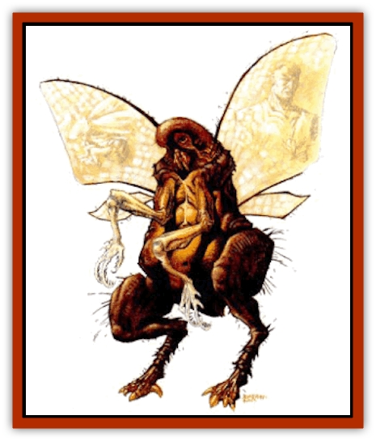

# Pakubrazi

| Statistic | **Pakubrazi** |
| --- | --- |
| **Activity Cycle:** | Any |
| **Alignment:** | Chaotic evil |
| **Armor Class:** | 9 or 6, or by armor |
| **Climate/Terrain:** | Urban and inhabited areas |
| **Damage/Attack:** | 2d4+2/2d4+2/1d4, or weapon +3 |
| **Diet:** | Omnivore |
| **Frequency:** | Uncommon |
| **Hit Dice:** | 6 |
| **Intelligence:** | Average (8-10) |
| **Magic Resistance:** | Nil |
| **Morale:** | Fanatic (17.18) |
| **Movement:** | 12, F1 18 (D) |
| **No. Appearing:** | 1-4 (1d4) |
| **No. of Attacks:** | 3 |
| **Organization:** | Solitary |
| **Size:** | L (10' long) |
| **Special Attacks:** | See below |
| **Special Defenses:** | See below |
| **THAC0:** | 15, or 14 w/weapon |
| **Treasure:** | B,R |
| **XP Value:** | 975 |

Pakubrazi are insect creatures that feed on the blood of living creatures. They look like crosses between [[Insect_Giant|giant ticks]] and [[Insect_Giant|giant flies]].

A pakubrazi can shapechange any part or all of its body into humanoid form. The pakubrazi can pick the race, but not the individual features. The humanoid shape for each race is always the same, and can be recognized if seen again. The individual pieces that can be formed are: primary legs, secondary insect legs, arms, eyes, feeders, head, carapace, torso with wings. This flexibility allows for a wide variety of hybrid forms.

**Combat:** In its natural insect form, a pakubrazi can attack with two claws and a bite. The two claws are not very large, but the extraordinary strength of the creature allows it to do significant amounts of damage. Using humanoid hands it can wield a weapon with a Strength of 19. The bite is actually a feeder tube which extrudes from the mouth to puncture the skin. Once it hits, the pakubrazi can automatically draw 1-2 points of Constitution every round. Death occurs if the victim is drained to zero. A pakubrazi needs 20 points a week for basic sustenence. Victims regain 1 point a day.

Any humanoid creature bitten by a pakubrazi may become tainted. If enough Pakubrazi genetic material gets into the blood stream of the humanoid, it will try to force the person to change. The body�s immune system will fight the taint. There is a 5% chance per point of Constitution drained that the victim will become tainted.

During any moment of excitement or stress, there is a 10% chance that the tainted creature will change 1d6 parts of its body into insect forms. The person becomes a wild beast lusting after the blood of the nearest available victim. The change lasts for 1d4x10 rounds, or until the tainted creature drains 10 points of blood. It is rumored that the [[Halfling_Athas|halflings]] may know a cure for the taint, but nothing else short of a *wish* spell will rid a body of pakubrazi taint.

| 1d8 | Changes | 1d8 | Changes |
| --- | --- | --- | --- |
| 1 | Primary legs | 5 | Feeder tubes |
| 2 | Secondary legs | 6 | Whole head |
| 3 | Arms | 7 | Carapace |
| 4 | Eyes | 8 | Torso w/wings |

When it has a human torso, its Armor Class is 9. The insect carapace gives it an Armor Class of 6. It can retain a basically human shape and be protected by the carapace. Although its secondary insect legs cannot attack, they do allow it to climb vertical surfaces, and even hang from ceilings. A pakubrazi needs small cracks, bumps or somethings to cling to when climbing.

**Habitat/Society:** Pakubrazi are parasites, living off of other civilized races. They maintain a charade of normal life among these races, and are masterful actors. Frequently solitary, they are capable of cooperating in small groups. Each Pakubrazi or cooperative group establishes its own hunting territory. They defend this territory to the death.

**Ecology:** Pakubrazi are thought to be a remnant of the Green Age. On rare occasions, pakubrazi blood has been used to intentionally taint an enemy by slipping it into his food. It makes a horrific form of revenge.

---
## Discovery & Documentation

**Source Publication:** Dark Sun Appendix II - Terrors Beyond Tyr (1991)
**Campaign Setting:** Dark Sun
**Author(s):** Jim Atkiss, Steve Brown, Timothy B. Brown, Andrew P. Morris, Bruce Nesmith, Wes Nicholson, Bill Slavicsek

### Other Creatures Found in This Source Book
   * [[Aarakocra_Athas|Aarakocra (Athas)]]
   * [[Animal_Domestic_Athas_II|Animal, Domestic (Athas) II]]
   * [[Aviarag|Aviarag]]
   * [[Baazrag|Baazrag]]
   * [[Baazrag_Boneclaw|Baazrag, Boneclaw]]
   * [[Bloodgrass|Bloodgrass]]
   * [[Cactus_Hunting|Cactus, Hunting]]
   * [[Cactus_Rock|Cactus, Rock]]
   * [[Cilops|Cilops]]
   * [[Crodlu|Crodlu]]
   * [[Dagorran|Dagorran]]
   * [[Dhaot|Dhaot]]
   * [[Drake_Lesser_Athas_General_Information|Drake, Lesser (Athas), General Information]]
   * [[Drake_Lesser_Athas_Magma|Drake, Lesser (Athas), Magma]]
   * [[Drake_Lesser_Athas_Rain|Drake, Lesser (Athas), Rain]]
   * [[Drake_Lesser_Athas_Silt|Drake, Lesser (Athas), Silt]]
   * [[Drake_Lesser_Athas_Sun|Drake, Lesser (Athas), Sun]]
   * [[Dray|Dray]]
   * [[Drik|Drik]]
   * [[Dune_Reaper|Dune Reaper]]
   * [[Dwarf_Athas|Dwarf (Athas)]]
   * [[Elemental_Beast_Athas_Air|Elemental Beast (Athas), Air]]
   * [[Elemental_Beast_Athas_Earth|Elemental Beast (Athas), Earth]]
   * [[Elemental_Beast_Athas_Fire|Elemental Beast (Athas), Fire]]
   * [[Elemental_Beast_Athas_Water|Elemental Beast (Athas), Water]]
   * [[Elf_Athas|Elf (Athas)]]
   * [[Fael|Fael]]
   * [[Feylaar|Feylaar]]
   * [[Fordorran|Fordorran]]
   * [[Giant_Half-giant|Giant, Half-giant]]
   * [[Giant_Shadow|Giant, Shadow]]
   * [[Golem_Athas_Magma|Golem (Athas), Magma]]
   * [[Golem_Athas_Salt|Golem (Athas), Salt]]
   * [[Golem_Athas_General_Information|Golem (Athas), General Information]]
   * [[Gorak|Gorak]]
   * [[Halfling_Athas|Halfling (Athas)]]
   * [[Human_Athas|Human (Athas)]]
   * [[Jhakar|Jhakar]]
   * [[Kaisharga|Kaisharga]]
   * [[Kes'trekel|Kes'trekel]]
   * [[Klar|Klar]]
   * [[Krag|Krag]]
   * [[Kragling|Kragling]]
   * [[Lirr|Lirr]]
   * [[Mastyrial|Mastyrial]]
   * [[Meorty|Meorty]]
   * [[Mul|Mul]]
   * [[Nikaal|Nikaal]]
   * [[Paraelemental_Beast_General_Information|Paraelemental Beast, General Information]]
   * [[Paraelemental_Beast_Magma|Paraelemental Beast, Magma]]
   * [[Paraelemental_Beast_Rain|Paraelemental Beast, Rain]]
   * [[Paraelemental_Beast_Silt|Paraelemental Beast, Silt]]
   * [[Paraelemental_Beast_Sun|Paraelemental Beast, Sun]]
   * [[Psionocus|Psionocus]]
   * [[Psurlon|Psurlon]]
   * [[Raaig|Raaig]]
   * [[Retriever_Obsidian|Retriever, Obsidian]]
   * [[Ruktoi|Ruktoi]]
   * [[Ruvoka_Athas|Ruvoka (Athas)]]
   * [[Sand_Howler|Sand Howler]]
   * [[Scorpion_Athas|Scorpion (Athas)]]
   * [[Seed_Brain|Seed, Brain]]
   * [[Silt_Horror_Black|Silt Horror, Black]]
   * [[Silt_Horror_Magma|Silt Horror, Magma]]
   * [[Silt_Horror_Red|Silt Horror, Red]]
   * [[Silt_Spawn|Silt Spawn]]
   * [[Slig|Slig]]
   * [[Spider_Athas|Spider (Athas)]]
   * [[Spinewyrm|Spinewyrm]]
   * [[Ssurran|Ssurran]]
   * [[Stalking_Horror|Stalking Horror]]
   * [[Tarek|Tarek]]
   * [[Tari|Tari]]
   * [[Thri-kreen|Thri-kreen]]
   * [[T'liz|T'liz]]
   * [[Tohr-kreen_II|Tohr-kreen II]]
   * [[Tohr-kreen_III|Tohr-kreen III]]
   * [[Trin|Trin]]
   * [[Tul'k|Tul'k]]
   * [[Undead_Athas_General_Information|Undead (Athas), General Information]]
   * [[Wraith_Athas|Wraith (Athas)]]
   * [[Xerichou|Xerichou]]
   * [[Zombie_Thinking|Zombie, Thinking]]
