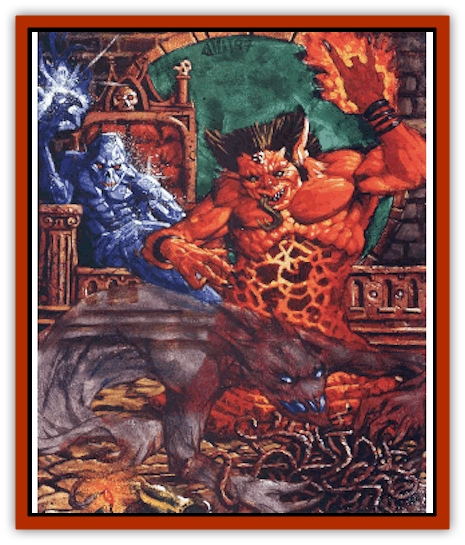

# Paraelemental

| Statistic | **Ice** | **Magma** | **Ooze** | **Smoke** |
| --- | --- | --- | --- | --- |
| **Activity Cycle:** | Any | Any | Any | Any |
| **Alignment:** | Neutral | Neutral | Neutral | Neutral |
| **Armor Class:** | 3 | 3 | 0 | 2 |
| **Climate/Terrain:** | Paraplane of Ice | Paraplane of Magma | Paraplane of Ooze | Paraplane of Smoke |
| **Damage/Attack:** | 3d8 | 3d6 | 2d8 | 2d8 |
| **Diet:** | Warmth | Any solid | Any solid | Air |
| **Frequency:** | Common | Common | Common | Common |
| **Hit Dice:** | 8, 12, or 16 | 8, 12, or 16 | 8, 12, or 16 | 8, 12, or 16 |
| **Intelligence:** | Low to high (5-14) | Low to high (5-14) | Low to high (5-14) | Low to high (5-14) |
| **Magic Resistance:** | Nil | Nil | Nil | Nil |
| **Morale:** | Champion (15-16) | Champion (15-16) | Champion (15-16) | Champion (15-16) |
| **Movement:** | 6 | 6 | 36 | Fl 18 (E) |
| **No. Appearing:** | 1d6 | 2d4 | 1d6 | 1d6 |
| **No. of Attacks:** | 1 | 1 | 1 | Special |
| **Organization:** | Band | Band | Band | Band |
| **Size:** | L (8-16' tall) | L (8-16' tall) | L (8-16' tall) | L (8-16' tall) |
| **Special Attacks:** | Cold aura | Heat aura | Multiple tendrils | Blinding smoke |
| **Special Defenses:** | See below | See below | See below | See below |
| **THAC0:** | 8 HD: 13 / 12 HD: 9 / 16 HD: 5 | 8 HD: 13 / 12 HD: 9 / 16 HD: 5 | 8 HD: 13 / 12 HD: 9 / 16 HD: 5 | 8 HD: 13 / 12 HD: 9 / 16 HD: 5 |
| **Treasure:** | Nil | Nil | Nil | Nil |
| **XP Value:** | 8 HD: 7.000 / 12 HD: 11,000 / 16 HD: 15,000 | 8 HD: 3,000 / 12 HD: 7,000 / 16 HD: 11,000 | 8 HD: 3,000 / 12 HD: 7,000 / 16 HD: 11,000 | 8 HD: 3,000 / 12 HD: 7,000 / 16 HD: 11,000 |

Between the Elemental Planes of Air, Earth, Fire, and Water lie four others - the Paraelemental Planes - that represent different combinations of those elements. And whereas the Elemental Planes spawn [[Elemental_General_Information|elementals]], the Paraelemental Planes create, naturally enough, paraelementals - creatures that embody the natures of Ice, Magma, Ooze, and Smoke. The four kinds of paraelementals are

generally regarded as slightly less powerful than elementals, yet still mightier than quasielementals (though plenty of inner-planar scholars dispute such rankings). Due to the nature of their home planes - which are, more or less, mixtures of two elements - parelementals're often thought to exhibit dual characters, though this manifests Itself in different ways.

By and large, paraelementals help to sustain themselves by consuming their opposites. In other words, ice paraelementals drain warmth, smoke paraelementals ingest air, and so on. This strikes some as a bit odd - why wouldn't an ice creature keep itself alive by surrounding itself with cold? But that's the wrong kind of question, and the Rule of Threes explains why. First of all, paraelementals won't starve to death if they *don't* consume their opposites; after all, they're just spirits that shape bodies for themselves out of the substance of their home plane. Second, the paraplanes don't *have* much of their opposites, anyway - there just ain't a lot of warmth on Ice. And third, the paraelementals don't actually *eat* their opposites; rather, they gain sustenance from the sheer act of converting it. Thus, an ice paraelemental relishes draining away the heat of a fire, not consuming the actual warmth itself.

Many paraelementals aren't too smart, but those with better than low Intelligence usually prefer to communicate in their own language.

## Ice Paraelemental

From the plane of absolute cold, this tall, humanoid creature is utterly - dangerously - frigid. Its body is translucent white, made of icy crystals covered in patches of frost. Piercing blue eyes peer out of deep sockets.

Some folks refer to an ice paraelemental as a cold or frost paraelemental instead, but it's all the same thing.

**Combat:** The freezing touch of an ice paraelemental causes 3d8 points of damage, but it don't have to strike a sod to make him sorry. It also gives off intense cold the way a raging fire gives off heat, and all creatures within 10 feet suffer 1d4 points of damage per round from the numbing chill. What's more, the paraelemental is so cold that its touch freezes water (or similar fluids). It can freeze 100 square feet of watery liquid to a depth of 6 inches.

If wounded in some way, an ice paraelemental finds succor in cold environments. When in contact with natural ice, snow, or sleet, it automatically heals 1d8 hit points per round, up to its normal maximum. 'Course, this makes it sodding difficult to fight an ice paraelemental on its home paraplane.

All ice paraelementals can be struck only by +1 or better weapons, and they're completely immune to cold-based spells and magic. However, they're particularly vulnerable to heat-based attacks, which inflict twice their normal damage on the frosty creatures.

**Habitat/Society:** A good many ice paraelementals have turned from their neutrality to serve the evil lord [[Archomental_Evil|Cryonax]], one of the Princes of Elemental Evil. But he's not the only blood with status on the paraplane - numerous minor lords and nobles rule their fellow paraelementals. They simply ignore Cryonax and his evil, maintaining their pure devotion to cold and nothing more. Ice paraelemental rulers gain their positions through strength and respect, and are often challenged by their underlings.

However, a planewalker traveling to Ice isn't likely to encounter any nobles or rulers. Instead, he'll find paraelementals operating in small, leaderless groups, hunting for food or patrolling for intruders. Strife among these creatures rarely occurs.

**Ecology:** Any warmth at all - or rather, the act of draining such warmth - provides a little sustenance for ice paraelementals. They steal it from any source of heat, even slowly snuffing out normal fires burning nearby. As mentioned earlier, they don't actually consume the heat so much as convert it. Naturally, those same flames'd be dangerously destructive if applied to an ice paraelemental directly. Perhaps that's part of the reason they drain the warmth from fire - to prevent it from being used against them.

## Magma Paraelemental

The Paraelemental Plane of Magma is often confused with the Elemental Plane of Fire. While the conditions on Magma are dangerous to outsiders for many of the same reasons, Magma's as much about Earth as it is about Fire. That is, on the paraplane of Magma, the environment consists of molten rock - an uncommon substance on the plane of Fire, where there's little rock to melt.

From the waist up, a magma paraelemental resembles a huge, stocky humanoid being, but the lower portion of its body is nothing but an amorphous mass of molten stone. Most of its upper body is black rock, but a reddish heat shines from within - particularly from the eyes and mouth of the creature.

**Combat:** When it comes to combat, the magma paraelemental shares much with its icy cousin. Its super-heated touch inflicts 3d6 points of damage to a victim and sets combustibles (like wood) aflame.

However, the paraelemental's mere presence is also quite dangerous. Anyone within 20 feet of the creature is affected as if he were the target of an enhanced *heat metal* spell. That is, during the first round in the area, all metallic objects grow hot. During the second round, they inflict 1d4 points of damage to anyone in contact with them. In the third round (and all thereafter). anyone touching the scorching metal suffers 2d4 points of heat damage. What's more, at this point, even berks who aren't touching any metal sustain 1d4 points of damage from the incredible heat exuded by the monster.

Leaving the area reduces the effect by one step each round. For example, during the third round of close proximity to a magma paraelemental, a basher in plate mail armor suffers 2d4 points of damage. If he leaves the affected area, he suffers only 1d4 points of damage in the next round. In the round after that, his armor remains uncomfortably hot but inflicts no damage. And in the next round, the plate mail cools to its normal temperature.

A few cutters've pointed out an odd thing about the magma paraelemental: Although its touch causes less damage than that of a [[Elemental_Fire_Water|fire elemental]], it exudes a debilitating aura of heat, whereas the fire elemental doesn't. This is because, quite simply, the fire elemental consists of more concentrated flame. It retains its intense heat in any environment, whereas the magma paraelemental constantly gives off warmth. That makes its touch less fiery, sure, but it also accounts for its radius of heat - an acceptable trade-off.

Magma paraelementals can be struck only by +1 or better weapons, and they're immune to the effects of heat and flame. They suffer normal damage from cold-based attacks. However, if they sustain a number of points of cold damage equal to their Hit Dice - in other words, if an 8-HD paraelemental suffers 8 points of cold damage - the cold affects them as would a *slow* spell.

**Habitat/Society:** Magma paraelementals almost never travel alone. They roam their plane in packs, living in large communities that seem to have no leaders at all. A group of paraelementals is usually harmonious, though distrustful of (or even hostile to) outsiders. They often war with the [[Mephit_General_Information|mephits]] of their paraplane - clashes that almost always end very badly for the [[Mephit_VII_Magma_Ash|mephits]].

**Ecology:** Magma paraelementals enjoy melting solid objects into liquid forms. They also derive a bit of sustenance from such actions.

## Ooze Paraelemental

Called the mud elemental by some among the Clueless, this creature is a liquid mass of dark, writhing tendrils. Its malleable form allows it to squeeze through small openings and even under the cracks of doors.

**Combat:** The ooze paraelemental attacks by grappling with its tendrils and constricting its foes. A hit by the creature indicates that a tendril wraps around a sod and constricts him, causing 2d8 points of damage each round until the victim or the paraelemental dies (or until the paraelemental decides to call off the attack for some reason). While it constricts one foe, it can send out other tendrils to enwrap - and constrict - further victims with no limit, except that the creature can make only one new attack each round. Constricted sods can still make attacks and perform other actions, though they do so with a -2 penalty. 'Course, they can't flee unless they break free of the paraelemental's tendrils by succeeding at a bend bars roll.

The magical nature of an ooze paraelemental makes it immune to ordinary weapons; the creature can be struck only by those of +1 or greater enchantment. What's more, fire- and cold-based attacks inflict only half their normal damage. On the other hand, a *transmute mud to rock* spell (the reverse of *transmute rock to mud*) petrifies the paraelemental if it fails its saving throw.

**Habitat/Society:** A number of powerful, highly intelligent ooze paraelementals vie for control of their paraplane, though some [[Mephit_II_Earth_Ooze|ooze mephits]] or other usually claims dominion over them all (and is roundly ignored). Ooze paraelementals despise both ooze mephits and [[Ooze_Sprite|ooze sprites]]. Some say that they despise themselves as well, perhaps because of their own revolting nature.

**Ecology:** Ooze paraelementals subsist upon the act of crushing and eventually liquefying solid objects. This process takes many hours.

## Smoke Paraelementals

At first glance, some bashers might not be able to tell the difference between a smoke paraelemental and a [[Quasielemental_Positive|steam quasielemental]]. Both appear to be large clouds of floating vapor or fog. A smoke paraelemental, however, is much darker in color, whereas the steam quasielemental is practically transparent.

Being composed entirely of smoke, this creature can fly through the air (often directed by strong winds, if present) or drift very low to the ground as a black, sooty mass.

**Combat:** In any given round, a smoke paraelemental can attack as many creatures as are within 10 feet of it. The paraelemental simply engulfs the targets and, if it makes a successful attack roll, partially enters their bodies, which causes 2d8 points of choking damage to each victim. Creatures who don't need to breathe are immune to this attack.

However, all sods in the affected area must also make a saving throw versus poison or suffer a -2 penalty to their attack rolls due to the paraelemental's blinding smoke. This saving throw is required even if the creature's own attack misses.

Smoke paraelementals can be harmed only by weapons of +1 or better enchantment. Heat- and air-based attacks made on them inflict 1 less point of damage per damage die (to a minimum of 1 point inflicted) - including attacks from fire and [[Elemental_Air_Earth|air elementals]].

**Habitat/Society:** The paraplane of Smoke is divided into tiny kingdoms of smoke paraelementals, each ruled by a powerful smoke king. As on the paraplane of Ooze, a [[Mephit_I_Air_Smoke|smoke mephit]] claims rulership of the entire plane, but the paraelelementals ignore him.

**Ecology:** Smoke paraelementals don't really eat. Instead, they merely breathe. Fact is, their only ecological function is to consume air and exude smoke. On the paraplane of Smoke, the paraelementals frequent small bubbles of air that leak in from the Elemental Plane of Air, much like prime-material animals converge upon a desert oasis.

---
## Discovery & Documentation

**Source Publication:** Planescape III (1996)
**Campaign Setting:** Planescape
**Author(s):** Monte Cook

### Other Creatures Found in This Source Book
   * [[Animental|Animental]]
   * [[Archomental_Evil|Archomental, Evil]]
   * [[Archomental_Good|Archomental, Good]]
   * [[Belker|Belker]]
   * [[Bzastra|Bzastra]]
   * [[Chososion|Chososion]]
   * [[Darklight|Darklight]]
   * [[Devete|Devete]]
   * [[Devourer_Planescape|Devourer (Planescape)]]
   * [[Dharum_Suhn|Dharum Suhn]]
   * [[Egarus|Egarus]]
   * [[Elemental_Athas_Lesser_Air_Earth|Elemental (Athas), Lesser, Air/Earth]]
   * [[Elemental_Athas_Lesser_Fire_Water|Elemental (Athas), Lesser, Fire/Water]]
   * [[Elemental_Fire_Kin_Salamander_II|Elemental, Fire Kin, Salamander II]]
   * [[Entrope|Entrope]]
   * [[Facet|Facet]]
   * [[Frost_Salamander|Frost Salamander]]
   * [[Fundamental_Air_Earth|Fundamental, Air/Earth]]
   * [[Fundamental_Fire_Water|Fundamental, Fire/Water]]
   * [[Fundamental_All_Elements|Fundamental, All Elements]]
   * [[Garmorm|Garmorm]]
   * [[Homunculus_Elemental|Homunculus, Elemental]]
   * [[Immoth|Immoth]]
   * [[Khargra|Khargra]]
   * [[Klyndes|Klyndes]]
   * [[Magran|Magran]]
   * [[Menglis|Menglis]]
   * [[Nathri|Nathri]]
   * [[Ooze_Sprite|Ooze Sprite]]
   * [[Phirblas|Phirblas]]
   * [[Psurlon|Psurlon]]
   * [[Quasielemental_Negative|Quasielemental, Negative]]
   * [[Quasielemental_Positive|Quasielemental, Positive]]
   * [[Rast|Rast]]
   * [[Ravid|Ravid]]
   * [[Ruvoka|Ruvoka]]
   * [[Scile|Scile]]
   * [[Shad|Shad]]
   * [[Shocker|Shocker]]
   * [[Sislan|Sislan]]
   * [[Suisseen|Suisseen]]
   * [[Terithran|Terithran]]
   * [[Thoqqua|Thoqqua]]
   * [[Trilloch|Trilloch]]
   * [[Tsnng|Tsnng]]
   * [[Ungulosin|Ungulosin]]
   * [[Vacuous|Vacuous]]
   * [[Wavefire|Wavefire]]
   * [[Xag-Ya_Xeg-Yi|Xag-Ya/Xeg-Yi]]
   * [[Xill|Xill]]
