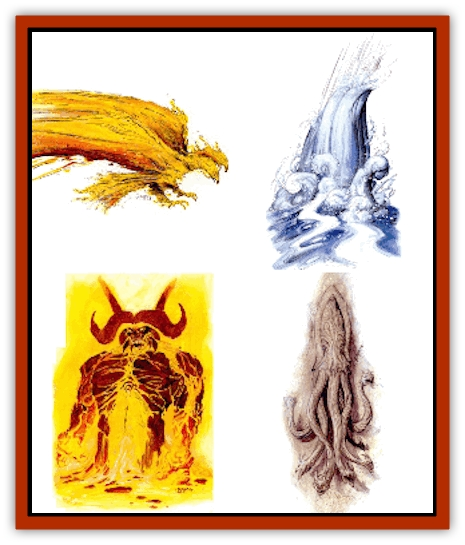

# Paraelemental Beast - General Information

Paraelemental beasts are creatures native to the four paraelemental planes (known as the Paraelemental Planes of [[Paraelemental_Beast_Magma|Magma]], Rain, Silt, and [[Paraelemental_Beast_Sun|Sun]] by Athasian clerics and scholars). Born of two elements, paraelemental beasts find peaceful existence only on their respective paraelemental planes. There the two elements blend, co-existing in a comfortable state. Anywhere else, the conflicting natures of these semi-intelligent beasts emerge, seeking to overpower each other. This gives conjured paraelemental beasts personalities that range from mean and confused to murderous and irrational. Either way, they aren't the frlendliest of creatures to meet outside their native planes - even on their best days.

As with [[Elemental_Beast_Athas_General_Information|elemental beasts]], paraelemental beasts aren't worshipped by the priests of Athas. They are consldered divine in nature, however, as these creatures are composed of the pure forces of the elements. Still, that doesn't make them revered. Elemental priests don't trust things of the paraelemental planes, so the beasts are rarely called upon by the clerics of air, earth, fire, and water.

Paraelemental clerics, on the other hand, readily conjure the divine beasts to increase their own power or to perform missions that benefit their patron paraelementals. Like the paraelementals they serve, these clerics seek quantity over quality. Nothing elevates the position of a paraelemental priest like the presence of a beast from his associated plane. The longer such a beast remains with him, the more favored by the paraelementals he's believed to be.

Paraelemental beasts will only be encountered on Athas if summoned by magical means. Each beast adopts a shell composed of the basic elements it represents. If the shell is destroyed, it returns to its native plane.

These beasts can only be harmed by magical weapons with a +1 attack bonus or better, wizard and priest spells, and psionic powers from the Telekinetic and Psychoportive disciplines. Spells related to their native planes in any way don't effect them, and defiling magic doesn't have any additional adverse effects on them besides the normal effects of the spells (as it does on lesser elementals).

**Summoning a Paraelemental Beast: **There are three methods for calling a paraelemental beast to the Prime Material Plane conjured by spell (*conjure elemental*, wizard or priest version), conjured by staff, or conjured by summoning device. The level of control gained over a paraelemental beast is influenced by the method used to summon it.

**Controlling a Paraelemental Beast: **Concentration during the summoning process is essential to ensuring control over a conjured paraelemental beast. Any distraction to the summoner, either mental or physical, results in a failure to control the beast when it arrives on the Prime Material Plane Control lasts for the duration of the spell that summoned it plus one day per level of the summoner, until the shell housing the beast is destroyed, or until its rage and insanity overcome it. Paraelemental beasts that are uncontrolled and acting upon their own desires are called free-willed.

Unlike the elemental beasts, paraelemental beasts aren't bothered by pain caused by the impurity of the Prime Material Plane. Instead, they suffer from elevated emotions due to the steady separation of their mixed natures that results from being removed from their native plane. Each day outside its native plane, a paraelemental beast becomes more enraged and insane. Even if successfully controlled, a beast must check each day to see if its rage overcomes it.

The base chance for a paraelemental beast to be overcome by its insanity is 10%. This increases by 10% each day, until after nine days, when the chance remains fixed at 90%. On the day that a check is failed, the beast's rage becomes a blinding fury. It attacks any living creatures nearby and then flees in an attempt to find its way home (or a suitable terrain type where it can find some small comfort).

**Paraelemental Beasts on Athas: **Paraelemental beasts aren't native to Athas. They can only arrive via magical summons, and they have no way to leave of their own accord. Controlled beasts are usually in the presence of or working for a priest whose patron is of their native planes. Uncontrolled beasts are very rare, and always found in the vicinity of some terrain feature that closely resembles the environment of their native planes.

[[Paraelemental_Beast_Rain|Paraelemental beasts of rain]] are the rarest type of these creatures encountered, as the shell they inhabit can't survive long under the harsh, crimson sun. [[Paraelemental_Beast_Silt|Paraelemental beasts of silt]] are the most common, as these creatures have actually found a niche in Athasian ecology.

---
## Discovery & Documentation

**Source Publication:** Dark Sun Appendix II - Terrors Beyond Tyr (1991)
**Campaign Setting:** Dark Sun
**Author(s):** Jim Atkiss, Steve Brown, Timothy B. Brown, Andrew P. Morris, Bruce Nesmith, Wes Nicholson, Bill Slavicsek

### Other Creatures Found in This Source Book
   * [[Aarakocra_Athas|Aarakocra (Athas)]]
   * [[Animal_Domestic_Athas_II|Animal, Domestic (Athas) II]]
   * [[Aviarag|Aviarag]]
   * [[Baazrag|Baazrag]]
   * [[Baazrag_Boneclaw|Baazrag, Boneclaw]]
   * [[Bloodgrass|Bloodgrass]]
   * [[Cactus_Hunting|Cactus, Hunting]]
   * [[Cactus_Rock|Cactus, Rock]]
   * [[Cilops|Cilops]]
   * [[Crodlu|Crodlu]]
   * [[Dagorran|Dagorran]]
   * [[Dhaot|Dhaot]]
   * [[Drake_Lesser_Athas_General_Information|Drake, Lesser (Athas), General Information]]
   * [[Drake_Lesser_Athas_Magma|Drake, Lesser (Athas), Magma]]
   * [[Drake_Lesser_Athas_Rain|Drake, Lesser (Athas), Rain]]
   * [[Drake_Lesser_Athas_Silt|Drake, Lesser (Athas), Silt]]
   * [[Drake_Lesser_Athas_Sun|Drake, Lesser (Athas), Sun]]
   * [[Dray|Dray]]
   * [[Drik|Drik]]
   * [[Dune_Reaper|Dune Reaper]]
   * [[Dwarf_Athas|Dwarf (Athas)]]
   * [[Elemental_Beast_Athas_Air|Elemental Beast (Athas), Air]]
   * [[Elemental_Beast_Athas_Earth|Elemental Beast (Athas), Earth]]
   * [[Elemental_Beast_Athas_Fire|Elemental Beast (Athas), Fire]]
   * [[Elemental_Beast_Athas_Water|Elemental Beast (Athas), Water]]
   * [[Elf_Athas|Elf (Athas)]]
   * [[Fael|Fael]]
   * [[Feylaar|Feylaar]]
   * [[Fordorran|Fordorran]]
   * [[Giant_Half-giant|Giant, Half-giant]]
   * [[Giant_Shadow|Giant, Shadow]]
   * [[Golem_Athas_Magma|Golem (Athas), Magma]]
   * [[Golem_Athas_Salt|Golem (Athas), Salt]]
   * [[Golem_Athas_General_Information|Golem (Athas), General Information]]
   * [[Gorak|Gorak]]
   * [[Halfling_Athas|Halfling (Athas)]]
   * [[Human_Athas|Human (Athas)]]
   * [[Jhakar|Jhakar]]
   * [[Kaisharga|Kaisharga]]
   * [[Kes'trekel|Kes'trekel]]
   * [[Klar|Klar]]
   * [[Krag|Krag]]
   * [[Kragling|Kragling]]
   * [[Lirr|Lirr]]
   * [[Mastyrial|Mastyrial]]
   * [[Meorty|Meorty]]
   * [[Mul|Mul]]
   * [[Nikaal|Nikaal]]
   * [[Paraelemental_Beast_Magma|Paraelemental Beast, Magma]]
   * [[Paraelemental_Beast_Rain|Paraelemental Beast, Rain]]
   * [[Paraelemental_Beast_Silt|Paraelemental Beast, Silt]]
   * [[Paraelemental_Beast_Sun|Paraelemental Beast, Sun]]
   * [[Pakubrazi|Pakubrazi]]
   * [[Psionocus|Psionocus]]
   * [[Psurlon|Psurlon]]
   * [[Raaig|Raaig]]
   * [[Retriever_Obsidian|Retriever, Obsidian]]
   * [[Ruktoi|Ruktoi]]
   * [[Ruvoka_Athas|Ruvoka (Athas)]]
   * [[Sand_Howler|Sand Howler]]
   * [[Scorpion_Athas|Scorpion (Athas)]]
   * [[Seed_Brain|Seed, Brain]]
   * [[Silt_Horror_Black|Silt Horror, Black]]
   * [[Silt_Horror_Magma|Silt Horror, Magma]]
   * [[Silt_Horror_Red|Silt Horror, Red]]
   * [[Silt_Spawn|Silt Spawn]]
   * [[Slig|Slig]]
   * [[Spider_Athas|Spider (Athas)]]
   * [[Spinewyrm|Spinewyrm]]
   * [[Ssurran|Ssurran]]
   * [[Stalking_Horror|Stalking Horror]]
   * [[Tarek|Tarek]]
   * [[Tari|Tari]]
   * [[Thri-kreen|Thri-kreen]]
   * [[T'liz|T'liz]]
   * [[Tohr-kreen_II|Tohr-kreen II]]
   * [[Tohr-kreen_III|Tohr-kreen III]]
   * [[Trin|Trin]]
   * [[Tul'k|Tul'k]]
   * [[Undead_Athas_General_Information|Undead (Athas), General Information]]
   * [[Wraith_Athas|Wraith (Athas)]]
   * [[Xerichou|Xerichou]]
   * [[Zombie_Thinking|Zombie, Thinking]]
