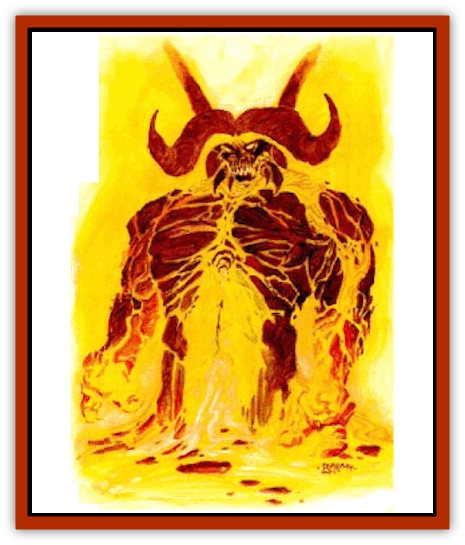

# Paraelemental Beast - Magma

| Statistic | **Paraelemental Beast, Magma** |
| --- | --- |
| **Activity Cycle:** | Any |
| **Alignment:** | Neutral |
| **Armor Class:** | 3 |
| **Climate/Terrain:** | Anywhere there is lava |
| **Damage/Attack:** | 3d6/3d6 |
| **Diet:** | Magma |
| **Frequency:** | Very rare |
| **Hit Dice:** | 8 |
| **Intelligence:** | Semi- (2-4) |
| **Magic Resistance:** | Nil |
| **Morale:** | Champion (15) |
| **Movement:** | 9, Sw 15 |
| **No. Appearing:** | 1 |
| **No. of Attacks:** | 2 |
| **Organization:** | Solitary |
| **Size:** | L (12' tall) |
| **Special Attacks:** | See below |
| **Special Defenses:** | +1 or better magical weapon to hit |
| **THAC0:** | 13 |
| **Treasure:** | Nil |
| **XP Value:** | 3,000 |

[[Paraelemental_Beast_General_Information|Paraelemental beasts]] of magma are found only near volcanos and other places lava flows to the surface. When summoned they form themselves from the magma as it pours from the ground.

Paraelemental beasts of magma resemble large humanoid creatures similar to [[Baatezu_General_Information|baatezu]] in form except they are composed solely of magma. They have massive wings of dripping magma that are at least 10 feet across when spread. They have huge, clawed hands and clawed feet. They have thick, lumbering tails as long as 7 feet Their bodies are almost black on the surface, but the surface constantly cracks open as they move, revealing the bright red magma beneath. Their eyes are always fiery red and never blacken as they cool. They leave a lava trail wherever they go and any thing near them most likely melts or ignites.

**Combat:** Paraelemental beasts of magma attack with their huge, clawed hands for 1-6 (1d6) points of damage plus 1-12 (1d12) points of additional damage because of the great heat radiating from them.

The creatures can swim through magma at a speed of 15 and they can also use open pits of magma to launch themselves into the air. They crash down on their opponents, causing double damage with their claws. This attack also gives them a +3 bonus to their attack roll and imposes a -5 penalty on their opponents' surprise rolls. Touching the creature causes 1.12 (1d12) points of burn damage to those not protected from magical fire and heat. All flammable objects (including clothing) that come in contact with the creature must successfully save vs. magical fire at -2 or they ignite.

Paraelemental beasts of magma can fire blasts of molten lava at opponents as far as 30 feet away. The blast causes 4-24 (4d6) points of damage unless a successful save vs. spell is made for only half damage or unless the target is resistant to fire-based and heat-based attacks.

Nonmagical weapons that touch these creatures melt or burn away if hit. The hit causes the creature no damage, but the weapon must make a successful save vs. magical fire at -6 or be destroyed. Magical weapons cause +1 point of damage per die of damage caused. The weapons also become red hot and must make a successful save vs. magical fire (no penalty) or they too are destroyed.

Paraelemental creatures of magma can regenerate 1 hit point per round if they are in contact with lava. If they are within an open pit of magma they can regenerate 3 hit points per round.

They are immune to all heat-based and flame-based attacks, but suffer double damage from cold-based attacks. They suffer 1 point of damage for every five gallons of water poured on them. They cannot regenerate damage caused by water unless they are in an open pit of magma.

**Habitat/Society:** Paraelemental beasts of magma are solitary creatures. Free-willed beasts often take up residence inside volcanos or other lava flows where they have full access to their para-element. They seldom interact with others except to attack those who remind them of their summoners.

**Ecology:** Paraelemental beast of magma hold no natural place on the Prime Material Plane. They seldom interact with other creatures and actively cause eruptions only to injure other living creatures after the beasts have been attacked for no reason.

---
## Discovery & Documentation

**Source Publication:** Dark Sun Appendix II - Terrors Beyond Tyr (1991)
**Campaign Setting:** Dark Sun
**Author(s):** Jim Atkiss, Steve Brown, Timothy B. Brown, Andrew P. Morris, Bruce Nesmith, Wes Nicholson, Bill Slavicsek

### Other Creatures Found in This Source Book
   * [[Aarakocra_Athas|Aarakocra (Athas)]]
   * [[Animal_Domestic_Athas_II|Animal, Domestic (Athas) II]]
   * [[Aviarag|Aviarag]]
   * [[Baazrag|Baazrag]]
   * [[Baazrag_Boneclaw|Baazrag, Boneclaw]]
   * [[Bloodgrass|Bloodgrass]]
   * [[Cactus_Hunting|Cactus, Hunting]]
   * [[Cactus_Rock|Cactus, Rock]]
   * [[Cilops|Cilops]]
   * [[Crodlu|Crodlu]]
   * [[Dagorran|Dagorran]]
   * [[Dhaot|Dhaot]]
   * [[Drake_Lesser_Athas_General_Information|Drake, Lesser (Athas), General Information]]
   * [[Drake_Lesser_Athas_Magma|Drake, Lesser (Athas), Magma]]
   * [[Drake_Lesser_Athas_Rain|Drake, Lesser (Athas), Rain]]
   * [[Drake_Lesser_Athas_Silt|Drake, Lesser (Athas), Silt]]
   * [[Drake_Lesser_Athas_Sun|Drake, Lesser (Athas), Sun]]
   * [[Dray|Dray]]
   * [[Drik|Drik]]
   * [[Dune_Reaper|Dune Reaper]]
   * [[Dwarf_Athas|Dwarf (Athas)]]
   * [[Elemental_Beast_Athas_Air|Elemental Beast (Athas), Air]]
   * [[Elemental_Beast_Athas_Earth|Elemental Beast (Athas), Earth]]
   * [[Elemental_Beast_Athas_Fire|Elemental Beast (Athas), Fire]]
   * [[Elemental_Beast_Athas_Water|Elemental Beast (Athas), Water]]
   * [[Elf_Athas|Elf (Athas)]]
   * [[Fael|Fael]]
   * [[Feylaar|Feylaar]]
   * [[Fordorran|Fordorran]]
   * [[Giant_Half-giant|Giant, Half-giant]]
   * [[Giant_Shadow|Giant, Shadow]]
   * [[Golem_Athas_Magma|Golem (Athas), Magma]]
   * [[Golem_Athas_Salt|Golem (Athas), Salt]]
   * [[Golem_Athas_General_Information|Golem (Athas), General Information]]
   * [[Gorak|Gorak]]
   * [[Halfling_Athas|Halfling (Athas)]]
   * [[Human_Athas|Human (Athas)]]
   * [[Jhakar|Jhakar]]
   * [[Kaisharga|Kaisharga]]
   * [[Kes'trekel|Kes'trekel]]
   * [[Klar|Klar]]
   * [[Krag|Krag]]
   * [[Kragling|Kragling]]
   * [[Lirr|Lirr]]
   * [[Mastyrial|Mastyrial]]
   * [[Meorty|Meorty]]
   * [[Mul|Mul]]
   * [[Nikaal|Nikaal]]
   * [[Paraelemental_Beast_General_Information|Paraelemental Beast, General Information]]
   * [[Paraelemental_Beast_Rain|Paraelemental Beast, Rain]]
   * [[Paraelemental_Beast_Silt|Paraelemental Beast, Silt]]
   * [[Paraelemental_Beast_Sun|Paraelemental Beast, Sun]]
   * [[Pakubrazi|Pakubrazi]]
   * [[Psionocus|Psionocus]]
   * [[Psurlon|Psurlon]]
   * [[Raaig|Raaig]]
   * [[Retriever_Obsidian|Retriever, Obsidian]]
   * [[Ruktoi|Ruktoi]]
   * [[Ruvoka_Athas|Ruvoka (Athas)]]
   * [[Sand_Howler|Sand Howler]]
   * [[Scorpion_Athas|Scorpion (Athas)]]
   * [[Seed_Brain|Seed, Brain]]
   * [[Silt_Horror_Black|Silt Horror, Black]]
   * [[Silt_Horror_Magma|Silt Horror, Magma]]
   * [[Silt_Horror_Red|Silt Horror, Red]]
   * [[Silt_Spawn|Silt Spawn]]
   * [[Slig|Slig]]
   * [[Spider_Athas|Spider (Athas)]]
   * [[Spinewyrm|Spinewyrm]]
   * [[Ssurran|Ssurran]]
   * [[Stalking_Horror|Stalking Horror]]
   * [[Tarek|Tarek]]
   * [[Tari|Tari]]
   * [[Thri-kreen|Thri-kreen]]
   * [[T'liz|T'liz]]
   * [[Tohr-kreen_II|Tohr-kreen II]]
   * [[Tohr-kreen_III|Tohr-kreen III]]
   * [[Trin|Trin]]
   * [[Tul'k|Tul'k]]
   * [[Undead_Athas_General_Information|Undead (Athas), General Information]]
   * [[Wraith_Athas|Wraith (Athas)]]
   * [[Xerichou|Xerichou]]
   * [[Zombie_Thinking|Zombie, Thinking]]
