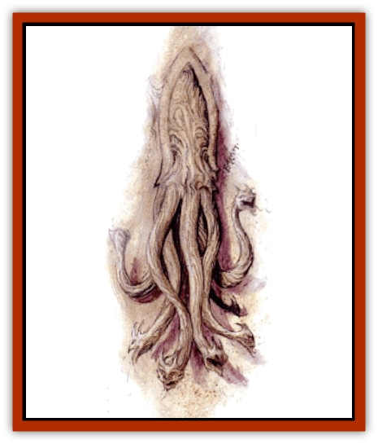

# Paraelemental Beast - Silt

| Statistic | **Paraelemental Beast, Silt** |
| --- | --- |
| **Activity Cycle:** | Any |
| **Alignment:** | Neutral |
| **Armor Class:** | 2 |
| **Climate/Terrain:** | Large areas of silt |
| **Damage/Attack:** | 3d6/1d6 (&times;6) |
| **Diet:** | Silt |
| **Frequency:** | Very rare |
| **Hit Dice:** | 7 |
| **Intelligence:** | Semi- (2-4) |
| **Magic Resistance:** | Nil |
| **Morale:** | Champion (15) |
| **Movement:** | 9, Sw 15 |
| **No. Appearing:** | 1 |
| **No. of Attacks:** | 7 |
| **Organization:** | Solitary |
| **Size:** | L (12' across) |
| **Special Attacks:** | See below |
| **Special Defenses:** | +1 magical weapon or better to hit |
| **THAC0:** | 13 |
| **Treasure:** | Nil |
| **XP Value:** | 3,000 |

[[Paraelemental_Beast_General_Information|Paraelemental beasts]] of silt can only be summoned in places where there are large amounts of silt. If they gain free will, they often travel to the Sea of Silt or other places where they can roam freely in their element forever.

Paraelemental creatures of silt resemble the krackens of legend, except they are composed entirely of silt. They have 8 octopuslike tentacles, but their upper bodies are serpentlike. Their heads are similar to those of [[Drake_Lesser_Athas_Silt|silt drakes]] in size and shape. Their necks are about 7' long, as are their tentacles. Their tentacles do not have suction cups but are strong enough to pick up humansized beings in their grasp and agile enough to batter opponents. A billow of fine silt dust rises like steam from their nostrils.

**Combat:** Paraelemental beasts of silt attack with their mouths and six of their tentacles. Their bite causes 3-18 (3d6) points of damage. Each tentacle causes 1-6 (1d6) points of damage and on a successful strike there is a 50% chance it wraps around the victim and constricts for 2-8 (2d4) points of damage each following round until the tentacle is cut loose or the victim breaks free. Any human-sized or smaller creature can be attacked by the creature with only one tentacle at a time.

Once a victim has been grabbed, the creature attempts to pull it down into the silt where it suffocates. On a percentage roll of 1-25 neither of a victim's arms are pinned, on a roll of 26-50 the left arm is pinned, on a roll of 51-75 the right arm is pinned, and on a roll of 76-100 both arms are pinned. When both arms are pinned, the victim cannot attack. When one arm is pinned, the character's attack rolls are at -3. When neither arm is pinned, the victim's attack rolls are at -1. The tentacles have 18/01 Strength and any creature with Strength greater than 18/01 can negate its constriction attacks by pulling against it. When this happens, the creature bites the victim until it stops struggling. The creature does not need to make an attack roll and can automatically bite any victim held this way.

Each tentacle has 8 hit points (in addition to the creature's 8 HD). When it receives 8 points of damage it turns into fine silt and pours to the ground. The paraelemental beast can no longer keep mental control over its shape because of the damage it suffers.

The paraelemental beast of silt has the fearsome whirlpool attack. The creature can swirl about within the silt, creating a funnelling effect. The effect draws everything within a 1-foot radius per hit point it has straight down into the funnel. Once it stops spinning, the silt above closes in, trapping any creature drawn in below the surface. Victims must make eight successful Constitution rolls in a row to reach the surface before breathing in silt. Victims who breath in silt must make a successful save vs. death magic at -3 or they die. If the save is successful, they receive 2-20 (2d10) points of damage and must continue toward the surface, attempting their remaining Constitution rolls.

Paraelemental beasts of silt are virtually invisible until they attack because they usually slink about in the same silt from which they are made. Only when they rise above the silt are their shapes visible.

Paraelemental beasts of silt receive double damage from all wind-based attacks and no damage from attacks relating to their own para-element. Whenever in direct contact with a large quantity of silt, they can regenerate at a rate of 2 hit points per round.

**Habitat/Society:** Paraelemental beasts of silt are solitary creatures. They generally roam about silt-filled areas, attacking only those who attack them or those who remind them of their summoners (including most humans, humanoids, and demihumans).

**Ecology:** While paraelemental beasts of silt are unnatural extraplanar creatures, they have found a place in the ecology of Athas. They now help reduce number of predators that roam their silt-filled homes.

---
## Discovery & Documentation

**Source Publication:** Dark Sun Appendix II - Terrors Beyond Tyr (1991)
**Campaign Setting:** Dark Sun
**Author(s):** Jim Atkiss, Steve Brown, Timothy B. Brown, Andrew P. Morris, Bruce Nesmith, Wes Nicholson, Bill Slavicsek

### Other Creatures Found in This Source Book
   * [[Aarakocra_Athas|Aarakocra (Athas)]]
   * [[Animal_Domestic_Athas_II|Animal, Domestic (Athas) II]]
   * [[Aviarag|Aviarag]]
   * [[Baazrag|Baazrag]]
   * [[Baazrag_Boneclaw|Baazrag, Boneclaw]]
   * [[Bloodgrass|Bloodgrass]]
   * [[Cactus_Hunting|Cactus, Hunting]]
   * [[Cactus_Rock|Cactus, Rock]]
   * [[Cilops|Cilops]]
   * [[Crodlu|Crodlu]]
   * [[Dagorran|Dagorran]]
   * [[Dhaot|Dhaot]]
   * [[Drake_Lesser_Athas_General_Information|Drake, Lesser (Athas), General Information]]
   * [[Drake_Lesser_Athas_Magma|Drake, Lesser (Athas), Magma]]
   * [[Drake_Lesser_Athas_Rain|Drake, Lesser (Athas), Rain]]
   * [[Drake_Lesser_Athas_Silt|Drake, Lesser (Athas), Silt]]
   * [[Drake_Lesser_Athas_Sun|Drake, Lesser (Athas), Sun]]
   * [[Dray|Dray]]
   * [[Drik|Drik]]
   * [[Dune_Reaper|Dune Reaper]]
   * [[Dwarf_Athas|Dwarf (Athas)]]
   * [[Elemental_Beast_Athas_Air|Elemental Beast (Athas), Air]]
   * [[Elemental_Beast_Athas_Earth|Elemental Beast (Athas), Earth]]
   * [[Elemental_Beast_Athas_Fire|Elemental Beast (Athas), Fire]]
   * [[Elemental_Beast_Athas_Water|Elemental Beast (Athas), Water]]
   * [[Elf_Athas|Elf (Athas)]]
   * [[Fael|Fael]]
   * [[Feylaar|Feylaar]]
   * [[Fordorran|Fordorran]]
   * [[Giant_Half-giant|Giant, Half-giant]]
   * [[Giant_Shadow|Giant, Shadow]]
   * [[Golem_Athas_Magma|Golem (Athas), Magma]]
   * [[Golem_Athas_Salt|Golem (Athas), Salt]]
   * [[Golem_Athas_General_Information|Golem (Athas), General Information]]
   * [[Gorak|Gorak]]
   * [[Halfling_Athas|Halfling (Athas)]]
   * [[Human_Athas|Human (Athas)]]
   * [[Jhakar|Jhakar]]
   * [[Kaisharga|Kaisharga]]
   * [[Kes'trekel|Kes'trekel]]
   * [[Klar|Klar]]
   * [[Krag|Krag]]
   * [[Kragling|Kragling]]
   * [[Lirr|Lirr]]
   * [[Mastyrial|Mastyrial]]
   * [[Meorty|Meorty]]
   * [[Mul|Mul]]
   * [[Nikaal|Nikaal]]
   * [[Paraelemental_Beast_General_Information|Paraelemental Beast, General Information]]
   * [[Paraelemental_Beast_Magma|Paraelemental Beast, Magma]]
   * [[Paraelemental_Beast_Rain|Paraelemental Beast, Rain]]
   * [[Paraelemental_Beast_Sun|Paraelemental Beast, Sun]]
   * [[Pakubrazi|Pakubrazi]]
   * [[Psionocus|Psionocus]]
   * [[Psurlon|Psurlon]]
   * [[Raaig|Raaig]]
   * [[Retriever_Obsidian|Retriever, Obsidian]]
   * [[Ruktoi|Ruktoi]]
   * [[Ruvoka_Athas|Ruvoka (Athas)]]
   * [[Sand_Howler|Sand Howler]]
   * [[Scorpion_Athas|Scorpion (Athas)]]
   * [[Seed_Brain|Seed, Brain]]
   * [[Silt_Horror_Black|Silt Horror, Black]]
   * [[Silt_Horror_Magma|Silt Horror, Magma]]
   * [[Silt_Horror_Red|Silt Horror, Red]]
   * [[Silt_Spawn|Silt Spawn]]
   * [[Slig|Slig]]
   * [[Spider_Athas|Spider (Athas)]]
   * [[Spinewyrm|Spinewyrm]]
   * [[Ssurran|Ssurran]]
   * [[Stalking_Horror|Stalking Horror]]
   * [[Tarek|Tarek]]
   * [[Tari|Tari]]
   * [[Thri-kreen|Thri-kreen]]
   * [[T'liz|T'liz]]
   * [[Tohr-kreen_II|Tohr-kreen II]]
   * [[Tohr-kreen_III|Tohr-kreen III]]
   * [[Trin|Trin]]
   * [[Tul'k|Tul'k]]
   * [[Undead_Athas_General_Information|Undead (Athas), General Information]]
   * [[Wraith_Athas|Wraith (Athas)]]
   * [[Xerichou|Xerichou]]
   * [[Zombie_Thinking|Zombie, Thinking]]
