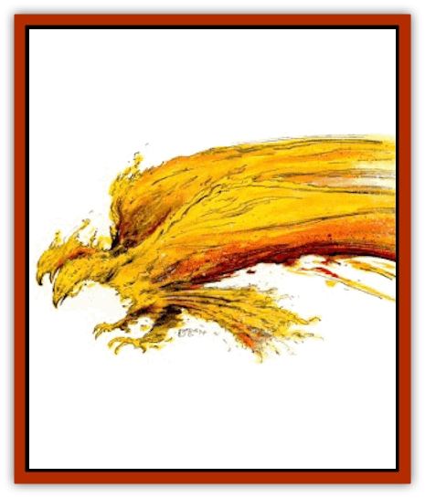

# Paraelemental Beast - Sun

| Statistic | **Paraelemental Beast, Sun** |
| --- | --- |
| **Activity Cycle:** | Any |
| **Alignment:** | Neutral |
| **Armor Class:** | 2 |
| **Climate/Terrain:** | Any surface area |
| **Damage/Attack:** | 3d6/2d6/2d6 |
| **Diet:** | Sunlight |
| **Frequency:** | Very rare |
| **Hit Dice:** | 9 |
| **Intelligence:** | Semi (2-4) |
| **Magic Resistance:** | Nil |
| **Morale:** | Elite (15-16) |
| **Movement:** | 6, F1 36 (D) |
| **No. Appearing:** | 1 |
| **No. of Attacks:** | 3 |
| **Organization:** | Solitary |
| **Size:** | L (16' wingspan) |
| **Special Attacks:** | See below |
| **Special Defenses:** | +1 magical weapon or better to hit |
| **THAC0:** | 11 |
| **Treasure:** | Nil |
| **XP Value:** | 3,000 |

[[Paraelemental_Beast_General_Information|Paraelemental beasts]] of sun can be summoned anywhere there is strong sunlight, of which there is no shortage in Athas. Paraelemental beasts of sun that gain free will often choose to make Athas their permanent home because of the great presence of their para-element.

Paraelemental beasts of sun resemble the [[Phoenix|phoenix]] of legend. They are two-headed birds composed of flames sustained by the rays of the suns. Their flaming wings span 16 feet across. Their two heads work in tandem, seemingly under the control of one brain. It hurts to look directly at paraelemental beasts of sun because they radiate light even more intense than a *light* spell.

**Combat:** Paraelemental beasts of sun attack by swooping down on their opponents and attacking them with their two talons for 2-12 (2d6) points of damage each, and with one of their beaks for 3-18 (3d6) points of damage. Opponents with resistance to magical flames suffer only half damage. The talons and beak are fiery hot and they leave terrible burns on their victims.

Flammable objects that touch these creatures ignite and burn until extinguished or totally consumed unless they successfully save vs. magical fire at a -2.

Paraelemental beasts of sun can generate intense heat from their bodies that cause sunstroke and dehydration. For each round the creature uses this attack, all victims within a 1-foot radius per hit point it has lose 1-6 (1d6) points of Constitution unless the victims make a successful save vs. breath weapon or have some special protection from heat stroke and dehydration.

Paraelemental beasts of sun regenerate 3 hit points per round while in sunlight. When removed from sunlight, their regeneration powers do not function and they have a -4 penalty to attack and damage rolls. Their flight speed is reduced by -3 for every 12 hours straight they are not exposed to sunlight and they also lose 2-12 hit points.

The creatures can create massive bursts of sunlight from their bodies that can blind any seeing opponent within a 150-foot radius unless the opponent makes a successful save vs. spell. All undead caught in this burst of light suffer 6-36 (6d6) points of damage with no savmg throw. When the paraelemental beasts use this power they lose 5 hit points because they burns up part of themselves producing the light. When they reach zero hit points they explode into solar energy producing the same effect as this power.

Paraelemental beasts of sun are immune to all heat-based and fire-based attacks, both nonmagical and magical. They can only be hit by a +1 or better magical weapon, by creatures of 4 HD or greater, and by creatures with magical abilities. They are immune to all *sleep*, *charm*, and *hold* spells. Cold-based attacks cause them 1 additional point of damage per die of damage caused. *Darkness* spells cause them 2-12 (2d6) points of damage and *continual darkness* causes them 4-24 (4d6) points of damage.

**Habitat/Society:** Paraelemental beasts of sun gather in small flocks of as many as 10 whenever possible, but because of their rarity on the Prime Material Plane, they are usually encountered alone. They spend most of their time flying high above the land, basking in solar energy. They seldom attack creatures except in defense or when they spot humans, humanoids, or demihumans that remind them of those who summoned them.

**Ecology:** Paraelemental beasts of sun are among the easiest creatures to summon and outnumber all other paraelemental beasts two to one. They are often spotted circling far overhead but are almost never seen near the ground except when they are recently summoned or when they attack those whom they believe summoned them.

---
## Discovery & Documentation

**Source Publication:** Dark Sun Appendix II - Terrors Beyond Tyr (1991)
**Campaign Setting:** Dark Sun
**Author(s):** Jim Atkiss, Steve Brown, Timothy B. Brown, Andrew P. Morris, Bruce Nesmith, Wes Nicholson, Bill Slavicsek

### Other Creatures Found in This Source Book
   * [[Aarakocra_Athas|Aarakocra (Athas)]]
   * [[Animal_Domestic_Athas_II|Animal, Domestic (Athas) II]]
   * [[Aviarag|Aviarag]]
   * [[Baazrag|Baazrag]]
   * [[Baazrag_Boneclaw|Baazrag, Boneclaw]]
   * [[Bloodgrass|Bloodgrass]]
   * [[Cactus_Hunting|Cactus, Hunting]]
   * [[Cactus_Rock|Cactus, Rock]]
   * [[Cilops|Cilops]]
   * [[Crodlu|Crodlu]]
   * [[Dagorran|Dagorran]]
   * [[Dhaot|Dhaot]]
   * [[Drake_Lesser_Athas_General_Information|Drake, Lesser (Athas), General Information]]
   * [[Drake_Lesser_Athas_Magma|Drake, Lesser (Athas), Magma]]
   * [[Drake_Lesser_Athas_Rain|Drake, Lesser (Athas), Rain]]
   * [[Drake_Lesser_Athas_Silt|Drake, Lesser (Athas), Silt]]
   * [[Drake_Lesser_Athas_Sun|Drake, Lesser (Athas), Sun]]
   * [[Dray|Dray]]
   * [[Drik|Drik]]
   * [[Dune_Reaper|Dune Reaper]]
   * [[Dwarf_Athas|Dwarf (Athas)]]
   * [[Elemental_Beast_Athas_Air|Elemental Beast (Athas), Air]]
   * [[Elemental_Beast_Athas_Earth|Elemental Beast (Athas), Earth]]
   * [[Elemental_Beast_Athas_Fire|Elemental Beast (Athas), Fire]]
   * [[Elemental_Beast_Athas_Water|Elemental Beast (Athas), Water]]
   * [[Elf_Athas|Elf (Athas)]]
   * [[Fael|Fael]]
   * [[Feylaar|Feylaar]]
   * [[Fordorran|Fordorran]]
   * [[Giant_Half-giant|Giant, Half-giant]]
   * [[Giant_Shadow|Giant, Shadow]]
   * [[Golem_Athas_Magma|Golem (Athas), Magma]]
   * [[Golem_Athas_Salt|Golem (Athas), Salt]]
   * [[Golem_Athas_General_Information|Golem (Athas), General Information]]
   * [[Gorak|Gorak]]
   * [[Halfling_Athas|Halfling (Athas)]]
   * [[Human_Athas|Human (Athas)]]
   * [[Jhakar|Jhakar]]
   * [[Kaisharga|Kaisharga]]
   * [[Kes'trekel|Kes'trekel]]
   * [[Klar|Klar]]
   * [[Krag|Krag]]
   * [[Kragling|Kragling]]
   * [[Lirr|Lirr]]
   * [[Mastyrial|Mastyrial]]
   * [[Meorty|Meorty]]
   * [[Mul|Mul]]
   * [[Nikaal|Nikaal]]
   * [[Paraelemental_Beast_General_Information|Paraelemental Beast, General Information]]
   * [[Paraelemental_Beast_Magma|Paraelemental Beast, Magma]]
   * [[Paraelemental_Beast_Rain|Paraelemental Beast, Rain]]
   * [[Paraelemental_Beast_Silt|Paraelemental Beast, Silt]]
   * [[Pakubrazi|Pakubrazi]]
   * [[Psionocus|Psionocus]]
   * [[Psurlon|Psurlon]]
   * [[Raaig|Raaig]]
   * [[Retriever_Obsidian|Retriever, Obsidian]]
   * [[Ruktoi|Ruktoi]]
   * [[Ruvoka_Athas|Ruvoka (Athas)]]
   * [[Sand_Howler|Sand Howler]]
   * [[Scorpion_Athas|Scorpion (Athas)]]
   * [[Seed_Brain|Seed, Brain]]
   * [[Silt_Horror_Black|Silt Horror, Black]]
   * [[Silt_Horror_Magma|Silt Horror, Magma]]
   * [[Silt_Horror_Red|Silt Horror, Red]]
   * [[Silt_Spawn|Silt Spawn]]
   * [[Slig|Slig]]
   * [[Spider_Athas|Spider (Athas)]]
   * [[Spinewyrm|Spinewyrm]]
   * [[Ssurran|Ssurran]]
   * [[Stalking_Horror|Stalking Horror]]
   * [[Tarek|Tarek]]
   * [[Tari|Tari]]
   * [[Thri-kreen|Thri-kreen]]
   * [[T'liz|T'liz]]
   * [[Tohr-kreen_II|Tohr-kreen II]]
   * [[Tohr-kreen_III|Tohr-kreen III]]
   * [[Trin|Trin]]
   * [[Tul'k|Tul'k]]
   * [[Undead_Athas_General_Information|Undead (Athas), General Information]]
   * [[Wraith_Athas|Wraith (Athas)]]
   * [[Xerichou|Xerichou]]
   * [[Zombie_Thinking|Zombie, Thinking]]
