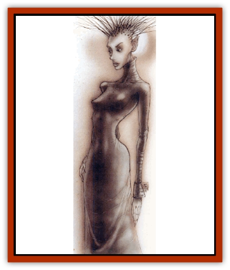

# Parai

| Statistic | **Parai** |
| --- | --- |
| **Activity Cycle:** | Any |
| **Alignment:** | Lawful neutral |
| **Armor Class:** | 0 |
| **Climate/Terrain:** | Mechanus |
| **Damage/Attack:** | 1d6/1d6 (fists) or 1d8 (gaze) |
| **Diet:** | Special |
| **Frequency:** | Rare |
| **Hit Dice:** | 5+5 |
| **Intelligence:** | High (14) |
| **Magic Resistance:** | Nil |
| **Morale:** | Fearless (19) |
| **Movement:** | 9 in any terrain |
| **No. Appearing:** | 5 |
| **No. of Attacks:** | 2 or 1 |
| **Organization:** | Patrol |
| **Size:** | M (6' tall) |
| **Special Attacks:** | Meld |
| **Special Defenses:** | Regeneration |
| **THAC0:** | 15 |
| **Treasure:** | Nil |
| **XP Value:** | 2,000 |

Native to Mechanus, this creature weals a floor-length black leather dress, the top of which molds to every curve of its body. The black clothing contrasts sharply with the chalky whiteness of the parai's skin visible only on its head and smooth hands. The face is a hollow porcelain mask, and much of the back of its head is missing. Looking into this hole, one can see only darkness. The impression is that the entire creature is hollow.

The strangest feature of a parai is the ball of white or pale yellow light that hovers in the hollow of its steel-haired head. This ball sheds light through its eyes and mouth, as well as illuminating the area behind the parai. Sages speculate that the light is the sentient part of the parai, that this ball contains the parai's guiding intelligence.

If a parai is killed, inquisitive people will discover that the creature is entirely hollow; the black dress contains only air. Once the life force is gone from the creature, the porcelain-white hands and face crumble away into fine powder.

**Combat:** A parai typically wades into combat flailing its powerful fists or using its fearsome gaze to sap the life from its foes. While the light hovers in its mask, its fists are as hard as steel, and any item that blocks a blow from a parai's fist must save versus crushing blow or be destroyed. The gaze is not as outwardly frightening, but it saps the life force of a creature as surely as a physical attack would. A parai regenerates half the damage it causes to victims whose life is thus sapped.

The most fearsome attack paraii employ is the meld, which is also the only known method by which the parai race reproduces. When a parai finds a victim who has exceptional beauty, strength, or intelligence, it begins a ceaseless hunt to incorporate this person into its race. It has chosen this victim with care, believing his or her qualities to be desirable additions to the parai race.

The method by which this assimilation is accomplished is as follows: First, the parai corners its prey. The light-spirit rises from behind its porcelain mask, leaving the body an empty husk. This husk is still under the guidance of the light, however, which sends the body marching after its chosen victim. The husk then attempts to embrace the prey. Without the light perched inside the mask, the porcelain of the face and hands becomes malleable and exceedingly sticky. If the target is struck by the grasping fists, the victim must save versus spells or be stuck to its attacker. Thereafter, the victim is treated as if he or she were under the effects of a *web* spell. If he cannot fight free within one turn, the dress and mask surround him completely, and he begins to transform into a parai.

If the intended quarry has companions and they kill the parai before it has ensnared its chosen victim, the parai dies. If the comrades don't come to their friend's aid until after it has been caught by the parai, then they have three days to cure their friend before he is forever changed into a parai. (The only known cures for this transformation are *wishes*, *limited wishes*, or, oddly, the priest spell *free action*.) If the husk does snare its prey but he or she somehow escapes, the parai has still gleaned a small portion of the person. Regardless of what is done to its husk, the parai's light forms a new body around itself after one day. Some small remnants of the victim's former image remain visible in the newly formed parai, but they're usually only faint hints.

**Habitat/Society:** Paraii are organized into patrols of five, though occasionally a single parai can be found on its own, investigating some matter or another. Parai society is nonexistent; all paraii are equal, and when they congregate, all act as though controlled by a single mind.

It is not known where the central parai intelligence resides, or even if there is such a thing. Perhaps there is simply a hive mind, an indefinable collection of consciousness that links paraii together. Regardless, all of them are somehow connected to the others, and no one has yet discovered a way to manipulate or destroy that link.

**Ecology:** A parai, found only on Mechanus, seeks to make everything perfect (that is, lawful and organized) like itself. It does this to ensure that the multiverse functions in a perfect manner. In order to accomplish the feat of perfecting everything, each parai hunts for potentially like-minded individuals to transform them into beings like itself.

There is no reasoning with a parai; it will not be deterred in its quest for perfection. It rarely speaks, refusing as it does to clutter the air with chaotic noise. Indeed, it usually makes no sounds at all, except for the whisper and creak of its leather dress and the whistle of its fists through the air.

A parai's natural enemies include the [[Modron|modrons]], who have their own agenda for perfection and resent the paraii intrusion. In addition, paraii leech away the life force of the modrons. Modrons above the quadrone level destroy paraii on sight, and they order their inferiors to attack immediately as well. The paraii, in turn, kidnap modrons and make them paraii whenever possible. This is one of the few known ways the modron population loses its members.

All who travel Mechanus are hereby advised to keep a close watch for the paraii, for they know no mercy and their dedication is tireless. The only certain way to escape from the paraii is to leave the plane itself, for they have never left the cold heart of order that is Mechanus. Until the paraii succeed in making Mechanus perfect, the rest of the planes are safe from their depredations. Of course, they may choose to follow a particularly attractive traveler&hellip;

---
## Discovery & Documentation

**Source Publication:** Planes of Law (1995)
**Campaign Setting:** Planescape
**Author(s):** Colin McComb, Wolfgang Baur

### Other Creatures Found in This Source Book
   * [[Achaierai|Achaierai]]
   * [[Archon|Archon]]
   * [[Baatezu_Lesser_Kocrachon|Baatezu, Lesser, Kocrachon]]
   * [[Bladeling|Bladeling]]
   * [[Busen|Busen]]
   * [[Dragon_Rust|Dragon, Rust]]
   * [[Formian|Formian]]
   * [[Gear_Spirit|Gear Spirit]]
   * [[Hellcat|Hellcat]]
   * [[Kyton|Kyton]]
   * [[Moigno|Moigno]]
