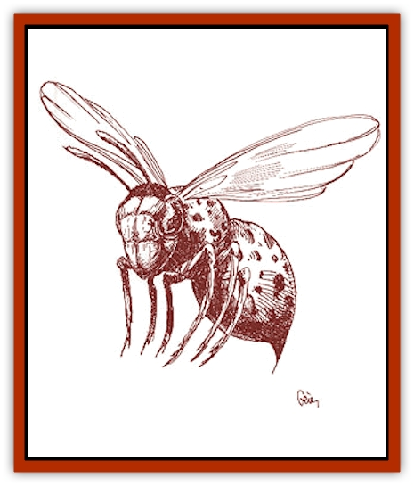

# Parasite - Savage Coast

| Statistic | **Parasite (Savage Coast)** |
| --- | --- |
| **Activity Cycle:** | Any |
| **Alignment:** | Nil |
| **Armor Class:** | Nil |
| **Climate/Terrain:** | Any |
| **Damage/Attack:** | Variable |
| **Diet:** | Special |
| **Frequency:** | Rare |
| **Hit Dice:** | Nil |
| **Intelligence:** | Non- (0) |
| **Magic Resistance:** | Nil |
| **Morale:** | Nil |
| **Movement:** | Nil |
| **No. Appearing:** | 1 infestation |
| **No. of Attacks:** | Variable |
| **Organization:** | Nil |
| **Size:** | T (less than 1' long) |
| **Special Attacks:** | Variable |
| **Special Defenses:** | Variable |
| **THAC0:** | Nil |
| **Treasure:** | Nil |
| **XP Value:** | 15 if nonfatal / 65 if potentially fatal |

**Combat:** [[Parasite|Parasites]] do not inflict combat damage. Each parasite has a special attack mode, outlined below. A victim who survives infestation by one of these parasites should receive the experience point award. Some parasites are deadly, in which case the victim receives a larger experience point award. Other parasites are merely annoying or inconvenient, so the experience point award is less. In many cases, the majority of the experience points from an encounter with a parasite will come from the subsequent adventures that take place while the victim is seeking a cure.

**Habitat/Society:** Parasites are mindless and have no organized society. Most parasites are extremely adaptable and can live wherever their hosts can live.

**Ecology:** Parasites derive all or part of their nutrients from the host, usually without contributing anything helpful.

**Louse, Inheritor**

  These tiny parasites resemble common head lice, usually inhabiting the hair or fur of the host creature. They cause their victims to deplete *cinnabryl* more quickly; the level of increase depends on how badly the carrier is infested. (Roll percentile dice to determine the degree of infestation.) A victim with a 50% infestation depletes *cinnabryl* at an increase of half the normal rate. A 100% infestation would cause the victim to deplete *cinnabryl* at twice the normal rate.

Collectively, Inheritor lice can also indiscriminately teleport the carrier (as per the Displace Legacy) up to three times per day. This usually happens if the host is physically threatened or in danger, but can also happen at completely random (and sometimes embarrassing) moments. The Inheritor lice thus attempt to preserve the life of their hosts.

Purging a humanoid body of Inheritor lice requires expensive ointments made with *cinnabryl* powder. [[Lyra_Bird_Saragón|Sarag�n lyra birds]] prey upon these lice.

**Moth, Powder**

  These tiny insects swarm together and build breeding-nests inside caches of *smokepowder*. They consume the *vermeil* contained in the *smokepowder*, quickly spoiling it. The moths are so small that they cannot be seen unless a *detect invisibility* is used. After the mating season is over, the insects leave the spoiled powder.

The insects cause chemical reactions in the *smokepowder*, which could cause any remaining unspoiled powder to detonate if the container is moved while the moths are still inside. (Roll percentile dice to determine the amount of spoiled powder.) Any person moving a powder-moth-infested keg must make a successful saving throw vs. paralyzation, or the keg will detonate.

A full keg of *smokepowder*, if detonated, would inflict 10d6+10 points of damage to everyone within a 10-foot radius, half that out to a 20-foot radius. A successful saving throw vs. breath weapon reduces this to half damage. Also, the damage should be adjusted according to the amount of powder remaining in the keg. A keg that is 50% spoiled would do (10d6+10)x½ points of damage. This detonation depletes *cinnabryl* worn by any Inheritors within the 20-foot radius, at a rate of one week's worth for every 8 points of damage inflicted. An explosion that did 22 points of damage would thus deplete two weeks worth of *cinnabryl*.

**Pest, Jibar�**

  The Jibar� jungle abounds with thousands of species of deadly and annoying parasites and insects. Jibar� pests are always either poisonous or equipped with a potentially deadly defense mechanism. The [[Phanaton|phanatons]] know how to avoid or neutralize most of these pests.

Nearly all Jibar� pests provide some component useful in the preparation of medicines, poisons, and antidotes; some, if prepared correctly, even have the potential to counter Afflictions or other infestations like Inheritor lice, cardinal ticks, and vermilia. Jibar� pests are intended to be more of an adventure hook than true monsters. Possible Jibar� pests include:

#l A small moth that spreads an hallucinogenic powder which makes its victims truly believe that they can fly. The moth can also be used to prepare a medicine that alleviates detriments associated with the Fly Legacy.|A small brown leech that drains several hit points worth of blood each week but prevents Afflictions associated with the Strength Legacy.|A bright green, fiercely territorial, poisonous wasp (if stung, make a successful saving throw vs. poison or die). The wasp's nest can be processed and made into an ointment that will cure those infected with vermilia.

**Plague, Lupin**

  The lupin plague is an extremely deadly infestation of disgusting burgundy, purple, or ginger-colored maggots. These creatures are usually attracted to maturing grapes, in which they lay tiny eggs. The eggs survive the fermentation of the grapes, hatching months later in the wine. Even worse, the eggs survive if they are ingested by someone unfortunate enough to consume tainted wine or grapes. Once hatched, these maggots grow quickly and eat their host from the inside unless proper medication or magical healing is used. The victim must make a successful saving throw vs. poison with a -3 penalty at the end of each day or die. More than one unscrupulous assassin has used wine tainted with the lupin plague to kill a victim.

These pests were dubbed the lupin plague because Renardy (the home of the [[Lupin|lupins]]) is the main producer of wine (and thus grapes) on the Savage Coast. However, new strains could feasibly spread to other vegetables, like hops, potatoes, grain, rice, or scarlet pimpernels.

**Tick, Cardinal**

  These tiny parasites usually infest humanoids with Legacies, although they can survive on blood alone. The presence of cardinal ticks reduces or deprives the host's Legacy powers, but it does not alter the other effects of the Red Curse upon them. Roll percentile dice to determine the level of infestation and thus the host's chance of failure when attempting to use a Legacy.

A single melee encounter against a tick-bearing creature causes everyone involved to walk away with a 5% infestation. Ticks then multiply at a rate of 15% each time the host attempts to use a Legacy. Nonhumanoids are naturally limited to a maximum 50% infestation.

Purging someone of a cardinal tick infestation requires expensive ointments made with *cinnabryl* powder. Scratching off the ticks causes 1 point of damage per 1% removed, unless rare Jibar� medicine can be used (see Jibar� pest). These ticks can often be found on [[Voat|voats]], [[Succulus|succuli]], [[Voat_Herathian|Slagovich juggernauts]], [[Troll_Legacy|legacy trolls]], [[Cinnavixen|cinnavixens]], and [[Batracine|batracines]]. Sarag�n lyra birds often prey on cardinal ticks.

**Vermilia**

  Vermilia are red, glowing bacteria which are often mistaken for *vermeil*. Unlike the harmless *vermeil*, however, vermilia are flesh-eating bacteria. They are sometimes found on the decaying bodies of dead, Legacy-using creatures, along with vermeil fungus and scarlet pimpernels.

Vermilia infection causes 1 point of damage the first day, 2 the second, 4 the third, 8 the fourth, etc., until either a *cure disease* or a *heal* spell is applied to the victim. Vermilia counts as a +2 magical weapon for purposes of devouring undead or magical creatures.

The blood of [[Vulturehound|vulturehounds]] and various Jibar� pests can be used in the preparation of medicine useful for killing vermilia. Fire effectively cleanses all vermilia-infested remains.

Vermilia is transmitted through physical contact only. Living creatures must make successful saving throws vs. poison to avoid the infection. Undead creatures are automatically infected, but they can attempt a saving throw vs. death magic at the end of each day, with a penalty equal to the damage caused by the vermilia. If the saving throw is successful, the undead creature takes no damage that day. All Legacy-using creatures get a -1 penalty per Legacy to any saving throws associated with vermilia infection.

---
## Discovery & Documentation

**Source Publication:** Monstrous Compendium Savage Coast Appendix (Online Exclusive) (1995)
**Campaign Setting:** Mystara
**Author(s):** Loren L Coleman, Ted James, Thomas Zuvich, Cindi M. Rice

### Other Creatures Found in This Source Book
   * [[Aranea_Savage_Coast|Aranea (Savage Coast)]]
   * [[Arashaeem|Arashaeem]]
   * [[Batracine|Batracine]]
   * [[Cat_Marine|Cat, Marine]]
   * [[Cinnavixen|Cinnavixen]]
   * [[Clockwork_Swordsman|Clockwork Swordsman]]
   * [[Critter_Temple|Critter, Temple]]
   * [[Cursed_One|Cursed One]]
   * [[Deathmare|Deathmare]]
   * [[Dragon_Savage_Coast_Crimson|Dragon (Savage Coast), Crimson]]
   * [[Dragon_Savage_Coast_Red_Hawk|Dragon (Savage Coast), Red Hawk]]
   * [[Echyan|Echyan]]
   * [[Ee'aar|Ee'aar]]
   * [[Enduk|Enduk]]
   * [[Fachan_Savage_Coast|Fachan (Savage Coast)]]
   * [[Feliquine|Feliquine]]
   * [[Fiend_Narvaezan|Fiend, Narvaezan]]
   * [[Frelôn|Frelôn]]
   * [[Ghriest|Ghriest]]
   * [[Glutton_Sea|Glutton, Sea]]
   * [[Goatman|Goatman]]
   * [[Golem_Naâruk|Golem, Naâruk]]
   * [[Golem_Savage_Coast|Golem (Savage Coast)]]
   * [[Grudgling|Grudgling]]
   * [[Heraldic_Servant_I|Heraldic Servant I]]
   * [[Heraldic_Servant_II|Heraldic Servant II]]
   * [[Heraldic_Servant_III|Heraldic Servant III]]
   * [[Heraldic_Servant_IV|Heraldic Servant IV]]
   * [[Heraldic_Servant_V|Heraldic Servant V]]
   * [[Heraldic_Servant_General_Information|Heraldic Servant, General Information]]
   * [[Hermit_Sea|Hermit, Sea]]
   * [[Jorri|Jorri]]
   * [[Juhrion|Juhrion]]
   * [[Kla'a-tah|Kla'a-tah]]
   * [[Leech_Legacy|Leech, Legacy]]
   * [[Lich_Inheritor|Lich, Inheritor]]
   * [[Lizard_Kin_Savage_Coast|Lizard Kin (Savage Coast)]]
   * [[Lupasus|Lupasus]]
   * [[Lupin|Lupin]]
   * [[Lyra_Bird_Saragón|Lyra Bird, Saragón]]
   * [[Malfera|Malfera]]
   * [[Manscorpion_Nimmurian|Manscorpion, Nimmurian]]
   * [[Mythuínn_Folk|Mythuínn Folk]]
   * [[Neshezu|Neshezu]]
   * [[Nikt'oo|Nikt'oo]]
   * [[Nosferatu|Nosferatu]]
   * [[Omm-wa|Omm-wa]]
   * [[Omshirim|Omshirim]]
   * [[Phanaton|Phanaton]]
   * [[Plant_Savage_Coast|Plant (Savage Coast)]]
   * [[Pudding_Vermilion|Pudding, Vermilion]]
   * [[Rakasta|Rakasta]]
   * [[Ray_Forest|Ray, Forest]]
   * [[Shedu_Greater_Savage_Coast|Shedu, Greater (Savage Coast)]]
   * [[Shimmerfish|Shimmerfish]]
   * [[Skinwing|Skinwing]]
   * [[Spawn_of_Nimmur|Spawn of Nimmur]]
   * [[Spider-spy|Spider-spy]]
   * [[Spirit_Heroic|Spirit, Heroic]]
   * [[Spirit_Walleran|Spirit, Walleran]]
   * [[Succulus|Succulus]]
   * [[Swampmare|Swampmare]]
   * [[Symbiont_Shadow|Symbiont, Shadow]]
   * [[Tortle|Tortle]]
   * [[Troll_Legacy|Troll, Legacy]]
   * [[Trosip|Trosip]]
   * [[Tyminid|Tyminid]]
   * [[Utukku|Utukku]]
   * [[Voat|Voat]]
   * [[Voat_Herathian|Voat, Herathian]]
   * [[Vulturehound|Vulturehound]]
   * [[Wallara|Wallara]]
   * [[Wurmling|Wurmling]]
   * [[Wynzet|Wynzet]]
   * [[Yeshom|Yeshom]]
   * [[Zombie_Red|Zombie, Red]]
