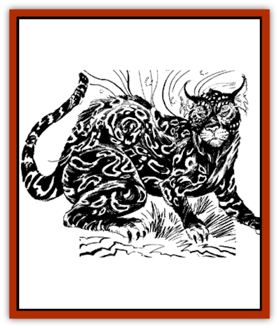

# Pardal

| Statistic | **Pardal** |
| --- | --- |
| **Activity Cycle:** | Night |
| **Alignment:** | Neutral |
| **Armor Class:** | 6 |
| **Climate/Terrain:** | Tropical/Jungles, forests, and grasslands |
| **Damage/Attack:** | 1-4/1-4/1-6 |
| **Diet:** | Carnivore |
| **Frequency:** | Rare |
| **Hit Dice:** | 4+2 |
| **Intelligence:** | Semi- (4) |
| **Magic Resistance:** | Nil |
| **Morale:** | Irregular (6-7) |
| **Movement:** | 12 |
| **No. Appearing:** | 1-2 |
| **No. of Attacks:** | 3 |
| **Organization:** | Solitary |
| **Size:** | M (5-6' long, excluding tail) |
| **Special Attacks:** | Hypnotism |
| **Special Defenses:** | Immune to visual illusions and controlling spells |
| **THAC0:** | 16 |
| **Treasure:** | Nil |
| **XP Value:** | 650 |

The laziest of the [[Cat_Great|great cats]], and also one of the most successful because of its magical method of attack, is the pardal. Of about the same size and build as a [[Cat_Great|jaguar]], its claws and teeth are smaller and less prominent, and its coloration is exactly the opposite of that animal; smoothly black all over with a rich speckling of tan or orange spots.

**Combat:** The pardal is neither an accomplished stalker, nor a powerful fighter able to take down prey by the strength of its limbs. On the hunt, it behaves as if success were a foregone conclusion - as if it had no fear that the prey would flee, fight back, or in any way make the life of the pardal difficult.

When it is hungry, it merely wanders about looking for any suitable game; a group of [[Mammal_Small|monkeys]] or [[Mammal_Small|pigs]] will do, but sometimes so will other predators like <a href=":/appendix/link?dog">wild dogs</a> or [[Wolf|wolves]]. Then, without any pretense of stealth, it ambles towards the prey in a nonthreatening manner that the victims are likely to interpret as disinterest. As the pardal's muscles needn't be as finely tuned as those of a normal predator, it tends to look less threatening than most; with its belly hanging loosely beneath it, it may even appear to have fed recently when it is actually at its hungriest, especially when viewed by the more stupid herbivores.

If it can get within 30' of its prey, any creatures within that range who look at the pardal, even at a glance, notice that the spots on the pardal's fur are not fixed - they flow over the black background in such as way as to produce a *hypnotic pattern* spell effect on all who fail a save vs. spells. This effect lasts for 2-5 rounds or until something drastically changes the situation within the group of hypnotized creatures.

Once a suitable group stands fascinated by the spell, the pardal selects a single target, usually the best eating of the lot, then advances to stare it straight in the face. To one already affected by the first spell, the pardal's golden eyes seem to spin crazily in their black sockets, an effect that causes the prey to be transfixed as by a *hold monster* spell, unless the victim makes a save vs. spells (no penalties or bonuses apply). The holding power of its eyes is stronger than the hypnotic effect of its fur, and causes a victim to stay rooted to the spot even as the pardal kills and devours it. As with the wizardly versions of this spell, the pardal's chosen victim cannot be freed from this spell without the intervention of *dispel magic* or stronger spells.

Conversely, the violence of the pardal's attack on its victim releases all other nearby creatures from its hypnotic pattern. Other effects, such as loud sounds or flashes of light, the appearance of a larger predator, or the wounding of animals besides the one chosen as prey (all of which could occur naturally or at the intervention of adventurers) will also break the hypnotic effect of the pardal's spots. While creatures with an Intelligence of 2 or higher are likely to learn to avoid an approaching pardal no matter how inoffensive it appears, the memory of a pardal attack rapidly fades in the minds of creatures with animal Intelligence (Int 1), so that it can usually prey on the same herd within a few weeks of a previous attack.

As a result of the ease with which it gets it meals, the pardal is found to be exceptionally weak for its size if forced into combat. It is physically weaker than other great cats and cannot employ its hind claws to rake prey. Given a choice, the pardal flees from persistent attackers, not being used to resistance from those it hunts. Moreover, its hypnotic powers operate only when it is hungry, so attacking a sated pardal is an even easier proposition.

Not only does the pardal employ hypnotic effects offensively, but it is also immune to outside illusions and charms. *Hold*, *charm*, and hypnotism-based spells have no effect whatsoever on pardals, and it is totally immune to visual illusions such as *phantasmal force*. Spells that target illusions at other senses have better effects. Instead of being immune to *improved phantasmal force* spells, a pardal saves against them at +6; it saves at +4 against *spectral force* spells, and it has no defenses against any illusions having no visual component at all, suffering a -2 penalty on its saves against these spells.

**Habitat/Society:** Just as the jaguar does, the pardal spends much of its time among the branches of trees; unlike its cousin, most of this time is spent napping, with relaxation only occasionally interrupted by the need to hunt for prey (and that requires little effort itself). A pardal is not territorial and will let other predators, including others of its own kind, share its range unless there is not game enough for two (in which case it will either kill the interloper when next it gets hungry, or simply leave to find more suitable accommodations).

Pardals are solitary animals, seeking the company of their kind only to mate. The lair of a female (50% of the population) sometimes has a single cub resident, but as they mate only rarely the lair will be solely inhabited 75% of the time. A young pardal takes two years to mature, and during that time it can only use the hypnotic tricks of an adult inexpertly (all victims' saves are made at +4), but as a single adult pardal can hunt as easily for two as for one, this is not a major drawback for the cub.

**Ecology:** Pardals are at the top of the food chain in the areas they inhabit, as even other predators fall prey to their special powers. Unlike other great cats, the population of pardals does not increase and decrease along with that of game around it; only a marked drop in all game in a region would threaten their food supply, so the pressure to exploit times of bounty is not strong in them.

Unfortunately for those trying to make a profit from selling pardal parts, the holding powers of its eyes are lost immediately upon its death, nor can the mere wearing of a pardal hide robe confer magical benefits on the wearer. The hide is still quite valuable to mages, who are likely to pay up to 2,000 gp for one in perfect condition as the primary component of a *robe of scintillating colors*, or of other magical items endowed with hypnotizing powers.

A live pardal might be worth up to 4,000 gp, as a creature immune to most of the standard ways of capturing live animals (such as *charm monster* or *hold monster* spells) is rarely seen in zoos or menageries. Because of their laziness, adults can also be tamed rather easily, to the same extent as a <a href=\/appendix/catsmall">house cat</a> (assuming that the trainer is immune to their magical powers). However, they cannot be fully domesticated or trained to attack on command; they can become an interesting ornament in a wizard's lair, but they would serve little purpose carried along with a group of adventurers.

---
## Discovery & Documentation

**Source Publication:** Dragon187 (1992)
**Campaign Setting:** Dragon Magazine
**Author(s):** 

### Other Creatures Found in This Source Book
   * [[Kruel|Kruel]]
